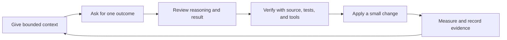

# AI-Assisted SDLC And Developer Productivity

AI can reduce the time spent searching, summarizing, drafting, comparing, and
performing repetitive transformations. It does not remove engineering
accountability. The developer remains responsible for requirements, architecture,
correctness, security, testing, operations, licensing, and the final decision.

Use this mental model:

```text
AI accelerates understanding and produces a candidate.
Engineering evidence decides whether that candidate is correct.
```

The most useful workflow is not "ask AI to build the feature." It is a short,
repeatable loop:



## Where AI Helps Across The SDLC

| SDLC stage | Helpful AI work | Human verification |
|---|---|---|
| Discovery | summarize domain material, extract actors and workflows, identify unanswered questions | confirm with product and domain owners |
| Requirements | turn notes into stories, examples, acceptance criteria, edge cases, and non-functional requirements | approve scope, policy, priority, and business meaning |
| Architecture | compare options, expose trade-offs, draft diagrams, threat models, failure scenarios, and ADRs | own invariants, boundaries, capacity assumptions, and decisions |
| Planning | split work into vertical slices, identify dependencies, risks, rollout steps, and test strategy | estimate using team knowledge and current codebase evidence |
| Implementation | explain unfamiliar code, locate change points, draft small functions, migrations, configuration, and repetitive mappings | review every change and run the real build and tests |
| Testing | generate boundary cases, test matrices, fixtures, property ideas, failure injection, and missing assertions | ensure tests prove behavior instead of copying implementation |
| Code review | summarize a diff, trace behavior, identify concurrency/security/compatibility risks, and suggest focused comments | inspect the actual diff and avoid speculative findings |
| Delivery | draft release notes, rollout checks, migration order, rollback plan, and CI failure summaries | approve production impact and execute governed release controls |
| Operations | summarize logs and traces, build an incident timeline, propose hypotheses and diagnostic queries | use authoritative telemetry; never let AI invent incident facts |
| Maintenance | map dependencies, explain legacy code, suggest refactoring seams, and update documentation | preserve behavior with characterization tests and measured changes |
| Learning | explain concepts at the right level, create exercises, quizzes, and interview practice | validate important facts and solve exercises independently |

## Requirements And Domain Analysis

Give AI the ticket, relevant domain glossary, existing API contract, and known
constraints. Ask it to separate facts from questions.

```text
Act as a requirements analyst for this retail checkout change.

Known facts:
- <paste approved requirements>

Existing behavior:
- <paste relevant contract or concise code references>

Return:
1. actors and business workflow;
2. functional and non-functional requirements;
3. acceptance examples, including failure cases;
4. ambiguous questions requiring product confirmation;
5. assumptions clearly labelled as assumptions.

Do not invent policy or mark an assumption as a requirement.
```

For Shopverse, AI can help distinguish order, inventory reservation, payment,
fulfillment, refund, and customer-notification responsibilities. A product owner
must still decide business policy such as reservation duration, cancellation
cutoff, promotion eligibility, and refund rules.

## Architecture And Design

AI is useful as a design reviewer when it receives explicit quality attributes.
Without scale, consistency, security, RPO/RTO, and operational requirements, it
will often return a generic diagram.

Ask for alternatives before asking for implementation:

```text
Review this design for an order, inventory, and payment workflow.

Invariants: <list>
Scale and hot-key assumptions: <list>
Availability and consistency requirements: <list>
Current architecture: <links or summary>

Compare orchestration and choreography. For each option provide:
- transaction boundaries;
- failure and ambiguous-outcome windows;
- idempotency, ordering, compensation, and reconciliation;
- observability and operational ownership;
- migration cost and rejected trade-offs.

Finish with questions, not a recommendation, where evidence is missing.
```

Useful design outputs include a context diagram, sequence diagram, state machine,
data ownership table, API/event contracts, threat model, capacity worksheet, ADR
draft, failure matrix, and rollout plan. Treat each as a review artifact, not as
proof that the design works.

## Understanding An Existing Codebase

One of the highest-value uses is reducing navigation time. Ask AI to trace a
specific runtime path and cite files, configuration, tests, and call sites.

```text
Trace checkout from the HTTP endpoint to database writes and published events.
For every step provide the file and symbol, transaction boundary, failure
behavior, and relevant test. Separate current implementation from planned or
documented behavior. Report unknowns instead of guessing.
```

Then verify the trace with repository search, IDE navigation, tests, and runtime
evidence. Never rely on an explanation that cannot point back to the source.

## Implementation Workflow

AI performs best with small, bounded changes:

1. Ask it to inspect the current implementation and tests.
2. State the exact behavior and constraints.
3. Request a small plan and impacted files.
4. Change one coherent slice.
5. Review the diff rather than trusting the generated response.
6. Run formatting, compilation, tests, static analysis, and security checks.
7. Test failure and retry behavior, not only the happy path.
8. Update contracts, migration notes, observability, and documentation.

For example:

```text
Add consumer deduplication for OrderCreatedEvent.

Constraints:
- PostgreSQL and Spring Data JPA;
- inbox insert, inventory update, and outgoing outbox row commit together;
- concurrent duplicates must produce one business effect;
- preserve the existing event contract and unrelated changes;
- add migration, integration tests, metrics, and documentation.

Before editing, identify transaction boundaries and the race in an
exists-then-save implementation. After editing, run the narrowest relevant
checks and show the evidence.
```

Avoid requesting a large feature in one prompt. Large generated changes hide
incorrect assumptions, make review difficult, and increase regression risk.

## Testing And Quality Engineering

AI can propose cases humans commonly miss:

- empty, null, minimum, maximum, and malformed inputs;
- duplicate, delayed, out-of-order, and concurrent requests;
- timeout after an external effect but before the response;
- transaction rollback and retry;
- stale versions and lost updates;
- authorization and tenant-boundary violations;
- schema compatibility during rolling deployment;
- cache staleness, queue backlog, and dependency degradation;
- recovery after process, node, zone, or database failure.

Use a test-generation prompt that prevents shallow tests:

```text
Create a test matrix for this behavior. Organize it by invariant, boundary,
concurrency, failure window, security, compatibility, and recovery. For every
case state the setup, action, observable assertion, and defect it would catch.
Do not test private implementation details or merely reproduce the method body.
```

Generated tests can be misleading when they mock the behavior being proved or
assert only that a method was called. Prefer observable state, returned contract,
published event, database constraint, metric, or recovery outcome.

## Debugging And Incident Response

AI can organize evidence faster, but it must not be allowed to manufacture a
root cause. Provide sanitized logs, metrics, traces, deployment changes, and a
precise time window.

```text
Build an incident timeline only from the supplied evidence.
Separate observations, hypotheses, contradictions, and missing evidence.
Rank the next diagnostic checks by information gained and operational risk.
Do not declare a root cause until one hypothesis explains all material evidence.
```

Safe incident usage:

- summarize thousands of repetitive log lines after removing secrets and PII;
- correlate error onset with deployments and dependency changes;
- translate a stack trace into candidate code paths;
- draft database, Kafka, Kubernetes, or observability queries for review;
- create a handoff summary and post-incident action list.

Do not paste production credentials, tokens, customer data, regulated data, or
unapproved proprietary material into an AI system. Do not execute destructive
commands suggested by AI without independently resolving and validating the
exact target.

## Code Review And Pull Requests

AI can act as a first reviewer, not the approval authority. Give it the diff and
relevant contracts, then request findings with evidence:

```text
Review this diff for correctness regressions, transaction boundaries,
concurrency, security, compatibility, observability, and missing tests.
For each actionable finding cite the exact file and line, describe the failing
scenario, and assign severity. Do not comment on style unless it affects
maintainability or violates an explicit project rule.
```

It can also draft a useful pull-request description:

```text
problem and customer impact
scope and non-goals
design and important trade-offs
tests and runtime evidence
migration, rollout and rollback
risks, monitoring and follow-up work
```

The developer must confirm that every claim matches the diff and executed test
output.

## Documentation And Communication

Use AI to turn verified engineering work into different views:

- technical design for reviewers;
- API examples for consumers;
- runbook steps for operations;
- release notes for stakeholders;
- concise status updates for the team;
- onboarding explanation for a new developer;
- interview questions and revision notes for personal learning.

Provide the authoritative source and intended audience. Ask AI to retain
uncertainty and implementation status. Never allow generic best practice to be
rewritten as if the project already implements it.

## A Practical Daily Developer Routine

### Start Of Day: Plan

1. Summarize assigned tickets and recent code changes.
2. Identify the highest-risk unknown and the smallest useful next step.
3. Convert the task into a short checklist with acceptance evidence.
4. Reserve focused time for design or implementation instead of continuously
   prompting without a goal.

### During Development: Pair

1. Ask AI to locate and explain relevant code.
2. Confirm the behavior using source and tests.
3. Compare two or three designs when a trade-off exists.
4. Implement a small slice and review the diff.
5. Ask for missing failure cases, then run the checks.

### Before A Pull Request: Verify

1. Ask AI to review only the final diff.
2. Run the repository's real build, tests, linting, and security checks.
3. Remove accidental debug output, secrets, unrelated changes, and weak tests.
4. Draft the PR description from actual evidence.
5. Record risks, rollback, monitoring, and known follow-ups.

### End Of Day: Capture

1. Summarize what changed, what was proven, and what remains uncertain.
2. Update the ticket, ADR, runbook, or documentation rather than keeping the
   result only in an AI conversation.
3. Turn one difficult concept or defect into a reusable note or test.
4. Prepare a precise restart point for the next work session.

## Personal Productivity Beyond Coding

AI can also reduce routine cognitive load:

| Activity | Productive use |
|---|---|
| Meetings | prepare questions, structure your own notes, extract decisions and owners |
| Communication | rewrite a message for clarity, audience, tone, and brevity |
| Learning | generate a study path, explain at multiple depths, quiz understanding |
| Time management | split a vague goal into focused sessions and define completion evidence |
| Decision making | create a comparison table and expose assumptions or missing information |
| Knowledge capture | convert solved incidents and discoveries into searchable notes or runbooks |
| Interview preparation | simulate follow-up questions and score answers against a rubric |

Do not use AI to create unnecessary summaries or tasks. Productivity improves
when an output changes a decision, reduces search time, prevents a defect, or
creates reusable evidence.

## Safety And Confidentiality Rules

Before sharing context, classify it:

| Data | Safe default |
|---|---|
| public documentation and synthetic examples | generally acceptable in an approved tool |
| internal code and architecture | use only organization-approved systems and policy |
| customer, employee, payment, health, or regulated data | do not share unless explicitly approved and protected |
| passwords, tokens, private keys, cookies, connection strings | never place in prompts |
| production logs and database records | sanitize, minimize, and follow incident/data policy |

Also verify:

- dependency licenses and provenance;
- generated code for injection, authorization, concurrency, and error handling;
- third-party API behavior and version against authoritative documentation;
- copyright and attribution requirements;
- whether generated output introduces a new dependency or data transfer;
- that a human owns every production-impacting approval.

## Common Failure Modes

| Failure | Better practice |
|---|---|
| vague prompt produces generic answer | provide goal, context, constraints, output format, and verification |
| AI invents project behavior | require file/symbol evidence and label unknowns |
| accepting a large generated patch | work in small slices and review the diff |
| generated test mirrors implementation | test contract, invariant, failure, and observable outcome |
| repeated prompting replaces thinking | write your own hypothesis or decision criteria first |
| confidential data enters a prompt | minimize and sanitize; use only approved tools |
| AI suggestion is treated as documentation | verify with authoritative sources and executed evidence |
| faster output increases rework | measure defects, review cycles, and lead time, not generated lines |

## Measuring Productivity Honestly

Do not measure AI success by prompts sent, code generated, or lines committed.
Compare meaningful outcomes before and after adoption:

- time from task start to reviewed, releasable change;
- time spent locating relevant code or documentation;
- pull-request review cycles and change-request rate;
- escaped defects, rollback rate, and security findings;
- flaky-test and incident-diagnosis time;
- percentage of changes with adequate tests, rollout, and operational evidence;
- developer-reported focus time and repeated manual work;
- reuse of generated documentation, runbooks, and automation.

A faster first draft is not a productivity gain when review and correction take
longer. Optimize the complete delivery system rather than local typing speed.

## Adoption Maturity

| Level | Practice | Required control |
|---:|---|---|
| 1 | explanation, summarization, drafting | human review and source verification |
| 2 | bounded code/test/document changes | repository rules, diff review, automated checks |
| 3 | multi-step development assistance | explicit plan, checkpoints, narrow permissions, rollback |
| 4 | automated recurring workflows | approved tools, audit trail, least privilege, monitoring, stop conditions |

Move up only when the previous level has reliable quality evidence. Greater
autonomy requires stronger verification, not less human accountability.

## Developer Checklist

Before using AI:

- define the outcome and what evidence will prove it;
- choose an approved tool and safe context;
- remove secrets, PII, and irrelevant data;
- provide project conventions and constraints.

Before accepting AI output:

- inspect cited source and every changed line;
- question assumptions and check authoritative documentation;
- compile, test, scan, and exercise failure paths;
- review security, concurrency, compatibility, and operations;
- confirm no unrelated user work was overwritten;
- record the final decision and evidence in the normal team system.

## Interview-Ready Answer

> I use AI as an engineering accelerator across the SDLC: clarifying
> requirements, exploring code, comparing designs, drafting small changes,
> generating failure-focused test ideas, reviewing diffs, diagnosing incidents,
> and maintaining documentation. I give it bounded context and explicit
> constraints, then verify its output with source code, authoritative references,
> automated checks, and runtime evidence. I never share secrets or sensitive data,
> and I retain human ownership of architecture, security, production changes, and
> business decisions. I measure the result through lead time, review cycles,
> defects, recovery time, and reusable knowledge—not generated code volume.

## Recommended Next

- [AI Developer Toolkit With Codex, Claude, Prompts, And Connectors](./AI-DEVELOPER-TOOLKIT-COMMANDS-PROMPTS-CONNECTORS.md)
- [Prompt Engineering And Structured Output](./PROMPT-ENGINEERING-STRUCTURED-OUTPUT.md)
- [AI Security And Guardrails](./AI-SECURITY-GUARDRAILS.md)
- [AI Evaluation And Production Operations](./AI-EVALUATION-OPERATIONS.md)
- [AI Learning Plan](./AI-LEARNING-PLAN.md)
- [Shopverse AI POC Plan](./SHOPVERSE-AI-POC-PLAN.md)
