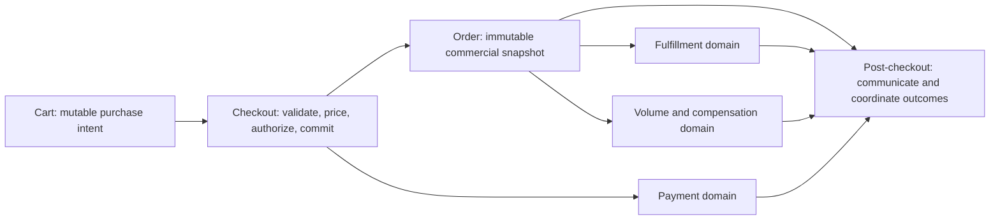
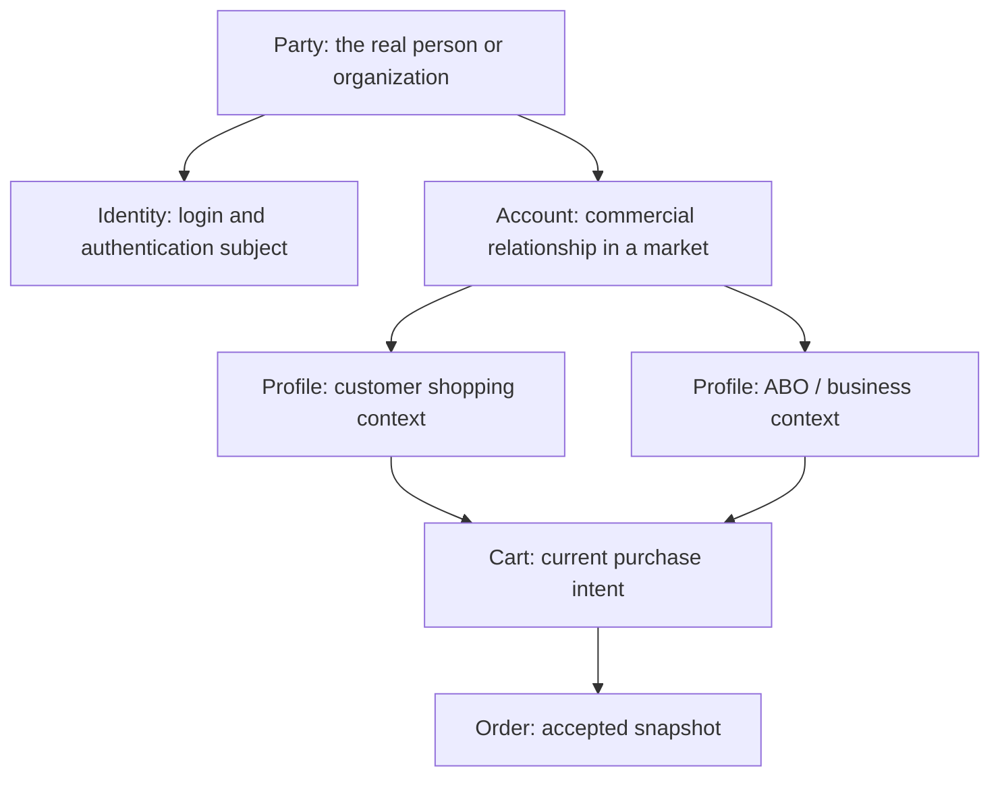

# Amway Commerce And Checkout Domain Primer

<DocLabels items={[{label: 'Intermediate', tone: 'intermediate'}, {label: 'Domain primer', tone: 'shopverse'}, {label: 'Public sources', tone: 'production'}]} />

This page gives a new checkout-pod engineer a working mental model of the
business, the checkout lifecycle, and JSON concepts such as `account` and
`profiles`.

<DocCallout type="mistake" title="Public primer, not an internal Amway specification">

This guide is based on public Amway material and general commerce domain
modeling. It does not document or disclose Amway's proprietary Next Gen
architecture, contracts, compensation rules, or data. Names and rules vary by
market. Treat every proposed field meaning below as a hypothesis until it is
confirmed by the owning team, schema, API specification, or contract test.

</DocCallout>

## Amway Business Model In Plain Language

Amway describes its model as **direct selling**: products are sold directly to
customers through independent distributors rather than only through conventional
retail stores. Public Amway material calls these distributors **Amway Business
Owners (ABOs)**; some markets use **Independent Business Owner (IBO)** or another
local term.

The business has two connected sides:

1. **Commerce:** customers and business owners discover, price, buy, receive,
   return, and obtain support for products.
2. **Independent-business attribution:** eligible product sales can be associated
   with a referring or sponsoring business and can contribute to market-specific
   sales-volume and compensation processes.

Amway says business owners can earn through retail sales and through bonuses or
incentives based on eligible personal and team product sales. This is important
to checkout because an order can be more than a payment-and-shipment record: it
may also be an auditable input to downstream volume, qualification, and
compensation processes. Exact eligibility and calculations are market-specific
and must not be recreated in checkout from assumptions.

Public materials also show why the **market** is a first-class domain dimension.
Actor names, registration types, prices, payment methods, purchase rules,
customer protections, volume rules, and returns can differ by country or
affiliate. For example, Amway's India page refers to Amway Direct Sellers and
Preferred Customers, while the United States page describes IBOs and Customers.

### Core actors

| Actor or concept | Business meaning | Checkout relevance |
|---|---|---|
| Customer | A person or organization purchasing products for use or consumption. Customer types vary by market. | Identity, eligibility, price treatment, addresses, consent, payment, and order ownership. |
| ABO / IBO / Direct Seller | An independent seller or business owner recognized in a market. | May be the buyer, referrer, sponsor, or recipient of eligible sales attribution. Do not infer one role from another. |
| Referrer or sponsor | A business relationship connected to customer or business-owner activity. | Attribution may need validation and an immutable order-time snapshot. It is not necessarily the authenticated shopper. |
| Amway market or affiliate | The local legal and commercial operating context. | Controls currency, language, catalog, tax, payment, fulfillment, protection, and business rules. |
| Product and offer | The sellable item plus its market-specific commercial terms. | SKU alone is not enough; eligibility, price, tax, promotions, and volume attributes may be contextual. |
| Order | The accepted commercial commitment produced by checkout. | Becomes the stable record used by payment, fulfillment, service, returns, and downstream attribution. |

### PV and BV

Public Amway references use **Point Value (PV)** and **Business Volume (BV)** as
product-sales measures used in compensation processes. Their definitions,
values, schedules, and transfer rules vary by market and time.

For checkout engineering, the safe model is:

- checkout consumes authoritative, versioned product or pricing results;
- the order records the values or references required for later audit;
- the compensation domain owns compensation calculations;
- refunds, cancellations, and returns produce explicit downstream adjustments;
- no service recomputes historical volume from today's catalog values.

## The Checkout Pod's Business Boundary

"Checkout pod" is an ownership label, not automatically one bounded context or
one deployable service. A practical boundary is the customer's transition from
**mutable purchase intent** to an **accepted, traceable order**, followed by the
customer-facing coordination needed to understand the outcome.



The checkout pod should orchestrate customer intent and preserve an order-time
snapshot. It should not silently become the source of truth for identity,
catalog, inventory, tax, payment settlement, fulfillment, or compensation.

### 1. Cart

A cart is a **draft**. It answers: "What does this shopper currently intend to
buy?"

Typical responsibilities include adding or removing lines, changing quantity,
selecting variants, persisting a cart, merging anonymous and signed-in carts,
and surfacing preliminary availability or price. Cart totals are estimates until
checkout revalidates them.

Important invariants:

- a cart has one owning shopping context;
- quantity and product identifiers are valid, but price and availability can
  change;
- market, currency, and channel changes trigger revalidation;
- sensitive payment data is never stored in the cart;
- merging carts is deterministic and does not bypass quantity or eligibility
  limits.

### 2. Checkout

Checkout is a **command and decision boundary**. It answers: "Can this actor place
this order, under these market rules, exactly once?"

A typical sequence is:

1. Resolve the authenticated party, selected account, active profile, market,
   channel, and cart.
2. Validate that those contexts are mutually compatible and that the actor may
   use them.
3. Revalidate product eligibility, quantity, inventory, price, promotions, tax,
   delivery options, and address.
4. Confirm customer-visible totals, disclosures, consent, and payment intent.
5. Submit with a stable idempotency key and bind it to a canonical request
   fingerprint.
6. Atomically create an order and the intent to publish its integration event,
   or invoke the platform's equivalent durable workflow.
7. Return a stable order identifier and an honest state such as accepted,
   pending, or failed.

Checkout must distinguish a definite failure from an **unknown outcome**. After
a timeout, blindly creating another order risks duplicate payment or duplicate
fulfillment; query by idempotency key or order reference first.

### 3. Post-checkout

Post-checkout is everything needed to make the committed order understandable
and operable. It is not merely the confirmation page.

Typical capabilities include:

- confirmation and receipt or invoice access;
- payment status and reconciliation;
- allocation, shipment, delivery, pickup, or back-order status;
- notifications and an order timeline;
- cancellation, return, refund, replacement, and customer support;
- downstream sales attribution or volume adjustment status;
- recovery from stuck, duplicated, or partially completed workflows.

Each downstream result should be represented as an explicit business transition.
A refund is not a database rollback of the original order, and a volume reversal
is not the deletion of historical attribution.

## Understanding `account` And `profiles` In JSON

The two words are often overloaded. Start with this separation:



- **Party** is the real-world person or organization.
- **Identity** proves who is signed in. It should not carry every business rule.
- **Account** usually represents a durable commercial relationship, membership,
  or customer/business record in a particular market.
- **Profile** usually represents one role-specific or contextual view of an
  account: for example, customer, Preferred Customer, or ABO context.
- **Cart** is mutable intent under one selected context.
- **Order** snapshots the approved facts so later profile changes do not rewrite
  history.

One person may therefore have multiple profiles, and the profile used for an
order may be different from a referring or sponsoring profile. That is a useful
domain hypothesis, not confirmation of the Next Gen contract.

### Illustrative payload shape

The following JSON is deliberately fictional and contains no production data.
It demonstrates questions to ask, not a contract to implement.

```json
{
  "market": "XX",
  "channel": "WEB",
  "account": {
    "accountId": "acct_example",
    "status": "ACTIVE"
  },
  "profiles": [
    {
      "profileId": "profile_customer_example",
      "type": "CUSTOMER",
      "status": "ACTIVE"
    },
    {
      "profileId": "profile_business_example",
      "type": "BUSINESS_OWNER",
      "status": "ACTIVE"
    }
  ],
  "shoppingContext": {
    "selectedProfileId": "profile_customer_example",
    "currency": "XXX"
  },
  "cart": {
    "cartId": "cart_example",
    "version": 7,
    "items": [
      {
        "productId": "product_example",
        "quantity": 1
      }
    ]
  }
}
```

Do not decide from this shape that every profile is selectable, that an array can
contain profiles from multiple markets, or that `account.status = ACTIVE`
implies checkout eligibility. Those are separate rules that require contract
evidence.

### Field-reading method

For every field, capture the following before changing code:

| Question | Why it matters |
|---|---|
| Who owns and creates the field? | Prevents checkout from becoming a second source of truth. |
| Is it identity, relationship, role, preference, or transaction state? | Prevents `account` and `profile` from becoming catch-all objects. |
| What is the identifier's scope: global, party, account, market, or channel? | Avoids collisions and incorrect joins. |
| Is it input, derived data, or an immutable snapshot? | Determines validation and persistence behavior. |
| Can it change during checkout? | Determines version checks and stale-context handling. |
| Is it sensitive or regulated? | Determines minimization, encryption, logging, retention, and access rules. |
| What are valid states and transitions? | Prevents happy-path-only logic. |
| What happens when it is absent, unknown, duplicated, or inconsistent? | Defines safe failure behavior and compatibility. |

## A Domain-Oriented Checkout Contract

A checkout request should normally carry references and customer choices, not
copies of every upstream record. The checkout service resolves authoritative
facts and snapshots only what the accepted order needs for customer service,
audit, fulfillment, and downstream processing.

| Data group | Examples | Contract guidance |
|---|---|---|
| Context | market, locale, channel, selected account/profile | Validate together; never trust client role claims without authorization. |
| Cart | cart ID, version, selected lines | Use optimistic concurrency or an equivalent stale-cart check. |
| Commercial | offer, price quote, promotion, currency | Reprice authoritatively and explain material changes before commitment. |
| Attribution | referrer/sponsor/business identifiers | Validate ownership and market rules; preserve the accepted snapshot. |
| Fulfillment | address reference, delivery choice, pickup location | Minimize copied personal data and validate deliverability. |
| Payment | token or payment-intent reference | Keep raw card and bank credentials outside checkout payloads and logs. |
| Consent | terms version, disclosure acknowledgement | Record evidence and version, not a vague boolean without provenance. |
| Reliability | idempotency key, request fingerprint, correlation ID | Separate duplicate retry from conflicting reuse and support tracing. |

### Order-time snapshots

Snapshot values that must remain explainable after upstream data changes, such
as the accepted item description, quantities, money breakdown, market, buyer
context, attribution references, terms version, and delivery promise. Keep a
reference to the authoritative entity as well as the necessary historical
snapshot; do not persist an unrestricted copy of the entire account/profile
response.

## Failure And Security Checklist

- Reject an account or profile that the authenticated party is not authorized to
  use, even if the identifier is syntactically valid.
- Fail safely when account, profile, market, or sponsorship facts disagree; do
  not silently select the first profile in an array.
- Revalidate price, eligibility, inventory, promotion, tax, and delivery at the
  commitment boundary.
- Bind an idempotency key to the same actor and canonical payload; conflicting
  reuse must not return an unrelated order.
- Treat downstream timeouts as ambiguous until reconciled.
- Redact tokens, addresses, contact data, business identifiers, and payment
  references from logs, traces, analytics, and error messages.
- Make order ownership and customer-service access explicit; knowing an order ID
  is not authorization.
- Publish downstream events durably and design consumers for duplicate delivery.
- Model cancellation, return, refund, shipment failure, and attribution reversal
  as auditable transitions.
- Apply retention, deletion, and subject-access rules by data class and market;
  an immutable financial record can still require minimization and restricted
  access.

## Questions To Resolve With The Team

Use these questions in onboarding or a contract walkthrough:

1. What does `account` mean in this API, and which system owns it?
2. What profile types exist in each supported market, and can one account have
   more than one active profile of the same type?
3. Which profile is the buyer, which is the order owner, and which receives sales
   attribution? Can they differ?
4. Is `profiles` a set of roles, market memberships, preferences, or historical
   records? Why is it an array?
5. Which fields are trusted from the client, and which are re-resolved server
   side?
6. At what step do price, tax, inventory, delivery, promotions, and product
   eligibility become final?
7. Which PV/BV or other attribution facts must be snapshotted, and which domain
   owns their calculation and reversal?
8. What makes two checkout attempts the same request? How are conflicting retries
   rejected?
9. What order state is returned when payment, inventory, or an event publisher
   times out?
10. Which post-checkout team owns cancellation, return, refund, replacement,
    notification, reconciliation, and customer-visible status?
11. Which fields contain personal, financial, or confidential business data, and
    where are they prohibited from appearing?
12. Which schema, API specification, state-transition diagram, and contract tests
    are canonical?

## Applying The Model In ShopVerse

ShopVerse is useful for practicing the reliability mechanics: authenticated
checkout, an idempotency key, an order-owned state machine, Kafka choreography,
transactional outbox intent, inventory and payment outcomes, compensation, and
an order timeline. See [Checkout, Security, And Event Flows](./CHECKOUT-SECURITY-EVENT-FLOWS.md).

It is **not** evidence of Amway's internal service boundaries or payload. In
particular, ShopVerse's current customer/order model does not implement the
market-specific account/profile, sponsorship, or compensation concepts described
in this primer.

## Public Sources And Provenance

- [Amway: How Amway Works](https://www.amwayglobal.com/how-amway-works/) — public
  overview of products, business owners, markets, and consumer protections.
- [Amway: What Is Direct Selling?](https://www.amwayglobal.com/answers/what-is-direct-selling/) —
  public definition of the direct-selling model.
- [Amway: How Business Owners Make Money](https://www.amwayglobal.com/answers/how-do-you-make-money-with-amway/) —
  public overview of retail mark-up, bonuses, and growth incentives.
- [Amway Global Business Resources: India](https://www.amwayglobal.com/how-amway-works/global-business-resources/india/) —
  example of market-specific actor names and retail-effort rules.
- [Amway Global Business Resources: United States](https://www.amwayglobal.com/how-amway-works/global-business-resources/united-states/) —
  example of market-specific IBO, customer, ordering, and sponsorship concepts.
- [Amway Business Reference Guide](https://www.amway.com/media-location/AmwayBusinessReferenceGuide_USEN.pdf) —
  official market reference describing PV and BV in a compensation context.

These sources explain public business concepts only. Internal design decisions
must be supported by approved internal artifacts and the responsible domain
owners.

## Recommended Next Pages

- [ShopVerse System Design](./SYSTEM-DESIGN.md)
- [Checkout, Security, And Event Flows](./CHECKOUT-SECURITY-EVENT-FLOWS.md)
- [API And Event Compatibility](./API-EVENT-COMPATIBILITY.md)
- [Idempotent Commands](../development/spring-rest/REST-IDEMPOTENT-COMMANDS.md)
