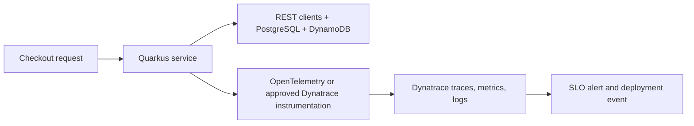

# Amway AWS Delivery, Argo CD, And Dynatrace

<DocLabels items={[{label: 'Project onboarding', tone: 'intermediate'}, {label: 'CI/CD', tone: 'production'}, {label: 'Observability', tone: 'production'}]} />

This guide explains the reported automation and observability path for the Amway
Next Gen checkout project: GitHub workflows validate source changes, AWS
CodePipeline promotes approved code, Argo CD reconciles Kubernetes workloads,
and Dynatrace supplies runtime evidence.

<DocCallout type="production" title="The tool name is probably Argo CD">

This guide interprets "gardo CD" or "agaro CD" as **Argo CD**. Confirm the name,
cluster platform, and ownership with the internal platform team. Argo CD shows
Kubernetes applications and resources; it is not a general inventory for EC2,
RDS, or DynamoDB instances.

</DocCallout>

<DocCallout type="production" title="Confirm the internal handoff">

The division below is the safest interpretation of the team-provided stack. Check
`.github/workflows`, AWS CDK pipeline definitions, CodeBuild buildspecs, deployment
runbooks, and Dynatrace configuration before treating any stage as implemented.
Do not copy internal repository names, account identifiers, role ARNs, endpoints,
tokens, or checkout payloads into this public reference.

</DocCallout>

## Delivery Mental Model

```mermaid
flowchart LR
    Commit["GitHub commit or pull request"]
    GHA["GitHub Actions workflow"]
    Quality["Gradle tests + JaCoCo + SonarQube"]
    Package["Immutable JVM/native artifact or image"]
    Trigger["Approved AWS pipeline handoff"]
    Pipeline["AWS CodePipeline and CodeBuild"]
    Desired["Approved Helm/manifests and image digest"]
    Argo["Argo CD reconciliation"]
    Deploy["Kubernetes cluster, likely Amazon EKS"]
    Verify["Dynatrace + smoke + rollback gate"]

    Commit --> GHA --> Quality --> Package --> Trigger
    Trigger --> Pipeline --> Desired --> Argo --> Deploy --> Verify
```

GitHub Actions runs repository workflows. CodePipeline coordinates AWS stages;
CodeBuild can execute approved build or release commands. In a GitOps topology,
the pipeline publishes the immutable image and updates or approves desired state,
then Argo CD pulls that desired state and reconciles it into Kubernetes. Determine
the implemented handoff from code rather than assuming every component deploys
directly to the cluster.

## Responsibility Split

| Concern | Likely owner | Evidence to inspect |
|---|---|---|
| pull-request validation | GitHub Actions | workflow triggers, required checks, branch protection |
| Gradle test and coverage | GitHub Actions and/or CodeBuild | workflow jobs, buildspec tasks, JaCoCo reports |
| Sonar quality gate | one explicitly selected CI stage | scanner invocation, report path, gate polling |
| artifact or image publication | approved build stage | registry destination, digest output, provenance |
| environment promotion | CodePipeline | stages, approvals, artifact input, role boundaries |
| cluster/infrastructure provisioning | CDK/CloudFormation from an approved AWS stage | synthesized templates, change sets, deployment role |
| Kubernetes desired state | Git/Helm/Kustomize repository | image digest, manifests, environment configuration, review history |
| workload synchronization | Argo CD | Application, target cluster/namespace, sync, health, drift, resource tree |
| runtime verification | smoke checks and Dynatrace | deployment event, SLO gate, rollback automation |

Avoid repeating expensive compilation and quality checks in both systems unless a
documented trust boundary requires it. If CodeBuild rebuilds, prove that its
source and dependency inputs are identical to the validated GitHub revision.

## Recommended Quality And Deployment Gates

1. Verify the Gradle wrapper, dependency locks, and Java 21 toolchain.
2. Compile and run unit, architecture, MapStruct, integration, and contract tests.
3. Generate JaCoCo XML and enforce the approved SonarQube quality gate.
4. Run dependency, license, secret, IaC, container, and SBOM checks.
5. Package the selected JVM/native target and publish an immutable digest.
6. Record commit SHA, build identity, image digest, and provenance together.
7. Run `cdk synth` and review `cdk diff` or the CloudFormation change set.
8. Apply Flyway migrations in the documented backward-compatible order.
9. Deploy through environment-specific least-privilege roles and approvals.
10. Verify Argo CD sync/health and the Kubernetes rollout without bypassing Git.
11. Run smoke checks and evaluate Dynatrace health before promotion completes.
12. Roll back or stop promotion when the defined failure threshold is reached.

## GitHub-To-AWS Security Boundary

When GitHub Actions must call AWS, prefer short-lived OpenID Connect federation.
Constrain the AWS trust policy to the expected GitHub organization, repository,
branch or tag, and protected environment. Separate roles for artifact publication,
pipeline triggering, infrastructure deployment, and application runtime.

Never place permanent AWS access keys, Dynatrace tokens, database credentials, or
deployment secrets in source or workflow output. Mask sensitive values, restrict
secret access to the exact environment, and prevent workflows from untrusted pull
requests from obtaining deployment credentials.

## What Argo CD Lets The Team See

Argo CD compares Git-managed desired state with live Kubernetes state. Its UI
normally shows an **Application** and a resource tree containing objects such as
Deployments, ReplicaSets, Pods, Services, ConfigMaps, Jobs, and Ingresses. It also
shows the selected Git revision, sync status, health assessment, events, manifest
differences, and operation history.

When teammates say "instances," they may mean running Pods or replicas. Confirm
the resource kind before troubleshooting:

| What the UI shows | Meaning |
|---|---|
| Application `Synced` | desired and live manifests currently match; not proof of business health |
| Application `OutOfSync` | Git and live cluster state differ |
| Deployment | controller describing desired replica count and rollout strategy |
| ReplicaSet | version-specific Pod controller created by a Deployment |
| Pod | one scheduled workload instance; it may contain one or more containers |
| degraded health | Argo CD detected an unhealthy managed resource |
| unknown/missing | health cannot be determined, access failed, or a resource is absent |

Do not edit a live managed object as a permanent fix: Argo CD may reverse the
change. Correct desired state through the approved Git workflow, except during a
documented emergency procedure. Access to the UI, application logs, terminal
features, sync, override, and delete actions must be protected by SSO and
least-privilege Argo CD RBAC.

## Dynatrace Trace Model

Dynatrace documents automatic tracing for JVM-based Quarkus applications and
OpenTelemetry export options for Quarkus, including native applications. Confirm
whether the project uses OneAgent, Dynatrace Operator, an OpenTelemetry SDK or
agent, direct OTLP export, or a collector. Avoid double instrumentation because
it can create duplicate spans and unnecessary overhead.

The useful unit is the end-to-end checkout transaction: inbound REST, application
logic, account/profile clients, PostgreSQL, DynamoDB, and downstream dependencies.
Instrumentation must propagate trace context across asynchronous and HTTP
boundaries without making Dynatrace the owner of business state.

## Checkout Telemetry Checklist

- service name, version, environment, commit, and deployment identifier;
- request rate, error rate, latency percentiles, saturation, and dependency time;
- trace and correlation identifiers under the approved cardinality policy;
- DynamoDB throttles, capacity trends, retries, conditional-write failures, and
  latency without keys or item payloads;
- PostgreSQL pool pressure, slow operations, migration status, and transaction
  failures;
- REST-client timeout, retry, circuit-breaker, and downstream error information;
- feature-flag evaluation failures and safe-default use without targeting data;
- deployment markers linking a regression to the immutable deployed digest.

Never place account/profile JSON, addresses, tokens, payment information,
DynamoDB item bodies, or unbounded identifiers in span attributes, logs, metric
labels, or request naming. Business identifiers are permitted only when security,
retention, masking, cardinality, and access policies explicitly approve them.

## Deployment Verification Workflow

After deployment, verify the health endpoint and one safe smoke path, then compare
Dynatrace error rate, latency, saturation, dependency failures, and resource usage
against the pre-deployment baseline. Confirm the deployment event contains the
same commit and digest produced by CI. A green pipeline without runtime evidence
does not prove checkout health.

Rollback criteria must be explicit: which SLO or alert blocks promotion, who can
override it, whether database changes are backward compatible, and whether rollback
means redeploying the previous digest or disabling a feature through an approved
flag. Never attempt cross-service database rollback as compensation.

## Questions To Resolve In The Internal Project

- Which GitHub events run CI and which required checks protect the release branch?
- Does GitHub publish the deployable artifact, or does CodeBuild create it?
- What mechanism starts CodePipeline and how is the exact revision transferred?
- Does CodePipeline update a GitOps repository, call Argo CD, or deploy directly
  to EKS, and which component is the authoritative deployer?
- In the Argo CD UI, does "instance" mean a Pod, replica, Application, or cluster?
- Which AWS role does each stage assume, and which OIDC claims restrict access?
- Are dev, test, stage, and production promotions separate pipelines or stages?
- Which Dynatrace instrumentation mode is used for JVM and native containers?
- How are trace context, service name, version, environment, and deployment events
  configured?
- Which telemetry fields are masked, dropped, or cardinality-limited?
- Which Dynatrace SLOs or alerts stop promotion or initiate rollback?

## Related Learning

- [Amway Project Technology Stack](./AMWAY-PROJECT-TECH-STACK.md)
- [Amway Checkout Domain Primer](./AMWAY-CHECKOUT-DOMAIN-PRIMER.md)
- [Quarkus Integration, Security, And Observability](../quarkus/QUARKUS-INTEGRATION-SECURITY-OBSERVABILITY.md)
- [CI/CD Automation](../operations/CI-CD-AUTOMATION.md)
- [Helm, GitOps, And Argo CD Overview](../operations/HELM-GITOPS-ARGOCD-OVERVIEW.md)
- [Argo CD Production Operations](../operations/helm-gitops/ARGOCD-PRODUCTION-OPERATIONS.md)

## Official References

- [AWS CodePipeline GitHub Connections](https://docs.aws.amazon.com/codepipeline/latest/userguide/connections-github.html)
- [GitHub Actions OpenID Connect In AWS](https://docs.github.com/actions/how-tos/secure-your-work/security-harden-deployments/oidc-in-aws)
- [AWS CodeBuild](https://docs.aws.amazon.com/codebuild/latest/userguide/welcome.html)
- [AWS CDK v2](https://docs.aws.amazon.com/cdk/)
- [AWS CodePipeline Deployment To Amazon EKS](https://docs.aws.amazon.com/codepipeline/latest/userguide/tutorials-eks-deploy.html)
- [Amazon EKS Continuous Deployment With Argo CD](https://docs.aws.amazon.com/eks/latest/userguide/argocd.html)
- [Argo CD Documentation](https://argo-cd.readthedocs.io/en/stable/)
- [Dynatrace Quarkus Monitoring](https://docs.dynatrace.com/docs/ingest-from/technology-support/application-software/java/quarkus)
- [Dynatrace OpenTelemetry](https://docs.dynatrace.com/docs/ingest-from/opentelemetry)
