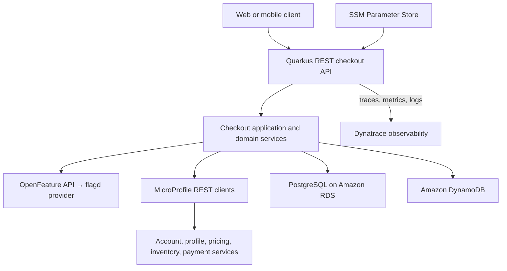
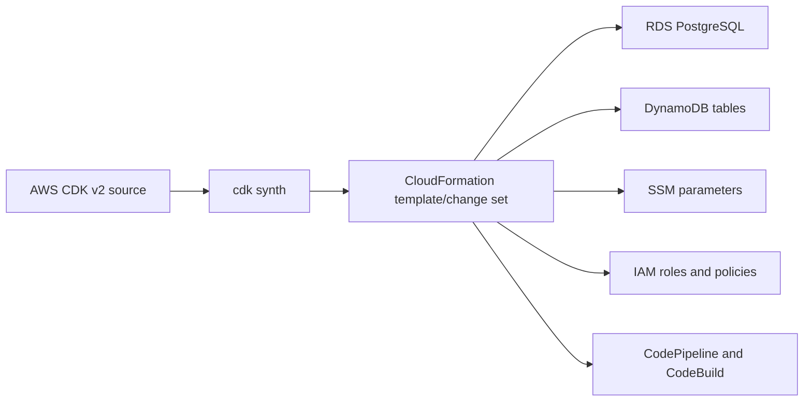
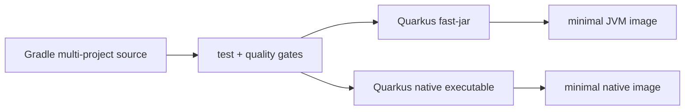

# Amway Next Gen Checkout Project Technology Stack

<DocLabels items={[{label: 'Project onboarding', tone: 'intermediate'}, {label: 'Checkout', tone: 'shopverse'}, {label: 'Production stack', tone: 'production'}]} />

This guide maps the Amway Next Gen checkout stack: what each technology owns,
how the parts interact, and what a new team member should inspect.

<DocCallout type="mistake" title="Stack inventory, not a proprietary architecture specification">

The technology inventory comes from the project team. The component boundaries,
module examples, data ownership, pipelines, AWS topology, and request flows below
are recommended interpretations until confirmed against the internal repository,
ADRs, deployed resources, API contracts, and responsible teams. Do not place
internal payloads, credentials, account/profile data, or infrastructure details
in this public reference repository.

</DocCallout>

<DocCallout type="production" title="DynamoDB and Dynatrace are different products">

This guide interprets the team term "dynamo trace" as **Dynatrace**, the
observability platform. Amazon **DynamoDB** remains the key-value/document
database. Confirm the spelling and approved Dynatrace integration pattern with
the internal platform team.

</DocCallout>

## Stack At A Glance

| Layer | Technology | Main responsibility |
|---|---|---|
| language/runtime | Java 21 | application language, modern JVM runtime, records, pattern matching, virtual-thread option |
| framework | Quarkus | build-time framework integration, dependency injection, REST, persistence, configuration, testing, native/JVM packaging |
| build | Gradle with Kotlin DSL, multi-project | dependency alignment, compilation, annotation processing, tests, coverage, analysis, packaging |
| relational data | PostgreSQL on Amazon RDS | transactional aggregates, constraints, joins, order/checkout state, migrations |
| key-value/document data | Amazon DynamoDB | access-pattern-driven data requiring partition-key scale and AWS-managed operation |
| observability | Dynatrace | application performance monitoring, distributed traces, metrics, logs, dashboards, alerting, and deployment verification |
| persistence | Hibernate ORM and Hibernate Reactive | blocking ORM or non-blocking ORM access to relational data |
| migrations | Flyway | ordered, versioned PostgreSQL schema evolution |
| inbound HTTP | Quarkus REST | JSON API resources, validation, authentication boundary, blocking/reactive dispatch |
| outbound HTTP | MicroProfile REST Client through Quarkus REST Client | typed calls to account, profile, pricing, inventory, payment, or other services |
| mapping | MapStruct | compile-time DTO, domain, persistence, and integration mapping |
| feature flags | OpenFeature with flagd | vendor-neutral flag evaluation API plus the flagd provider/evaluator |
| infrastructure as code | AWS CDK v2 | CloudFormation-backed definitions for RDS, DynamoDB, SSM, roles, pipeline, and related resources |
| configuration | AWS Systems Manager Parameter Store | hierarchical non-secret and approved secure configuration references |
| packaging | multi-stage Docker, JVM or native Quarkus artifact | reproducible minimal runtime container |
| repository CI | GitHub Actions workflows | pull-request and branch checks such as Gradle tests, JaCoCo, SonarQube, packaging, and security checks |
| AWS deployment | AWS CodePipeline and CodeBuild | controlled artifact promotion and deployment into AWS environments |
| Kubernetes delivery | Argo CD | GitOps reconciliation, application/resource visibility, sync, health, and drift reporting |
| static quality | SonarQube | bugs, vulnerabilities, maintainability, duplication, and quality-gate reporting |
| coverage | JaCoCo | Java bytecode test-coverage generation consumed by Gradle and SonarQube |

## System Mental Model



The central architectural question is not which library is present. It is which
component owns each business fact and consistency boundary. Checkout may combine
account/profile context, cart intent, pricing, inventory, payment, and delivery,
but it should not silently become the system of record for all of them.

## 1. Java 21 Runtime

Java 21 is a long-term-support release and supplies the language and JVM on which
Quarkus runs. Features commonly useful in this stack include records for immutable
transport types, pattern matching for controlled domain branching, improved
switch expressions, and virtual threads for appropriate blocking workloads.

Java 21 does not make blocking code reactive. Three different execution choices
may exist:

| Model | Typical shape | Suitable when |
|---|---|---|
| imperative worker thread | direct return value, JDBC/Hibernate ORM, blocking clients | dependencies block and the simpler programming model meets capacity goals |
| reactive event loop | `Uni`/`Multi`, reactive PostgreSQL, non-blocking clients | the complete call chain is non-blocking and high concurrency justifies it |
| virtual thread | imperative code scheduled on virtual threads | supported dependencies block, pinning is understood, and database/downstream capacity remains bounded |

Choose one model deliberately per boundary. A reactive REST method that calls
JDBC or a blocking SDK on an I/O thread can stall many requests.

## 2. Quarkus Framework

Quarkus supplies CDI dependency injection, configuration, REST, persistence,
security, test integration, health, telemetry, and packaging through extensions.
It performs significant discovery and augmentation at build time, which helps
startup and memory behavior but makes extension compatibility and native-image
requirements important.

Start with the [Quarkus Beginner-To-Advanced Learning Path](../quarkus/README.md).
For checkout-specific implementation reasoning, use the
[Quarkus Checkout Capstone](../quarkus/QUARKUS-CHECKOUT-TUTORIAL.md).

Useful repository evidence includes:

```text
gradle/libs.versions.toml
settings.gradle.kts
build.gradle.kts
gradle.properties
*/build.gradle.kts
*/src/main/java/
*/src/main/resources/application.properties
*/src/main/resources/db/migration/
*/src/test/java/
```

## 3. Gradle Kotlin DSL Multi-Project Build

A multi-project build has one root build coordinating multiple Gradle subprojects.
Kotlin DSL means build scripts use `.gradle.kts`; it does not necessarily mean
the application is written in Kotlin.

An illustrative shape is:

```text
checkout-platform/
├── settings.gradle.kts
├── build.gradle.kts
├── gradle/libs.versions.toml
├── checkout-app/          # deployable Quarkus application
├── checkout-domain/       # framework-light domain model
├── checkout-api/          # API DTOs or generated contract types
├── checkout-persistence/  # PostgreSQL/DynamoDB adapters
├── checkout-clients/      # outbound REST contracts and adapters
├── checkout-flags/        # typed feature decisions
├── checkout-test-support/ # reusable fixtures without production secrets
└── infrastructure/        # AWS CDK application, if kept in the same repository
```

This is a suggested decomposition, not confirmation of the real modules.

```kotlin
// settings.gradle.kts
rootProject.name = "checkout-platform"

include(
    "checkout-app",
    "checkout-domain",
    "checkout-persistence",
    "checkout-clients"
)
```

Only deployable application modules normally need the `io.quarkus` plugin.
Library modules should remain ordinary Java libraries where possible. Quarkus
must be able to index beans and entities from application libraries; official
Gradle guidance recommends a `META-INF/beans.xml` for CDI discovery in an
external module when it is not the main Quarkus application module.

### Build ownership

- Centralize Java toolchains, repositories, dependency constraints, code style,
  test conventions, JaCoCo aggregation, and Sonar settings.
- Use a Quarkus platform BOM or enforced platform for compatible extension
  versions.
- Avoid applying every plugin to every module.
- Keep module dependencies acyclic and direct them toward domain abstractions.
- Run the committed Gradle wrapper rather than an arbitrary machine installation.

```powershell
.\gradlew.bat projects
.\gradlew.bat dependencies
.\gradlew.bat clean test
.\gradlew.bat build
```

The exact project tasks and target module names must come from `gradlew tasks`
and the CI buildspec.

## 4. PostgreSQL, Hibernate ORM, And Hibernate Reactive

PostgreSQL is the natural store for data requiring local ACID transactions,
relational constraints, uniqueness, referential integrity, flexible queries, and
auditable state transitions. Checkout examples include orders, idempotency
records, timelines, outbox intent, and payment or fulfillment references when
the checkout domain owns them.

The phrase **Hibernate ORM + Reactive** needs clarification in the real project:

1. some modules may use blocking Hibernate ORM and others Hibernate Reactive;
2. one application may expose separate blocking and reactive persistence units;
3. the team may mean Hibernate Reactive with the familiar ORM annotations;
4. the dependency list may include both even though only one serves a specific
   use case.

Quarkus documentation explicitly says Hibernate Reactive is a different stack,
not a required successor to Hibernate ORM, and Quarkus REST does not require it.
At the time of this review, Quarkus labels Hibernate Reactive as preview, so the
project's pinned platform support and upgrade policy deserve explicit review.

### Blocking path

```text
Quarkus REST worker/virtual thread
    → application transaction
    → Hibernate ORM
    → JDBC pool
    → PostgreSQL
```

### Reactive path

```text
Quarkus REST event loop
    → Mutiny transaction/session
    → Hibernate Reactive
    → Vert.x reactive PostgreSQL client
    → PostgreSQL
```

Do not mix blocking database work into a reactive chain. Reactive concurrency
also does not increase the database's transaction or connection capacity.

## 5. Flyway Migrations With Reactive Persistence

Flyway owns schema history; Hibernate should normally validate the released
schema rather than create or update it automatically in production.

```text
src/main/resources/db/migration/
├── V001__create_checkout_order.sql
├── V002__add_idempotency_fingerprint.sql
└── V003__create_outbox.sql
```

Flyway uses JDBC internally. When application access is reactive, official
Quarkus guidance requires the datasource to provide both a JDBC driver for
migrations and a reactive client for runtime access.

```kotlin
dependencies {
    implementation("io.quarkus:quarkus-flyway")
    implementation("io.quarkus:quarkus-jdbc-postgresql")
    implementation("io.quarkus:quarkus-reactive-pg-client")
    implementation("io.quarkus:quarkus-hibernate-reactive")
}
```

Do not copy versions from this page; use the project BOM and version catalog.

Production choices include migration during application startup, a dedicated
pipeline step, or a Kubernetes/AWS deployment job. Whichever owns migration must
handle concurrent deploys, locks, backward compatibility, failure recovery, and
expand-transition-contract rollouts. Never edit an already applied migration.

## 6. DynamoDB

DynamoDB is not a generic replacement for PostgreSQL. Model it from explicit
access patterns:

- exact partition and sort keys;
- required reads, writes, conditional updates, and queries;
- secondary indexes and their consistency/cost;
- item size and TTL behavior;
- hot-key, throttling, retry, and capacity risks;
- stream, backup, point-in-time recovery, and multi-region requirements.

Possible checkout uses include keyed session/state lookups, deduplication,
short-lived workflow material, or high-scale document access—but the actual use
must be confirmed. Do not write the same business truth independently to RDS and
DynamoDB and call it a transaction. Select one owner and propagate derived state
through a recoverable event, change stream, or reconciliation process.

## 7. Quarkus REST And MicroProfile REST Client

Quarkus REST owns inbound HTTP handling. A resource should bind and validate the
request, establish authenticated context, call the application service, and map
the outcome to a stable API response.

```java
@Path("/api/checkouts")
@Consumes(MediaType.APPLICATION_JSON)
@Produces(MediaType.APPLICATION_JSON)
public class CheckoutResource {

    private final CheckoutService checkoutService;

    public CheckoutResource(CheckoutService checkoutService) {
        this.checkoutService = checkoutService;
    }

    @POST
    public Response checkout(
            @HeaderParam("Idempotency-Key") String key,
            @Valid CheckoutRequest request) {
        return Response.status(201)
                .entity(checkoutService.checkout(key, request))
                .build();
    }
}
```

MicroProfile REST Client interfaces represent outbound HTTP contracts:

```java
@Path("/profiles")
@RegisterRestClient(configKey = "profile-api")
@Produces(MediaType.APPLICATION_JSON)
public interface ProfileClient {

    @GET
    @Path("/{profileId}")
    ProfileResponse find(@PathParam("profileId") String profileId);
}
```

Every client needs a base URL, connect/read deadline, authentication policy,
bounded retry policy, error mapping, observability, and contract tests. Request
and response body logging must remain disabled or redacted for account, profile,
address, payment, and token data.

## 8. MapStruct Mapping Boundaries

MapStruct generates type-safe Java mapping implementations during compilation.
It is useful for explicit boundaries:

```text
API DTO ↔ application command
domain result ↔ API response
domain aggregate ↔ persistence entity
external service response ↔ internal integration model
```

```java
@Mapper(componentModel = MappingConstants.ComponentModel.CDI,
        unmappedTargetPolicy = ReportingPolicy.ERROR)
public interface CheckoutMapper {

    CheckoutCommand toCommand(CheckoutRequest request);

    CheckoutResponse toResponse(CheckoutResult result);
}
```

Prefer compile failure for unmapped target fields on security- and
money-sensitive objects. Do not let mapping silently decide business defaults,
authorization, price, profile selection, status transitions, or sensitive-field
redaction. Those are explicit application policies and should have focused tests.

MapStruct is an annotation processor, so its processor belongs on the Gradle
annotation-processor path. Generated sources should be reproducible and normally
not hand-edited.

## 9. OpenFeature And flagd

OpenFeature is the vendor-neutral evaluation API. A provider connects it to an
evaluation system; flagd is one such provider/evaluator. Without a configured
provider, the SDK returns the default value supplied by the application.

```java
boolean enabled = client.getBooleanValue(
        "new-checkout-pricing",
        false,
        evaluationContext);
```

Treat the default as a real failure-mode decision. A safe checkout flag design
defines:

- stable flag key, owner, purpose, and expiration/removal date;
- safe default when flagd is unavailable or not ready;
- evaluation context with minimal, non-sensitive attributes;
- consistency expectations across a single checkout attempt;
- metrics for bounded variants without customer identifiers;
- rollback behavior and state compatibility between old and new paths.

<DocCallout type="production" title="Feature flags must not replace authorization or durable business state">

A client-controlled flag context is not permission evidence. Do not use a flag
to bypass account/profile ownership, payment controls, legal eligibility, or data
protection. Do not reevaluate a flag halfway through a workflow if switching
variants would make the order inconsistent; snapshot the relevant decision when
the business process requires it.

</DocCallout>

Flag configuration should not be stored in SSM merely because SSM is available.
AWS itself recommends a purpose-built dynamic configuration system for feature
flags; in this stack, OpenFeature plus flagd owns that responsibility.

## 10. AWS CDK v2 And Runtime Infrastructure

AWS CDK v2 defines infrastructure in code and synthesizes AWS CloudFormation.
The application may define constructs for:



CDK review must cover deletion/retention policy, encryption keys, backups,
Multi-AZ, subnet and security-group placement, database credentials, DynamoDB
recovery and indexes, IAM least privilege, tags, alarms, budgets, and environment
isolation.

Run `cdk diff` and review the synthesized template/change set before deployment.
An infrastructure unit test does not prove the change is operationally safe.

## 11. SSM Parameter Store

Parameter Store is appropriate for hierarchical environment configuration such
as resource identifiers, endpoint URLs, and approved tuning values. It supports
versioning, IAM access controls, and `SecureString` values.

Keep these distinctions explicit:

| Data | Preferred owner |
|---|---|
| ordinary environment configuration | SSM Parameter Store |
| rotating database/API credentials | usually AWS Secrets Manager or the approved secret service |
| feature flags and targeting rules | OpenFeature provider/flagd control plane |
| compile-time constants | source/build configuration when truly immutable |

Avoid CDK synthesis-time lookups for secrets. AWS warns that lookup values can
end up in synthesized templates or cached context. Prefer deployment/runtime
references that preserve secrecy and grant the workload only the exact parameter
paths and KMS permissions it needs.

## 12. Multi-Stage Docker: JVM Or Native

One source codebase can be packaged for the JVM or as a native executable.



A multi-stage build keeps compilers, Gradle caches, and source files out of the
runtime stage. The final image should run as non-root, use an approved pinned base
image, contain no credentials, expose only required files, and include provenance,
SBOM, vulnerability scanning, and signing according to policy.

### JVM versus native decision

| JVM | Native |
|---|---|
| mature diagnostics and simpler build | potentially faster startup and lower memory for suitable workloads |
| strong warmed performance | closed-world reflection/resource constraints |
| larger runtime layer | heavier and slower build |
| normal JVM profiling and heap tooling | native-specific monitoring must be deliberately included |

Benchmark startup, memory, warmed throughput, p99 latency, CPU, image pull,
build time, build memory, and incident diagnostics under the same resource limits.
Native is not automatically the better checkout deployment.

## 13. CodePipeline And CodeBuild Delivery Flow

GitHub Actions runs CI; CodePipeline and CodeBuild perform the reported AWS
release; Argo CD probably displays and reconciles the Kubernetes workloads.
Preserve the tested digest and confirm whether CodePipeline updates GitOps state,
invokes Argo CD, or deploys directly.

See [AWS Delivery, Argo CD, And Dynatrace](./AMWAY-DELIVERY-OBSERVABILITY.md) for
the pipeline, workload UI, security boundaries, and verification path.

## 14. Dynatrace Observability

Dynatrace is the reported APM and observability platform. It should connect
Quarkus request traces with REST dependencies, PostgreSQL, DynamoDB, logs,
metrics, SLOs, and deployment events. Confirm whether instrumentation uses
OneAgent, Dynatrace Operator, OpenTelemetry, or an approved combination, and
prevent sensitive checkout data or unbounded identifiers from entering telemetry.

The focused [delivery and observability guide](./AMWAY-DELIVERY-OBSERVABILITY.md)
contains the full trace model, telemetry checklist, data-safety rules, and
deployment-regression workflow.

## 15. JaCoCo And SonarQube

JaCoCo generates execution coverage; SonarQube imports that report and combines
it with static-analysis findings. SonarQube does not generate Java coverage.

```kotlin
plugins {
    jacoco
    id("org.sonarqube")
}

tasks.test {
    useJUnitPlatform()
    finalizedBy(tasks.jacocoTestReport)
}

tasks.jacocoTestReport {
    dependsOn(tasks.test)
    reports {
        xml.required.set(true)
        html.required.set(true)
    }
}
```

In a multi-project build, decide whether each module reports independently or a
root task produces an aggregate XML report. Ensure generated MapStruct code,
Quarkus-generated classes, DTOs, and infrastructure sources follow an explicit
coverage/exclusion policy rather than being excluded to inflate a number.

Coverage proves execution, not assertion strength. Quality gates should emphasize
changed critical code, branches, security findings, duplication, and focused
tests for money, identity, account/profile ownership, idempotency, concurrency,
and failure recovery.

## End-To-End Developer Workflow

Developers build and test locally through the Gradle wrapper, push changes into
GitHub CI, and promote an approved immutable artifact through the AWS deployment
pipeline. Dynatrace supplies post-deployment evidence. Learn the exact local
dependencies, triggers, environments, and approval gates from project code and
runbooks; use the [focused delivery guide](./AMWAY-DELIVERY-OBSERVABILITY.md) for
the detailed flow.

## First-Week Repository Walkthrough

1. Run `java -version` and `gradlew --version`; confirm Java 21 toolchains.
2. Read `settings.gradle.kts` to identify all subprojects and included builds.
3. Read the root convention plugins/version catalog before module scripts.
4. Identify the deployable Quarkus module and list its extensions.
5. Trace one checkout endpoint into service, mapper, repository, and REST clients.
6. Determine which paths are blocking, reactive, or virtual-thread based.
7. Find PostgreSQL entities, reactive sessions, Flyway migrations, and ownership.
8. Find every DynamoDB table, key schema, index, conditional write, and TTL.
9. List feature flags, defaults, evaluation context, owners, and removal dates.
10. Trace configuration from CDK/SSM/secret storage into Quarkus configuration.
11. Read the Dockerfiles and identify the selected JVM/native production image.
12. Read `.github/workflows`, CodePipeline/CDK definitions, CodeBuild buildspecs,
    Sonar, JaCoCo, artifact handoff, deployment, and rollback gates.
13. Identify the Dynatrace integration mode, service naming, dashboards, alerts,
    SLOs, trace propagation, data-masking rules, and deployment events.

## Questions For The Checkout Team

- Which Gradle subproject produces the deployable service and which modules are
  reusable libraries?
- Where is the Quarkus platform version controlled and how are upgrades tested?
- Which endpoints and repositories are blocking versus reactive, and why?
- Does one service use both Hibernate ORM and Hibernate Reactive, or do separate
  modules use them?
- Who runs Flyway, when, and how is backward-compatible rollout enforced?
- What business facts belong to PostgreSQL and what belongs to DynamoDB?
- How are cross-store derived views reconciled after partial failure?
- Which downstream REST calls are safe to retry and what idempotency key do they
  carry?
- Which MapStruct policies fail compilation for unmapped sensitive fields?
- What is each flag's safe default when flagd cannot initialize?
- Which CDK stack owns RDS, DynamoDB, SSM, IAM, pipeline, and monitoring?
- Which values belong in Parameter Store versus Secrets Manager versus flagd?
- Is production JVM or native, and what measurements justified the choice?
- Which tests and Sonar quality gate block deployment?
- How is the exact tested image promoted and rolled back?

## Common Architecture Mistakes

- assuming Quarkus REST requires Hibernate Reactive;
- calling JDBC, Flyway, AWS SDK blocking clients, or blocking REST code on an I/O
  thread;
- maintaining PostgreSQL and DynamoDB as competing sources of truth;
- letting Hibernate alter production schema outside Flyway governance;
- hiding domain decisions in MapStruct expressions;
- using feature flags as authorization or reevaluating them inconsistently during
  checkout;
- putting secrets into CDK context, synthesized templates, Docker layers, logs,
  or CodeBuild plain environment variables;
- rebuilding an image during promotion instead of deploying the tested digest;
- treating coverage percentage or a passed Sonar gate as proof of checkout
  correctness;
- choosing native packaging without native integration and diagnostic testing.

## Related Learning

- [Amway Checkout Domain Primer](./AMWAY-CHECKOUT-DOMAIN-PRIMER.md)
- [OpenAPI Contracts And Generated DTO Artifacts](./AMWAY-OPENAPI-CONTRACT-ARTIFACTS.md)
- [Quarkus Beginner-To-Advanced](../quarkus/README.md)
- [Quarkus Data, Transactions, And Testing](../quarkus/QUARKUS-DATA-TRANSACTIONS-TESTING.md)
- [AWS RDS And DynamoDB](../cloud/aws/AWS-DATABASES.md)
- [CI/CD Automation](../operations/CI-CD-AUTOMATION.md)
- [Coverage And Test Quality](../spring/testing/COVERAGE-TEST-QUALITY.md)

## Official References

- [Quarkus Gradle Tooling](https://quarkus.io/guides/gradle-tooling)
- [Quarkus REST](https://quarkus.io/guides/rest)
- [Quarkus REST Client](https://quarkus.io/guides/rest-client)
- [Hibernate ORM](https://quarkus.io/guides/hibernate-orm)
- [Hibernate Reactive](https://quarkus.io/guides/hibernate-reactive)
- [Quarkus Flyway](https://quarkus.io/guides/flyway)
- [MapStruct Reference](https://mapstruct.org/documentation/stable/reference/html/)
- [OpenFeature Java SDK](https://openfeature.dev/docs/reference/sdks/server/java/)
- [OpenFeature Providers](https://openfeature.dev/docs/reference/concepts/provider/)
- [AWS CDK v2](https://docs.aws.amazon.com/cdk/)
- [AWS CDK Pipelines](https://docs.aws.amazon.com/cdk/v2/guide/cdk-pipeline.html)
- [SSM Parameter Store](https://docs.aws.amazon.com/systems-manager/latest/userguide/systems-manager-parameter-store.html)
- [SonarQube Java Coverage](https://docs.sonarsource.com/sonarqube-server/analyzing-source-code/test-coverage/java-test-coverage/)
- [Gradle JaCoCo Plugin](https://docs.gradle.org/current/userguide/jacoco_plugin.html)
