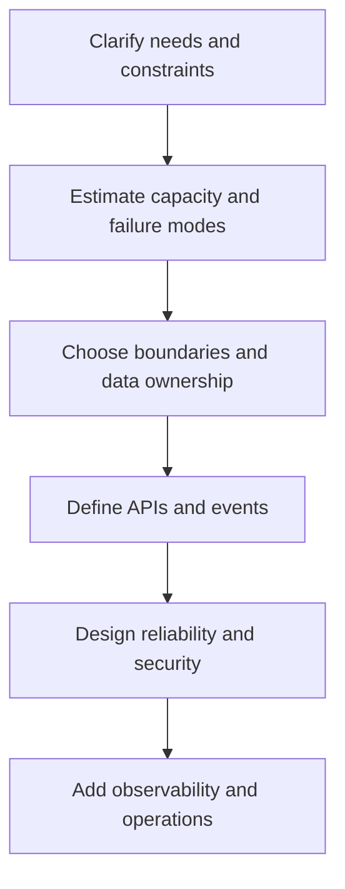

# Architecture Revision Sheet

## Architecture Decision Flow



## Design Sequence

```text
requirements -> scale/SLOs -> APIs/events -> data model -> components
-> critical flows -> failure/security -> capacity -> operations -> evolution
```

## One-Line Recall

| Concept | Revision answer |
|---|---|
| scalability | Sustain growth by adding/resizing resources without breaking requirements. |
| availability | Return an acceptable outcome during specified failures. |
| durability | Acknowledged data survives the defined failure model. |
| consistency | Rules governing which writes an observer may see and when. |
| CAP | During a network partition, a distributed operation cannot guarantee both availability and linearizable consistency. |
| partitioning | Split data/work by a key to distribute capacity and ownership. |
| replication | Maintain copies for availability/read scale; replication is not backup. |
| backpressure | Prevent upstream work from exceeding downstream capacity. |
| idempotency | Make duplicate logical attempts converge on one effect. |
| RPO/RTO | Maximum acceptable data loss and time to restore service. |

## Component Decisions

| Requirement | Typical option | Core trade-off |
|---|---|---|
| strong relational invariant | relational database | vertical/write coordination limits |
| hot repeated reads | cache | staleness and invalidation |
| retained fan-out/replay | Kafka/event log | partition ordering and operations |
| immediate request outcome | HTTP/RPC | temporal coupling and timeout ambiguity |
| text search | search index | asynchronous consistency and duplication |
| binary content | object storage | separate metadata/access control |
| global static delivery | CDN | invalidation and personalized content boundaries |

## Capacity Formulas

```text
concurrency ~= arrival rate * average latency
storage ~= write bytes/sec * retention seconds * replication factor
required workers >= peak arrival rate / measured worker rate
catch-up time ~= backlog / (processing rate - arrival rate)
```

Always add peak, failure, maintenance, retry, growth, and recovery headroom.

## Failure Prompts

- caller times out after the server committed;
- duplicate command/event arrives;
- one partition or tenant becomes hot;
- cache and database disagree;
- queue backlog approaches retention;
- database primary or entire region fails;
- old/new schemas coexist during rollback;
- credentials rotate while instances remain live;
- load exceeds every configured pool.

## Domain-Driven Design Interview Questions

### Domain, subdomain, and bounded context?

The domain is the business problem space; subdomains split it into cohesive areas; a bounded context defines
where one model and ubiquitous language are consistent. Context boundaries come from language, invariants,
ownership and change, not automatically from database tables or nouns.

### Core, supporting, and generic subdomains?

Core subdomains differentiate the business and deserve focused investment. Supporting subdomains are necessary
but not differentiating; generic capabilities are common solutions that may be bought or standardized. The
classification guides build/buy and talent decisions and can change over time.

### Bounded context versus microservice?

A bounded context is a model and language boundary; a microservice is an independently operated deployment and
ownership boundary. They often align, but a modular monolith can contain multiple contexts and a complex context
can have multiple deployable components.

### What is ubiquitous language?

It is the precise vocabulary shared by experts, code, tests, contracts and operations within one context.
Conflicting meanings such as "customer" or "order" often reveal a context boundary. A glossary unused by the
model is documentation, not ubiquitous language.

### Entity versus value object?

An entity has lifecycle continuity through stable identity; a value object is immutable and compared by its
complete value. Money, address or date range are common values, but business meaning decides. Do not give every
object identity merely because the database can.

### What is an aggregate and aggregate root?

An aggregate is the smallest consistency boundary that enforces atomic invariants; its root is the only external
mutation entry. Reference other aggregates by identity and coordinate cross-aggregate behavior through explicit
workflows and eventual consistency.

### Domain service versus application service?

A domain service owns a domain rule that fits no single entity/value. An application service coordinates a use
case, transaction, authorization and ports. Putting every rule in application services produces an anemic model;
putting orchestration inside entities couples the domain to infrastructure.

### Repository versus DAO?

A repository exposes collection-like access to aggregate roots in domain language; a DAO exposes persistence-
oriented operations. Do not create both layers without separate responsibilities, and do not use repositories
for arbitrary cross-context reporting joins.

### Domain event versus integration event?

A domain event is an internal business fact; an integration event is an external versioned contract. Translate,
minimize and publish the latter reliably. Sharing one implementation class leaks internal evolution and ignores
delivery, compatibility and privacy boundaries.

### What is an anti-corruption layer?

It translates an upstream/vendor model into the receiving context's language, including identifiers, states,
units and errors. It costs mapping and operations but protects local invariants and prevents foreign concepts
from becoming the domain model.

### Does DDD require CQRS or event sourcing?

No. CQRS helps when write invariants and read models differ materially; event sourcing stores events as the
authoritative history. Both add projection, evolution, replay and operational complexity. Use them only for a
demonstrated requirement.

### How do you discover and validate a domain boundary?

Use workflows, terminology conflicts, event storming, examples, incidents, invariants and team ownership.
Validate through change coupling, transaction needs, contracts, failure behavior and domain expert review; then
adjust the boundary as evidence changes.

## Architecture Governance And Trade-Off Questions

### What belongs in an architecture decision record?

Record context, decision drivers, considered options, chosen decision, consequences, status, owners and review
triggers. An ADR explains why under known constraints; it is not an immutable command or a substitute for current
diagrams, contracts and operational evidence.

### Reversible versus irreversible decisions?

Make reversible decisions quickly with guardrails and feedback. For hard-to-reverse data, protocol, vendor,
security or organizational commitments, invest in experiments, compatibility plans, exit costs and explicit
approval. Reversibility is a spectrum, not two labels.

### Build versus buy?

Compare strategic differentiation, required fit, total lifecycle cost, security/compliance, integration,
operability, vendor viability, lock-in and exit plan. A license price is neither total cost nor proof that an
internal platform should be built.

### How do you manage technical debt?

Name the compromised quality, interest paid through incidents/delay/risk, affected owner and options. Prioritize
against business outcomes, reserve capacity where justified, prevent hidden growth through standards and review,
and verify that repayment improves a measurable constraint.

### Standardization versus team autonomy?

Standardize high-cost safety and interoperability boundaries through paved roads, evidence and governed
exceptions. Preserve autonomy where local context matters. Measure adoption, delivery outcomes and exception
causes instead of enforcing uniform tools as the goal.

### How should an architecture be reviewed?

Start from requirements, invariants and evidence; inspect boundaries, data, security, capacity, failure,
operations, evolution, cost and alternatives. Use specialists for material risks and record decisions/actions.
A diagram-style review without failure paths is incomplete.

### How do you prevent architecture drift?

Keep contracts and policies executable where possible, assign owners, publish current diagrams/ADRs, detect
dependency/schema/config drift in CI and production, and review exceptions. Drift can reveal that the intended
architecture is wrong, so reconcile rather than blindly restoring it.

### When should an architecture be revisited?

Use explicit triggers: SLO or capacity miss, security/regulatory change, team ownership shift, vendor/end-of-life,
cost threshold, repeated incident, or invalidated assumption. Calendar review helps hygiene but evidence should
drive material change.

### How do you communicate an architecture trade-off?

State the decision and outcome first, then drivers, options, evidence, consequences, risks, mitigations and the
condition that changes the choice. Adapt detail for executives, operators and implementers without changing the
facts or hiding uncertainty.

### How do you migrate architecture incrementally?

Define target boundaries and measurable outcomes, introduce seams, route a small slice, keep old/new contracts
compatible, reconcile data, observe behavior and retain rollback/exit paths. Avoid a multi-year rewrite that
delivers no independently valuable checkpoints.

## Interview Structure

1. clarify functional scope and invariants;
2. quantify traffic, data, latency, availability, durability, and compliance;
3. define contracts and ownership;
4. draw the normal critical path;
5. identify bottlenecks and partitioning;
6. walk failure, overload, security, and recovery;
7. explain telemetry, rollout, migration, and alternatives.

## Final Checklist

- boundaries and owners are explicit;
- every state has an authority;
- capacity is calculated with headroom;
- consistency and ordering match business needs;
- timeout, duplicate, overload, and partial failure are handled;
- security and privacy follow data flow;
- SLOs, alerts, runbooks, rollout, rollback, and DR are testable.

## Official References

- [AWS Architecture Center](https://aws.amazon.com/architecture/)
- [Google Cloud Architecture Framework](https://cloud.google.com/architecture/framework)
- [Microsoft Azure Architecture Center](https://learn.microsoft.com/azure/architecture/)
