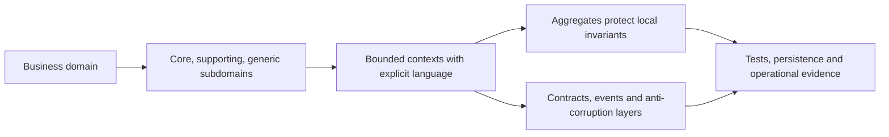

# Domain-Driven Design For Production Systems

Domain-driven design aligns software boundaries and language with a complex business domain. It is most useful
where rules, state transitions and competing models create risk. It is not a requirement to create one class for
every DDD term or one microservice for every aggregate.

## Strategic Design

- A **domain** is the business problem space.
- A **subdomain** is a cohesive problem area. Core subdomains differentiate the business; supporting subdomains
  are necessary but not differentiating; generic subdomains are often bought or standardized.
- A **bounded context** is the boundary inside which one model and ubiquitous language are consistent.
- **Ubiquitous language** is the precise shared vocabulary used by domain experts, code, tests, APIs and
  operational discussion inside that context.
- A **context map** records relationships and translation between contexts rather than pretending one enterprise
  model fits every team.

Bounded contexts are discovered from language, invariants, ownership, workflows, change cadence and integration
pressure. They are not automatically deployment units. A modular monolith can contain several bounded contexts;
one context can also need multiple deployable components.

## Context Relationships And Translation

Common relationships include partnership, customer-supplier, conformist, shared kernel, open-host service,
published language and separate ways. Choose deliberately from team power, change control and coupling.

An **anti-corruption layer** translates an external model into the receiving context's language and protects its
invariants. It adds mapping and operational cost, but prevents vendor or upstream semantics from leaking through
the domain. Translation must cover identifiers, states, errors, money/time units and version evolution.

## Tactical Building Blocks

| Building block | Responsibility |
|---|---|
| entity | continuity through identity while attributes change |
| value object | immutable descriptive value, compared by value |
| aggregate | consistency and transaction boundary for related entities/values |
| aggregate root | only external entry point for aggregate mutation |
| domain service | domain rule that does not naturally belong to one entity/value |
| application service | coordinates use case, transaction, authorization and ports without owning domain rules |
| repository | collection-like access to aggregate roots, hiding persistence mechanics |
| domain event | business fact that already occurred inside the domain model |

## Aggregate Design

An aggregate protects invariants that must be atomically true. Keep it small: reference other aggregates by
identity, avoid loading large graphs, and use eventual consistency plus explicit workflow/reconciliation across
aggregate boundaries. One transaction should normally change one aggregate; exceptions require a proven
invariant and storage boundary.

Aggregate versioning supports optimistic concurrency, but retry must re-read and re-evaluate the command. Blindly
replaying stale decisions can preserve database consistency while violating business intent.

## Domain Events And Integration Events

A domain event represents a fact meaningful inside its bounded context. An integration event is a published,
versioned contract for other contexts. They may share information but need not be the same class or schema.
Translate and minimize the external contract, publish atomically through an outbox where required, and assume
at-least-once delivery, duplicates and reordering.

Events should use past-tense business language and stable identities. Do not publish internal entity graphs or
use events as remote method calls disguised as facts.

## Commands, Queries, And CQRS

A command requests a state transition and can be rejected; an event records what happened. A query returns a
view without requesting business mutation. CQRS is useful when write invariants and read models have materially
different needs, but it adds projection lag, rebuild, reconciliation and operational ownership.
DDD does not require CQRS or event sourcing.

## Persistence And Framework Boundaries

Keep domain invariants executable without requiring a live framework container. Map persistence and transport
concerns at boundaries when annotations, lazy loading or serialization would leak infrastructure semantics into
the model. Pragmatic annotations are acceptable when they do not weaken invariants or couple contexts.

Repositories return aggregate roots, not arbitrary cross-context joins. Reporting and search can use dedicated
read models rather than stretching aggregate repositories into analytics APIs.

## Discovery And Testing

Use event storming, example mapping, workflow observation, incident history and terminology conflicts to discover
commands, events, policies, aggregates and boundaries. Validate with domain examples, concurrency tests, contract
tests between contexts, and production reconciliation evidence.

## Common Failure Modes

- anemic entities with every rule in a god service;
- aggregate equals an entire database graph;
- bounded context equals table, noun, team, or microservice by default;
- one shared canonical model across unrelated contexts;
- domain and integration events treated as identical implementation objects;
- repository per table rather than per aggregate root;
- event sourcing adopted because events exist;
- abstractions added to simple CRUD with no domain complexity.

## Interview Checks

**Bounded context versus microservice?** A bounded context is a model/language boundary; a microservice is a
deployment and ownership boundary. They often align, but neither implies the other.

**Entity versus value object?** Entity equality follows stable identity; a value object is immutable and equal by
its complete value. Choose from lifecycle and business meaning, not database primary-key availability.

**How large should an aggregate be?** The smallest boundary that can enforce required atomic invariants. Large
aggregates increase contention and loading cost; cross-aggregate rules need workflows, reservations or repair.

**Domain event versus integration event?** Domain events are internal business facts; integration events are
external compatibility contracts. Translate intentionally and publish with reliable delivery semantics.

## Official References

- [Domain-driven design reference](https://www.domainlanguage.com/ddd/reference/)
- [Microsoft DDD-oriented microservice guidance](https://learn.microsoft.com/dotnet/architecture/microservices/microservice-ddd-cqrs-patterns/)

## Recommended Next

Apply the boundary method to [Service Boundaries And Ownership](./microservices/SERVICE-BOUNDARIES-OWNERSHIP.md), then compare it with the [Retail Domain Architecture](./retail/RETAIL-DOMAIN-ARCHITECTURE.md).
