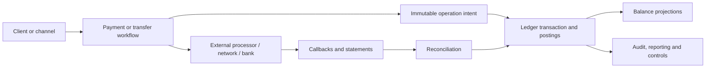

# Financial Systems Architecture

<DocLabels items={[
  {label: 'Financial correctness', tone: 'production'},
  {label: 'Architect path', tone: 'advanced'},
  {label: 'Interview preparation', tone: 'interview'},
]} />

Financial systems are not ordinary CRUD applications with a currency field. They must preserve
value, explain every transition, distinguish uncertain outcomes from failures, reconcile with
external authorities, and produce evidence that survives retries, outages, operator actions,
schema changes, and recovery.

This track teaches engineering principles, not accounting, legal, tax, or regulatory advice.
Product accountants, compliance, risk, security, and scheme/provider specialists must approve
the business rules used in a real system.

## System Mental Model



The external system may be the authority for a card capture while your ledger is the authority
for customer liability. Reconciliation proves that those different authorities agree; it is not
an afterthought that runs only when something looks wrong.

## Complete Route

1. [Money, Ledger, And Accounting Invariants](./MONEY-LEDGER-ACCOUNTING-INVARIANTS.md)
2. [Payment Lifecycle, Idempotency, And Uncertain Outcomes](./PAYMENT-LIFECYCLE-IDEMPOTENCY.md)
3. [Reconciliation, Settlement, And Restartable Batch](./RECONCILIATION-SETTLEMENT-BATCH.md)
4. [Financial Controls, Security, And Auditability](./FINANCIAL-CONTROLS-SECURITY-AUDIT.md)
5. [Financial Production Scenarios And Interview Workbook](./FINANCIAL-PRODUCTION-INTERVIEW.md)

Related foundations:

- [Database Production Mastery](../../data/DATABASE-PRODUCTION-MASTERY.md)
- [Kafka Production Mastery](../../integration/kafka/KAFKA-PRODUCTION-MASTERY.md)
- [Saga Liveness And Recovery](../../reliability/SAGA-LIVENESS-TIMEOUT-RECOVERY.md)
- [Outbox Production Failure Modes](../../reliability/OUTBOX-PRODUCTION-FAILURE-MODES.md)
- [Application And Platform Security](../../security/README.md)

## Core Invariants

Write these before selecting services or topics:

1. A financial operation has one stable identity across client retries and internal redelivery.
2. A posted ledger transaction is balanced according to the approved chart and accounting rules.
3. Posted history is corrected with linked reversing/adjusting entries, not destructive edits.
4. Currency, amount, precision, rounding rule, business date, and value date are explicit.
5. State transitions are guarded; stale or duplicate messages cannot move state backward.
6. A timeout or lost response produces `UNKNOWN/PENDING`, never an invented success or failure.
7. External statements and internal positions are reconciled with owned, aged exceptions.
8. Every privileged action identifies actor, authority, reason, approval, time, and affected object.
9. Recovery preserves auditability and proves the ledger plus projections are consistent.

The exact debit/credit meaning and recognition point depend on the product. The engineering
invariant is that approved rules are centralized, versioned, testable, and traceable.

## Service Boundaries

| Boundary | Owns | Must not silently own |
|---|---|---|
| payment orchestration | provider attempts, state machine, callbacks | authoritative accounting balances |
| ledger | accounts, transactions, postings, balance derivation | provider credential handling |
| reconciliation | matching, breaks, evidence, adjustments workflow | arbitrary mutation of posted history |
| settlement | clearing files/instructions, positions, cutoffs | customer-facing guesses about provider outcome |
| entitlements | subjects, roles, attributes, approvals | business posting rules |
| reporting | read models and finance extracts | hidden corrective writes to the ledger |

A modular monolith may be safer than premature microservices when one database transaction must
enforce the ledger invariant. Split deployment boundaries only with a credible consistency,
replay, reconciliation, access-control, and operational-ownership model.

## Evidence Standard

For every workflow, be able to produce:

```text
operation and idempotency identity
state-transition history
ledger transaction and postings
external request/reference and verified callback
outbox/inbox delivery evidence
reconciliation match or owned break
actor, approval and reason for manual action
business/value/processing timestamps
release, rule and schema version
```

Logs alone are not the ledger. Metrics alone are not an audit trail. A distributed trace alone
does not prove that a posting occurred exactly once.

## Completion Standard

You are ready when you can design and defend:

- a multi-currency money value without binary floating-point errors;
- an append-only, balanced ledger and rebuildable balance projection;
- an authorization/capture/refund/dispute lifecycle with conditional transitions;
- idempotency across HTTP, Kafka, databases, webhooks, and provider APIs;
- uncertain-outcome recovery without double charging;
- daily and intraday reconciliation with control totals and exception ownership;
- restartable end-of-day processing with cutoffs and business dates;
- maker-checker approvals, entitlements, secrets, audit, and sensitive-data boundaries;
- failover, replay, and disaster recovery without fabricating financial state;
- incident answers backed by invariants, evidence, containment, and reconciliation.

## Recommended Next

Begin with [Money, Ledger, And Accounting Invariants](./MONEY-LEDGER-ACCOUNTING-INVARIANTS.md).

## Official References

- [PCI SSC document library](https://www.pcisecuritystandards.org/document_library/)
- [Federal Reserve payment systems](https://www.federalreserve.gov/paymentsystems.htm)
