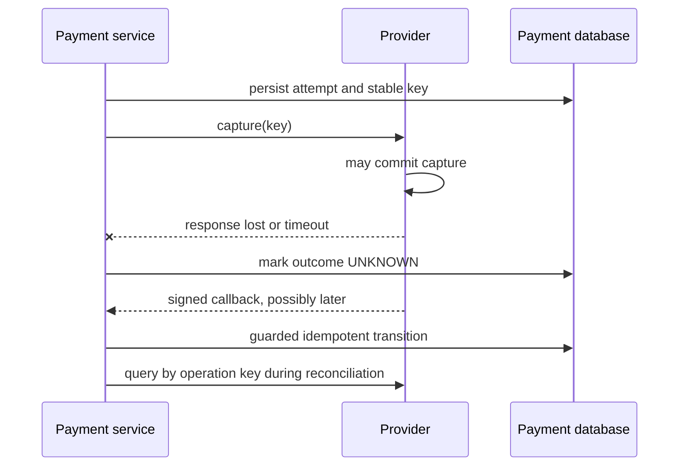

# Payment Lifecycle, Idempotency, And Uncertain Outcomes

## Separate The Stages

```text
CREATED
  -> AUTHORIZATION_PENDING -> AUTHORIZED -> CAPTURE_PENDING -> CAPTURED
  -> DECLINED                 |                |
                              -> VOIDED        -> REFUND_PENDING -> REFUNDED
                                               -> DISPUTED -> WON/LOST

external progression: submitted -> cleared -> settled (scheme/provider dependent)
```

Authorization reserves or approves funds; capture requests transfer or collection; clearing
exchanges obligations; settlement moves final positions. Exact guarantees vary by payment rail.
Model provider-specific details behind an adapter without flattening meaningful states.

## Guarded State Transitions

Every command supplies expected identity and transition. Use a conditional update or optimistic
version so late messages cannot overwrite newer state.

```sql
UPDATE payment_intent
SET status = 'CAPTURED', provider_reference = :reference, version = version + 1
WHERE id = :id AND status IN ('AUTHORIZED', 'CAPTURE_PENDING') AND version = :expected;
```

Zero rows means duplicate, stale, or invalid transition; load current state and classify it. Do
not map every zero-row result to a retry.

## End-To-End Idempotency

Persist the key, operation/tenant scope, canonical request hash, status, stable result, and expiry.

1. Atomically reserve a unique key.
2. Reject the same key with a different request hash.
3. Return the stored result after success.
4. Expose in-progress/unknown rather than launching a second effect.
5. Expire only after the maximum retry, callback, dispute, and audit window permits it.

Use the same stable provider key for a retry when the provider contract supports it. Kafka producer
idempotence does not deduplicate a charge, and an inbox does not deduplicate a direct provider call
unless the operation identity and state protocol connect them.

## Timeout Means Unknown



Never immediately create a new attempt with a new key. Await a verified callback, query provider
state, or reconcile a statement. Keep the workflow pending and define handling for aged unknowns.

## Webhooks And Callbacks

Treat callbacks as untrusted, duplicate, delayed, and out of order:

- authenticate with the provider's signature or mTLS mechanism;
- validate timestamp/replay window and raw bytes where the signature contract requires it;
- store provider event ID under a uniqueness constraint;
- acknowledge after durable receipt when the contract permits;
- process asynchronously with bounded retries;
- fetch authoritative provider state for incomplete or security-sensitive notifications;
- correlate amount, currency, merchant and object ownership;
- rotate secrets/keys with overlap and audit verification failures.

## Database, Ledger, And Event Consistency

Within one local transaction, guard the payment transition, post/reference the approved ledger
transaction, insert the outbox event, and commit. The relay can publish duplicates, so consumers
use an inbox or business invariant.

If the provider effect occurs before the database commit, a crash leaves external success with
local uncertainty; reconciliation must recover it. XA usually cannot include public payment rails.

## Orchestration And Saga Liveness

A participant can consume a command, commit work, and fail before publishing its outcome. The
orchestrator retains a deadline and operation key, queries status or sends a safe retry, then routes
aged cases to reconciliation. Absence of an event is not proof of failure.

Compensation is a new operation: an authorization may be voided, a capture may require refund,
and a settled item may require adjustment. Compensation can fail and must itself be idempotent,
observable, and reconciled.

## Refunds, Reversals, And Disputes

Maintain separate identities, amounts, lifecycle, provider references, and ledger postings. For
partial refunds guard `refunded + requested <= captured`. A dispute is not merely a refund: it has
evidence, deadlines, provisional/final states, and scheme-defined financial effects.

## Production Signals

Track intent age by status/provider; authorization, capture and refund outcomes; callback failures,
duplicates and age; provider/internal mismatches; idempotency collisions; outbox/inbox age; ledger
posting failures; workflow divergence; and reconciliation breaks/manual adjustments.

## Interview Questions

**Provider returned `500`; retry?** Classify the contract and outcome first. The request may have
succeeded. Reuse a stable key or query status; do not assume HTTP `500` means no financial effect.

**Kafka event delivered twice?** Guard the business transition and persist event/operation identity
with the state change. Offset commits cannot make the database effect exactly once.

**Payment captured but inventory expired?** Preserve capture, stop confirmation, and initiate an
idempotent refund or approved exception workflow. Do not rewrite the capture as failed.

## Official References

- [PCI Security Standards Council document library](https://www.pcisecuritystandards.org/document_library/)
- [OWASP Transaction Authorization](https://cheatsheetseries.owasp.org/cheatsheets/Transaction_Authorization_Cheat_Sheet.html)
- [ISO 20022 overview](https://www.iso20022.org/about-iso-20022)

## Recommended Next

Continue with [Reconciliation, Settlement, And Restartable Batch](./RECONCILIATION-SETTLEMENT-BATCH.md).

