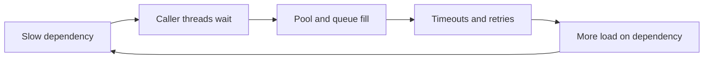

# Microservices Cascading-Failure Prevention

A cascade begins when waiting work consumes a finite resource faster than it is
released. The first failure may be a database, DNS, network, CPU, or dependency;
the system-wide failure is usually unbounded waiting, retries, queues, or shared
pools.

## Deadline Hierarchy

Propagate one end-to-end deadline. Each downstream call receives only the
remaining budget, with time reserved for response handling. A connection timeout,
request timeout and pool-acquisition timeout answer different questions; configure
all three.

Retries must fit inside the remaining deadline and be safe/idempotent. A retry at
gateway, SDK and service can multiply attempts. Define one retry owner and a total
retry budget with exponential backoff and jitter.

## Resource Bounds And Bulkheads

Bound threads/virtual-thread tasks, executor queues, HTTP connections, database
connections, in-flight requests, message batches, tenant concurrency and memory.
Use separate bulkheads when background Kafka/replay work must not exhaust the
interactive request path.

Reject early when admission capacity is exhausted. An unbounded queue converts
overload into stale work, memory pressure and worse tail latency.

## Circuit Breaker, Rate Limit And Load Shedding

- circuit breaker stops repeated calls after observed failures;
- rate limiter protects an agreed capacity over time;
- concurrency limiter protects simultaneous resource use;
- load shedding rejects work that cannot meet its deadline;
- fallback provides a deliberately reduced result, never fabricated correctness.

A circuit breaker does not replace timeouts or capacity bounds. Half-open probes
must be few enough not to overwhelm a recovering dependency.

## Backpressure And Brownouts

Backpressure communicates reduced capacity upstream through bounded queues,
credits, pause/resume, rate-limit responses, or admission rejection. A brownout
temporarily disables optional expensive work—recommendations, enrichment or
analytics—while preserving core invariants.

Define brownout triggers, owner, duration, customer impact and automatic exit.

## Hedged Requests

A hedge starts a duplicate request after a latency threshold and accepts the first
valid response. Use only for idempotent reads, after measuring tail latency, with
strict hedge budgets and cancellation. Hedging an overloaded dependency or a
non-idempotent write amplifies harm.

## Thundering Herd And Cache Stampede

Prevent synchronized refresh/retry with jitter, request coalescing, single-flight
loading, stale-while-revalidate, distributed ownership where necessary and
bounded refresh concurrency. Never let every replica rebuild the same expensive
cache entry simultaneously.

## Dependency Recovery

When a dependency returns, do not release the full backlog immediately. Use
canaries, progressive concurrency, tenant fairness and saturation feedback.
Reconcile timed-out or ambiguous writes before retrying non-idempotent operations.

## Evidence

Capture request rate, error rate, duration, saturation, pool acquisition time,
queue depth/age, timeout/retry counts, breaker state, shed requests, dependency
p99, tenant share and remaining deadline. Trace attempts with one logical request
ID and distinct attempt IDs.

## Scenario: Database Pool Exhaustion

1. stop retry amplification and reduce background consumers;
2. confirm pool waiters, checked-out connections, query/transaction duration and DB saturation;
3. find leaks, slow queries or oversized transactions;
4. preserve a reserved/bulkheaded interactive capacity if designed;
5. restore gradually and measure pool wait, not only connection count;
6. add acquisition deadlines, leak evidence and capacity tests.

## Interview Questions

**Why can retries reduce availability?** They add load precisely when capacity is
already impaired and can exceed the original traffic by multiple layers.

**Circuit breaker or bulkhead?** Breaker reduces calls based on failure history;
bulkhead limits resource consumption. Production systems often need both.

**What proves graceful degradation?** Core business SLO and invariants remain
within target while optional work is measurably shed and dependencies stay below
saturation.

## Recommended Next

Continue with [Microservices Observability And SLOs](./MICROSERVICES-OBSERVABILITY-SLOS.md).

