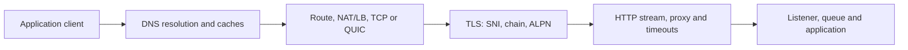

# Network Diagnosis Incidents, Labs, Interviews, And Revision

## End-To-End Diagnostic Sequence

1. Capture exact client, destination name/URL, time, network/namespace and error.
2. Separate DNS, pool wait, connect, TLS, write, first-byte, download and server spans.
3. Resolve using application/OS path and direct resolver; record returned addresses/TTL.
4. Confirm route, selected load-balancer/backend, socket state and listener.
5. Inspect TLS SNI/ALPN/chain/hostname/time and negotiated protocol.
6. Correlate client, proxy and server logs/traces with connection/stream identifiers.
7. Use bounded packet capture only when higher-level evidence cannot decide.
8. Contain, correct the owning layer, then verify existing and new connections.

## Timing Command Example

```bash
curl --silent --show-error --output /dev/null \
  --connect-timeout 2 --max-time 10 \
  --write-out 'dns=%{time_namelookup} connect=%{time_connect} tls=%{time_appconnect} first=%{time_starttransfer} total=%{time_total}\n' \
  https://service.example/health
```

The client tool itself has DNS/cache/proxy/protocol behavior; correlate with application metrics.



## Production Scenarios

**Only one region fails hostname resolution.** Compare resolver/forwarder/authoritative reachability,
split-horizon view, DNSSEC, cache status, network policy and recent zone change from that region.

**Connection timeouts rise during deployment.** Inspect readiness/endpoints, LB drain, SYN/SYN-ACK,
server backlog, CPU/throttling and connection storm. Stop rollout, restore capacity/drain and align
pool/lifecycle.

**TLS fails after rotation for some clients.** Compare trust stores, intermediate chain, SNI, SAN,
clock, protocol and existing connection reuse. Restore overlap/chain, then update and measure adoption.

**HTTP/2 works directly but not through proxy.** Verify ALPN and protocol on each hop, proxy support,
header/framing/stream limits, idle timeout and whether upstream was downgraded.

**Small calls work, large responses hang.** Investigate MTU/PMTUD, flow-control windows, TCP loss,
proxy/body limits and application backpressure using filtered packet and HTTP/2 evidence.

**Latency spikes but no packet loss.** Check DNS/cache misses, pool acquisition, TLS reconnects,
proxy queues, server first byte, HTTP/2 stream limits/flow control and downstream spans.

## Packet-Analysis Questions

- Did client send SYN and receive SYN-ACK? Which direction loses packets?
- Was handshake retransmitted and what is RTT?
- Did TLS alert occur, and from which peer?
- Which certificate/SNI/ALPN was negotiated?
- Are TCP retransmissions, duplicate ACK/SACK or zero windows present?
- Did server send FIN/RST/GOAWAY, and were requests accepted before it?
- Are captures taken on both sides of NAT/proxy showing address translation?

Packet timestamps can be affected by capture point/offload/clock. Encrypted payload limits application
inspection; use TLS key logging only in authorized isolated labs.

## Hands-On Labs

1. Build authoritative and caching DNS containers; change TTL and observe positive/negative cache.
2. Introduce wrong search suffix, stale runtime cache and split-horizon response; diagnose each.
3. Capture a TCP handshake, intentional packet loss/retransmission, graceful FIN and RST.
4. Exhaust a small local ephemeral-port/NAT test range safely and prove connection reuse correction.
5. Create a CA/intermediate/server certificate; test missing chain, wrong SAN, expiry and mTLS.
6. Run HTTP/1.1 and HTTP/2 servers; measure multiplexing, stream limits, GOAWAY and connection drain.
7. Create an MTU black-hole lab in isolated namespaces and diagnose small-versus-large behavior.
8. Trace one request through client, proxy and server with DNS/TCP/TLS/HTTP/application timings.

## Top Interview Questions

**Timeout versus connection refused?** Timeout often means drop/unreachable/overloaded handshake; refusal
usually means reachable host/port actively rejects or lacks listener. Verify packets and LB/proxy behavior.

**Why can retry worsen a network incident?** It multiplies connection/DNS/TLS/server load, especially across
layers. Use bounded jitter, deadlines, idempotency, admission and one retry owner.

**How do you rotate certificates without downtime?** Deploy overlapping trust, issue/deploy new leafs,
refresh long-lived connections/clients, observe adoption, then revoke/remove old trust with rollback window.

## Additional Production Interview Questions

### What happens during DNS resolution?

The application/runtime may consult its cache, OS resolver configuration, search domains and local caching
stub, which queries recursive and authoritative servers as needed. Positive and negative answers can be cached
at several layers; TTL affects future lookups, not existing connections.

### TCP timeout, refusal, reset, or graceful close?

A connect timeout suggests dropped/unreachable path or no timely handshake; refusal is an active reject/no
listener; reset aborts an established or attempted connection; FIN is graceful half-close. Confirm from both
endpoints and any proxy/NAT rather than decoding one client exception in isolation.

### What does the TLS handshake validate?

It negotiates protocol/cipher, authenticates the certificate chain and hostname/SAN, checks validity and usage,
and derives session keys. SNI selects the virtual name and ALPN selects HTTP protocol. A valid certificate does
not authorize the application request.

### HTTP/1.1 versus HTTP/2 versus HTTP/3?

HTTP/1.1 typically uses multiple connections for concurrency; HTTP/2 multiplexes binary streams over TCP;
HTTP/3 uses QUIC streams over UDP to reduce transport head-of-line coupling. Actual benefit depends on proxy,
TLS, loss, stream limits and application support across every hop.

### Why do keep-alive and connection pools matter?

Reuse avoids DNS/TCP/TLS cost, but stale connections, long lifetimes, pool waits and per-destination limits can
cause latency or skew. Bound acquisition/connect/read/idle/lifetime, drain on deployment and observe pool plus
socket state rather than opening a new connection for every call.

### How does ephemeral-port or NAT exhaustion appear?

Each translated connection consumes source-port and connection-tracking state until expiry/TIME_WAIT. High
connection churn creates intermittent connect failures despite healthy backends. Reuse connections, reduce
unnecessary retries, distribute egress and measure NAT/port-table occupancy.

### What is an MTU black hole?

Small packets pass while larger packets requiring fragmentation or path-MTU discovery stall because required
ICMP feedback is blocked or encapsulation reduces MTU. Compare packet sizes, retransmissions and interface/path
MTU; do not misdiagnose the symptom as an application timeout.

### How do load-balancer timeouts affect long requests and streams?

Idle, request, response, connection-age and drain timers can terminate otherwise healthy calls. Align client,
proxy and server budgets, use keepalive only where supported, handle GOAWAY/drain and make reconnection safe.
Preserve original client identity only through trusted proxy metadata.

### When should packet capture be used?

After DNS, timing, socket, proxy and application evidence cannot distinguish the layer. Scope interface, hosts,
ports, duration and size; capture both sides of translation when needed. Treat payloads as sensitive and account
for encryption, offload and clock/capture-point effects.

### Why do layered retries create a storm?

If client, proxy and service each retry, attempts multiply while deadlines, connections and server work overlap.
Choose one retry owner, cap attempts under one deadline, require idempotency and use jitter, admission control and
load shedding so recovery traffic cannot prevent recovery.

## One-Page Revision

- DNS answers are cached at multiple layers; TTL does not close existing connections.
- TCP is ordered bytes; ACK is transport receipt, not business completion.
- Flow control protects receiver; congestion control protects network.
- `TIME_WAIT` is normal correctness state; `CLOSE_WAIT` often signals local close leak.
- NAT/LB connection tracking and ephemeral ports are shared finite resources.
- TLS validates chain, time, SAN/hostname, usage and trust; SNI selects name, ALPN protocol.
- mTLS authenticates identity; authorization remains separate.
- HTTP/2 multiplexes streams but shares TCP loss and connection/flow-control limits.
- Diagnose layer timings and both sides before tuning.
- Packet captures are sensitive, scoped evidence—not a default production action.

## Official References

- [Wireshark User's Guide](https://www.wireshark.org/docs/wsug_html_chunked/)
- [curl timing variables](https://curl.se/docs/manpage.html)
- [Kubernetes Services and networking](https://kubernetes.io/docs/concepts/services-networking/)

## Recommended Next

Return to the [DNS, TCP, TLS, And HTTP/2 Diagnosis Path](../NETWORK-PROTOCOL-DIAGNOSIS-PATH.md) and complete an end-to-end timed trace.
