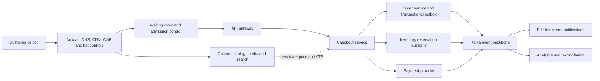

# Black Friday Retail Scale And Resilience

Black Friday is not solved by placing more application instances behind a load
balancer. The system must absorb a large, skewed read workload while protecting
the much smaller capacity of inventory, orders, payments, and databases. The
design goal is controlled service under overload: preserve correct commercial
decisions, keep the most important journeys available, reject excess work early,
and recover every accepted operation.

## Clarify "Billions Of Requests"

Convert the headline into a capacity model before selecting technology. One
billion requests over 24 hours averages about 11,600 requests per second, but a
launch window, bot traffic, polling, images, and client retries can make the
peak many times higher. Also distinguish edge requests from origin API calls:
a CDN should serve most images and cacheable catalog responses without reaching
the application.

Estimate at least:

- peak requests per second by endpoint and region, not only daily volume;
- read/write ratio, payload sizes, cacheable percentage, and CDN hit ratio;
- unique shoppers, authenticated sessions, carts, checkouts, and orders per second;
- hot-SKU concentration rather than assuming uniform demand;
- payment-provider, inventory-write, database, Kafka, and fulfillment limits;
- SLO, maximum queue wait, recovery time, and acceptable degraded behavior.

For example, a system might receive 120,000 edge requests per second while the
CDN absorbs 90%. The 12,000 origin requests per second may yield only 1,000
checkout attempts and 300 accepted orders per second. Every tier must be sized
from measured ratios and a safety margin, not from these illustrative values.

## Invariants And Service Priorities

Protect correctness before optional experience:

1. Never confirm more inventory than the authoritative reservation policy permits.
2. One customer checkout intent creates at most one business order.
3. A payment timeout is an unknown outcome, not an automatic failure.
4. Every accepted order or reservation is durably recorded before success is returned.
5. Duplicate and out-of-order messages cannot repeat a business transition.
6. Browse traffic cannot consume all capacity needed by checkout and recovery.
7. The customer receives an honest state: confirmed, pending, rejected, or sold out.

Define traffic classes such as checkout, payment callback, reservation expiry,
order status, cart, product detail, search, recommendation, and analytics. Reserve
capacity for correctness-critical traffic. Shed recommendations, reviews,
personalization, and expensive facets before rejecting an already-admitted
checkout or a payment-provider callback.

## End-To-End Flow

The waiting room does not make the downstream system faster. It bounds
concurrency and admits work at the rate that inventory, order, and payment paths
can safely sustain. An admission token should be signed, short lived, scoped to
the customer or sale, and protected from replay or resale.

## Component Responsibilities

| Component | Responsibility | Why it exists during the peak |
|---|---|---|
| DNS and global traffic manager | route to a healthy region and support controlled failover | prevents one unhealthy region from receiving all new traffic |
| CDN and object storage | serve images, scripts, static pages, and safe cached product responses | removes bandwidth and read load from application services |
| WAF and bot management | block known attacks, abusive automation, scraping, and credential stuffing | preserves scarce capacity and improves sale fairness |
| Waiting room and admission controller | cap concurrent buyers and issue verifiable admission tokens | converts an uncontrolled spike into bounded work |
| API gateway | authenticate, validate, rate limit, route, and propagate deadlines/correlation | provides a consistent protection boundary without replacing service authorization |
| Catalog and search read models | serve denormalized discovery data | scales browse reads independently from transactional order data |
| Redis or local cache | cache measured hot reads, sessions, rate-limit state, and short-lived results | reduces latency and source load; it is not final stock authority |
| Inventory service | own stock ledger, ATP policy, reservation, confirmation, release, and expiry | provides the atomic no-oversell decision |
| Checkout service | revalidate commercial facts and coordinate the durable workflow | turns mutable browse data into an explicit purchase attempt |
| Order service | own the commercial record, idempotency outcome, order state, and outbox | makes an accepted order durable and retry safe |
| Payment service/provider | own authorization attempts and reconcile uncertain outcomes | avoids duplicate charges after timeouts or callbacks |
| Kafka | buffer asynchronous work and decouple order, inventory, fulfillment, and notification rates | absorbs bounded bursts and enables replay; it does not create unlimited capacity |
| Reconciliation workers | compare independent authorities and repair owned exceptions | detects gaps that retries and messaging guarantees cannot eliminate |
| Observability platform | expose journey SLOs, saturation, queue age, business correctness, and traces | shows whether the platform is serving customers or merely keeping processes alive |

## Catalog And Search At Extreme Read Scale

Catalog is a read-optimization problem during the event:

- Keep product and merchandising data in their authoritative store, but publish
  denormalized product documents to a search engine and cache-safe views to the edge.
- Serve product media from object storage through the CDN. Use immutable asset
  names so long cache lifetimes do not serve the wrong image.
- Precompute landing pages, category navigation, deal lists, and safe facets.
- Pre-warm only measured hot products and queries. Add TTL jitter,
  request coalescing, stale-while-revalidate, and bounded cache loaders to prevent
  a stampede when a popular key expires.
- Replicate search/read models across regions. Define index-lag and stale-data
  behavior, and keep the last known safe catalog view when enrichment fails.
- Disable expensive ranking, recommendations, reviews, or secondary facets when
  their latency or error budget is exhausted.

Search price and availability are informative. Checkout must revalidate the
current price, promotion eligibility, tax, delivery promise, and authoritative
ATP. The UI should show a clear change or sold-out result rather than silently
substituting stale catalog data.

## Hot-SKU Inventory Without Overselling

A flash-sale SKU is a contention problem, not merely a database-size problem.
Adding replicas cannot safely authorize independent sales of the same last unit.
Choose one authoritative reservation strategy:

- an atomic conditional update such as `available >= requested`, with a unique
  reservation identity and guarded state transition;
- a single-writer partition for a SKU or allocation bucket, with durable input
  and enough measured processing capacity;
- preallocated regional or channel stock buckets whose total never exceeds the
  global sellable allocation, followed by reconciliation and controlled rebalance;
- a bounded set of pre-minted purchase permits for a deliberately scarce drop.

Do not split a quantity into independent caches unless the allocation invariant
is explicit. Redis may hold fast permits when durability, failover, fencing, and
reconstruction are designed, but a normal cache decrement alone is not durable
inventory authority.

Reservations need an expiry, but expiry and confirmation can race. Guard
`ACTIVE -> CONFIRMED` and `ACTIVE -> EXPIRED` with the expected state/version so
only one wins. Confirm, release, and expire idempotently. Make sold-out knowledge
fast at the edge to stop useless retries, while allowing the inventory authority
to decide whether released stock can re-enter the sale.

Fairness is a product requirement. A waiting room can issue randomized or FIFO
positions; per-account, device, address, or payment limits can reduce abuse.
Document accessibility, privacy, household-sharing, false-positive appeal, and
fraud trade-offs rather than treating bot blocking as perfect.

## Checkout, Order, And Payment Under Load

The critical path should be short and bounded:

1. The client sends a stable, scoped idempotency key and admission token.
2. Checkout validates identity, cart fingerprint, limits, price, and eligibility.
3. Inventory atomically creates or returns the same reservation result.
4. Order service creates a `PENDING` order and outbox intent in one local transaction.
5. Payment uses a stable provider operation key. A timeout becomes `UNKNOWN` or
   `PENDING` and is resolved by status query or verified callback.
6. Versioned events keyed by aggregate drive confirmation, compensation,
   fulfillment, notification, and analytics.
7. The API returns a durable state. Nonessential email or recommendation work
   remains asynchronous.

The exact ordering of reservation, order creation, and payment depends on the
business policy. State the failure windows and compensation for the selected
sequence. Do not claim a distributed ACID transaction across inventory, order,
and an external payment provider.

Use bounded connection pools, executors, queues, and timeouts. Propagate a
remaining deadline, cap retries with exponential backoff and jitter, and never
retry a non-idempotent operation blindly. Separate pools and circuit breakers so
a slow recommendation, tax, fraud, or payment dependency cannot exhaust every
checkout worker. Kafka consumers must handle duplicates, stale versions, poison
events, lag, replay, and dead-letter recovery.

## Data Placement

| Need | Suitable store | Important qualification |
|---|---|---|
| product authority and merchandising | relational or document database | chosen around authoring, hierarchy, governance, and regional needs |
| catalog discovery | Elasticsearch or OpenSearch read model | eventually consistent; rebuildable from authority |
| hot read/session/rate data | Redis plus in-process cache where safe | control memory, hot keys, eviction, TTL, and fallback |
| inventory ledger and reservation | transactional SQL or strongly consistent distributed database | conditional writes, idempotency, audit, and locality matter more than product label |
| orders and payment state | partitioned transactional SQL, or distributed SQL when justified | preserve constraints, history, and local transaction boundaries |
| integration events | Kafka with deliberate keys, partitions, retention, and replication | capacity must include peak ingress and post-peak drain |
| operational analytics | ClickHouse projections and facts | do not query it to authorize checkout or inventory |
| long-term history | compressed columnar files in object storage | lifecycle, encryption, legal hold, and restore testing are required |

Partition order data by a stable distribution key that matches access patterns,
and use read replicas only for safe stale reads. A read replica does not increase
primary write capacity. Avoid cross-partition uniqueness assumptions; keep a
globally routable order identity and make idempotency ownership explicit.

## Uninterrupted Service Through Controlled Degradation

Absolute uninterrupted service is not a credible promise. A production answer
defines availability targets and a degradation ladder:

1. remove personalization, recommendations, reviews, and costly facets;
2. serve stale-but-safe catalog data and static sale pages;
3. reduce polling and refresh frequency; use push or backoff hints where possible;
4. restrict new browse traffic while preserving admitted checkout and callbacks;
5. queue only work that can finish within its business deadline;
6. reject early with `429` or `503`, a truthful retry time, and an accessible UI;
7. stop new checkout admission if correctness-critical dependencies are unsafe.

Queues smooth bounded bursts but cannot fix permanent under-capacity. Monitor
oldest-message age and estimated drain time, not just queue length. Reject work
whose deadline will expire before service, because accepting it produces retry
storms and false customer expectations.

Deploy across failure domains with stateless application replicas, quorum-aware
data services, tested backups, and rehearsed regional recovery. Avoid changing
DNS or failing over databases automatically unless data consistency, fencing,
replication lag, session behavior, and payment callbacks are understood. Freeze
risky changes before the event, but retain tested feature flags and rollback.

## Readiness, Testing, And Operations

Before the sale:

- load test the complete journey with realistic hot-key skew, cache misses,
  retries, login, checkout, provider limits, and queue drain;
- run dependency-failure, zone-loss, cache-loss, broker-rebalance, and slow-database tests;
- prove reservation, order, payment, and event idempotency under duplicate requests;
- pre-scale slow-starting capacity, verify quotas, warm safe caches, and test autoscaling;
- reconcile inventory allocations and validate sold-out and waiting-room UX;
- define named owners, dashboards, rollback actions, customer messaging, and business stop rules.

During the event, watch customer outcomes and saturation together: CDN hit ratio,
bot rejection, admission rate, queue wait, checkout success, inventory conflicts,
oversell count, order idempotency conflicts, payment unknown age, database lock
wait, pool utilization, Kafka lag/oldest age, p99 latency, and error budget burn.
Do not put SKU, customer, or order IDs into metric labels.

After the event, drain queues at a rate downstreams can sustain, reconcile orders
against reservations and provider payments, expire abandoned reservations,
recover stuck workflows, verify fulfillment capacity, and record corrections in
an audit trail. Peak readiness includes the recovery tail, not only the launch.

## Interview Answer In Two Minutes

Start by converting billions per day into peak RPS by endpoint, region, and hot
SKU. Put static assets and safe catalog views behind a CDN; use search read models
and protected caches so browse traffic rarely reaches transactional databases.
Apply bot controls and a waiting room to admit checkout at measured downstream
capacity, with priority and bulkhead isolation for payment callbacks and recovery.

At checkout, revalidate price and authoritative ATP. Prevent oversell through an
atomic inventory reservation or explicitly bounded allocation permits. Make the
checkout and every downstream operation idempotent. Persist order state and an
outbox atomically, then use Kafka for bounded buffering and asynchronous
fulfillment; treat payment timeout as unknown and reconcile it. Use timeouts,
retry budgets, circuit breakers, load shedding, graceful feature degradation,
multi-zone deployment, observability, reconciliation, and rehearsed recovery.
Finish with quantified SLOs, capacity evidence, failure tests, and the trade-off:
it is better to reject excess work honestly than accept orders the business
cannot preserve or fulfill.

## Review Checklist

- Did the answer separate edge, origin, checkout, and order request rates?
- Did it model hot-SKU skew and the authoritative no-oversell decision?
- Are catalog/search data separated from order and inventory authority?
- Are admission, fairness, bot defense, rate limiting, and load shedding distinct?
- Are checkout, order, inventory, payment, and event operations idempotent?
- Are timeout, retry, queue, pool, partition, and provider limits bounded?
- Is optional functionality degraded before correctness-critical traffic?
- Are reconciliation, queue drain, fulfillment load, and post-event recovery covered?
- Are SLOs, alerts, ownership, capacity tests, rollback, and regional recovery explicit?

## Official References

- [Google SRE Book: Handling Overload](https://sre.google/sre-book/handling-overload/)
- [AWS Builders' Library: Avoiding Insurmountable Queue Backlogs](https://aws.amazon.com/builders-library/avoiding-insurmountable-queue-backlogs/)
- [Apache Kafka Design Documentation](https://kafka.apache.org/documentation/#design)
- [OWASP Automated Threats To Web Applications](https://owasp.org/www-project-automated-threats-to-web-applications/)

Continue with [Retail Domain Interview Questions](./RETAIL-DOMAIN-INTERVIEW.md)
[Redis For Retail Caching And Session Storage](./REDIS-RETAIL-CACHING-SESSIONS.md),
and [Retail Domain And Commerce Architecture](./RETAIL-DOMAIN-ARCHITECTURE.md).
