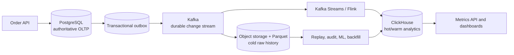
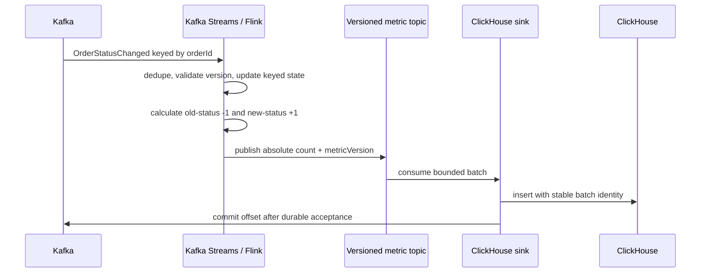

# ClickHouse For Large-Scale Retail Analytics

ClickHouse is a column-oriented online analytical processing (OLAP) database. It
is built for filtering and aggregating very large datasets, not for replacing the
transactional database that accepts an order, reserves inventory, or captures a
payment.

In the retail dashboard design:

```text
PostgreSQL answers: what is the authoritative order state?
Kafka answers: which committed lifecycle facts must be delivered and replayed?
ClickHouse answers: what do billions of facts mean by date, status, facility,
                    region, channel, seller, or fulfillment dimension?
```

## Why A Columnar Database Helps

A row-oriented OLTP database typically stores one complete row together. That is
effective when a request reads or changes a small number of orders. An analytical
query often needs only a few columns from millions of rows:

```sql
SELECT business_date, facility_id, new_status, count()
FROM order_status_events
WHERE business_date >= :startDate
  AND business_date < :endDate
GROUP BY business_date, facility_id, new_status;
```

ClickHouse stores columns separately. For this query it can avoid reading customer,
payload, correlation, or other unused columns. Similar values compress well, and
vectorized execution processes batches of values rather than interpreting one row
at a time.

The `MergeTree` family writes immutable sorted data parts, then merges parts in
the background. Its partition expression supports lifecycle operations and broad
pruning; its `ORDER BY` expression determines physical sort order and the sparse
primary index used to skip ranges. It is not a relational uniqueness constraint.

### What ClickHouse is good at

- time-range scans over millions or billions of facts;
- `GROUP BY`, sums, counts, percentiles, funnels, and dimensional filtering;
- compressed event history;
- high-throughput batched or streaming ingestion;
- pre-aggregated dashboards and near-real-time analytical queries;
- distributed reads across shards and replicated availability.

### What ClickHouse should not own here

- per-order checkout transactions;
- cross-row business constraints for inventory or payment;
- frequent single-row updates as the normal write pattern;
- customer-facing read-after-write order confirmation;
- the only copy of raw history or report evidence.

## Use Multiple Storage Tiers, Not One Database

“Huge data” is a retention and access-pattern problem, not simply a database name.
A production design separates data by authority, temperature, and cost:



| Tier | Suggested content | Typical purpose |
|---|---|---|
| PostgreSQL | active operational orders and bounded customer history | transactions and authoritative workflow |
| Kafka | retained lifecycle events for the recovery window | buffering, decoupling, replay |
| ClickHouse | detailed recent facts plus daily/monthly projections | interactive operational and business analytics |
| object storage/Parquet | long-retained raw facts and immutable reports | inexpensive archive, large backfills, audit and data science |

Retention is a business decision. For example, ClickHouse might retain detailed
events for 13–24 months and daily aggregates longer, while Parquet retains the
approved historical period. Do not adopt those numbers without legal, analytical,
recovery, and cost requirements.

## Capacity From Measured Bytes

For an illustrative workload:

```text
10 million orders/day * 6 events/order = 60 million events/day
60 million * 365 * 2 years             = 43.8 billion events
```

Estimate storage from a representative compressed benchmark:

```text
daily compressed bytes
  = daily rows * measured compressed bytes per row

cluster storage
  = daily compressed bytes
  * retained days
  * replica count
  * merge/free-space headroom
```

Include projections, primary-index marks, dictionaries, temporary merge space,
backups, replicas, and failed-node/rebalance headroom. JSON payload size is not the
compressed columnar size; benchmark real schemas and realistic value distributions.

## Timestamp Model

Retail analytics normally requires at least three time concepts:

| Field | Meaning | Use |
|---|---|---|
| `event_time` | when the business transition occurred | assign the event to a business interval |
| `ingestion_time` | when analytics accepted the event | measure pipeline delay and late arrival |
| `business_date` | local retail date derived from event time and an approved timezone | partition and daily reporting key |

Store event timestamps as UTC `DateTime64`. Derive `business_date` using the
facility or market timezone configured for that event. Do not use the ClickHouse
server timezone or the dashboard user's browser timezone implicitly.

```text
event_time UTC:       2026-07-30T20:15:00Z
facility timezone:    Asia/Kolkata
local event time:     2026-07-31T01:45:00+05:30
business_date:        2026-07-31
```

Version the timezone/retail-calendar policy if facilities can change configuration.
Some retailers use a trading-day cutoff other than midnight; derive and persist
that business key during normalized event processing.

## Detailed Fact Table

```sql
CREATE TABLE analytics.order_status_events
(
    event_id UUID,
    order_id String,
    order_version UInt64,
    previous_status LowCardinality(Nullable(String)),
    new_status LowCardinality(String),
    event_time DateTime64(3, 'UTC'),
    ingestion_time DateTime64(3, 'UTC'),
    business_date Date,
    facility_id LowCardinality(String),
    market LowCardinality(String),
    channel LowCardinality(String),
    counting_grain LowCardinality(String)
)
ENGINE = MergeTree
PARTITION BY toYYYYMM(business_date)
ORDER BY
(
    business_date,
    facility_id,
    new_status,
    event_time,
    order_id,
    event_id
);
```

Why this layout:

- monthly partitions make today/month queries prune historical months and make
  retention manageable;
- `business_date` first supports the dominant reporting range;
- facility and status improve skipping for common dashboard filters;
- event time preserves ordering within the analytical range;
- low-cardinality dimensions compress efficiently;
- order and event IDs retain drill-down and reconciliation identity.

Do not partition by `order_id`, SKU, or customer. Millions of partitions produce
metadata and merge overhead. If most queries use a different dimension, benchmark
an alternative sort key or projection rather than guessing.

## Query Today By Timestamp

The API should calculate the business interval explicitly. In Java:

```java
LocalDate date = request.businessDate();
ZoneId zone = facilityTimeZone.resolve(request.facilityId());

Instant start = date.atStartOfDay(zone).toInstant();
Instant end = date.plusDays(1).atStartOfDay(zone).toInstant();
```

Use a half-open range—`>= start` and `< end`—because it avoids double counting at
adjacent boundaries and handles variable daylight-saving day lengths.

For the raw fact table, filter both the partition key and precise UTC range:

```sql
SELECT
    new_status AS status,
    uniqExact(order_id) AS order_count
FROM analytics.order_status_events
PREWHERE business_date = :businessDate
WHERE event_time >= :startUtc
  AND event_time < :endUtc
  AND facility_id IN (:authorizedFacilities)
  AND counting_grain = 'ORDER'
GROUP BY status
ORDER BY status;
```

This is useful for investigation and reconciliation. The normal dashboard should
read the much smaller daily projection instead of recalculating exact distinct
counts from raw facts on every refresh.

```sql
SELECT
    status,
    sum(latest_value) AS order_count
FROM
(
    SELECT
        facility_id,
        market,
        channel,
        status,
        argMax(metric_value, metric_version) AS latest_value
    FROM analytics.order_daily_metrics
    WHERE business_date = :businessDate
      AND metric_type = 'ENTERED_STATUS'
      AND counting_grain = 'ORDER'
      AND facility_id IN (:authorizedFacilities)
    GROUP BY facility_id, market, channel, status
)
GROUP BY status;
```

## Query One Month

Treat a month as another half-open date range:

```text
startDate = 2026-07-01
endDate   = 2026-08-01
```

The filter selects one monthly partition in the example schema:

```sql
SELECT
    business_date,
    status,
    sum(latest_value) AS order_count
FROM
(
    SELECT
        business_date,
        facility_id,
        market,
        channel,
        status,
        argMax(metric_value, metric_version) AS latest_value
    FROM analytics.order_daily_metrics
    WHERE business_date >= :startDate
      AND business_date < :endDate
      AND metric_type = 'ENTERED_STATUS'
      AND counting_grain = 'ORDER'
      AND facility_id IN (:authorizedFacilities)
    GROUP BY business_date, facility_id, market, channel, status
)
GROUP BY business_date, status
ORDER BY business_date, status;
```

For one total per status across the month, omit `business_date` from the outer
selection and grouping. Keep it in the inner grouping so each versioned daily
metric is resolved before summation.

This approach reads roughly one row per daily metric grain, not every order event.
A date range spanning several months prunes all unrelated partitions and merges
only the selected daily snapshots.

## Current Metrics Are Not A Date Query

“Pending now” is a latest-state gauge, not the sum of daily `PENDING` transitions.
Query the current metric projection:

```sql
SELECT
    status,
    sum(latest_value) AS order_count,
    max(latest_as_of) AS as_of
FROM
(
    SELECT
        facility_id,
        market,
        channel,
        status,
        argMax(metric_value, metric_version) AS latest_value,
        argMax(as_of_event_time, metric_version) AS latest_as_of
    FROM analytics.order_current_metrics
    WHERE metric_type = 'CURRENT_STATUS'
      AND facility_id IN (:authorizedFacilities)
    GROUP BY facility_id, market, channel, status
)
GROUP BY status;
```

For “pending at the end of each day,” query immutable/versioned `EOD_SNAPSHOT`
rows in the daily table. For “orders created in the month that remain pending,”
build a cohort projection or join a bounded creation cohort to latest state; do
not pretend a transition count answers that question.

## How Aggregates Reach ClickHouse

The preferred correctness path is:



Incremental ClickHouse materialized views can transform each newly inserted block
and maintain aggregate target tables. They are useful for append-only facts and
straightforward rollups. They do not automatically make a duplicate external sink
delivery correct or reinterpret an old row that was later replaced. For lifecycle
state, deduplicate and calculate versioned snapshots in the stream layer, then use
ClickHouse for storage and query acceleration.

## Partitioning, Sharding, And Replication

These terms solve different problems:

| Mechanism | Purpose |
|---|---|
| partition | lifecycle and broad pruning inside a table |
| `ORDER BY` | sort locality, sparse primary index, compression and range skipping |
| shard | distribute storage and compute across servers |
| replica | availability and read/storage redundancy |

For detailed order facts, a stable hash of `order_id` is a reasonable starting
shard key because it distributes writes and keeps one order's records together.
Sharding by facility may create hotspots when facility volume is uneven. Queries
by date/facility may fan out across shards, but each shard prunes the same date
partitions and performs a partial aggregation before results merge.

Daily aggregate tables are far smaller. Depending on scale, replicate them or use
a distribution aligned with the query pattern. Benchmark with production-like
skew and node loss; do not add shards before one well-sized node or replica set is
measured.

## Retention And Cold Storage

Use TTL policies to expire or move detailed partitions after the approved hot
period, but keep deletion and legal-hold behavior explicit. Before removing a
partition, prove that:

- its raw Parquet archive is complete and checksummed;
- finalized/corrected daily metrics remain available for the required period;
- restore and backfill procedures have been exercised;
- privacy deletion and legal-hold policies agree with the archive; and
- replicas and backups are not mistaken for independent archival evidence.

Keep raw events immutable and partition Parquet paths predictably:

```text
order-status-events/
  business_year=2026/
    business_month=07/
      business_date=2026-07-30/
        part-0001.parquet
```

## Query Efficiency Rules

1. Filter the partition/business-date range explicitly.
2. Use half-open timestamp and date ranges.
3. Select only required columns; avoid `SELECT *`.
4. Query daily/current projections for dashboards and raw facts for audit.
5. Put common selective dimensions into a benchmarked sort key or projection.
6. Batch inserts; avoid a flood of tiny parts.
7. Avoid `FINAL` on large interactive queries; resolve versions with `argMax` or
   publish already versioned aggregate snapshots.
8. Bound dates, facilities, dimensions, rows, concurrency, and execution time at
   the Metrics API.
9. Cache popular authorized responses briefly while preserving analytical `asOf`.
10. Use query logs and actual bytes/rows read to validate pruning.

## Operational Signals

Monitor:

- rows and compressed bytes ingested per second;
- Kafka/sink lag and oldest unpersisted event age;
- insert batch size, tiny-part creation, active part count, and merge backlog;
- disk utilization, replica lag, failed parts, and mutation/TTL progress;
- query p50/p95/p99, rows and bytes read, memory, spills, and rejected queries;
- current/daily metric freshness and reconciliation mismatch;
- late-event and corrected-report rates; and
- archive/export checksum and last successful restore drill.

A database can be technically available while the dashboard is hours stale. Alert
on the business freshness SLO as well as ClickHouse process health.

## Database Choice Summary

| Question | Choice |
|---|---|
| Where is an order created and transitioned? | PostgreSQL owned by the Order service |
| Where are committed changes buffered and replayed? | Kafka via transactional outbox |
| Where are recent billions of facts queried interactively? | ClickHouse |
| Where are dashboard counts served from? | ClickHouse versioned current/daily projections |
| Where is long-term inexpensive raw history kept? | Object storage with Parquet |
| Where are operational JVM/API/consumer metrics kept? | Prometheus-compatible monitoring |

If the organization already operates a governed warehouse and only needs hourly
or daily reporting, a warehouse scheduled query may be better than introducing
ClickHouse. Select ClickHouse when low-latency high-volume analytics, continuous
ingestion, and operational ownership justify another distributed datastore.

## Interview Answer

> ClickHouse is a columnar OLAP database that stores compressed sorted parts and
> executes vectorized analytical queries. I would keep order transactions in
> PostgreSQL, publish lifecycle events through outbox and Kafka, use Kafka Streams
> or Flink to build versioned current and daily metrics, and sink those projections
> idempotently into ClickHouse. Event timestamps stay in UTC while an approved
> facility timezone produces `business_date`. Today uses one business-date
> partition and a half-open UTC interval; a month uses `[monthStart, nextMonth)`
> and sums version-resolved daily projections. Detailed facts stay hot in
> ClickHouse for the measured retention window and move to Parquet/object storage
> for cheaper long-term history. Partitioning, sort keys, shards, replicas,
> correction, replay, and reconciliation are designed separately.

## Related Guides

- [Retail Order Metrics And Analytics At Scale](./RETAIL-ORDER-METRICS-ANALYTICS.md)
- [Retail Domain Interview Questions](./RETAIL-DOMAIN-INTERVIEW.md)
- [Database System Design Scenarios](../../data/database-selection/SYSTEM-DESIGN-SCENARIOS.md)
- [Specialized Databases](../../data/database-selection/SPECIALIZED-DATABASES.md)
- [Database Engine Internals](../../data/DATABASE-ENGINE-INTERNALS.md)
- [Kafka Streams Stateful Processing](../../integration/streaming/KAFKA-STREAMS-STATEFUL-PRODUCTION.md)

## Official References

- [ClickHouse introduction](https://clickhouse.com/docs/get-started/about/intro)
- [MergeTree table engine](https://clickhouse.com/docs/reference/engines/table-engines/mergetree-family/mergetree)
- [ClickHouse primary indexes](https://clickhouse.com/docs/concepts/core-concepts/primary-indexes)
- [ClickHouse partitioning key](https://clickhouse.com/docs/reference/engines/table-engines/mergetree-family/custom-partitioning-key)
- [Incremental materialized views](https://clickhouse.com/docs/concepts/features/materialized-views/incremental-materialized-view)
- [ClickHouse TTL](https://clickhouse.com/docs/concepts/features/operations/delete/ttl)
- [ClickHouse date and time functions](https://clickhouse.com/docs/reference/functions/regular-functions/date-time-functions)

## Recommended Next Page

Continue with [Retail Order Metrics And Analytics At Scale](./RETAIL-ORDER-METRICS-ANALYTICS.md)
to connect ClickHouse storage to the complete outbox, Kafka, projection, API,
finalization, and reconciliation flow.
