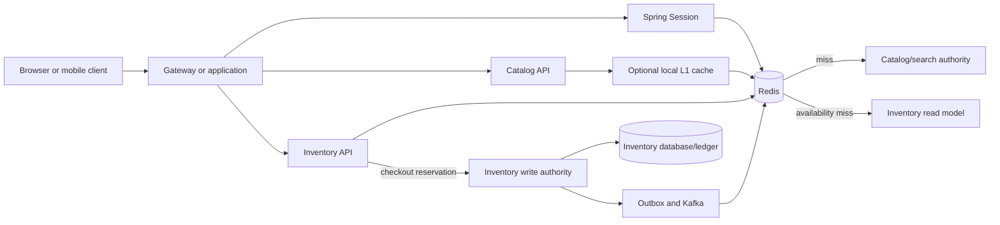
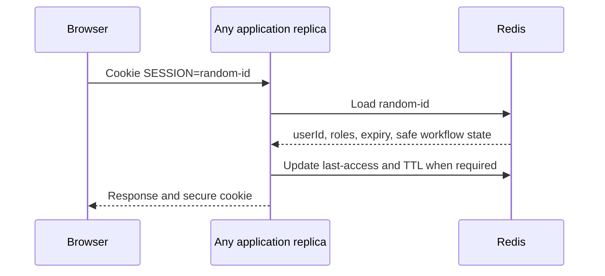
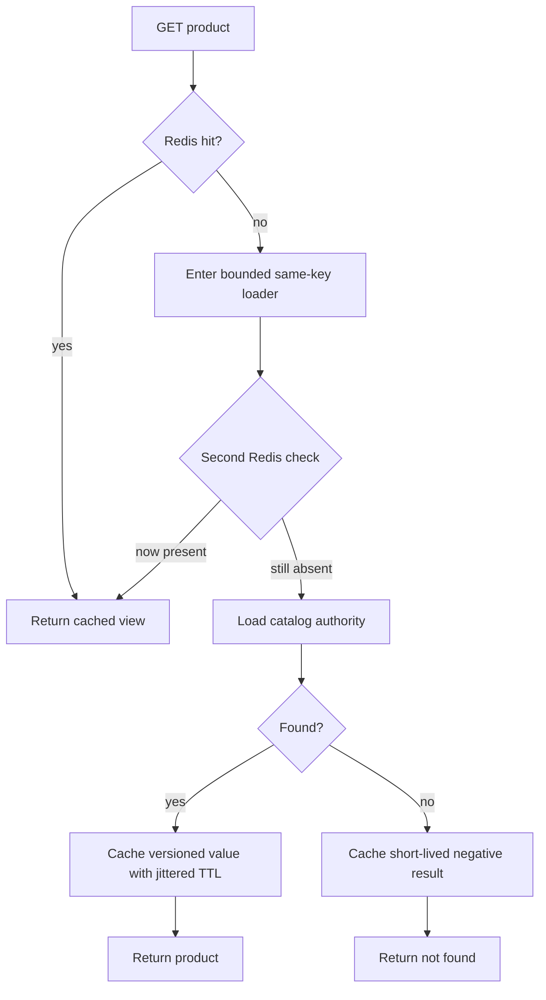

# Redis For Retail Caching And Session Storage

Redis is useful in retail because it provides shared, low-latency access to
bounded data with expiration and atomic operations. Those properties make it a
good fit for stateful HTTP sessions, hot catalog views, short-lived availability
projections, rate limits, and coordination metadata. They do not automatically
make Redis the authority for products, orders, payments, or the last unit of
inventory.

Start by declaring Redis's role for every key family. That role determines
durability, eviction, consistency, fallback, and recovery.

| Key family | Redis role | System of record | On Redis failure |
|---|---|---|---|
| authenticated session | shared stateful-session store | Redis for the live session; identity system for authentication facts | fail closed or require sign-in according to risk policy |
| product detail | disposable cache | catalog authority | protected load from authority or bounded stale response |
| category/product list | disposable query/result cache | search or catalog read model | protected query or simplified response |
| displayed availability | short-lived projection cache | inventory service/ledger | show unavailable/unknown or bounded stale label |
| inventory reservation | not an ordinary cache concern | inventory reservation authority | reject or remain pending; never guess success |
| rate-limit counter | short-lived control state | Redis for the active window | fail-open or fail-closed according to endpoint risk |

## Architecture And Request Flows



The two inventory paths are intentionally different. Browsing can use a
freshness-bounded projection. Checkout needs an atomic reservation decision from
the inventory authority. A fast cache must not turn approximate availability
into an oversell.

## Redis-Backed Stateful Sessions

If a session exists only in one application process, a load balancer must keep
the user on that replica and a restart loses the session. Redis lets every
stateless application replica resolve the same opaque session identifier.



The browser cookie should contain only an unpredictable session identifier. Do
not put passwords, raw access tokens, payment-card data, or a serialized customer
record into it. The server-side session should also be minimal: stable user ID,
authorization context needed for the request, selected locale, and deliberately
chosen short-lived workflow state.

### Spring Boot And Spring Session

```gradle
implementation "org.springframework.boot:spring-boot-starter-data-redis"
implementation "org.springframework.session:spring-session-data-redis"
```

```yaml
spring:
  session:
    store-type: redis
    timeout: 30m
  data:
    redis:
      host: redis.internal
      port: 6379
      connect-timeout: 1s
      timeout: 300ms

server:
  servlet:
    session:
      cookie:
        http-only: true
        secure: true
        same-site: lax
```

Spring Session replaces the servlet container's local session repository with a
Redis-backed repository. It creates and reads session records, manages expiry,
and deletes or expires them after logout or inactivity. Exact property names and
defaults depend on the supported Spring Boot line; verify them during upgrades.

Security and production requirements include:

- TLS, authenticated Redis access, network isolation, and least privilege;
- session ID rotation after login or privilege elevation;
- `HttpOnly`, `Secure`, and an appropriate `SameSite` cookie policy;
- CSRF protection for cookie-authenticated state-changing requests;
- explicit idle and maximum session lifetime rather than an unlimited sliding session;
- logout, administrator revocation, account-disable, and password-reset behavior;
- no session identifiers in logs, metrics, traces, URLs, or analytics events;
- replication/failover and tested behavior during topology changes.

A Redis-backed session and a stateless signed token are different choices. A
session provides immediate server-side revocation and small cookies but requires
a live shared lookup. A self-contained access token removes that lookup but needs
short expiry and a deliberate revocation/refresh design. Do not combine both
without naming which one authorizes the request.

### Session Failure Decisions

Do not blindly fall back to an application-local session when Redis fails: the
user could appear logged out on one replica and logged in on another. For
authenticated checkout, account, or payment functions, fail closed or require
reauthentication. An anonymous catalog journey may continue with a new anonymous
session if cart-recovery and customer communication policies support it.

Separate session Redis capacity from large caches when eviction or noisy catalog
traffic could remove active sessions. This can mean separate clusters or at
least distinct capacity, eviction, monitoring, and failure domains. A cache may
use an eviction policy; important active sessions require memory sizing that
does not depend on opportunistic eviction.

## Cache-Aside For Product Details

The catalog service commonly uses cache-aside:



```java
public ProductView getProduct(ProductKey productKey) {
    String key = productCacheKey(productKey);

    ProductView hit = productCache.get(key);
    if (hit != null) {
        return hit;
    }

    return productLoads.executeOnce(key, () -> {
        ProductView secondCheck = productCache.get(key);
        if (secondCheck != null) {
            return secondCheck;
        }

        ProductView loaded = catalogRepository.findView(productKey)
            .orElseThrow(ProductNotFoundException::new);

        productCache.put(key, loaded, jitteredTtl(12, 18));
        return loaded;
    });
}
```

The example's `executeOnce` represents bounded same-key request coalescing, not
an unlimited distributed lock. Always recheck Redis after acquiring the loading
right because another request may already have populated it.

### Key And Value Design

Every input that changes a response belongs in the key or cached representation:

```text
retail:catalog:product:v3:{market}:{channel}:{locale}:{sku}
```

Include tenant, market, channel, locale, currency, customer segment, or
authorization scope only when it affects that value. Omitting a dimension can
serve the wrong price or content; adding unbounded dimensions destroys reuse and
memory predictability. Prefer stable identifiers and normalized values.

Cache immutable DTOs rather than managed JPA entities. Use explicit JSON or
another reviewed serializer, a schema/version field, bounded value size, and
safe type handling. During an incompatible migration, use a new namespace,
temporarily support old/new reads if needed, warm the new keys, switch traffic,
and let old keys expire.

## Product And Inventory Lists

A product-list cache key must include the normalized query:

```text
retail:catalog:list:v5:{market}:{channel}:{category}:{sort}:{filterHash}:{page}:{size}
```

Caching complete product documents in every page duplicates data. A common
design caches an ordered page of SKU/offer IDs, then retrieves product views
with Redis multi-get or pipelining:

```text
list key -> [sku-10, sku-44, sku-71]
product keys -> one reusable product view per SKU/context
```

For arbitrary filters, facets, ranking, and millions of products, Elasticsearch
or OpenSearch remains the query engine. Cache only measured hot queries. Cap
page size, key cardinality, value size, and deep pagination; otherwise Redis
becomes an unbounded copy of search results.

For a page containing 20 SKUs, handle cached availability in a batch:

1. Multi-get the 20 `(SKU, location or fulfillment region)` keys.
2. Separate hits from misses without issuing one source call per miss.
3. Batch-read only the missing values from the inventory read model.
4. Multi-set or pipeline the loaded projections with a short, jittered TTL.
5. Assemble the response while retaining explicit `UNKNOWN` for unresolved values.

```java
public Map<AvailabilityKey, AvailabilityView> getAvailability(
        List<AvailabilityKey> requested) {
    Map<AvailabilityKey, AvailabilityView> result = cache.multiGet(requested);

    List<AvailabilityKey> missing = requested.stream()
        .filter(key -> !result.containsKey(key))
        .toList();

    if (!missing.isEmpty()) {
        Map<AvailabilityKey, AvailabilityView> loaded =
            inventoryReadModel.findAll(missing);
        cache.multiPut(loaded, jitteredTtlSeconds(20, 40));
        result.putAll(loaded);
    }

    return result;
}
```

Pipelining reduces network round trips; it does not make the commands atomic.
Prefer customer-safe labels such as `IN_STOCK`, `LOW_STOCK`, `OUT_OF_STOCK`, or
`UNKNOWN` to a rapidly stale exact quantity. The inventory read model should
avoid an N+1 query when loading the misses.

## Inventory Authority At Checkout

Browsing availability answers, "what can we display within this freshness
policy?" Reservation answers, "can this checkout own these units now?" The
latter requires an atomic invariant in the inventory authority, for example:

```sql
UPDATE inventory_balance
SET available = available - :quantity,
    reserved = reserved + :quantity,
    version = version + 1
WHERE sku_id = :skuId
  AND location_id = :locationId
  AND available >= :quantity;
```

Zero affected rows means the reservation did not succeed. Use a stable
reservation identity, guarded state transitions, expiry, and idempotent confirm
or release. Redis may hold an availability projection or deliberately designed
scarce-sale permits, but a normal cached counter is not evidence that the
durable inventory reservation succeeded.

After an inventory change, commit the inventory state and outbox intent in one
local transaction. A Kafka consumer can invalidate or refresh affected Redis
keys. It must deduplicate events, compare aggregate versions, tolerate replay,
and avoid allowing an older event to overwrite a newer projection.

## Cache-Miss And Stampede Protection

Misses are expected after first access, TTL expiry, invalidation, eviction,
restart, failover, or a new query combination. The dangerous case is a miss
storm: thousands of requests for one hot product all fall through to the same
database or search service.

Use layered protection:

- in-process same-key coalescing for requests reaching one replica;
- a short, ownership-safe distributed loading lease only when cross-replica
  coalescing is worth its failure complexity;
- a second cache check after acquiring the loading right;
- TTL jitter so popular keys do not expire simultaneously;
- refresh-ahead for measured hot keys;
- stale-while-revalidate where bounded staleness is honest;
- loader concurrency limits, database bulkheads, deadlines, and load shedding;
- short negative caching for genuine not-found responses, never for timeouts.

Do not wait indefinitely for a cache-fill lock. If the holder crashes, the lease
must expire; release must verify ownership. A distributed lock still does not
make the database and Redis atomic and may require fencing when stale holders can
modify an external resource.

### Stale-While-Revalidate

Store logical freshness separately from hard expiry:

```text
value: product view
freshUntil: 10:05:00
hardExpiry: 10:20:00
```

- Before `freshUntil`, return the value.
- Between `freshUntil` and `hardExpiry`, return it and trigger one bounded refresh.
- After `hardExpiry`, use protected authoritative loading or return unavailable.
- During a source outage, serve stale data only for fields whose business policy
  allows it and visibly revalidate price/stock at checkout.

Product descriptions and images can usually tolerate more staleness than price,
promotion eligibility, delivery promise, or inventory. Authorization and
security policy should normally fail closed rather than use stale cache data.

## Invalidation And Consistency

There is no universal invalidation mechanism. Select it per data family:

| Strategy | Useful when | Risk/control |
|---|---|---|
| TTL only | stale data is acceptable for a known window | choose freshness from business policy, not convenience |
| cache-aside eviction after commit | one service knows the affected keys | database commit and eviction are not atomic |
| outbox plus event invalidation | many replicas/services need the update | measure event lag and make consumers idempotent/version-aware |
| versioned namespace | many query variants are expensive to enumerate | old keys consume memory until TTL |
| refresh/update event | hot views should remain warm | stale event must not replace a newer value |

Avoid broad `allEntries` eviction during a peak unless its miss burst is measured
and acceptable. Do not use Redis Pub/Sub as the only invalidation record when
disconnected consumers must catch up; Pub/Sub is ephemeral. A durable Kafka
topic or Redis Stream can retain work, subject to the platform's replay,
retention, and operational requirements.

## Topology, Memory, And Durability

Standalone Redis is a development topology. Sentinel and Redis Cluster address
different availability and partitioning needs, but failover is not invisible.
Clients need short timeouts, topology refresh, bounded reconnects, and tested
handling for redirects and promotions. Replication is asynchronous, so some
acknowledged writes can be lost in a failover window depending on configuration.

Capacity planning includes key count, average and p99 value size, allocator and
replication overhead, growth, TTL distribution, persistence copy-on-write, and
headroom. Select eviction deliberately:

- disposable catalog cache may use an LRU/LFU-style eviction policy;
- active sessions should not silently compete with an unbounded product cache;
- critical coordination keys require a design that does not rely on eviction.

Redis Cluster distributes hash slots, but one popular key can still saturate one
node. Do not add arbitrary key suffixes if callers need one authoritative value.
Replicate safe hot reads, split values by a meaningful bounded dimension, or
change the access pattern. Keep Lua scripts and large commands bounded because
they occupy Redis's command execution path.

## Failure And Degradation Matrix

| Failure | Product/customer behavior | Source protection |
|---|---|---|
| one product key misses | protected load, cache, return | same-key coalescing and second check |
| many keys expire together | stale response or controlled refresh | jitter, refresh-ahead, bounded loaders |
| Redis is slow | time out quickly; use policy-specific fallback | circuit breaker and source concurrency limit |
| Redis is unavailable | catalog may use bounded stale/local data; session and checkout follow stricter policy | prevent every request from falling through simultaneously |
| catalog authority is unavailable | serve bounded stale product data or explicit unavailable result | do not cache timeout as product-not-found |
| inventory projection is unavailable | display `UNKNOWN` or suppress promise | checkout still requires inventory authority |
| inventory authority is unavailable | reject or keep workflow pending according to policy | never confirm from cached availability |
| session store is unavailable | fail closed/reauthenticate for protected actions | do not create inconsistent per-replica sessions |

The fallback must respect the remaining request deadline. Retrying Redis and then
the source repeatedly can consume the whole deadline and amplify an outage.

## Observability And Capacity Evidence

Measure by bounded key family, not by customer, SKU, or session ID labels:

- hit, miss, stale-serve, negative-hit, load-success, and load-failure rates;
- load and command p50/p95/p99 latency;
- coalesced waiters, loader concurrency, rejection, and source amplification;
- memory used, fragmentation, evictions, expirations, key/value size, and TTL distribution;
- connections, blocked clients, CPU, network, replication lag, failover, and slot health;
- session creation, expiry, revocation, lookup failure, and reauthentication rate;
- availability projection age and checkout revalidation disagreement;
- inventory oversell, reservation conflict, and stale-event rejection.

A high global hit ratio can hide a failing critical key family. Report catalog,
product-list, availability, and session behavior separately. Capacity tests must
include empty-cache startup, hot-key skew, synchronized expiry, Redis latency,
failover, source slowdown, and the database load generated by fallback.

## Testing Checklist

- Prove two application replicas read and revoke the same session.
- Verify session rotation, expiry, logout, CSRF, cookie flags, and Redis outage behavior.
- Prove cache keys isolate market, channel, locale, tenant, page, filter, and schema version.
- Run concurrent same-key misses and assert bounded source calls.
- Verify negative caching distinguishes not-found from timeout and authorization failure.
- Test multi-get partial misses without N+1 source queries.
- Inject duplicate and out-of-order invalidation events.
- Roll back a source transaction and prove cache invalidation does not advertise an uncommitted value.
- Test serializer migration with old and new application versions.
- Remove Redis, slow it, fill memory, force eviction/failover, and measure graceful behavior.
- Prove cached inventory never authorizes checkout and reservations remain idempotent.

## Interview Questions And Answer Signals

### Why is Redis good for sessions?

It gives all stateless application replicas shared, expiring, low-latency session
state and supports immediate server-side revocation. The answer must also cover
cookie security, memory isolation, failover, and what protected requests do when
Redis is unavailable.

### How is a product cache miss handled?

Use cache-aside: check Redis, enter a bounded same-key loader, check again, batch
or load from the catalog authority, populate a versioned value with jittered TTL,
and return it. Protect the authority with coalescing, concurrency limits,
deadlines, stale policy, and load shedding.

### How do you cache a product or inventory list?

Normalize every query dimension into the list key, cache reusable IDs when full
objects would be duplicated, use multi-get for item views, batch-load only
misses, and pipeline writes. Cap query cardinality and let the search engine
handle arbitrary filters.

### Can Redis prevent overselling?

An explicitly designed Redis inventory authority can use atomic operations, but
an ordinary availability cache cannot. In the usual retail architecture,
checkout performs an idempotent atomic reservation against the inventory
authority; Redis only accelerates the browsing projection.

### What happens when Redis fails?

Behavior differs by key family. Catalog may use protected source fallback or
bounded stale data. Inventory should show unknown and revalidate authoritatively.
Authenticated session and checkout operations use stricter fail-closed or
pending behavior. Every fallback is bounded to prevent a database stampede.

## Official References

- [Redis Documentation](https://redis.io/docs/latest/)
- [Redis Client-Side Caching](https://redis.io/docs/latest/develop/use/client-side-caching/)
- [Spring Session With Redis](https://docs.spring.io/spring-session/reference/configuration/redis.html)
- [Spring Data Redis Reference](https://docs.spring.io/spring-data/redis/reference/)
- [Spring Cache Abstraction](https://docs.spring.io/spring-framework/reference/integration/cache.html)

## Recommended Next

Continue with [Black Friday Retail Scale And Resilience](./BLACK-FRIDAY-RETAIL-RESILIENCE.md),
[Retail Domain Interview Questions](./RETAIL-DOMAIN-INTERVIEW.md), and
[Spring Cache](../../spring/SPRING-CACHE.md).
