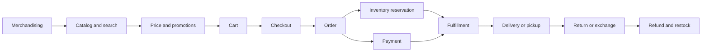

# Retail Domain And Commerce Architecture

Retail software connects customer demand to merchandise, inventory, payment,
and physical fulfillment. The difficult part is not displaying a product or
creating an order. It is preserving a trustworthy commercial promise while
prices change, inventory moves, payments are uncertain, channels compete for
stock, and fulfillment or returns continue long after checkout.

This guide uses **retail** broadly: e-commerce, stores and point of sale (POS),
mobile apps, marketplaces, call centers, warehouses, and omnichannel journeys
such as buy online, pick up in store (BOPIS).

## End-To-End Retail Journey



The customer sees one journey, but each step has a different source of truth,
failure model, owner, and lifecycle. An order should therefore reference the
product, price, tax, promotion, address, and payment facts accepted at purchase
time instead of depending on mutable catalog pages.

## Essential Retail Vocabulary

| Term | Meaning |
|---|---|
| Product | Customer-facing concept, such as a running shoe model. |
| Variant | A purchasable combination of attributes, such as blue, size 9. |
| SKU | Stock keeping unit used to identify and track a sellable variant. |
| Offer | A seller's commercial terms for a SKU: price, currency, availability, channel, and validity. |
| Assortment | Products intentionally available to a market, store, channel, or customer segment. |
| On hand | Physical stock recorded at a location. It may include units that cannot be sold. |
| Reserved | Stock temporarily or permanently allocated to demand. |
| Available to promise (ATP) | Quantity the retailer is willing to promise after reservations, safety stock, and business rules. |
| Safety stock | Stock withheld to absorb uncertainty or protect a service level. |
| Backorder | Demand accepted for stock expected later. |
| Cart | A mutable customer selection; it is not a confirmed price or inventory commitment unless explicitly designed as one. |
| Order | The durable commercial record of what was accepted from the customer. |
| Fulfillment order | Work required from a location to pick, pack, ship, or prepare pickup for all or part of an order. |
| Return merchandise authorization (RMA) | Controlled authorization and tracking identity for a return. |
| Omnichannel | Coordinated customer and inventory journeys across stores and digital channels. |

## Core Domain Boundaries

| Domain | Owns | Important rule |
|---|---|---|
| Product information and catalog | product hierarchy, attributes, variants, media, category placement | Product descriptions change; accepted order lines must remain historically explainable. |
| Merchandising | assortment, launch windows, channel and market eligibility | Being known to the catalog does not mean an item is sellable everywhere. |
| Pricing | price lists, currency, effective dates, markdowns | Resolve price for an explicit market, channel, customer context, and time. |
| Promotions | eligibility, coupons, stacking, usage limits, allocation | Preserve the evaluated promotion result and rule version on the order. |
| Search and discovery | denormalized search index, ranking, facets, suggestions | Search is eventually consistent and should not authorize price or stock. |
| Inventory | stock ledger, reservations, adjustments, ATP by location | Guard reservation atomically; never implement it as an unprotected read then write. |
| Cart | selections, quantities, customer/session association | Treat cart totals as estimates until checkout revalidates them. |
| Checkout | validation and orchestration of price, stock, delivery, tax, fraud, payment, and order creation | Use a stable checkout identity and make retries safe. |
| Order management | accepted order, line lifecycle, amendments, cancellation, routing status | Order, payment, inventory, and fulfillment are related state machines, not one status field. |
| Payment | authorization, capture, refund, provider attempts, uncertain outcomes | A timeout is unknown, not proof of failure; reconcile before retrying with a new identity. |
| Fulfillment | sourcing, allocation, pick, pack, ship, pickup, tracking | One order can create multiple fulfillments from different locations. |
| Returns and refunds | return eligibility, RMA, inspection, disposition, refund request | Receipt, restock, and refund are separate facts and may occur at different times. |
| Customer and loyalty | identity, preferences, membership, points, consent | Loyalty balance and personal data require explicit authority, audit, and retention controls. |

These are logical ownership boundaries. They do not require one microservice per
row. A modular monolith can preserve the same language and invariants with less
distributed coordination, while independently scaled services may be justified
for search, pricing, inventory, checkout, or fulfillment at larger scale.

## Commercial And Operational Invariants

Write invariants before choosing technologies:

1. Every sellable unit has an unambiguous SKU and seller or inventory owner.
2. The order records the accepted unit price, discounts, tax, currency, and rule
   versions; later catalog or pricing changes do not rewrite history.
3. An inventory reservation cannot reduce ATP below the allowed threshold.
4. Reservation confirm, release, and expiry operations are idempotent.
5. A checkout retry with the same key cannot create a second customer order or
   payment attempt unintentionally.
6. Order-line transitions are monotonic and guarded against stale events.
7. Payment, inventory, order, and fulfillment states can be reconciled when
   messages are duplicated, delayed, or missing.
8. Cancellation and fulfillment compete through an explicit rule: once a line
   crosses a defined fulfillment point it may require a return instead.
9. Refund amount cannot exceed the refundable captured amount after previous
   refunds, adjustments, and policy deductions.
10. Every manual stock, price, order, loyalty, or refund adjustment identifies
    the actor, reason, authority, time, and affected entity.

## Price, Promotion, And Tax Snapshot

At checkout, evaluate the complete commercial context and persist a snapshot:

```text
SKU and seller
quantity and unit of measure
base/list price and selling price
promotion identifiers, allocations and rule versions
tax jurisdiction, category, rate and calculated amount
shipping charge and discount allocation
currency, rounding rule and total
market, channel, customer segment and evaluation time
```

Do not recompute historical order totals from today's price or promotion rules.
For returns, allocate order-level discounts to lines using a stable policy so a
partial return produces a deterministic refund.

## Inventory And Availability

Physical stock and customer-facing availability are different views:

```text
ATP = eligible on-hand
    - active reservations
    - safety stock
    - damaged or quarantined units
    + eligible inbound supply (only when policy permits)
```

The actual formula is business-specific. Keep its inputs and policy version
observable. Common inventory operations are receive, adjust, transfer, reserve,
confirm, release, expire, pick, ship, return, inspect, and restock.

For high-contention SKUs, use an atomic conditional update, database lock,
optimistic version, single-writer partition, or another mechanism whose failure
behavior is understood. Cache can accelerate availability reads, but the cache
should not independently authorize the last unit.

## Checkout And Order State

A typical checkout performs these decisions:

1. Authenticate the customer or establish a guest identity.
2. Validate sellability, quantity limits, delivery address, and channel rules.
3. Reprice the cart and explain any change to the customer.
4. Calculate promotions, shipping, and tax.
5. Reserve inventory with an expiry and stable reservation identity.
6. Authorize payment with a stable provider idempotency key.
7. Persist the order and its immutable commercial snapshot.
8. Publish durable events using an outbox or equivalent atomic mechanism.
9. Confirm or release reservations according to the accepted workflow.

There is rarely one safe distributed transaction across all participants. Use a
Saga-style workflow with explicit pending states, compensation, deadlines, and
reconciliation. Compensation is a business operation: releasing stock or
voiding an authorization is not a database rollback.

Model state per aggregate instead of inventing one universal status:

| Aggregate | Example states |
|---|---|
| order line | `CREATED`, `ALLOCATED`, `RELEASED`, `CANCELLED`, `COMPLETED`, `RETURNED` |
| payment attempt | `PENDING`, `AUTHORIZED`, `CAPTURED`, `VOIDED`, `FAILED`, `UNKNOWN`, `REFUNDED` |
| reservation | `ACTIVE`, `CONFIRMED`, `RELEASED`, `EXPIRED` |
| fulfillment | `PLANNED`, `PICKING`, `PACKED`, `SHIPPED`, `READY_FOR_PICKUP`, `DELIVERED` |
| return | `REQUESTED`, `AUTHORIZED`, `RECEIVED`, `INSPECTED`, `RESTOCKED`, `DISPOSED`, `CLOSED` |

## Events And Consistency

Useful domain events describe completed facts:

```text
PriceCalculated
InventoryReserved
InventoryReservationFailed
OrderPlaced
PaymentAuthorized
PaymentOutcomeUnknown
FulfillmentAllocated
ShipmentDispatched
OrderLineCancelled
ReturnReceived
RefundCompleted
```

Every consumer should expect duplicate delivery. Include event identity,
aggregate identity and version, occurred time, schema version, correlation and
causation identifiers, and only the business data the contract requires.
Partition events where ordering matters, reject stale versions, and reconcile
authoritative stores rather than assuming the event stream can never have a gap.

## Omnichannel And Marketplace Concerns

Omnichannel adds location and channel policies to every promise. BOPIS needs
store-level ATP, reservation expiry, preparation capacity, pickup identity, and
a no-show policy. Ship-from-store competes with walk-in demand and needs safety
stock plus operational acceptance by the store.

Marketplace retail also separates the customer-facing order from seller orders,
commissions, seller fulfillment, settlement, and disputes. The platform must
make seller, inventory owner, merchant of record, fulfillment owner, and return
policy explicit for each line.

## Production Metrics

| Area | Useful measures |
|---|---|
| discovery | search latency, zero-result rate, index lag, product-detail conversion |
| cart and checkout | cart abandonment, checkout success, p95/p99 latency, validation failure by reason |
| inventory | reservation success, oversell count, ATP drift, expired reservation age, stock adjustment rate |
| orders | placement rate, duplicate prevention, stuck state age, cancellation rate |
| payment | authorization and capture success, unknown outcomes, duplicate prevention, refund age |
| fulfillment | allocation latency, pick/pack time, on-time ship/delivery, split-shipment rate |
| returns | return rate by reason/SKU, time to receive, refund cycle time, restock recovery |
| business | conversion, average order value, gross margin, stockout rate, sell-through |

Business measures need dimensional controls. Unbounded SKU, customer, order, or
coupon identifiers make poor metric labels; keep high-cardinality detail in
logs, traces, or analytical stores.

For the end-to-end production design—metric definitions, PostgreSQL/outbox,
Kafka Streams or Flink, ClickHouse schemas, current versus daily queries,
watermarks, reconciliation, and report delivery—continue with
[Retail Order Metrics And Analytics At Scale](./RETAIL-ORDER-METRICS-ANALYTICS.md).

## Security And Compliance Boundaries

- Minimize payment-card scope by tokenizing through an approved payment provider;
  never place sensitive authentication data in logs or events.
- Separate customer PII, credentials, payment tokens, operational order data,
  and analytics access according to need.
- Protect coupons, gift value, loyalty points, refunds, and inventory adjustments
  as fraud targets, not harmless CRUD fields.
- Verify marketplace and payment callbacks cryptographically and make replay
  handling explicit.
- Record consent, retention, deletion, export, and legal-hold behavior for
  customer data without corrupting required financial or order records.
- Apply least privilege and stronger approval controls to price overrides,
  refunds, stock corrections, and customer-account changes.

The exact tax, consumer-protection, payment, privacy, and record-retention rules
depend on jurisdiction and business model. Product, finance, legal, compliance,
security, and operations owners must approve them.

## Shopverse Study Crosswalk

Use these pages to turn the generic domain model into concrete design practice:

- [Checkout And Order Design](../shopverse-capstones/CHECKOUT-ORDER-DESIGN.md)
- [Inventory Reservation Design](../shopverse-capstones/INVENTORY-RESERVATION-DESIGN.md)
- [Payment Reliability Design](../shopverse-capstones/PAYMENT-RELIABILITY-DESIGN.md)
- [Catalog And Search Design](../shopverse-capstones/CATALOG-SEARCH-DESIGN.md)
- [Retail Order Metrics And Analytics At Scale](./RETAIL-ORDER-METRICS-ANALYTICS.md)
- [Redis For Retail Caching And Session Storage](./REDIS-RETAIL-CACHING-SESSIONS.md)
- [Black Friday Retail Scale And Resilience](./BLACK-FRIDAY-RETAIL-RESILIENCE.md)
- [Kafka Consumer Groups, Rebalancing, And Ordering](../../integration/kafka/KAFKA-CONSUMER-GROUPS-REBALANCING-ORDERING.md)
- [Financial Systems Architecture](../financial/FINANCIAL-SYSTEMS-ARCHITECT-PATH.md)
- [Shopverse current-state architecture](../../case-study/SHOPVERSE-ARCHITECTURE-CURRENT-STATE.md)

These links are design and case-study material. Confirm each page's status before
treating a production practice as implemented in the current Shopverse runtime.

## Completion Checklist

You understand the retail domain when you can:

- distinguish product, variant, SKU, offer, inventory, reservation, order, and
  fulfillment without merging their ownership;
- explain why cart totals and search availability are estimates;
- design idempotent checkout, payment, reservation, cancellation, and return flows;
- handle partial fulfillment, partial cancellation, and partial refund per line;
- preserve accepted commercial history while rules and catalog data evolve;
- identify overselling, uncertain payment, stale event, and reconciliation risks;
- define peak-event capacity, operational SLOs, fraud controls, and recovery proof.

Continue with [Black Friday Retail Scale And Resilience](./BLACK-FRIDAY-RETAIL-RESILIENCE.md)
and [Retail Domain Interview Questions](./RETAIL-DOMAIN-INTERVIEW.md).
