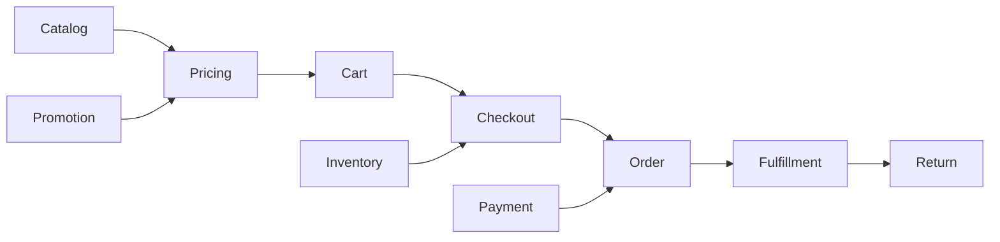

# Retail Domain Interview Questions

## Retail Lifecycle Map



Strong retail answers connect business language to invariants, ownership,
failure windows, customer impact, and measurable recovery. Use this structure:

```text
clarify the retail journey and authority
-> state the invariant
-> model state and transaction boundaries
-> explain concurrency and failure handling
-> add reconciliation, metrics and operational ownership
-> name trade-offs and rejected alternatives
```

## Domain Fundamentals

### 1. What is the difference between a product, variant, SKU, and offer?

A product is the customer-facing concept; a variant is a specific attribute
combination; a SKU identifies a stock-tracked sellable unit; an offer adds
seller, market, channel, price, currency, availability, and validity. State that
the exact vocabulary varies by retailer, then make identities explicit.

### 2. What is the difference between on-hand inventory and ATP?

On hand is recorded physical stock. Available to promise subtracts reservations,
safety stock, damage or quarantine and may add eligible inbound supply. ATP is a
policy-backed customer promise, not a synonym for the warehouse count.

### 3. Is a cart a reservation?

Usually no. Reserving for every abandoned cart can starve real buyers. Most
systems reserve during checkout for a bounded time; scarce-drop businesses may
reserve earlier with strict expiry and fairness rules. Explain the business
trade-off rather than assuming one universal policy.

### 4. Why must an order snapshot product and price data?

Catalog text, tax, price and promotion rules change. The order must remain an
explainable record of what the customer accepted, including allocated discounts,
currency, seller, tax, delivery promise, and rule versions.

### 5. Why are order, payment, inventory, and fulfillment separate states?

They progress independently. An order can be accepted while payment is pending,
one line shipped, another cancelled, and a refund outstanding. One status field
hides valid partial states and creates invalid transitions.

## Pricing And Promotion Questions

### 6. How would you design a pricing service?

Clarify SKU/offer, market, channel, customer segment, currency, quantity and
effective time. Use versioned price lists and deterministic resolution rules,
return an explainable breakdown, cache safe reads, and persist the accepted
result on the order. Define consistency expectations for price changes.

### 7. How do you handle a price changing while an item is in the cart?

Treat the cart total as an estimate, reprice at checkout, show the difference,
and require acceptance according to policy. A quoted-price feature needs a quote
identity, expiry, eligibility, and a clearly owned guarantee.

### 8. How do you design promotions without creating an unmaintainable rule engine?

Separate eligibility, benefit calculation, stacking/exclusion, limits, and
allocation. Version rules, make evaluation deterministic for explicit context,
explain applied/rejected promotions, and test combinations. Start with governed
strategies before adopting a general-purpose rule language.

### 9. How do partial returns work with an order-level discount?

Allocate the discount to order lines at purchase using a stable rounding policy
and persist the allocation. Calculate refundable value from the accepted line
snapshot and previous refunds, not by rerunning today's promotion.

## Inventory And Concurrency Questions

### 10. How do you prevent overselling the last unit?

Guard the authoritative reservation atomically with a conditional update, lock,
version, or single-writer partition. Give each reservation a stable identity and
expiry. Cached ATP can inform browsing but cannot independently authorize the
last unit.

### 11. Can overselling be eliminated completely?

Software can enforce a reservation invariant inside its authority, but physical
shrinkage, delayed store updates, damage and external channels create uncertainty.
Use safety stock, channel allocation, reconciliation, substitution/backorder
policy, and measurable customer recovery.

### 12. How do reservation expiry and checkout race safely?

Use a guarded state transition such as `ACTIVE -> CONFIRMED` or `ACTIVE ->
EXPIRED`. Only one transition can win for the expected version and time rule.
Make confirm/release idempotent and reconcile reservations stuck around the
deadline.

### 13. How would you handle a flash sale or hot SKU?

Quantify demand and fairness first. Protect dependencies with admission control,
queues or waiting rooms, rate limits and bounded work. Serialize or partition
reservation authority for the SKU, precompute safe reads, prevent bots, expose
sold-out quickly, and avoid accepting more work than can drain within the SLO.

### 14. How do stores and the website share inventory?

Model stock by location and ownership, publish movements, calculate channel ATP
with safety stock, and reconcile with physical counts. Define freshness and
whether a store must accept ship-from-store or pickup work before a promise is
confirmed.

## Checkout, Order, And Payment Questions

### 15. How do you make checkout idempotent?

Accept a client-scoped idempotency key, persist request fingerprint and outcome,
enforce uniqueness, and return the same order for equivalent retries. Propagate
stable identities to inventory and payment instead of creating fresh downstream
attempts after a timeout.

### 16. Can checkout be one ACID transaction?

Only inside one transactional resource. Inventory, tax, fraud, payment providers,
and fulfillment usually cross boundaries. Use a durable workflow with pending
states, timeouts, compensation, outbox/inbox delivery and reconciliation; name
the exact local transaction boundaries.

### 17. What do you do when payment authorization times out?

Record `UNKNOWN` or `PENDING`, retain the stable provider key, query status or
wait for a verified callback, and reconcile before a new-key attempt. Timeout
does not prove the provider did nothing.

### 18. When should payment be captured?

It depends on the business and payment method. Authorization at order placement
and capture at shipment reduces charging for unfulfilled goods, but introduces
authorization expiry and partial-capture complexity. Digital or immediate goods
may capture earlier. State policy, scheme constraints, customer communication,
and reconciliation.

### 19. How do you model split shipments and partial cancellation?

Track state and quantities per order line and fulfillment unit. Allocate charges,
discounts, tax, capture and refund amounts deterministically. Use guarded
transitions so cancellation either stops uncommitted fulfillment or becomes a
return after the point of no return.

### 20. An order was created but its event was not published. What now?

Write the order and transactional outbox record atomically. Relay with at-least-
once delivery, monitor unpublished age, and make consumers idempotent. For an
already observed gap, backfill from authoritative order data with audit and
reconciliation.

### 21. Events arrive twice or out of order. How should consumers behave?

Deduplicate by event or business-operation identity, compare aggregate version,
guard state transitions, and keep handlers idempotent. Partition by an identity
that needs ordering, but do not depend on global order.

## Fulfillment, Returns, And Omnichannel Questions

### 22. How does an order management system choose a fulfillment location?

Optimize only among eligible locations. Inputs include ATP confidence, distance,
delivery promise, capacity, cutoff, split cost, margin, carrier options and store
acceptance. Preserve the chosen plan and support controlled rerouting when it
fails.

### 23. Design buy online, pick up in store (BOPIS).

Use store-level ATP, an expiring reservation, store acceptance and preparation
states, pickup notification, secure customer verification, no-show expiry, and
restock. Track time-to-ready and failed-promise rate; protect walk-in demand with
an explicit safety-stock policy.

### 24. How would you design returns and refunds?

Separate eligibility, RMA, carrier/store receipt, inspection, inventory
disposition, refund decision, payment refund and customer notification. Make
each idempotent, cap cumulative refund, handle partial quantities, preserve fraud
signals and reconcile received items with money movement.

### 25. A refund succeeded at the provider but the local update failed. What now?

Keep the refund operation in an unknown state, reuse its stable identity, query
or consume the verified callback, then update and reconcile idempotently. Never
blindly send another refund under a new identity.

### 26. What changes in a marketplace order?

One customer order may fan out into seller orders with separate inventory,
fulfillment, commission, settlement, cancellation and return policies. Make the
seller, merchant of record, inventory owner, payment/settlement owner, SLA and
dispute authority explicit per line.

## Architecture And Operations Questions

### 27. Why not serve catalog pages directly from the order database?

Discovery needs flexible denormalized documents, facets, ranking and high read
scale; ordering needs transactional commercial history. Build a search/read
model from authoritative catalog data, measure index lag, and revalidate price
and availability at checkout.

### 28. Where is caching useful, and what must remain authoritative?

Cache product detail, price reads, eligibility and approximate availability when
freshness is defined. Authoritative order creation, reservation, coupon usage,
refund limits and payment transitions require guarded writes. Explain key design,
TTL/invalidation, stampede protection, fallback and stale-data UX.

### 29. How would you prepare for Black Friday or a major sale?

Forecast by journey and hot key, load test beyond expected peak, pre-warm safe
caches, scale queues/partitions/pools, protect dependencies with budgets and
admission control, degrade optional features, freeze risky changes, staff an
incident room, and define rollback plus business recovery. Capacity must include
the post-peak queue drain and downstream fulfillment load.

### 30. Which retail metrics matter most?

Combine technical and business signals: availability and latency, conversion,
checkout success, authorization success, oversells, ATP drift, duplicate orders,
stuck-state age, on-time fulfillment, cancellations, returns and refund age.
Avoid high-cardinality entity IDs in metric labels.

### 31. How do you reconcile a retail platform?

Compare independent authorities: order lines versus reservations and shipments,
captures versus orders, refunds versus returns, inventory ledger versus physical
counts, and internal payments versus provider settlement. Use control totals,
stable identities, aging, owned exceptions and auditable corrections.

### 32. What are the highest-risk security and fraud areas?

Payment data, account takeover, gift value, loyalty points, coupon abuse, bots,
refund fraud, price overrides, inventory adjustment and marketplace callbacks.
Use tokenization, least privilege, step-up controls, rate limits, signed callbacks,
maker-checker approval, audit and careful PII retention.

### 33. How would you build a daily order-status dashboard at millions of orders per day?

First define whether each number counts orders, fulfillment orders, shipments,
packages, or lines. Separate current backlog, transitions during a business day,
and end-of-day snapshots. Keep PostgreSQL as the operational authority; commit
order state and outbox intent atomically; publish versioned events to Kafka keyed
by order ID; and use Kafka Streams or Flink to deduplicate, validate versions,
maintain latest state, and calculate query-oriented metrics.

Publish accepted facts, compacted current state, and versioned absolute metric
snapshots to durable Kafka topics. An idempotent sink loads ClickHouse raw,
current-state, and daily metric tables. The dashboard queries bounded aggregates
through an authorized API. A restartable Spring Batch or workflow job waits for
the event-time watermark, reconciles control totals, versions the snapshot, and
delivers a secure report. Cover late events, replay, bootstrap, sink ambiguity,
freshness, and correction explicitly. See the complete
[Retail Order Metrics And Analytics design](./RETAIL-ORDER-METRICS-ANALYTICS.md).
For timestamp, partition, retention, and today-versus-month query follow-ups, use
[ClickHouse For Large-Scale Retail Analytics](./CLICKHOUSE-RETAIL-ANALYTICS.md).

### 34. How would you handle billions of Black Friday requests without interrupting catalog, order, or inventory service?

Translate billions per day into peak requests per second by endpoint, region,
and hot SKU. Let a CDN absorb static and cache-safe catalog traffic; serve
discovery from search read models and protected caches. Use bot controls, rate
limits, and a waiting room to admit checkout only at the measured capacity of
inventory, orders, payments, and databases. Reserve capacity and bulkheads for
accepted checkout, provider callbacks, and recovery while degrading optional
recommendations, reviews, and expensive facets.

At checkout, revalidate price and authoritative ATP. Prevent oversell through an
atomic reservation, a single-writer SKU partition, or explicitly bounded stock
allocations. Make checkout, order, inventory, and payment operations idempotent;
persist order plus outbox atomically; use Kafka to buffer bounded asynchronous
work; and reconcile uncertain payment and inventory outcomes. Explain deadlines,
retry budgets, circuit breakers, load shedding, multi-zone recovery, queue drain,
fulfillment capacity, observability, and fair sold-out behavior. See
[Black Friday Retail Scale And Resilience](./BLACK-FRIDAY-RETAIL-RESILIENCE.md)
for the component responsibilities, flow, data placement, and readiness plan.

### 35. How would you use Redis for sessions and retail caching, and handle a product-list or inventory-list miss?

Use Spring Session when application replicas need shared, revocable stateful
sessions: keep only an unpredictable ID in a secure cookie, store minimal
expiring state in Redis, isolate session capacity from disposable caches, and
define fail-closed or reauthentication behavior during an outage. For catalog,
use cache-aside with versioned keys, explicit query dimensions, jittered TTLs,
bounded same-key loading, negative caching only for genuine not-found results,
and stale-while-revalidate where the business permits staleness.

For a list, multi-get all item keys, batch-load only misses from the catalog,
search, or inventory read model, and pipeline the cache fill; avoid N+1 source
queries. Cached inventory is an approximate browsing projection. Checkout must
revalidate price and perform an idempotent, atomic reservation against the
inventory authority. Cover invalidation, event versions, serializer migration,
hot keys, eviction, failover, source protection, observability, and security. See
[Redis For Retail Caching And Session Storage](./REDIS-RETAIL-CACHING-SESSIONS.md).

### 36. How do you preserve Order, Inventory, And Payment event ordering in Kafka?

Kafka orders only within one partition, so define the smallest aggregate that
needs serialization and publish with its stable key—for example `orderId` for an
order-lifecycle stream. Do not claim ordering across separate order, inventory,
and payment topics. Add immutable event ID and aggregate version; preserve
per-aggregate order in the transactional outbox relay; keep consumer execution
partition/key ordered; and prevent retry topics or DLT recovery from silently
letting later versions overtake a failed record.

Process with an inbox uniqueness constraint, durable version tracking, and
guarded business transitions in one local transaction. Use separate keys such
as `(skuId, locationId)` for inventory-ledger ordering and `paymentId` for a
payment lifecycle; one record cannot be ordered by several independent keys.
Cover partition expansion, hot keys, rebalances, offset commits, replay, payment
side-effect reconciliation, and version-gap recovery. See
[Kafka Consumer Groups, Rebalancing, And Ordering](../../integration/kafka/KAFKA-CONSUMER-GROUPS-REBALANCING-ORDERING.md).

## System-Design Prompts

Use the answer structure at the top for these exercises:

1. Design product catalog and search for 50 million SKUs across ten countries.
2. Design inventory reservation for a flash sale with one million concurrent buyers.
3. Design a pricing and promotion platform for stores, web, and mobile.
4. Design idempotent checkout across order, inventory, tax, fraud and payment.
5. Design an order management system with split shipments and partial cancellation.
6. Design BOPIS and ship-from-store across 5,000 locations.
7. Design returns, exchanges, refunds and reverse logistics.
8. Design a marketplace order that contains products from five sellers.
9. Diagnose orders paid but not shipped after an event-stream incident.
10. Design peak-readiness controls for a Black Friday launch.
11. Design a current and daily order-status dashboard for millions of orders per day.
12. Design catalog, inventory, checkout, and order processing for a Black Friday event with billions of edge requests.
13. Design Redis-backed sessions and product/inventory caching for a multi-region retail platform.
14. Design ordered, idempotent Kafka choreography across order, inventory, and payment services.

For every prompt clarify scale, hot-key skew, countries/currencies, sellers,
channels, consistency, delivery promise, availability SLO, retention, RPO/RTO,
fraud, manual operations, and the source of truth for each decision.

### Order Metrics Dashboard Follow-Ups

For prompt 11, answer these before selecting technology:

1. Does `SHIPPED` count an order once or count every shipment/package/line?
2. Is `PENDING` the current backlog, the end-of-day backlog, or a daily transition?
3. Which facility timezone assigns the business date?
4. What live and finalized freshness objectives apply?
5. What peak event rate, retention, dimensions, and concurrent query count apply?
6. How are partial fulfillment, cancellation, returns, test orders, and late facts treated?
7. Which authority and control total will reconcile each result?

An architect-level answer should reject repeated full scans of the operational
orders table, explain why Kafka exactly-once does not cover a direct ClickHouse
side effect, prefer versioned snapshots over unprotected append-only counter
deltas, and provide bootstrap, replay, correction, security, and recovery proof.

## Rapid-Fire Checks

Be able to answer these in one or two sentences:

- Why is search availability approximate?
- What causes an inventory reservation leak?
- What is the point of no return for cancellation?
- Why allocate discounts to lines at purchase time?
- How does authorization differ from capture?
- Why is a payment timeout an unknown outcome?
- What makes a webhook safe to process?
- Why can at-least-once events still produce exactly-once business effects?
- How does backorder differ from preorder?
- What evidence proves an order was recovered safely?

## Interview Scoring Rubric

| Level | Evidence in the answer |
|---:|---|
| 0 | Names retail terms or technologies without ownership or behavior. |
| 1 | Explains the happy path and major components. |
| 2 | Defines invariants, authority, concurrency, failure windows and recovery. |
| 3 | Quantifies scale and SLOs, covers partial states, reconciliation, fraud, operations, and trade-offs. |

For senior roles, aim for level 2 consistently. For lead and architect roles,
reach level 3 on checkout, inventory, order, payment, fulfillment, and incident
scenarios without claiming impossible end-to-end exactly-once guarantees.

## Recommended Study Route

1. Review [Retail Domain And Commerce Architecture](./RETAIL-DOMAIN-ARCHITECTURE.md).
2. Study [Retail Order Metrics And Analytics At Scale](./RETAIL-ORDER-METRICS-ANALYTICS.md).
3. Learn [ClickHouse For Large-Scale Retail Analytics](./CLICKHOUSE-RETAIL-ANALYTICS.md).
4. Prepare [Black Friday Retail Scale And Resilience](./BLACK-FRIDAY-RETAIL-RESILIENCE.md).
5. Study [Redis For Retail Caching And Session Storage](./REDIS-RETAIL-CACHING-SESSIONS.md).
6. Master [Kafka Ordering And Rebalancing](../../integration/kafka/KAFKA-CONSUMER-GROUPS-REBALANCING-ORDERING.md).
7. Design [Checkout And Order](../shopverse-capstones/CHECKOUT-ORDER-DESIGN.md).
8. Deep-dive [Inventory Reservation](../shopverse-capstones/INVENTORY-RESERVATION-DESIGN.md).
9. Practise [Payment Reliability](../shopverse-capstones/PAYMENT-RELIABILITY-DESIGN.md).
10. Apply the [System Design Interview Evaluation Rubric](../system-design-deep-dives/INTERVIEW-RUBRIC.md).
