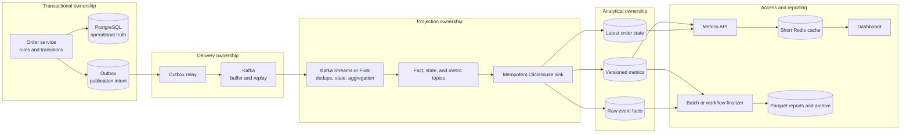
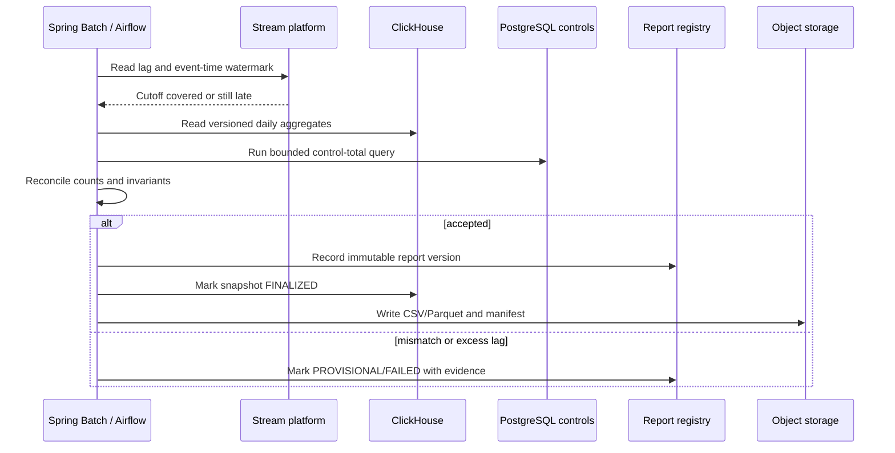
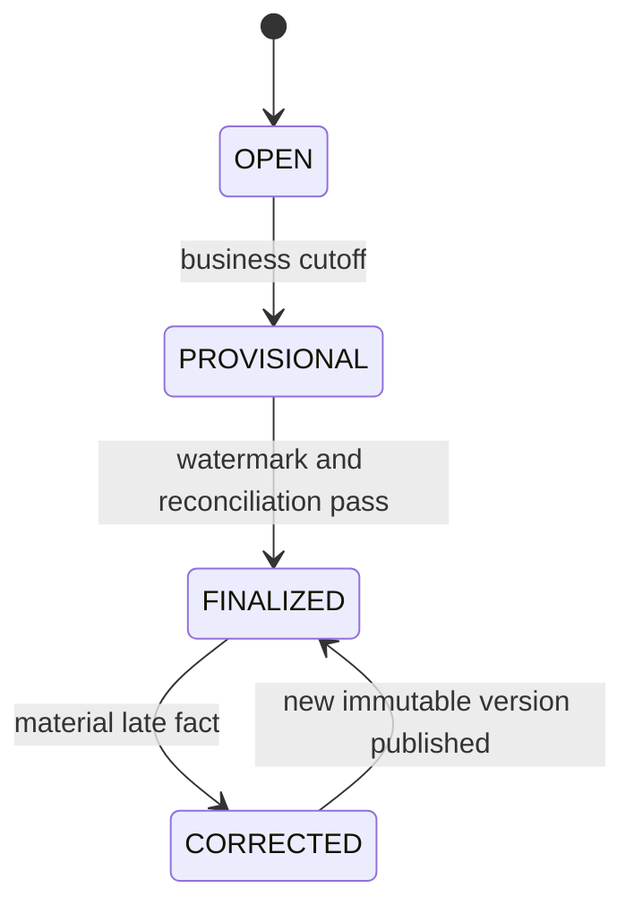
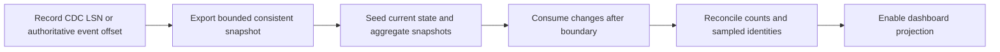

# Retail Order Metrics And Analytics At Scale

A large retail dashboard must not scan the operational order table for every
refresh or make a midnight Java scheduler recalculate all history.

The production pattern is:

1. keep order transactions authoritative in the Order service database;
2. publish committed lifecycle facts through a transactional outbox;
3. process them continuously using a keyed stream;
4. store replayable facts and query-oriented projections in an analytical store;
5. serve the dashboard from bounded aggregates; and
6. finalize each business day using a restartable, reconciled job.

This CQRS-style projection does not make ClickHouse or Kafka the order authority.

## Clarify The Metric Before Choosing A Database

The word `PENDING` is not a complete metric definition. Interviewers and product
owners may mean different populations:

| Displayed metric | Precise definition | Projection type |
|---|---|---|
| created today | distinct orders whose accepted `OrderCreated` event time falls in the business day | daily transition count |
| picked today | distinct counting units that first entered `PICKED` during the business day | daily transition count |
| shipped today | distinct orders, shipments, packages, or lines that first entered `SHIPPED` during the business day | daily transition count |
| pending now | counting units whose latest accepted status belongs to the configured pending set | current-state gauge |
| pending at close | current pending population captured at the business-day cutoff | end-of-day snapshot |
| created today and still pending | intersection of creation cohort and latest state | cohort projection |

Before implementation, record:

- counting grain: order, fulfillment order, shipment, package, or order line;
- status dictionary and legal transitions;
- facility or market business timezone and daylight-saving policy;
- whether event time or ingestion time assigns the business date;
- partial-fulfillment, cancellation, return, test-order, and fraud-exclusion rules;
- provisional and final freshness objectives;
- late-event and correction policy; and
- dimensions authorized for each dashboard user.

## Capacity Model

Do not claim a retailer's real traffic without evidence. Start with explicit
assumptions and replace them with measured values:

```text
orders per day                 = 10,000,000
lifecycle events per order     = 6
events per day                 = 60,000,000
average events per second      = 60,000,000 / 86,400 ~= 695
10x peak events per second     ~= 6,950
two-year event count           ~= 43.8 billion
```

Capacity tests include payload bytes, facility skew, Kafka replication,
repartitioning, ClickHouse merges, query concurrency, replay, failure, and
post-peak queue drain. Size for peak and recovery headroom.

## Storage Decision

| Need | Recommended starting point | Why |
|---|---|---|
| accept and update orders | service-owned PostgreSQL | transactions, constraints, concurrency control, recovery |
| buffer, order per aggregate, and replay changes | Kafka keyed by `orderId` | durable decoupling and independently scalable consumers |
| high-volume dimensional aggregation | ClickHouse | columnar compression, partition pruning, distributed analytical scans |
| moderate reporting before OLAP is justified | PostgreSQL read replica plus bounded materialized views | smaller operational footprint while scale remains measured |
| enterprise cross-domain analytics | approved cloud warehouse or lakehouse | shared governance and broad historical joins |
| inexpensive raw retention | object storage using Parquet | compact immutable history and backfill source |
| short dashboard response cache | Redis | absorbs repeated reads; never the reporting authority |
| application health and latency | Prometheus-compatible metrics | operational time series, not high-cardinality business truth |

Do not select Cassandra for ad hoc group-by analytics, Elasticsearch as the
order-count authority, or high-cardinality order/customer/SKU Prometheus labels.

## Component Ownership



| Component | Owns | Must not own |
|---|---|---|
| Order service | authorization, idempotent commands, legal transitions, order version, atomic order/outbox write | fleet-wide analytical scans |
| PostgreSQL | authoritative operational order state | dashboard aggregation across years of history |
| outbox relay | bounded claim, Kafka send, acknowledgement, retry, stuck-row telemetry | business-state interpretation |
| Kafka | partitioned transport, retention, replay, consumer isolation | authoritative current order state |
| stream processor | event validation, deduplication, keyed state, metric calculation, projection output | synchronous checkout decisions |
| ClickHouse sink | batching, retry, idempotent ingestion, offset/batch evidence | inventing or repairing business transitions |
| ClickHouse | facts and query-oriented projections | order workflow transactions |
| Metrics API | authorization, filter validation, freshness contract, bounded queries | raw unrestricted analytical SQL from browsers |
| daily finalizer | cutoff, watermark, reconciliation, snapshot version, export | full operational-table rescan on every run |

## Write Path: Order And Event Intent

The Order service changes state and records event intent in one transaction:

```java
@Transactional
public OrderView markPicked(PickOrderCommand command) {
    Order order = orderRepository.findByIdForUpdate(command.orderId())
            .orElseThrow(OrderNotFoundException::new);

    authorization.checkFacility(command.actor(), order.facilityId());
    order.markPicked(command.commandId(), clock.instant());
    orderRepository.save(order);
    outboxService.enqueue(OrderStatusChanged.from(order, command.commandId()));

    return mapper.toView(order);
}
```

The transaction does **not** wait for Kafka or ClickHouse. The outbox survives
broker outages, and every projection handles possible relay duplicates.

## Event Contract And Ordering

```json
{
  "eventId": "123e4567-e89b-12d3-a456-426614174000",
  "schemaVersion": 1,
  "eventType": "ORDER_STATUS_CHANGED",
  "orderId": "ORD-100",
  "orderVersion": 7,
  "countingGrain": "ORDER",
  "previousStatus": "PICKED",
  "newStatus": "SHIPPED",
  "occurredAt": "2026-07-30T14:20:00Z",
  "ingestedAt": "2026-07-30T14:20:03Z",
  "facilityId": "FC-42",
  "market": "IN",
  "channel": "WEB",
  "correlationId": "corr-456",
  "causationId": "cmd-789"
}
```

Contract rules:

- use `orderId` as the Kafka key so one order's records stay in one partition;
- require a globally stable `eventId` and monotonic `orderVersion`;
- define compatibility for every producer and consumer before schema evolution;
- include event time and ingestion time for late-data analysis;
- include bounded analytical dimensions, not customer PII or payment secrets;
- reject or quarantine an impossible state transition;
- ignore an already accepted `eventId` and a stale aggregate version; and
- never claim global order across all orders.

## Projection Topics

Keep external database writes outside the Kafka Streams transaction. The stream
application should produce durable Kafka records first:

| Topic | Key | Value | Retention |
|---|---|---|---|
| `analytics.order-status-facts.v1` | `eventId` | normalized accepted lifecycle fact | retained for replay policy |
| `analytics.order-current-state.v1` | `orderId` | latest version and status | compacted |
| `analytics.order-metric-snapshots.v1` | metric-grain key | absolute count and metric version | compacted plus bounded history |
| `analytics.order-projection-errors.v1` | `eventId` | rejected transition/schema evidence | retained for operations |

Kafka Streams can atomically coordinate input offsets, state stores, changelogs,
and these output topics when configured appropriately. That guarantee does not
automatically include a ClickHouse JDBC or HTTP call made inside a processor.

## Stateful Processing Algorithm

The processor keeps latest state by `orderId` and aggregate counts by metric key:

```text
receive event
  -> validate schema and required dimensions
  -> find processed event ID / latest order state
  -> duplicate event ID? ignore
  -> orderVersion <= stored version? ignore or quarantine
  -> invalid previousStatus -> newStatus? quarantine
  -> derive the facility business date from occurredAt
  -> decrement old current-status counter when applicable
  -> increment new current-status counter
  -> increment first-entry daily transition counter
  -> update latest order state
  -> emit accepted fact, state snapshot, and absolute metric snapshots
```

For `PENDING -> PICKED`:

```text
CURRENT_STATUS / PENDING  : -1
CURRENT_STATUS / PICKED   : +1
ENTERED_STATUS / PICKED   : +1 for that business date
```

The topology may calculate deltas internally, but it should publish the resulting
**absolute value plus a monotonically increasing metric version**. A retried sink
then replaces an older snapshot rather than applying `+1` twice.

```json
{
  "metricKey": "CURRENT_STATUS|FC-42|IN|WEB|PICKED",
  "metricVersion": 918273,
  "metricType": "CURRENT_STATUS",
  "status": "PICKED",
  "facilityId": "FC-42",
  "market": "IN",
  "channel": "WEB",
  "value": 1502100,
  "asOfEventTime": "2026-07-30T14:20:00Z"
}
```

Use Kafka Streams when the workload is primarily keyed state, tables, and bounded
windows. Consider Flink when complex event-time joins, large distributed state,
watermarks, or advanced late-event processing justify its operational cost.

## ClickHouse Tables

For ClickHouse storage, timestamp, query, sharding, and retention details, see
[ClickHouse For Large-Scale Retail Analytics](./CLICKHOUSE-RETAIL-ANALYTICS.md).

### Accepted event facts

```sql
CREATE TABLE analytics.order_status_events
(
    event_id UUID,
    order_id String,
    order_version UInt64,
    event_type LowCardinality(String),
    previous_status LowCardinality(Nullable(String)),
    new_status LowCardinality(String),
    event_time DateTime64(3, 'UTC'),
    ingestion_time DateTime64(3, 'UTC'),
    business_date Date,
    facility_id LowCardinality(String),
    market LowCardinality(String),
    channel LowCardinality(String),
    schema_version UInt16
)
ENGINE = MergeTree
PARTITION BY toYYYYMM(business_date)
ORDER BY (business_date, facility_id, new_status, event_time, order_id, event_id);
```

Monthly partitions allow date pruning and retention without creating one partition
per order or SKU. The Kafka-to-ClickHouse sink must make `event_id` ingestion
idempotent; a MergeTree sort key is not a uniqueness constraint.

### Latest order state

```sql
CREATE TABLE analytics.order_current_state
(
    order_id String,
    order_version UInt64,
    current_status LowCardinality(String),
    status_changed_at DateTime64(3, 'UTC'),
    facility_id LowCardinality(String),
    market LowCardinality(String),
    channel LowCardinality(String),
    ingested_at DateTime64(3, 'UTC')
)
ENGINE = ReplacingMergeTree(order_version)
PARTITION BY cityHash64(order_id) % 64
ORDER BY order_id;
```

All versions use a stable partition. Use this table for drill-down and
reconciliation; serve totals from the metric projection rather than merge timing.

### Current metric snapshots

```sql
CREATE TABLE analytics.order_current_metrics
(
    metric_type LowCardinality(String),
    status LowCardinality(String),
    facility_id LowCardinality(String),
    market LowCardinality(String),
    channel LowCardinality(String),
    metric_version UInt64,
    metric_value Int64,
    as_of_event_time DateTime64(3, 'UTC'),
    ingested_at DateTime64(3, 'UTC')
)
ENGINE = ReplacingMergeTree(metric_version)
ORDER BY (metric_type, facility_id, market, channel, status);
```

### Daily transition and snapshot metrics

```sql
CREATE TABLE analytics.order_daily_metrics
(
    business_date Date,
    metric_type LowCardinality(String),
    counting_grain LowCardinality(String),
    status LowCardinality(String),
    facility_id LowCardinality(String),
    market LowCardinality(String),
    channel LowCardinality(String),
    metric_version UInt64,
    metric_value Int64,
    report_state LowCardinality(String),
    as_of_event_time DateTime64(3, 'UTC'),
    ingested_at DateTime64(3, 'UTC')
)
ENGINE = ReplacingMergeTree(metric_version)
PARTITION BY toYYYYMM(business_date)
ORDER BY
(
    business_date,
    metric_type,
    counting_grain,
    facility_id,
    market,
    channel,
    status
);
```

`report_state` can be `OPEN`, `PROVISIONAL`, `FINALIZED`, or `CORRECTED`. In a
cluster, use the appropriate replicated and distributed engines and prove query
behavior during replica lag and failover.

## Query Patterns

Use `argMax` to select the value attached to the greatest version without forcing
large dashboard queries to use `FINAL`:

### Current operational backlog

```sql
SELECT
    status,
    sum(latest_value) AS order_count,
    max(latest_as_of) AS as_of
FROM
(
    SELECT
        facility_id,
        market,
        channel,
        status,
        argMax(metric_value, metric_version) AS latest_value,
        argMax(as_of_event_time, metric_version) AS latest_as_of
    FROM analytics.order_current_metrics
    WHERE metric_type = 'CURRENT_STATUS'
      AND facility_id IN ('FC-42', 'FC-43')
      AND market = 'IN'
    GROUP BY facility_id, market, channel, status
)
GROUP BY status
ORDER BY status;
```

### Orders entering each status during a day

```sql
SELECT
    status,
    sum(latest_value) AS order_count
FROM
(
    SELECT
        facility_id,
        channel,
        status,
        argMax(metric_value, metric_version) AS latest_value
    FROM analytics.order_daily_metrics
    WHERE business_date = toDate('2026-07-30')
      AND metric_type = 'ENTERED_STATUS'
      AND counting_grain = 'ORDER'
      AND market = 'IN'
    GROUP BY facility_id, channel, status
)
GROUP BY status
ORDER BY status;
```

### End-of-day pending snapshot

```sql
SELECT
    facility_id,
    argMax(metric_value, metric_version) AS pending_at_close
FROM analytics.order_daily_metrics
WHERE business_date = toDate('2026-07-30')
  AND metric_type = 'EOD_SNAPSHOT'
  AND status = 'PENDING'
  AND report_state IN ('FINALIZED', 'CORRECTED')
GROUP BY facility_id;
```

Use parameterized API queries and allowlisted dimensions. Place limits on date
ranges, facility counts, grouping combinations, response rows, and execution time.

## Sink Delivery And Idempotency

The sink consumes projection topics independently of checkout. It should:

1. batch records within bounded bytes and latency;
2. persist Kafka topic, partition, offset range, and batch identity;
3. use stable ClickHouse insert-deduplication tokens where supported;
4. retry ambiguous insert outcomes with the same token;
5. compare `metricVersion` and `orderVersion`, never arrival order alone;
6. commit Kafka offsets only after durable acceptance;
7. quarantine incompatible schemas rather than dropping them; and
8. expose lag, batch age, retry, duplicate, and rejected-version metrics.

Versioned absolute snapshots make duplicate sink delivery safe at the business
level. A plain append-only delta table without an idempotent sink can double a
counter after a crash and offset replay.

## Dashboard API And Cache Contract

```http
GET /api/order-metrics?businessDate=2026-07-30&facilityId=FC-42&grain=ORDER
```

```json
{
  "businessDate": "2026-07-30",
  "timezone": "Asia/Kolkata",
  "countingGrain": "ORDER",
  "asOf": "2026-07-30T15:30:10Z",
  "processingLagSeconds": 7,
  "reportState": "PROVISIONAL",
  "metrics": {
    "CREATED": 1750210,
    "PENDING_NOW": 182400,
    "PICKED_TODAY": 1502100,
    "SHIPPED_TODAY": 1420300
  }
}
```

The Metrics API owns identity, facility/region authorization, allowed filters,
timezone conversion, freshness status, pagination/export limits, and query
telemetry. Redis may cache an authorized response for 15–60 seconds, but the
cached response retains the analytical `asOf` time. Cache age is not projection
freshness.

The UI exposes freshness and loading, empty, stale, unavailable, provisional,
finalized, and corrected states.

## Daily Finalization

Continuous aggregation supplies the dashboard throughout the day. A daily job
finalizes rather than recalculates the entire order history:



Spring `@Scheduled` can trigger one instance, but it does not by itself provide
distributed ownership, durable restart, or report idempotency. Use Spring Batch
with a durable `JobRepository`, a clustered orchestrator, or a Kubernetes CronJob
with concurrency controls. Protect the application report registry with a unique
key such as:

```text
(report_type, business_date, facility_id, calculation_version)
```

Publish a secure object-storage link rather than attaching large reports or
making a bucket public.

## Event Time, Watermarks, And Corrections

An event that occurred at 23:58 but arrived at 00:15 belongs to the earlier
business day when the contract uses event time. Preserve both timestamps and use
a lifecycle:



Define an allowed-lateness threshold from measured behavior. A longer threshold
delays finality and retains more processing state; a shorter threshold creates
more corrections. Never silently put a late event into the wrong date or discard
it merely because the first report is already published.

## Initial Bootstrap

When existing orders predate the event pipeline, combine a consistent snapshot
with a precise change boundary:



If complete retained lifecycle events exist, replaying them may replace a source
snapshot. Otherwise, do not start an uncoordinated export and live consumer: an
order changing during that gap can be missed or counted twice.

Store bootstrap identity, watermark, row counts, checksums, code/schema version,
and reconciliation outcome. Include replica lag in the boundary design.

## Replay, Backfill, And Rebuild

A projection is production-ready only if it is rebuildable:

1. create versioned shadow ClickHouse tables or a new projection namespace;
2. record the input topic offsets, raw partitions, code and schema versions;
3. replay a bounded date range without mixing it into live counters;
4. compare control totals, sampled order histories, duplicates and rejected rows;
5. atomically switch the API to the verified projection version; and
6. retain the prior version through the rollback window.

Do not delete a corrupt table before the replacement is proven. Treat replay as
an audited write operation with authorization and rate limits.

## Reconciliation

Reconciliation compares independent evidence rather than trusting one pipeline:

- operational orders accepted in the day versus `OrderCreated` facts;
- outbox event IDs versus Kafka and raw analytical event IDs;
- latest operational order version versus current-state projection version;
- transition facts versus daily metric snapshots;
- current-state population versus the sum of current-status metrics;
- final report totals versus facility/channel control totals; and
- archived report manifest versus registry checksum and row count.

Not every equality is a business invariant. Orders created on one day may ship on
another, and partial fulfillment changes the grain. Document each formula,
tolerance, exclusion, owner, and correction procedure.

## Observability And SLOs

| Area | Signals |
|---|---|
| outbox | pending count, oldest age, claim age, publish latency, attempts |
| Kafka | input/output rate, consumer lag, partition skew, rebalance and ISR health |
| stream | processed/duplicate/stale/rejected counts, state size, restore time, watermark |
| sink | batch size/age, offset, retries, ambiguous outcomes, ClickHouse latency/errors |
| ClickHouse | insert/query p95/p99, parts/merge backlog, disk, replica lag, rejected queries |
| dashboard | API latency/error, cache hit, result age, stale/provisional responses |
| reporting | last successful business date, duration, mismatch, corrections, export checksum |

Alert on business age, not only infrastructure status. A running consumer with an
oldest unprocessed event age of two hours is not healthy for a five-minute
freshness objective.

## Security And Governance

- authorize metrics by facility, region, market, seller, and role at the API;
- exclude customer names, addresses, credentials, payment data, and unnecessary
  identifiers from retained analytical events;
- encrypt transport and storage and restrict Kafka topics, ClickHouse tables,
  report registry, and object paths independently;
- log report and replay actions without logging sensitive payloads;
- define retention, deletion, residency, legal-hold, and backup behavior;
- use signed, short-lived download links for exports; and
- test aggregate disclosure risk for narrow filters and small populations.

## Failure Matrix

| Failure | Expected behavior | Recovery evidence |
|---|---|---|
| Kafka unavailable | order and outbox commit; relay retries later | outbox oldest age returns to SLO |
| duplicate publication | stream ignores accepted `eventId` | duplicate counter and unchanged metric version |
| out-of-order version | stale record ignored or quarantined | stored version remains monotonic |
| stream instance loss | task restores state from changelog/standby | restored offsets and state checksum |
| ClickHouse unavailable | projection topics retain results; sink backs off | sink lag drains without counter inflation |
| ambiguous ClickHouse insert | retry same batch/token and versioned snapshots | offsets, batch identity and row versions agree |
| late event after finalization | produce corrected calculation/report version | original and corrected manifests retained |
| bad projection deployment | build shadow projection and switch back | prior projection remains queryable |
| report job duplicate launch | unique job/report identity rejects duplicate | one accepted report version |
| source/projection mismatch | keep report provisional and reconcile | owned exception and audited correction |

## Common Incorrect Designs

- scanning the complete `orders` table on every dashboard refresh;
- running one uncoordinated midnight `@Scheduled` method on every replica;
- updating PostgreSQL and publishing Kafka independently without an outbox;
- calling ClickHouse directly inside Kafka Streams and claiming Kafka exactly-once
  covers the external database;
- applying append-only `+1` deltas without sink idempotency;
- treating `ReplacingMergeTree` as an immediate uniqueness constraint;
- counting arrival date instead of the defined business event date;
- mixing orders, shipments, packages, and lines in one unlabeled number;
- using order IDs as Prometheus labels;
- hiding data lag or provisional status from users; and
- keeping no raw facts, replay boundary, or reconciliation path.

## Interview Walkthrough

For a Walmart-scale hypothetical, structure the answer:

1. clarify grain, status definitions, dimensions, timezone, freshness, retention,
   peak scale, availability, and correction policy;
2. keep PostgreSQL authoritative and remove analytical scans from checkout;
3. commit order state and outbox intent atomically;
4. publish versioned events to Kafka keyed by order ID;
5. use Kafka Streams for keyed projections or Flink for complex event-time needs;
6. publish durable fact, current-state, and versioned metric snapshots;
7. sink idempotently into ClickHouse and archive raw facts in Parquet;
8. query bounded aggregates through an authorized Spring Boot API;
9. continuously display freshness, then finalize with a restartable reconciled job;
10. cover duplicates, late data, replay, bootstrap, capacity, security, and failure.

Explain why each boundary exists and how recovery is proven.

## Implementation Checklist

- [ ] Event schema, key, compatibility, PII classification, and transition rules reviewed.
- [ ] Order/outbox atomicity and duplicate publication tested.
- [ ] Stateful topology tests cover duplicates, stale versions, invalid transitions, and late events.
- [ ] ClickHouse schemas and queries benchmarked at peak, replay, and failure load.
- [ ] Sink retries prove no counter inflation after ambiguous outcomes.
- [ ] Dashboard exposes `asOf`, lag, grain, timezone, and report state.
- [ ] Finalizer is restartable, idempotent, reconciled, versioned, and observable.
- [ ] Bootstrap, replay, correction, rollback, retention, and restore drills are documented.

## Related Guides

- [Retail Domain And Commerce Architecture](./RETAIL-DOMAIN-ARCHITECTURE.md)
- [Retail Domain Interview Questions](./RETAIL-DOMAIN-INTERVIEW.md)
- [ClickHouse For Large-Scale Retail Analytics](./CLICKHOUSE-RETAIL-ANALYTICS.md)
- [Database System Design Scenarios](../../data/database-selection/SYSTEM-DESIGN-SCENARIOS.md)
- [Kafka Streams Stateful Processing](../../integration/streaming/KAFKA-STREAMS-STATEFUL-PRODUCTION.md)
- [Change Data Capture](../CHANGE-DATA-CAPTURE.md)
- [CQRS](../CQRS.md)
- [Transactional Outbox](../../reliability/OUTBOX-PATTERN.md)
- [Spring Batch](../../spring/SPRING-BATCH.md)

## Official References

- [Apache Kafka Streams core concepts](https://kafka.apache.org/documentation/streams/core-concepts)
- [Apache Kafka delivery semantics](https://kafka.apache.org/documentation/#semantics)
- [Apache Flink event time and watermarks](https://nightlies.apache.org/flink/flink-docs-stable/docs/concepts/time/)
- [ClickHouse incremental materialized views](https://clickhouse.com/docs/concepts/features/materialized-views/incremental-materialized-view)
- [ClickHouse ReplacingMergeTree](https://clickhouse.com/docs/reference/engines/table-engines/mergetree-family/replacingmergetree)
- [PostgreSQL table partitioning](https://www.postgresql.org/docs/current/ddl-partitioning.html)
- [Spring Batch reference](https://docs.spring.io/spring-batch/reference/)
- [Debezium outbox event router](https://debezium.io/documentation/reference/stable/transformations/outbox-event-router.html)

## Recommended Next Page

Practise defending the design in [Retail Domain Interview Questions](./RETAIL-DOMAIN-INTERVIEW.md),
then study the generic recovery mechanics in [Kafka Streams Stateful Processing](../../integration/streaming/KAFKA-STREAMS-STATEFUL-PRODUCTION.md).
