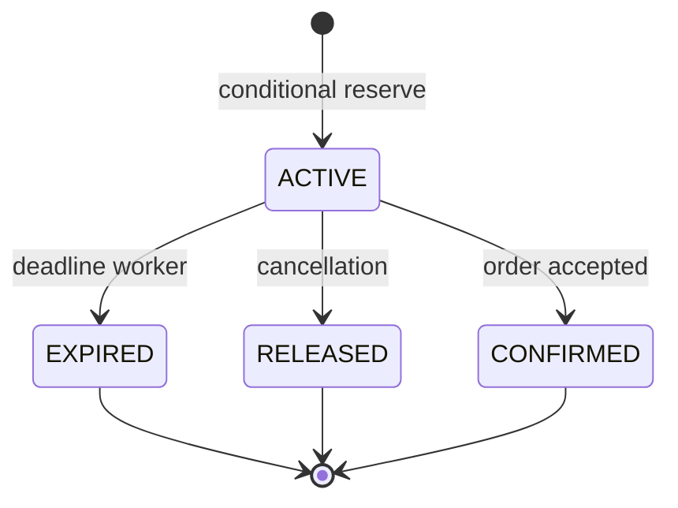
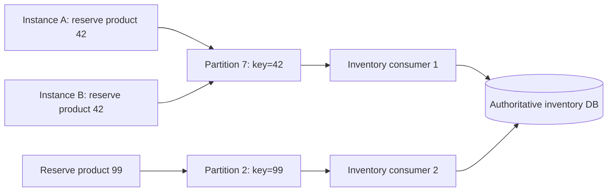
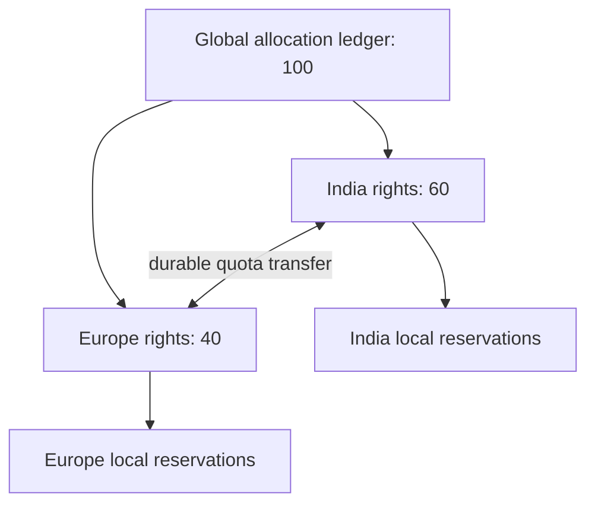
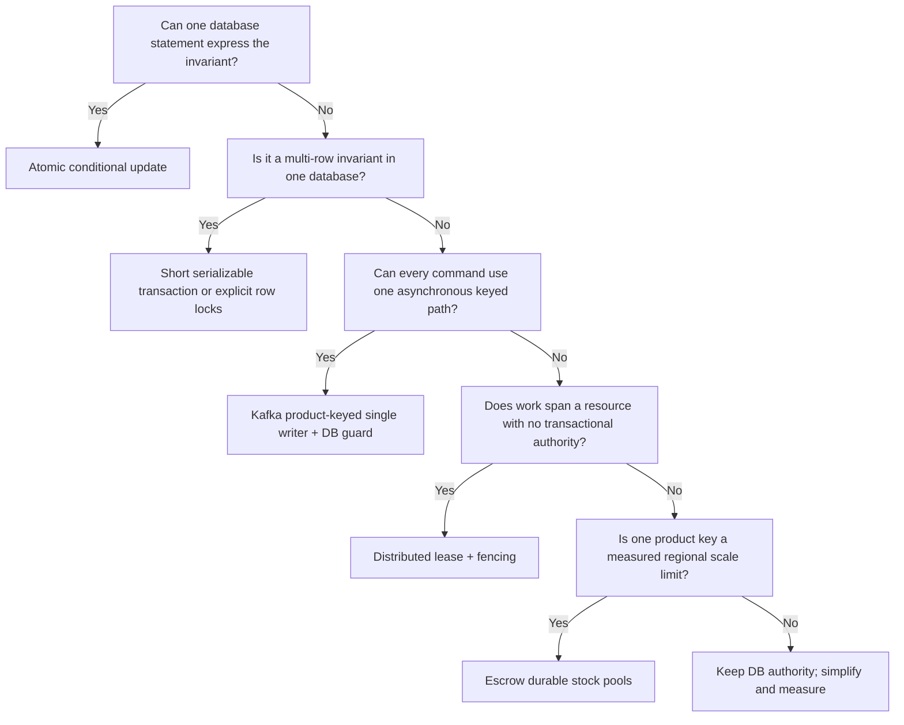

# Inventory Reservation System Design

<DocLabels items={[
  {label: 'System-design capstone', tone: 'advanced'},
  {label: 'Concurrency control', tone: 'production'},
  {label: 'Shopverse inventory', tone: 'shopverse'},
]} />

## Invariant And Load

The authoritative invariant is `available >= 0` for each stock pool. Assume 750
checkout attempts/s peak, five lines/order, and a hot SKU receiving 20% of demand:
up to 750 reservation-line attempts/s may target one row/key. Average throughput
therefore hides the contention design problem.



## The Race That Every Approach Must Stop

Assume product `42` has one available unit and Inventory Service runs as instances
`A` and `B`. A JVM-only lock does not help because each instance owns a different
lock object.

```text
A reads available = 1       B reads available = 1
A decides "yes"             B decides "yes"
A writes available = 0      B writes available = 0
A reports success           B reports success
```

The final counter looks valid, but two reservations were promised for one unit.
This is a **lost update** and a business oversell. Correctness requires one durable
authority to make the check and mutation indivisible, or one durable owner to
serialize all commands for the stock pool.

Every production design also needs a second invariant: retrying the same logical
command must return the original outcome without decrementing stock again. In
ShopVerse, `inventory_reservations.order_number` is unique, so `orderNumber` is the
reservation idempotency key for the current one-line-order model.

## What ShopVerse Implements Today

The current runtime uses **optimistic locking**, which remains the baseline rather
than any of the alternatives below:

1. `InventoryItem.version` is mapped with JPA `@Version`.
2. Each transaction reads the item, checks availability, moves quantity from
   `availableQuantity` to `reservedQuantity`, and calls `saveAndFlush`.
3. Hibernate updates using the version it read. If another instance committed
   first, the stale update affects no row and the losing transaction rolls back.
4. The reservation row and inventory mutation share the local transaction. The
   saga transaction also places its result in the transactional outbox.
5. The unique `order_number` constraint protects duplicate reservation identity.

The relevant implementation evidence is in
`inventory-service/.../entity/InventoryItem.java`,
`service/InventoryServiceImpl.java`, `saga/InventorySagaTransactionService.java`,
and `db/changelog/001-create-inventory-schema.yml`.

Optimistic locking is a good default when collisions are uncommon. Under a hot-SKU
flash sale, many transactions can read the same version and all but one fail late.
The complete transaction must be retried from a fresh read; retrying only the
`save` on the stale entity is incorrect. Bound retries, add jitter, and finally
return a stable sold-out/conflict result.

## Strategy Comparison

| Strategy | Where the decision is serialized | Strongest use case | Primary cost |
|---|---|---|---|
| atomic conditional update | one database statement on the stock row | common single-pool reservation | explicit affected-row and idempotency handling |
| serializable transaction | database dependency/lock graph | multi-row invariant that cannot be one statement | blocking, deadlocks or serialization retries |
| Kafka single writer | one consumer per product-keyed partition | asynchronous commands at high event volume | hot partitions and asynchronous result |
| distributed lock with fencing | lock service plus fenced destination | exclusive work spanning a boundary with no simpler authority | leases, stale owners and another dependency |
| escrow/stock partitioning | preallocated independent stock pools | multi-region or extreme hot-key scale | quota transfer and stranded capacity |

These are not interchangeable libraries. They choose different places to own the
serialization decision.

## Strategy 1: Atomic Conditional Update

### How it works

Move the availability predicate into the `UPDATE` itself:

```sql
UPDATE inventory_items
SET available_quantity = available_quantity - :quantity,
    reserved_quantity = reserved_quantity + :quantity,
    version = version + 1
WHERE product_id = :productId
  AND available_quantity >= :quantity;
```

The database takes the necessary write lock while evaluating and changing the row.
The affected-row count is the decision:

- `1` means this transaction reserved the units;
- `0` means the product does not exist or no longer has enough stock.

For the last unit, instances A and B can both submit the statement, but they cannot
both match `available_quantity >= 1`. One update changes `1` to `0`; after waiting
for that row, the other reevaluates the predicate and changes zero rows.

### Transaction and idempotency example

The stock update, reservation insert, and outbox insert must use the same local
database transaction:

```text
BEGIN
  1. Look up reservation by order number.
     If it exists, return its stored outcome.
  2. Execute the conditional stock update.
  3. If row count = 0, store/return REJECTED.
  4. If row count = 1, insert reservation(order_number, ..., RESERVED).
  5. Insert InventoryReserved into the outbox.
COMMIT
```

There is still a duplicate-command race: two deliveries may both see no reservation
before either inserts it. Keep the unique constraint. If the duplicate insert loses,
roll back its whole transaction and then read the winner's stored outcome in a new
transaction. Never catch the constraint error and commit the stock decrement.

In Spring Data this is commonly a `@Modifying` repository query returning `int`.
Clear or refresh the persistence context after the bulk update because bulk JPQL or
native SQL bypasses already-managed entity state.

### Where it fits and where it does not

Use it when the invariant is expressible in one guarded statement, especially for
a hot single SKU. It avoids a preliminary read and late optimistic-lock failure.
It does not by itself solve a cart containing several SKUs, duplicate outcomes,
reservation expiry, or outbox atomicity. A multi-line cart still needs one database
transaction, deterministic row order, and a clear all-or-nothing or partial policy.

## Strategy 2: Serializable Transaction

### How it works

`SERIALIZABLE` asks the database to make concurrent committed results equivalent to
some serial order. Conceptually, A runs before B or B runs before A even if their
execution overlaps.

```sql
SET TRANSACTION ISOLATION LEVEL SERIALIZABLE;
START TRANSACTION;

SELECT available_quantity
FROM inventory_items
WHERE product_id = 42;

-- Application validates the complete business invariant.
UPDATE inventory_items
SET available_quantity = available_quantity - 1,
    reserved_quantity = reserved_quantity + 1
WHERE product_id = 42;

INSERT INTO inventory_reservations (...);
INSERT INTO outbox_events (...);
COMMIT;
```

The exact mechanism depends on the database. MySQL InnoDB uses stronger locking
behavior for serializable reads; other databases may detect a dangerous dependency
and abort one transaction. Either way, the application must handle deadlock or
serialization failure by retrying the **entire transaction** with bounded backoff.

### Example where it adds value

Suppose a business rule says at least ten units must remain across two substitutable
warehouses:

```text
warehouse_east.available + warehouse_west.available >= 10
```

Two transactions updating different rows can violate that cross-row predicate even
though neither row has a lost update. Serializable execution can protect the broader
read/write dependency when a single conditional statement or explicit aggregate row
is impractical.

### Trade-offs

- Readers and writers may block more, and a hot predicate can become a bottleneck.
- Deadlocks/aborts are expected control flow, so request handlers and consumers need
  retry budgets and idempotency.
- Long transactions increase lock time and contention. Do not perform HTTP calls,
  Kafka waits, or payment calls inside them.
- Applying serializable isolation globally is usually wasteful; scope it to the
  transaction that needs the multi-row invariant.

For a single ShopVerse inventory row, an atomic conditional update or `@Version`
is simpler. Serializable isolation is a precision tool, not a universal upgrade.

## Strategy 3: Kafka Single Writer Per Product

### How it works

Publish every reservation command with `productId` as its record key. Kafka hashes
the key to a partition, records for that partition are ordered, and one consumer in
a consumer group owns that partition at a time.



If A's command has offset 100 and B's offset 101, the partition owner processes A
first. It reserves the last unit. B then observes zero and produces a rejection.
Different products can run in parallel on other partitions.

The command result is asynchronous:

```text
OrderCreated(product=42) -> InventoryReserved or InventoryRejected
```

The caller therefore keeps an order in a pending state rather than waiting for a
synchronous stock response. This aligns with ShopVerse's Kafka choreography.

### What it guarantees—and what it does not

Kafka ordering is per partition, not global. It only serializes paths that use the
same topic, key, partitioner, and consumer group. Replays, consumer crashes after a
database commit but before offset commit, administrative writes, expiry workers,
and alternate APIs can still touch inventory. At-least-once delivery means the same
command can run again.

Therefore retain all of the following:

- a database no-negative-stock guard;
- a unique command/reservation idempotency key;
- an atomic stock + reservation + outbox transaction;
- offset retry/DLT/replay behavior that preserves the original product key.

Current ShopVerse outbox calls use `orderNumber` as the Kafka key. Switching the
reservation command path to `productId` would be a contract and partitioning design
change, not a configuration-only optimization.

### Hot-key and multi-line limits

A celebrity SKU still maps to one partition and one logical consumer, so adding
instances does not increase that SKU's throughput. Batch, reduce per-command work,
or move to escrow only after measuring this limit. Orders with multiple products
also span partitions; Kafka does not provide an atomic transaction across the
inventory database rows. Define whether line reservations are all-or-nothing or
compensate partial success.

## Strategy 4: Distributed Lock With Fencing

### Basic lease flow

A Redis/etcd-style lock can coordinate instances around `inventory:42`:

```text
1. A acquires inventory:42 with owner token a7 and a 5-second lease.
2. A reads and updates product 42.
3. A releases only if the stored owner token is still a7.
4. B retries with jitter if acquisition fails.
```

A random owner token prevents A from accidentally deleting B's later lock. A TTL
prevents a crashed owner from blocking the system forever. Neither one prevents a
**stale owner**:

```text
t0 A receives lease and fencing token 41
t1 A pauses for 8 seconds; its 5-second lease expires
t2 B receives lease and fencing token 42, then writes
t3 A resumes and attempts its old write
```

If the database accepts A at `t3`, the lease did not protect correctness. A fencing
token is a monotonically increasing ownership number. The protected destination
must reject operations whose token is older than the greatest token already seen:

```sql
UPDATE inventory_items
SET available_quantity = available_quantity - :quantity,
    reserved_quantity = reserved_quantity + :quantity,
    last_fencing_token = :token
WHERE product_id = :productId
  AND available_quantity >= :quantity
  AND last_fencing_token < :token;
```

Here B's token `42` fences A's token `41`. Notice that the database still enforces
the final rule. If it can already perform this conditional update, the external lock
may add latency and failure modes without adding correctness.

### When to use it

Use a distributed lock when work must be exclusive across processes and cannot be
owned cleanly by one transactional database row or one broker partition—for
example, coordinating a legacy external device or a singleton maintenance action.
Do not hold a lease across slow payment/network calls. Define acquisition timeout,
lease extension, maximum work duration, safe token-checked release, fencing,
metrics, and behavior when the lock service is unavailable.

For ordinary ShopVerse stock decrement, prefer the inventory database authority.
Redis can cache availability hints, but an unfenced Redis lock should not become the
only no-oversell guarantee.

## Strategy 5: Escrow Or Stock Partitioning

### How it works

Escrow divides a global invariant into independent rights that cannot overlap.
Instead of every region contending on `product 42 = 100`, allocate durable quotas:

```text
Global stock for product 42 = 100
India pool = 60 reservation rights
Europe pool = 40 reservation rights
```

India can reserve locally while its pool is positive; Europe does the same. Even
during a network partition, total promises cannot exceed 100 because neither region
can spend the other's rights. Each pool still uses an atomic conditional update or
equivalent local transaction.



Do not allocate quota to short-lived application instances: autoscaling and crashes
would strand ownership. Allocate to durable shards, regions, warehouses, or stock
pools, and let replaceable instances transact against their pool's database.

### Quota transfer example

If Europe has 20 unused rights and India reaches zero, India cannot simply increment
its counter. A safe transfer has an identity and durable state:

```text
transfer T9: Europe -> India, quantity 10
Europe remaining rights: 20 -> 10
India applies T9 once: 0 -> 10 remaining rights
Europe finalizes T9 after acknowledgement
```

Retries use the same transfer ID. The protocol must ensure rights are not spendable
in both pools during an uncertain transfer. Reconciliation verifies:

```text
global physical stock
= available rights
+ active reservations
+ confirmed consumption
+ rights in transfer
```

### Trade-offs

Escrow removes one global hot row and keeps regional reservation available during
some partitions, but demand may not match allocation. India can reject customers
while Europe has unused rights. Forecasting, transfer latency, failover ownership,
returns, replenishment, and reconciliation become core system behavior. Use this
only when measured contention or multi-region availability justifies the complexity.

## Choosing A Strategy



For ShopVerse, the practical progression is:

1. Keep `@Version`, the unique order key, local transaction, and outbox as the
   implemented safe baseline.
2. If optimistic conflicts become material, benchmark an atomic conditional update.
3. Consider product-keyed Kafka serialization when asynchronous queueing and hot-key
   behavior are explicitly designed; retain the database guard.
4. Use serializable transactions only for demonstrated multi-row invariants.
5. Avoid a distributed lock for ordinary stock mutation.
6. Introduce escrow only for proven multi-region or extreme hot-SKU requirements.

## Failure Controls And Evidence

| Failure | Required control/evidence |
|---|---|
| two instances reserve the final unit | concurrent integration test; exactly one `RESERVED` result |
| duplicate Kafka delivery | unique command key; same stored result; one stock decrement |
| transaction rolls back after stock update | no reservation, outbox, or stock mutation remains |
| retry after unknown response | client reuses idempotency key and reads durable outcome |
| expiry races with release/confirmation | conditional reservation-state transition; release once |
| deadlock/serialization failure | bounded whole-transaction retry with metric |
| Kafka rebalance/replay | database idempotency survives new partition owner |
| expired distributed lease | stale fencing token rejected at destination |
| escrow transfer interruption | transfer ID replay and allocation reconciliation |
| stale catalog/cache quantity | label as hint; authoritative validation during reserve |

Measure reservation decision latency, success/rejection counts, optimistic conflict
or database retry rate, lock wait/deadlock time, Kafka partition skew and lag,
active-reservation age, expiry backlog, idempotency conflicts, negative-stock
violations, and reconciliation drift. Never use customer/order IDs as unbounded
metric labels.

## Interview Checks

<ExpandableAnswer title="Would partitioning Kafka by SKU solve overselling?">

It serializes commands for a SKU only within the paths that preserve the same key
and partition. Database writers, duplicate delivery, replays and alternate paths
still exist. Treat partitioning as an execution-owner optimization and keep a
database invariant plus idempotency.

</ExpandableAnswer>

<ExpandableAnswer title="Why can a Redis lock expire safely only with fencing?">

The previous owner can pause past lease expiry and resume after a new owner writes.
A monotonically increasing fencing token lets the destination reject that stale
operation. Ownership tokens make release safer, but they do not fence old work.

</ExpandableAnswer>

<ExpandableAnswer title="Why not use SERIALIZABLE for every reservation?">

It can protect complex database invariants, but it increases blocking or aborts and
still requires whole-transaction retry. A single guarded update expresses the
one-row stock invariant more directly and generally with less coordination.

</ExpandableAnswer>

## Official References

- [MySQL InnoDB locking reads](https://dev.mysql.com/doc/refman/8.4/en/innodb-locking-reads.html)
- [MySQL transaction isolation levels](https://dev.mysql.com/doc/refman/8.4/en/innodb-transaction-isolation-levels.html)
- [Apache Kafka ordering and consumer groups](https://kafka.apache.org/documentation/#intro_concepts_and_terms)
- [Redis distributed locks and fencing guidance](https://redis.io/docs/latest/develop/clients/patterns/distributed-locks/)

## Related ShopVerse Guides

- [JPA Transactions And Locking](../../spring/jpa/JPA-TRANSACTIONS-LOCKING.md)
- [Distributed Locks And Fencing](../../reliability/locking/DISTRIBUTED-LOCKS-AND-FENCING.md)
- [Distributed Consistency And CAP](../DISTRIBUTED-CONSISTENCY-CAP.md)
- [Saga Consistency And Compensation](../../reliability/SAGA-CONSISTENCY-COMPENSATION.md)

## Recommended Next

Continue with [Payment Reliability Design](./PAYMENT-RELIABILITY-DESIGN.md).
