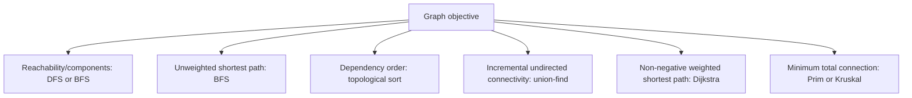

# Graph Algorithms Interview Guide

First define the graph: vertex identity, directed or undirected edges, weights,
parallel edges, disconnected components, and whether neighbors are explicit or
generated from a grid/string state.

Mark BFS nodes visited when enqueued to prevent duplicate frontier growth. In recursive
DFS, account for O(v) stack depth. Topological sort succeeds only when all vertices are
processed; fewer means a directed cycle. Union-find requires path compression and
union by rank/size for near-constant amortized operations.

## Ten Interview Checks

1. **BFS versus DFS?** BFS gives minimum edges in an unweighted graph; DFS is often simpler for reachability, components, and postorder.
2. **Adjacency list versus matrix?** List uses O(v+e); matrix uses O(v²) and gives constant-time edge lookup.
3. **Directed-cycle detection?** Use visiting/visited colors or Kahn indegrees; an undirected parent check is insufficient.
4. **Topological ordering?** It exists only for a DAG and may not be unique.
5. **Union-find fit?** Offline/incremental undirected connectivity, cycle edges, and Kruskal—not directed reachability.
6. **Dijkstra boundary?** Non-negative weights; negative edges require another algorithm such as Bellman-Ford.
7. **Grid complexity?** Treat cells as vertices and bound each neighbor; typical traversal is O(rows × columns).
8. **Bidirectional BFS?** It can reduce explored depth when both endpoints and reverse transitions are available.
9. **Disconnected graph?** Start traversal from every unvisited vertex when the question concerns the entire graph.
10. **Common Java bug?** Mutable keys, marking visited too late, comparator overflow, recursion overflow, or rebuilding neighbors repeatedly.

## Official References

- [Princeton Algorithms: undirected graphs](https://algs4.cs.princeton.edu/41graph/)
- [Princeton Algorithms: directed graphs](https://algs4.cs.princeton.edu/42digraph/)
- [Princeton Algorithms: shortest paths](https://algs4.cs.princeton.edu/44sp/)

## Recommended Next

Practice the Graph table in the [DSA Interview Question Bank](./DSA-INTERVIEW-QUESTION-BANK.mdx).
