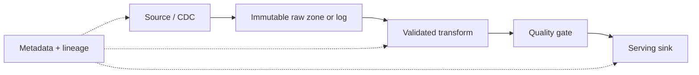

# Data Pipeline Production And Interview Guide

A production pipeline owns more than transformation code: source position, schema contract, event identity,
partitioning, time semantics, state, sink idempotency, replay, lineage, quality, privacy, recovery, and cost.

## Batch, Streaming, And Time

Choose batch when bounded latency, simpler recomputation, and cost-efficient scans satisfy the requirement. Choose
streaming when freshness justifies continuous state and operations. A hybrid design often retains immutable raw
input and uses the same logical transformation for live processing and backfill.

Event time describes when the event occurred; processing time describes when an operator handles it. A watermark
is a progress estimate used to close event-time windows. Define allowed lateness, idle-source behavior, correction
or retraction semantics, and where irrecoverably late events go. Fast but irreproducible processing-time answers can
be worse than delayed correct results.

## Reliability, Replay, And Evolution

Checkpoints bind operator state to recoverable source positions. Exactly-once processing inside an engine does not
guarantee exactly-once effects in an arbitrary external sink; the sink needs a compatible transaction, idempotent
upsert, or deduplication boundary. Keep replay inputs long enough for the recovery objective and version code,
configuration, schemas, and reference data needed to reproduce output.

Backfill is a production migration. Isolate its capacity, choose event-time bounds, prevent double writes, write to
a versioned destination when possible, compare counts/checksums/business invariants, then cut over with rollback.
Schema evolution requires producer/consumer compatibility and semantic validation; syntactically compatible data
can still change units, meaning, null behavior, or key distribution.

## Quality, Lineage, Security, And Operations

Validate freshness, completeness, uniqueness, validity, referential/business consistency, and distribution drift.
Quarantine invalid records with reason codes and safe metadata. Lineage should connect source version and position,
transformation release, run/checkpoint, and destination version. Apply least privilege, encryption, retention,
purpose limitation, deletion propagation, and sensitive-field controls throughout raw zones and DLQs.

Monitor end-to-end freshness, source lag, throughput, error/quarantine rate, watermark delay, checkpoint duration and
failure, state size, skew, backpressure, sink latency, reconciliation differences, and cost per useful record.

## Ten Interview Scenarios

### 1. ETL versus ELT?

ETL transforms before loading the serving store; ELT loads governed raw data then transforms in the destination.
Compare privacy, compute locality, reproducibility, tooling, and blast radius rather than treating either as modern.

### 2. Batch versus streaming?

Use business freshness, correction semantics, volume, recomputation cost, operational skill, and recovery needs.
Streaming is a continuous operational commitment, not simply a faster batch job.

### 3. Event time versus processing time?

Event time supports reproducible business windows despite delay and reordering. Processing time is simpler but ties
results to runtime arrival and failure behavior.

### 4. What is a watermark?

It estimates event-time progress and determines when windows may emit. It needs an explicit lateness policy and can
stall when a partition becomes idle unless idleness is handled.

### 5. Checkpoint versus savepoint?

A checkpoint is automated fault-recovery state; a savepoint is an operator-controlled state snapshot commonly used
for upgrade, migration, or rescaling. Their retention and compatibility obligations differ.

### 6. How do you make a sink replay-safe?

Use stable event identity, deterministic output keys, idempotent upsert or transactional/deduplication boundaries,
and version-aware conflict rules. Test the crash after effect but before source-position commit.

### 7. How do you run a safe backfill?

Freeze bounds and transformation version, isolate capacity, write a versioned target, validate at technical and
business levels, merge or cut over deliberately, and retain rollback and audit evidence.

### 8. How do you detect silent data corruption?

Combine schema enforcement with distribution checks, reconciliation, control totals, invariants, freshness, and
sampled source-to-sink traces. Transport success is not data correctness.

### 9. How do you handle a poison record?

Classify it, preserve safe diagnostic context, quarantine without blocking the partition forever, alert on rate,
repair the producer or transformation, and replay through a governed path.

### 10. A pipeline is running but data is stale—where do you look?

Trace source capture position, broker lag, partition skew, watermark/idleness, checkpoint failures, state growth,
backpressure, sink throttling, retries, and quality-gate quarantine using one end-to-end freshness SLI.

## Official References

- [Kafka Connect documentation](https://kafka.apache.org/documentation/#connect)
- [Debezium source connectors](https://debezium.io/documentation/reference/stable/connectors/index.html)
- [Apache Flink streaming analytics](https://nightlies.apache.org/flink/flink-docs-stable/docs/learn-flink/streaming_analytics/)
- [Apache Flink checkpoints](https://nightlies.apache.org/flink/flink-docs-stable/docs/ops/state/checkpoints/)

## Recommended Next

Continue with [Kafka Connect CDC And Production](../integration/streaming/KAFKA-CONNECT-CDC-PRODUCTION.md) and
[Event Streaming Interview Revision](../integration/streaming/EVENT-STREAMING-INTERVIEW-REVISION.md).
