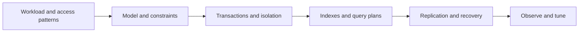

# Database Engineering Revision Sheet

## Database Review Path

## One-Line Recall

| Concept | Revision answer |
|---|---|
| primary key | Stable row identity and clustered/access-path influence depending on engine. |
| unique constraint | Authoritative database protection against duplicate values or idempotency identities. |
| foreign key | Enforces referential integrity inside the database boundary. |
| composite index | Ordered index whose useful prefixes follow column order. |
| covering index | Contains all values required by a query, avoiding extra row lookup. |
| MVCC | Maintains versions/snapshots so reads and writes can overlap under isolation rules. |
| optimistic locking | Detects concurrent modification using a version at update time. |
| pessimistic locking | Acquires database locks before conflicting work proceeds. |
| persistence context | JPA identity map and unit of managed entity change tracking. |
| flush | Synchronizes pending ORM changes to SQL; it is not necessarily transaction commit. |

## Isolation Recall

| Level | Intent |
|---|---|
| read committed | each statement reads committed data; repeated reads may change |
| repeatable read | repeated reads in a transaction remain stable under engine semantics |
| serializable | result is equivalent to serial execution, with reduced concurrency/retries |

Isolation level alone does not enforce every business invariant. Use constraints,
conditional writes, locks, or serializable transactions where the invariant needs
them.

## Index Review

- derive indexes from real predicates, joins, ordering, grouping, and selectivity;
- put equality/range/order columns in an evidence-based order;
- inspect the execution plan and actual row counts;
- remove redundant or unused indexes carefully;
- remember that indexes cost writes, memory, disk, and maintenance;
- avoid applying functions/casts that prevent intended index use.

## JPA Failure Prompts

- N+1 queries from lazy traversal;
- unexpected eager graph and duplicate rows;
- `LazyInitializationException` outside persistence context;
- self-invocation bypassing `@Transactional` proxy;
- long transaction holding a connection during remote I/O;
- `saveAll` without configured JDBC batching;
- cascade deleting data outside aggregate ownership;
- pagination with fetch joins or unstable order.

## Scaling Decisions

Optimize query/model first, then consider read replicas, caches, partitioning,
specialized stores, and denormalized projections. Each added store introduces
replication lag, reconciliation, failure, security, and operational cost.

## Migration Checklist

Use expand-and-contract: add compatible schema, deploy code that handles old/new,
backfill safely, switch reads/writes, verify, then remove old structure after the
rollback window. Avoid long blocking DDL and irreversible changes in the same step.

## Interview Prompts

**Optimistic or pessimistic locking?** Choose from contention, retry cost, work
duration, invariant risk, and database behavior—not preference.

**SQL or NoSQL?** Start from invariants, access patterns, scale, consistency,
partitioning, operations, and team capability.

**Why is a query slow?** Check wait/pool time, plan, row estimates, scans, joins,
sorts, locks, cache, I/O, returned data, and application mapping.

## Core Database Interview Questions

### When should a schema be normalized or denormalized?

Normalize authoritative OLTP data to remove update anomalies, express ownership,
and enforce constraints. Denormalize only for a measured read pattern, with an
explicit refresh/repair process and a named source of truth. Duplicated data is a
consistency obligation, not a free performance improvement.

### Primary key, unique constraint, and foreign key?

A primary key supplies stable row identity. A unique constraint protects an
additional candidate key or idempotency identity. A foreign key preserves
referential integrity inside one database boundary. Application checks improve
messages but cannot replace constraints because concurrent check-then-insert
operations race.

### How do B-tree, hash, GIN, GiST, and BRIN indexes differ?

B-tree is the general choice for equality, range, and ordered access. Hash targets
equality. GIN commonly indexes multi-valued tokens such as arrays or full-text
terms; GiST supports extensible search structures such as geometric/range queries;
BRIN summarizes physical page ranges and fits very large naturally ordered data.
Engine capabilities differ, so choose from operators and workload, not the label.

### How should columns be ordered in a composite index?

Start from complete query shapes. Leading equality predicates commonly come before
the first range predicate, then consider ordering/grouping and selectivity using an
actual plan. The useful-prefix rule is engine- and index-type-sensitive; do not
repeat “most selective first” as a universal law.

### What is a covering index, and why might it not produce an index-only scan?

A covering index stores all columns needed by a query, sometimes using included
payload columns. The engine may still visit the table for visibility, locking, or
unsupported index-type reasons. Covering also increases index size and write cost,
so verify heap/table fetches and workload benefit.

### Why might the optimizer ignore a valid index?

A sequential scan can be cheaper when a query returns much of the table. Other
causes include stale or inaccurate statistics, low selectivity, implicit casts,
functions on indexed columns, collation/type mismatch, parameter-sensitive plans,
or a composite index whose leading access path does not fit. Read estimated versus
actual rows before forcing a plan.

### How do you investigate a slow query?

Separate connection-pool wait from database execution first. Capture the real SQL
and parameters, use the engine's execution-plan tooling safely, compare estimated
and actual rows, and inspect scans, joins, sorts/spills, locks, I/O, cache behavior,
returned bytes, and ORM mapping. Re-measure latency and resource cost after one
controlled change.

### Why do sargability and keyset pagination matter?

A sargable predicate lets the optimizer use an index search rather than transform
each stored value. Keyset pagination continues after a stable, unique ordered key
and avoids scanning/discarding every earlier row on deep pages. Offset pagination
is convenient for shallow pages but can become slow and unstable under concurrent
inserts unless ordering is deterministic.

### What do ACID and MVCC guarantee?

ACID describes transaction atomicity, consistency, isolation, and durability; the
database cannot infer every business invariant. MVCC keeps row versions so readers
and writers can overlap under the engine's visibility rules. It reduces some lock
contention but does not eliminate write conflicts, deadlocks, version cleanup, or
the need for correct isolation.

### What anomalies remain at common isolation levels?

Read committed can allow non-repeatable reads and changing result sets. Repeatable
read and snapshot isolation are engine-specific and may still permit write skew.
Serializable aims for an outcome equivalent to serial execution, often by blocking
or aborting transactions. State the invariant and test the actual engine rather
than reasoning from the isolation name alone.

### Optimistic locking versus pessimistic locking?

Optimistic locking uses a version or conditional update and retries/conflicts when
another writer wins; it fits lower contention and short retryable work. Pessimistic
locking acquires database locks before the change; it fits costly conflicts or hot
invariants but can reduce throughput and deadlock. Keep either transaction short
and never hold a database lock across remote I/O.

### How do deadlocks happen, and how should applications react?

Transactions acquire incompatible resources in a cycle. The database selects a
victim and rolls it back. Prevent them with consistent access order, small
transactions, appropriate indexes, and reduced lock scope; retry only the complete
idempotent transaction with bounded jitter, and retain evidence of the lock graph.

### Why can a larger connection pool reduce throughput?

Connections are concurrent database work, not free capacity. Beyond the database's
CPU, I/O, lock, memory, and downstream limits, more active queries increase queueing,
context switching, contention, and tail latency. Size from measured service time
and database capacity, then bound request, worker, pool, and retry concurrency
together.

### How do you distinguish a connection leak from a slow checkout?

A leak never returns a connection; slow work eventually returns it after a long
transaction, query, lock wait, or remote call. Correlate active/idle/pending pool
metrics with checkout duration, transaction traces, slow queries, lock waits, and
leak diagnostics. Raising the acquisition timeout hides neither problem.

### What consistency problems do read replicas introduce?

Asynchronous replicas can return stale data after an acknowledged primary write.
Define which operations tolerate staleness and provide primary/sticky routing,
version tokens, or a bounded wait for read-your-writes paths. Monitor replay lag in
time and bytes; “replica is healthy” does not prove it satisfies the freshness SLO.

### Synchronous versus asynchronous replication?

Synchronous replication waits for a configured remote durability/visibility point,
increasing confidence and latency while potentially reducing write availability.
Asynchronous replication lowers commit latency but permits lag and non-zero data
loss at failover. Specify exactly what acknowledgment means for the chosen engine.

### How do you choose a shard key?

Use the dominant access and transaction scope, cardinality, write distribution,
growth, tenant isolation, locality, and rebalancing requirements. A good key routes
most queries to one shard without creating hot tenants or unbounded partitions.
Cross-shard joins, unique constraints, transactions, and resharding become explicit
application/platform problems.

### Partitioning versus sharding?

Partitioning divides data into managed pieces; it may occur inside one database
instance. Sharding distributes those pieces across independent nodes or clusters.
Both need routing and pruning, but sharding adds cross-node failure, rebalancing,
global-constraint, and operational complexity.

### What makes a backup strategy credible?

A successful backup job is only evidence that bytes were produced. Define RPO/RTO,
full/incremental and transaction-log retention, encryption, isolation from the
primary failure domain, retention and deletion policy, and restore prerequisites.
Regularly restore into a clean environment and verify application-level invariants
at the target point in time.

### What is an ambiguous database commit?

The server may commit while the client loses the response or connection. Retrying a
non-idempotent statement can duplicate the effect. Use a stable operation identity,
unique constraint/state lookup, and reconciliation to discover the authoritative
outcome; a timeout is not proof of rollback.

### How do expand-and-contract migrations support zero downtime?

Add a backward-compatible structure, deploy code that can tolerate old and new
versions, dual-write or backfill through an idempotent bounded process where needed,
switch reads, verify, and remove the old structure only after the rollback window.
Plan locks, transaction-log growth, replicas, CDC, and long-running older binaries.

### Persistence context, dirty checking, flush, and commit?

The JPA persistence context is an identity map/unit of work for managed entities.
Dirty checking detects changes and flush emits SQL when required; flush can happen
before a query or commit and does not itself prove transaction commit. Detached
objects are not tracked, and `merge()` returns the managed copy rather than turning
the passed instance into that copy.

### How do you prevent N+1 queries without over-fetching?

Define the use-case fetch plan explicitly with projections, entity graphs, join
fetches, or batch fetching. Count SQL in tests and inspect row multiplication. A
global switch to eager loading can replace N+1 with oversized joins, duplicate
rows, pagination errors, and excessive memory.

### What is the safe role of Redis or another cache?

Use it for bounded, reconstructable acceleration unless the design explicitly makes
it authoritative. Define keys, tenant scope, serialization, TTL, invalidation,
stampede control, memory/eviction policy, topology, and behavior when Redis is slow
or unavailable. Cache-aside normally provides bounded staleness, not atomic
consistency with the database.

### What does change data capture solve, and what does it not solve?

CDC turns committed database changes into a stream without synchronous database-to-
broker dual writes. Direct table CDC exposes storage-level changes; an outbox gives
an intentional integration contract. CDC remains at-least-once in common designs
and still needs schema governance, ordering keys, snapshot/bootstrap handling,
consumer idempotency, lag monitoring, replay, and reconciliation.

## Final Checklist

- constraints protect authoritative invariants;
- transaction and isolation boundaries are explicit;
- indexes are justified by plans and workload;
- ORM SQL and fetch behavior are understood;
- migrations support overlapping versions and rollback;
- pools, locks, latency, storage, replicas, and backups are monitored;
- restoration and reconciliation are tested.

## Official References

- [PostgreSQL documentation](https://www.postgresql.org/docs/)
- [Oracle Database documentation](https://docs.oracle.com/en/database/)
- [MongoDB documentation](https://www.mongodb.com/docs/)
- [PostgreSQL indexes](https://www.postgresql.org/docs/current/indexes.html)
- [PostgreSQL transaction isolation](https://www.postgresql.org/docs/current/transaction-iso.html)
- [Hibernate ORM user guide](https://docs.jboss.org/hibernate/orm/current/userguide/html_single/Hibernate_User_Guide.html)
