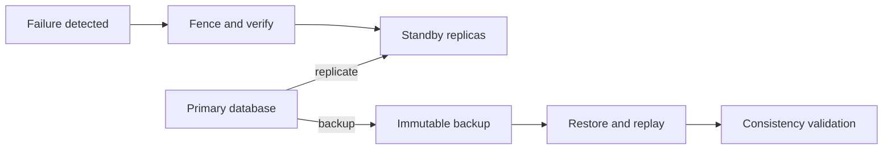

# Database Replication, Backup, And Recovery

## Failure-To-Recovery Path



<DocLabels items={[
  {label: 'High availability', tone: 'advanced'},
  {label: 'Disaster recovery', tone: 'production'},
  {label: 'Data correctness', tone: 'interview'},
]} />

Replication, high availability, backup, and disaster recovery solve different failures.
A replica can copy corruption or an accidental delete. A backup can be unrecoverable or too
old. A promoted standby can accept writes while the old primary is still alive. Treat the
whole system as a correctness protocol, not a checkbox.

## Four Different Capabilities

| Capability | Primary purpose | Does not prove |
|---|---|---|
| replication | maintain additional copies and optionally serve reads | recoverability from logical corruption |
| high availability | restore service after component failure | acceptable data loss or site recovery |
| backup/PITR | recover historical durable state | fast automated failover |
| disaster recovery | restore an agreed service at another failure domain | zero RPO/RTO without tested architecture |

`RPO` is the maximum acceptable data-loss window. `RTO` is the maximum acceptable restoration
time. Define them per business capability, then design, measure, and rehearse them.

## Replication Semantics

### Synchronous and asynchronous

Synchronous acknowledgement waits for the required remote durability condition, reducing the
loss window but adding latency and coupling availability to replica health. Asynchronous
replication acknowledges locally and ships changes later, improving write availability/latency
but permitting lag and data loss on promotion.

"Synchronous" is incomplete without naming what acknowledged: memory receipt, OS cache, durable
log flush, apply, and how many replicas/failure domains.

### Physical and logical

- Physical replication replays engine-level log/storage changes and is commonly used for close
  standby copies.
- Logical replication publishes decoded row/change operations and supports selective data,
  migrations, integration, and version flexibility, with different DDL and correctness concerns.

### Read replicas

Read scaling works only when workloads and consistency requirements permit it. Account for:

- replay lag and stale reads;
- read-your-writes and monotonic-read expectations;
- long replica queries delaying cleanup or apply;
- replica cancellation/conflict behavior;
- failover capacity: the new primary must handle writes plus redirected reads;
- routing transactions consistently rather than mixing primary and replica state.

Use primary reads, session stickiness, version/token checks, lag thresholds, or delayed response
when the user must observe a recent write. "Eventual consistency" is not an excuse for undefined UX.

## Safe Failover Protocol

```text
detect failure
  -> establish quorum/authority
  -> fence old writer
  -> choose the most appropriate candidate
  -> promote and publish new topology
  -> drain/replace stale client connections
  -> validate writes, reads, jobs and replication
  -> reconcile ambiguous operations
```

Fencing prevents two primaries from accepting conflicting writes. Techniques depend on the
platform: quorum leases, storage fencing, network isolation, instance termination, or a single
authoritative control plane. DNS changes alone do not fence the old database.

Never promote solely from "the primary did not answer me"; the observer may be partitioned while
the primary remains writable. Automate only with an understood failure detector and authority model.

## Ambiguous Commit

The client may send `COMMIT`, the database may durably commit, and the response may be lost during
a network failure. The client sees a timeout but cannot infer rollback.

For important mutations:

- assign a stable idempotency/business operation key;
- make duplicate requests return the existing result;
- inspect authoritative state before retrying ambiguous work;
- reconcile external effects;
- preserve audit evidence;
- do not translate every connection exception into an automatic mutation retry.

## Backup And Point-In-Time Recovery

A recoverable chain commonly combines a consistent base backup with continuous transaction-log
archival. Point-in-time recovery restores a base and replays log up to a target time/transaction.
Engine-specific tools and guarantees vary.

A production backup design specifies:

- included databases, tablespaces, keys, configuration, roles, and external dependencies;
- full/incremental/log cadence and retention;
- encryption, key escrow/rotation, immutability, and access controls;
- off-host and cross-failure-domain copies;
- integrity verification and catalog monitoring;
- recovery dependencies and exact restore order;
- deletion/privacy obligations;
- routine restore rehearsals against stated RPO/RTO.

Backup success is not the objective. A timed restore that produces correct, usable application
state is the objective.

## Recovery Exercise

1. Declare failure scenario, target recovery point, RPO, and RTO.
2. Provision an isolated target and recover credentials/keys/configuration.
3. Restore base data and replay logs to the selected point.
4. Validate engine consistency, schema/migration version, constraints, row/business invariants,
   sequences, jobs, and application reads/writes.
5. Reconnect downstream consumers/search/cache/projections using an explicit reconciliation plan.
6. Record achieved RPO/RTO, missing dependencies, manual steps, bottlenecks, and corrective owners.

Never test destructive restoration over the only production copy.

## Multi-Region Design

Choose a write-authority model explicitly:

- **single writer, passive region:** simpler conflict model; failover has promotion and routing delay;
- **regional writers with ownership:** partition tenants/entities by home region; ownership movement
  needs fencing and ordering;
- **multi-writer:** lower local write latency but requires engine/application conflict semantics,
  global constraints, clock assumptions, and reconciliation.

Cross-region latency makes synchronous durability expensive. Data residency, encryption, network
egress, schema rollout, observability, and failback are architecture inputs—not operational details.

## Scaling Choices

| Pressure | Candidate response | Key risk |
|---|---|---|
| read-heavy | cache, read replica, projection | staleness and invalidation |
| write-heavy single node | query/index/transaction tuning, vertical capacity | finite headroom |
| data volume | partitioning or sharding | routing, cross-shard work, rebalancing |
| global access | regional replicas or authority | latency, conflicts, residency |
| mixed access models | CQRS/materialized views/search | duplication, replay and reconciliation |

Sharding requires a stable key, balanced distribution, per-shard capacity, directory/routing
strategy, resharding, global-ID and uniqueness policy, cross-shard transaction position, and a
backup/restore story for a consistent system-wide recovery point.

## Schema Changes During Replication

Use expand/contract compatibility:

1. deploy readers that tolerate old and new forms;
2. add backward-compatible schema;
3. write compatible data;
4. backfill in bounded, restartable batches;
5. verify replica/apply lag and correctness;
6. move reads;
7. remove obsolete schema only after every producer/consumer is safe.

Large DDL, index builds, and backfills can generate logs faster than replicas/archive storage can
consume them. Monitor lag, log retention, disk headroom, locks, and recovery duration.

## Incident Scenarios

### Replication lag grows

Separate source generation from transport and apply. Inspect write/DDL/backfill rate, network,
replica CPU/I/O, long queries, conflicts, log retention, and apply workers. Protect log capacity,
throttle optional writers/backfills, stop routing consistency-sensitive reads to stale replicas,
and avoid promotion to a knowingly incomplete candidate unless the business accepts the RPO.

### Primary and standby can both accept writes

Treat as a split-brain correctness incident. Stop or fence writers, preserve logs and timelines,
identify authoritative history through the control plane, quantify divergence, and reconcile using
business rules. Do not simply point clients at whichever node responds first.

### Backup completed but restore fails

Preserve the artifacts and failure evidence. Test keys, permissions, versions, checksums, base/log
continuity, recovery storage, configuration, and missing external dependencies. Escalate against
the recovery objective and repair the process before calling the system protected.

### Disk fills with transaction logs

Find why logs cannot be recycled: failed archive, disconnected/stalled replica, abandoned slot,
long transaction, backup, or recovery consumer. Restore the consumer/path or add controlled
capacity; never blindly delete logs required for crash recovery, replicas, or PITR.

## Production Evidence And Alerts

- replication receive/replay position, byte/time lag, and oldest retained log;
- primary/replica role, timeline/term/epoch, quorum and last topology change;
- archive success/failure, backup age, checksum, immutable-copy age;
- restore-test age and achieved RPO/RTO;
- failover duration, client reconnection errors, ambiguous transaction count;
- replica read staleness and traffic routing;
- disk forecast for logs, backups, compaction, and recovery headroom.

## Interview Questions

**Why is a read replica not a backup?** It continuously applies primary changes, including damaging
logical changes, while backup/PITR retains recoverable history under a separate lifecycle.

**Can automatic failover guarantee zero data loss?** Only if the acknowledged durability protocol,
candidate selection, and failure assumptions satisfy a zero RPO. Async replicas may be behind.

**What do you validate after promotion?** Authority/fencing, data and log position, application
writes/reads, connection targets, jobs, sequences, replication re-establishment, lag, and ambiguous
business operations—not merely TCP connectivity.

**Failover versus failback?** Failover restores service on a new authority. Failback is a separate,
risk-bearing migration of authority after the old environment is repaired and resynchronized.

## Official References

- [PostgreSQL high availability, load balancing, and replication](https://www.postgresql.org/docs/current/high-availability.html)
- [PostgreSQL backup and restore](https://www.postgresql.org/docs/current/backup.html)
- [PostgreSQL continuous archiving and PITR](https://www.postgresql.org/docs/current/continuous-archiving.html)
- [Oracle Database High Availability](https://docs.oracle.com/en/database/oracle/oracle-database/23/haovw/)
- [Oracle Data Guard concepts](https://docs.oracle.com/en/database/oracle/oracle-database/23/sbydb/)
- [Apache Cassandra operations](https://cassandra.apache.org/doc/latest/cassandra/managing/operating/index.html)
- [Apache Cassandra backups](https://cassandra.apache.org/doc/latest/cassandra/managing/operating/backups.html)

For engine implementation details, use the [Oracle Database Architect Path](../ORACLE-DATABASE-ARCHITECT-PATH.md)
and [Cassandra Architect Path](../CASSANDRA-ARCHITECT-PATH.md).

## Recommended Next

Practise containment and recovery with the [Database Load Incident Runbook](./DATABASE-LOAD-INCIDENT-RUNBOOK.md)
and review the complete [Database Production Mastery](../DATABASE-PRODUCTION-MASTERY.md) map.
