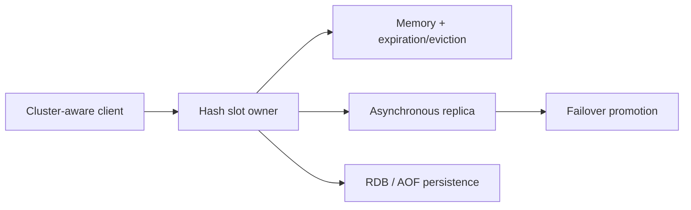

# Redis Internals, Operations, And Interview Scenarios

Redis is an in-memory data-structure server, not merely a map. Its fast command path does not remove network,
serialization, memory, persistence, replication, or failover costs. State whether Redis is an authoritative store,
a rebuildable cache, a coordination mechanism, or a stream before choosing durability and recovery behavior.

## Runtime, Memory, And Latency

Redis executes most commands serially on its main command-processing path, while selected I/O and background work
can use other threads. One slow command, huge value, Lua script, or response can therefore delay unrelated clients.
Measure command latency, event-loop stalls, CPU, memory fragmentation, network bytes, blocked clients, slow log,
key cardinality, and value-size distributions. Avoid unbounded collections and `KEYS`-style production scans.

Expiration makes a key logically unavailable after its TTL; deletion is performed through passive access-time and
active sampling. Eviction is different: when `maxmemory` is reached, a configured policy chooses keys to remove.
Choose `noeviction`, all-key or TTL-only LRU/LFU/random policies from the workload and authority model. Reserve
headroom for replication and persistence buffers rather than sizing only live keys.

## Persistence, Replication, And Availability

- RDB snapshots offer compact point-in-time files but can lose changes since the last snapshot.
- AOF records writes and trades fsync policy, file growth, and rewrite cost against the loss window.
- Using both improves recovery options but still requires tested backup, restore, and corruption procedures.
- Replication is asynchronous by default, so acknowledged writes can be lost during promotion.

Sentinel provides monitoring and automatic failover for a non-sharded primary/replica deployment. Redis Cluster
shards the keyspace into 16,384 hash slots; clients must follow `MOVED` and `ASK` redirections. Multi-key operations
must target one slot, commonly through a deliberate hash tag. Cluster improves capacity and availability but does
not create cross-slot transactions or eliminate the asynchronous-replication loss window.

## Caching And Coordination Safety

Cache-aside must define TTL jitter, invalidation, negative caching, maximum staleness, and the source of truth.
Protect a hot miss with request coalescing or a single-flight mechanism, bounded concurrency, and optionally
stale-while-revalidate. A mutex without fencing can still allow an expired lock holder to overwrite a newer owner.
Use unique ownership tokens, safe compare-and-delete release, bounded leases, and fencing tokens where stale writes
must be rejected by the protected resource. Idempotency is still required for ambiguous outcomes.

## Ten Interview Scenarios

### 1. Why can Redis latency spike when CPU is not saturated?

Look for a slow or high-complexity command, large request/response, Lua execution, fork or persistence activity,
memory pressure, swapping, network queues, or client-pool wait. Correlate slow log and latency events with host and
client metrics instead of inferring from average CPU.

### 2. Expiration versus eviction?

Expiration follows a key's TTL contract. Eviction is memory-pressure admission behavior controlled by
`maxmemory-policy`; it can remove a still-valid cached key.

### 3. RDB versus AOF?

Compare recovery point, write amplification, fsync latency, rewrite behavior, startup time, storage, and restore
testing. The right answer follows the state-authority and data-loss budget.

### 4. Sentinel versus Redis Cluster?

Sentinel supplies failover for one unsharded dataset. Cluster supplies sharding plus per-shard replication and
failover, with client routing and cross-slot constraints.

### 5. Why can a write disappear after failover?

Replication is asynchronous. The primary can acknowledge before the replica receives the write; promotion then
exposes an older state. Describe the loss window instead of claiming linearizable durability.

### 6. How do you diagnose a hot key?

Use command/key sampling, per-node traffic, latency, and value-size evidence. Split or replicate the read model,
improve key distribution, add local caching, or redesign the access pattern without placing sensitive keys in
metrics labels.

### 7. How do you prevent a cache stampede?

Combine TTL jitter, single-flight loading, bounded regeneration, stale-while-revalidate, and source protection.
Prove behavior when the loader crashes or the source is slow.

### 8. Why is Redis Pub/Sub unsuitable for durable work?

Pub/Sub does not retain messages for disconnected subscribers. Use Redis Streams or a durable broker when replay,
consumer progress, pending ownership, or recovery is required.

### 9. Is `SET NX PX` alone a safe distributed lock?

It provides a lease acquisition primitive, not stale-owner protection. Use a unique token for release and fencing
at the protected resource when an expired holder can still perform work.

### 10. What must a Redis disaster-recovery test prove?

Prove backup integrity, restore time, acceptable loss, client discovery, failover behavior, DNS/TLS/auth recovery,
warm-up load, and reconciliation with the authoritative system.

## Official References

- [Redis persistence](https://redis.io/docs/latest/operate/oss_and_stack/management/persistence/)
- [Redis Sentinel](https://redis.io/docs/latest/operate/oss_and_stack/management/sentinel/)
- [Redis Cluster specification](https://redis.io/docs/latest/operate/oss_and_stack/reference/cluster-spec/)
- [Redis key eviction](https://redis.io/docs/latest/develop/reference/eviction/)

## Recommended Next

Continue with [Spring Data Redis](../../spring/data/SPRING-DATA-REDIS.md) and
[Distributed Locks And Fencing](../../reliability/locking/DISTRIBUTED-LOCKS-AND-FENCING.md).
