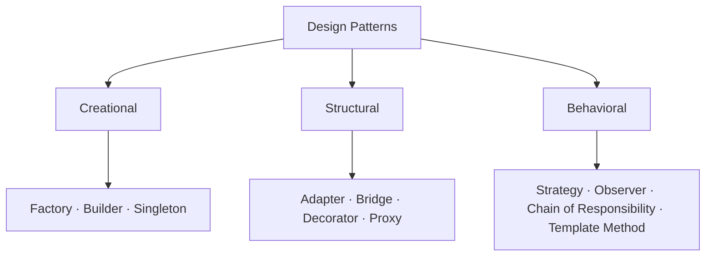

<!-- split-guide-index -->
# Design Patterns

<DocLabels items={[{label: 'Pattern catalog', tone: 'advanced'}, {label: 'Shopverse', tone: 'shopverse'}, {label: 'Architect route', tone: 'production'}]} />

Select and apply object, behavioral, integration, and reliability patterns. Use the
category guides for comparison and the dedicated pattern pages for implementation,
runtime mechanics, trade-offs, testing, and interview preparation.

## Start With The Design Pressure

A pattern is a named response to a recurring design pressure, not a target for
the codebase. Before choosing one, write down:

Pattern overengineering begins when the indirection costs more than the change
it protects. Prefer the simpler design until a real variation point, invariant,
or integration boundary justifies the pattern.

1. **The problem:** what change, dependency, or invariant is difficult today?
2. **The variation point:** what must be allowed to change independently?
3. **The stable boundary:** what should callers be able to rely on?
4. **The simplest baseline:** would a constructor, method, or small composition
   solve the problem without a pattern?
5. **The cost:** which new types, indirection, lifecycle rules, or debugging
   difficulties will the pattern introduce?
6. **The evidence:** which test proves the pattern protects the intended
   behavior?

Every dedicated guide uses this reasoning model: **problem → naive design →
pattern implementation → alternatives → drawbacks → mitigations → tests**.

## Browse by Pattern Family

<TopicCards items={[
  {title: 'Immutable Classes And Defensive Copies', href: '/development/design-patterns/immutable-class', description: 'Protect object invariants across collections, arrays, dates, records, builders, cloning, serialization, and concurrency.', icon: 'security', tags: ['Java', 'Construction foundation']},
  {title: 'Pattern Selection Cheat Sheet', href: '/development/design-patterns/DESIGN-PATTERN-SELECTION-CHEATSHEET', description: 'Choose across all GoF patterns from the design pressure, trade-off, and closest alternatives.', icon: 'brain', tags: ['Decision guide', 'GoF']},
  {title: 'Creational Patterns', href: '/development/design-patterns/CREATIONAL-PATTERNS', description: 'Control how objects are selected, assembled, copied, and scoped.', icon: 'boxes', tags: ['Five GoF patterns', 'Java + Spring']},
  {title: 'Structural Patterns', href: '/development/design-patterns/STRUCTURAL-PATTERNS', description: 'Compose objects and adapt boundaries without rigid inheritance.', icon: 'layers', tags: ['Adapter', 'Bridge', 'Decorator', 'Proxy']},
  {title: 'Behavioral Patterns', href: '/development/design-patterns/BEHAVIORAL-PATTERNS', description: 'Organize algorithms, events, workflows, and ordered responsibility.', icon: 'route', tags: ['Strategy', 'Observer', 'Chain', 'Template Method']},
]} />

<DocCallout type="production" title="Highest-priority patterns for Spring interviews">

Give extra attention to **Strategy, Factory, Proxy, Observer, Chain of
Responsibility, Adapter, and Template Method**. They appear repeatedly in Spring
architecture discussions because the container, AOP infrastructure, event model,
web stack, and extension points make these patterns visible in real applications.

For each one, be ready to explain the problem it solves, a Spring implementation,
one framework example, its main trade-off, and when a simpler design is better.

</DocCallout>

## Spring Interview Deep Dives

<TopicCards items={[
  {title: 'Strategy', href: '/development/design-patterns/strategy', description: 'Select interchangeable behavior with injected Spring beans.', icon: 'route', tags: ['Interview priority', 'Behavioral']},
  {title: 'Factory', href: '/development/design-patterns/factory', description: 'Centralize creation or runtime implementation selection.', icon: 'boxes', tags: ['Interview priority', 'Creational']},
  {title: 'Proxy', href: '/development/design-patterns/proxy', description: 'Understand AOP, transactions, caching, security, and self-invocation.', icon: 'security', tags: ['Interview priority', 'Structural']},
  {title: 'Observer', href: '/development/design-patterns/observer', description: 'Publish in-process events and choose safe transaction boundaries.', icon: 'network', tags: ['Interview priority', 'Behavioral']},
  {title: 'Chain of Responsibility', href: '/development/design-patterns/chain-of-responsibility', description: 'Build ordered handlers like filters, validators, and security chains.', icon: 'layers', tags: ['Interview priority', 'Behavioral']},
  {title: 'Adapter', href: '/development/design-patterns/adapter', description: 'Keep vendor APIs and DTOs outside the application core.', icon: 'code', tags: ['Interview priority', 'Structural']},
  {title: 'Template Method', href: '/development/design-patterns/template-method', description: 'Hold a workflow stable while selected steps vary.', icon: 'brain', tags: ['Interview priority', 'Behavioral']},
]} />

## Recommended Learning Order

1. Learn object ownership with [Immutable Classes And Defensive Copies](./design-patterns/immutable-class.md).
2. Use the [Pattern Selection Cheat Sheet](./design-patterns/DESIGN-PATTERN-SELECTION-CHEATSHEET.md)
   to start from a design pressure rather than a pattern name.
3. Study [Creational Patterns](./design-patterns/CREATIONAL-PATTERNS.md): construction, selection,
   copying, lifecycle, and safe publication.
4. Study [Structural Patterns](./design-patterns/STRUCTURAL-PATTERNS.md): boundaries, object graphs,
   interface translation, wrappers, and proxy behavior.
5. Study [Behavioral Patterns](./design-patterns/BEHAVIORAL-PATTERNS.md): algorithm selection,
   workflows, events, state transitions, commands, and responsibility ownership.
6. Revisit the dedicated Spring priority guides and defend when a simpler design is better.

## Complete GoF Coverage

The category guides cover the complete 23-pattern catalog. High-frequency Java and Spring patterns
also have dedicated implementation guides.

| Family | Complete catalog | Dedicated deep dives |
|---|---|---|
| creational | Factory Method, Abstract Factory, Builder, Prototype, Singleton | all five, plus immutability foundations |
| structural | Adapter, Bridge, Composite, Decorator, Facade, Flyweight, Proxy | Adapter, Bridge, Decorator, Proxy; remaining patterns are explained and compared in the family guide |
| behavioral | Chain of Responsibility, Command, Interpreter, Iterator, Mediator, Memento, Observer, State, Strategy, Template Method, Visitor | Strategy, Observer, Chain of Responsibility, Template Method; remaining patterns are explained and compared in the family guide |

## What “Depth” Means In This Track

Do not stop at a class diagram. For each pattern, be able to answer:

| Dimension | Question to answer |
|---|---|
| pressure | what concrete change or coupling makes the current design painful? |
| invariant | what must remain true before and after the pattern is introduced? |
| runtime flow | which object calls which collaborator, and where is the decision made? |
| ownership | who creates, mutates, closes, retries, caches, or observes each object? |
| implementation variants | what changes between plain Java, dependency injection, AOP, events, and distributed messaging? |
| failure behavior | what happens on exceptions, partial work, re-entry, concurrency, or duplicate delivery? |
| cost | which extra types, indirection, memory, lifecycle rules, or debugging difficulty appear? |
| proof | which unit, integration, architecture, concurrency, or failure test validates the design? |

<PatternComparison
  title="Choose by design pressure"
  columns={['Strategy', 'Factory', 'Decorator', 'Observer']}
  rows={[
    {criterion: 'Primary pressure', values: ['Swap behavior', 'Control creation', 'Add behavior around a contract', 'Notify interested consumers']},
    {criterion: 'Decision owner', values: ['Caller or registry', 'Factory/container', 'Composition root', 'Publisher and subscription model']},
    {criterion: 'Main risk', values: ['Too many tiny strategies', 'Hidden service locator', 'Order-sensitive wrappers', 'Hidden workflow and failure semantics']},
    {criterion: 'Proof', values: ['Algorithm + selection tests', 'Product/candidate tests', 'Invocation-order tests', 'Delivery/transaction tests']},
  ]}
/>

<ExpandableAnswer title="Dry run: selecting a pattern instead of guessing one">

Suppose checkout has a growing `if/else` chain for card, wallet, and bank-transfer behavior.

1. The pressure is runtime variation in payment behavior.
2. The stable boundary is `PaymentStrategy.pay(request)`.
3. A registry selects one injected strategy by payment type.
4. A unit test proves each algorithm; a registry test proves selection and unknown-type behavior.
5. Strategy is justified only if the algorithms vary independently. If there are two stable cases,
   a small conditional may remain clearer.

This reasoning distinguishes Strategy from Factory: Strategy owns interchangeable behavior;
Factory owns construction or implementation creation. A design may use both, but they solve
different pressures.

</ExpandableAnswer>

## Common Pattern Misuse

| Misuse | Why it fails | Better move |
|---|---|---|
| pattern chosen before the problem | creates ceremony without a protected variation point | name the pressure and simplest baseline first |
| interface for every class | adds navigation but no substitutability | introduce a boundary only where behavior or dependency varies |
| factory as service locator | hides dependencies and moves errors to runtime | constructor-inject dependencies and keep selection explicit |
| singleton holding mutable request state | creates races and test coupling | keep shared services stateless or synchronize explicit state ownership |
| observer for required workflow | hides ordering, failure, and transaction semantics | orchestrate required steps explicitly; publish facts for optional reactions |
| decorator/proxy without ordering rules | behavior changes silently with wrapper order | document and test the complete invocation chain |
| deep copy through serialization | couples domain semantics to transport and loses ownership clarity | use immutable values or explicit copy contracts |

## Reading Strategy

Use **Design Patterns** as a decision and verification guide inside **Design Patterns**. Start by naming the invariant or operational outcome, then follow the runtime flow and identify the owning component. For every example, record the expected success evidence, the most important failure mode, and the metric or test that proves recovery. This keeps the material useful for implementation reviews, production incidents, and architect interviews instead of treating it as isolated syntax.

Within **Design Patterns**, apply the Shopverse guidance incrementally: verify the current behavior, introduce one bounded change, test the unhappy path, and preserve a rollback or reconciliation route. Follow links to canonical pages when a concept belongs to another track; do not copy that explanation into this page. This ownership rule keeps the focused guides short while retaining technical depth and traceability.

## Interview Questions

<InterviewPractice
  title="Design-pattern interview drill"
  questions={[
    {question: 'Strategy versus Factory: what changes?', answer: 'Strategy encapsulates interchangeable behavior; Factory owns construction or implementation creation. A factory may create a strategy, but their design pressures differ.', difficulty: 'Beginner'},
    {question: 'Decorator versus Proxy?', answer: 'Both wrap the same contract. Decorator composes optional behavior; Proxy controls access, lifecycle, remoting, or interception and may be transparent to callers.', difficulty: 'Intermediate'},
    {question: 'When is Observer dangerous?', answer: 'When required workflow, ordering, transaction outcome, retry, or failure ownership becomes hidden. Required synchronous steps usually need explicit orchestration.', difficulty: 'Advanced'},
    {question: 'Why is a pattern not automatically good design?', answer: 'It adds types and indirection. It is justified only when it protects a real variation point or invariant more clearly than a constructor, method, conditional, or small composition.', difficulty: 'Intermediate'},
  ]}
/>

<ExpandableAnswer title="How should you explain any design pattern in an interview?">

State the recurring problem, show the naive design and its change pressure, name the stable boundary
and participants, trace one runtime example, compare the closest alternative, then give the main
drawback and a test that proves the design. Pattern definitions without trade-offs are incomplete.

</ExpandableAnswer>

<ExpandableAnswer title="Composition versus inheritance?">

Composition delegates to collaborators that can be replaced independently at runtime and avoids
binding callers to a base-class lifecycle. Inheritance is appropriate for a genuine substitutable
type hierarchy with stable extension hooks. Several patterns prefer composition because change
along one axis should not force a growing subclass matrix.

</ExpandableAnswer>

<ExpandableAnswer title="Can multiple patterns appear in one design?">

Yes. A factory may construct a strategy, a decorator may wrap it, and a proxy may add transaction
or security interception. Name each pattern only when its distinct responsibility is useful; do
not describe every library object as a pattern participant.

</ExpandableAnswer>

## Official References

- [Spring Framework reference](https://docs.spring.io/spring-framework/reference/)
- [Spring Boot reference](https://docs.spring.io/spring-boot/reference/)

## Recommended Next Page

Continue with [Design Pattern Selection Cheatsheet](./design-patterns/DESIGN-PATTERN-SELECTION-CHEATSHEET.md).
