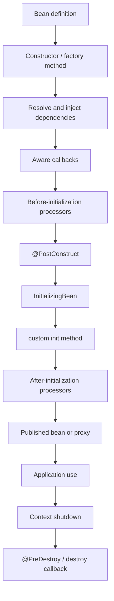

# Spring Bean Scopes And Lifecycle

<DocLabels items={[
  {label: 'Intermediate', tone: 'intermediate'},
  {label: 'Scopes and ownership', tone: 'foundation'},
  {label: 'Graceful lifecycle', tone: 'production'},
  {label: 'Shopverse evidence', tone: 'shopverse'},
]} />

Scope defines which container lookup shares an instance. Lifecycle defines who
initializes it, when it becomes usable, and who releases its resources.



This is the application-facing sequence. Processor registration and refresh-phase
internals remain in the
[Container And BeanFactory Internals](../../spring/internals-production/CONTAINER-BEANFACTORY-AUTOCONFIG.md)
guide.

## Choose Scope From Ownership

| Scope | Shared by | Main caution |
|---|---|---|
| singleton | one bean instance per application context | mutable state is shared across threads |
| prototype | each container request for the bean | container does not own full destruction |
| request | one HTTP request | requires active web request or scoped proxy/provider |
| session | one HTTP session | memory, serialization, expiry, and clustered session behavior |
| application | servlet application context | web-container ownership differs from plain singleton intent |

Most services, repositories, clients, configuration properties, and controllers are
singleton beans. Singleton means one container instance, not thread-safe. Keep
request/customer state in method arguments or durable stores.

<DocCallout type="shopverse" title="Current Shopverse ownership">

Shopverse services are stateless singleton components whose mutable business state
lives in databases, caches, or request-local objects. Repository/client/publisher
resources are container-managed. No production custom prototype/request-scoped bean
or explicit `@PreDestroy` callback was found in the current services.

</DocCallout>

## Prototype Inside Singleton

A prototype injected directly into a singleton is resolved once while the singleton
is created. Use a provider when every operation genuinely needs a fresh object:

```java
ReportService(ObjectProvider<ReportWorkspace> workspaces) {
    this.workspaces = workspaces;
}

Report create() {
    return workspaces.getObject().render();
}
```

The consumer that obtains a prototype owns cleanup of resources it opens. Do not
use prototype scope as a substitute for a normal local variable or factory.

## Web Scopes And Proxies

A singleton cannot hold one concrete request-scoped instance. Inject a scoped proxy
or provider that resolves the current request instance at invocation time. Access
from schedulers, async threads, or startup code fails when no request scope is active.

<DocCallout type="mistake" title="ThreadLocal is not a bean scope">

Thread pools reuse threads, async work crosses threads, and reactive pipelines do
not preserve arbitrary thread-local state. Use supported request/security/context
propagation and clear owned context after every operation.

</DocCallout>

## Lazy Resolution

`@Lazy` on a bean definition delays singleton creation until the bean is requested.
An eager singleton that directly depends on that bean requests it during startup, so
definition-level laziness alone does not defer the dependency. `@Lazy` on an
injection point supplies a proxy that resolves the target on first use; an
`ObjectProvider<T>` makes the lookup visible in application code.

Lazy initialization changes timing, not ownership or correctness. It can improve
startup time for truly optional capabilities, but it can also move missing
configuration, constructor failures, and connection errors from startup to the first
customer request. Verify the first-use latency and failure path instead of enabling
global lazy initialization to conceal a slow or broken startup.

## Parent And Child Application Contexts

A child context can normally resolve beans from its parent; the parent cannot see
child-only beans. Each context owns its own singleton registry, lifecycle, event
multicaster, and post-processor set. A child can shadow a parent bean name, producing
two distinct instances and potentially different proxy/advice behavior.

This boundary appears in some web and test arrangements. Diagnose it by recording
the owning context and bean factory, not only the bean name. Closing a child does not
mean the parent-owned singleton was destroyed, and a post-processor registered in
one factory does not automatically process instances owned by the other.

## Initialization Callbacks

Use constructors for cheap invariant establishment and injected values. Use
`@PostConstruct` for local validation/initialization that depends on injection.
Avoid migrations, unbounded scans, and remote calls in either; they delay startup
and couple availability to transient dependencies.

```java
@PostConstruct
void validateRoutes() {
    if (routes.isEmpty()) {
        throw new IllegalStateException("At least one route is required");
    }
}
```

For work that must occur after the application has started or become ready, use the
appropriate Boot lifecycle/event/runner abstraction and define failure plus
readiness behavior explicitly.

### Exact Callback Sequence

For a normal bean, the interview-relevant sequence is:

1. instantiate the raw object;
2. populate properties and dependencies;
3. invoke container-awareness callbacks such as `BeanNameAware`,
   `BeanClassLoaderAware`, `BeanFactoryAware`, and then context-specific callbacks
   ending with `ApplicationContextAware` where applicable;
4. invoke before-initialization `BeanPostProcessor` callbacks;
5. invoke `@PostConstruct`;
6. invoke `InitializingBean.afterPropertiesSet()`;
7. invoke the configured custom init method;
8. invoke after-initialization processors, which may publish a proxy.

On orderly singleton destruction, the corresponding callback styles run as
`@PreDestroy`, `DisposableBean.destroy()`, then the configured custom destroy
method. Avoid implementing several callback styles on one bean: although their
order is defined, one cohesive callback is easier to reason about and test.

`Aware` interfaces are infrastructure callbacks, not a preferred way to obtain
ordinary collaborators. Constructor injection keeps application dependencies
explicit. Use an `Aware` contract only when the bean genuinely needs container
metadata or infrastructure, such as its owning `ApplicationContext`.

## Destruction And Graceful Shutdown

```java
@PreDestroy
void stop() {
    intake.close();
    executor.shutdown();
}
```

Destruction callbacks run on orderly context close, not on process kill or host
failure. Cleanup must be bounded and idempotent. Stop admission before closing
resources, drain or relinquish work, flush telemetry, then exit within the platform
grace period.

<DocCallout type="code" title="Illustrative lifecycle callback">

Shopverse currently relies on Spring-managed datasource, Kafka, HTTP, and scheduler
lifecycle rather than custom `@PreDestroy` methods. Add a custom callback only for a
resource the bean itself creates and owns.

</DocCallout>

## Published Identity And Proxies

After initialization, a post-processor can publish a proxy instead of the raw target.
The injected identity must be the container-published bean for transactions, cache,
security, async, or resilience advice to apply. Do not retain `this` in static state
or leak the instance from its constructor.

## Failure And Diagnostic Evidence

| Symptom | Evidence to inspect |
|---|---|
| startup hangs | startup steps, thread dump, constructor/init logs, dependency timeout |
| callback did not run | bean is container-managed, callback signature, context actually closed |
| request scope unavailable | thread/request boundary and scoped proxy/provider |
| prototype reused | injection location and provider lookup count |
| advice missing | injected runtime class/proxy and external versus self invocation |
| shutdown exceeds grace | in-flight work, executor/container stop time, blocked resource |

Tests should close the context and assert cleanup, not call `@PreDestroy` directly.
Use concurrent tests for singleton state, a request-aware test for web scopes, and a
provider-count assertion for prototypes.

## Interview Questions

<ExpandableAnswer title="Does singleton scope make a bean thread-safe?">

No. It means one instance per application context. Concurrent callers share any
mutable fields, so state must be immutable, synchronized, confined, or externalized.

</ExpandableAnswer>

<ExpandableAnswer title="Why is a prototype injected into a singleton often created only once?">

The dependency is resolved when the singleton is constructed. Use a provider or
scoped proxy for a fresh lookup at each operation.

</ExpandableAnswer>

<ExpandableAnswer title="Who destroys a prototype-scoped bean?">

Spring creates and initializes it but does not manage its complete destruction.
The consumer that obtains it owns resource cleanup.

</ExpandableAnswer>

<ExpandableAnswer title="Why should remote work not run in @PostConstruct?">

It blocks context startup, has unclear retry/readiness behavior, and couples local
bean creation to a transient remote dependency.

</ExpandableAnswer>

<ExpandableAnswer title="Why can @PreDestroy be skipped in production?">

It requires orderly context shutdown. A forced kill, crash, or host loss can bypass
it, so correctness cannot depend on the callback always executing.

</ExpandableAnswer>

<ExpandableAnswer title="What is the initialization callback order?">

After construction and dependency population, Spring invokes aware callbacks and
before-initialization post-processors, followed by `@PostConstruct`,
`InitializingBean.afterPropertiesSet()`, a custom init method, and finally
after-initialization processors that may return a proxy.

</ExpandableAnswer>

<ExpandableAnswer title="Does @Lazy guarantee that a dependency is absent at startup?">

No. An eager bean that directly requires a lazy definition can trigger its creation.
An injection-point lazy proxy or provider defers target resolution, but also moves
initialization failures and latency to first use.

</ExpandableAnswer>

<ExpandableAnswer title="Can a parent context see a bean defined in its child?">

No. Lookup normally flows from child to parent. The contexts have separate singleton
and processor ownership, and a child may shadow a parent bean name with a different
instance.

</ExpandableAnswer>

## Official References

- [Spring bean scopes](https://docs.spring.io/spring-framework/reference/core/beans/factory-scopes.html)
- [Spring lifecycle callbacks](https://docs.spring.io/spring-framework/reference/core/beans/factory-nature.html)
- [Using lazy-initialized beans](https://docs.spring.io/spring-framework/reference/core/beans/dependencies/factory-lazy-init.html)
- [Spring `BeanFactory` lifecycle callback order](https://docs.spring.io/spring-framework/docs/current/javadoc-api/org/springframework/beans/factory/BeanFactory.html)
- [Spring Boot graceful shutdown](https://docs.spring.io/spring-boot/4.0/reference/web/graceful-shutdown.html)

## Recommended Next

Continue with [Configuration Properties](./CONFIGURATION-PROPERTIES.md), then use
[Spring AOP](../../spring/SPRING-AOP.md) for proxy advice behavior.
