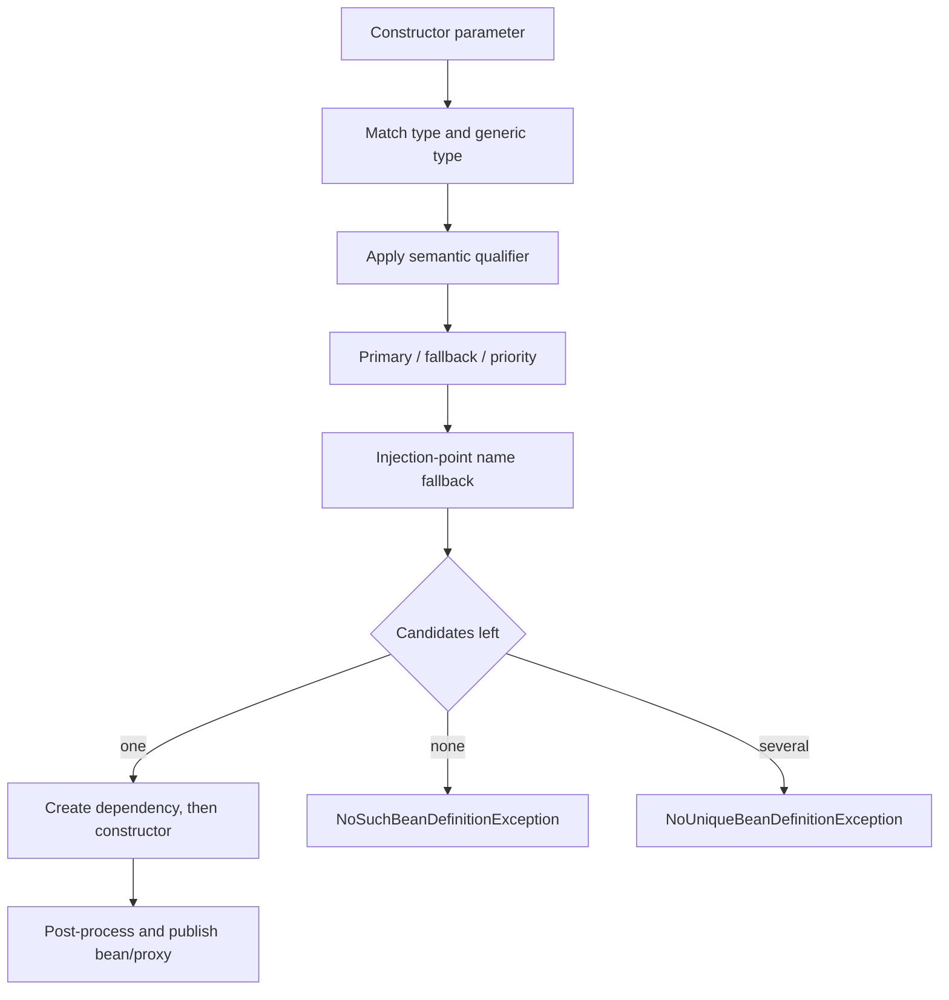

# Spring Dependency Injection And Bean Resolution

<DocLabels items={[
  {label: 'Intermediate', tone: 'intermediate'},
  {label: 'Dependency resolution', tone: 'foundation'},
  {label: 'Startup diagnostics', tone: 'production'},
  {label: 'Shopverse examples', tone: 'shopverse'},
]} />

Dependency injection makes the constructor the ownership contract. Spring resolves
that contract from registered bean definitions and publishes the resulting bean or
proxy through the application context.



## Bean Definition Versus Instance

A bean definition records class/factory, scope, constructor arguments, qualifiers,
lazy behavior, and lifecycle metadata. Component scanning, `@Bean` methods,
imports, and auto-configuration register definitions before normal singleton
instances are created.

Use stereotypes for application-owned classes and `@Bean` for third-party objects
or explicit infrastructure construction:

```java
@Configuration(proxyBeanMethods = false)
class TimeConfiguration {
    @Bean
    Clock applicationClock() {
        return Clock.systemUTC();
    }
}
```

### `BeanFactory`, `ApplicationContext`, And `FactoryBean`

These similarly named types answer different questions:

| Type | Responsibility |
| --- | --- |
| `BeanFactory` | foundational registry, lookup, scope, dependency-resolution, and creation contract |
| `ApplicationContext` | normal application container built on `BeanFactory`, adding automatic processor discovery, lifecycle coordination, events, resources, messages, and environment integration |
| `FactoryBean<T>` | a container-managed extension that creates another object of type `T` |
| `@Bean` | configuration metadata marking a Java factory method whose return value becomes a bean |

Use an `ApplicationContext` for ordinary applications. A bare
`DefaultListableBeanFactory` does not automatically discover and activate all the
post-processors that enable familiar annotation and AOP behavior; framework
integration code that chooses it must bootstrap those facilities explicitly.

For a `FactoryBean` named `client`, `getBean("client")` returns its product while
`getBean("&client")` returns the factory object. This product/factory distinction is
unrelated to `@Bean`, despite the similar words. Prefer a regular `@Bean` factory
method for straightforward application configuration; use `FactoryBean` when a
reusable container extension needs specialized object-creation semantics or type
prediction.

## Constructor Injection

```java
@Service
@RequiredArgsConstructor
class InventoryServiceImpl {
    private final InventoryItemRepository itemRepository;
    private final InventoryProperties properties;
    private final OutboxService outboxService;
}
```

With one constructor, `@Autowired` is unnecessary. Required constructor arguments
stay explicit, can be `final`, and allow a plain unit test to construct the class.
Too many parameters are useful design pressure to reduce responsibilities.

### How Spring Selects A Constructor

- A bean class with one constructor uses it without requiring `@Autowired`.
- With several constructors, one constructor may declare required `@Autowired` and
  becomes the selected constructor.
- If several constructors declare `@Autowired(required = false)`, Spring chooses the
  greediest constructor whose dependencies can be satisfied.
- If no annotated candidate is satisfiable, a primary/default constructor is the
  fallback when one exists; otherwise creation fails.

```java
@Component
final class ReportService {
    private final ReportRepository repository;
    private final AuditPublisher auditPublisher;

    @Autowired
    ReportService(ReportRepository repository, AuditPublisher auditPublisher) {
        this.repository = repository;
        this.auditPublisher = auditPublisher;
    }

    ReportService(ReportRepository repository) {
        throw new IllegalStateException("Not selected by the container");
    }
}
```

Do not use overloaded constructors to hide optional business dependencies. Prefer
one unambiguous constructor and express optionality with `Optional<T>`, a nullable
contract, or `ObjectProvider<T>` when deferred/repeated lookup is intentional.

### `@Autowired`, `@Inject`, And `@Resource`

| Annotation | Resolution model | Important distinction |
| --- | --- | --- |
| Spring `@Autowired` | primarily type, then qualifiers and candidate ranking | supports Spring-specific optional/required semantics and constructor selection |
| Jakarta `@Inject` | type with qualifier support | portable JSR-330 form; no `required` attribute |
| Jakarta `@Resource` | explicit or inferred bean name, with type fallback in supported cases | supported on fields and setter methods, not constructor injection |

All three are processed by container post-processors, so they work only on
container-managed instances and are not available inside the post-processor types
responsible for applying them. Constructor injection with one clear constructor is
the normal application default. Use `@Resource(name = "...")` only when a bean-name
contract is intentional rather than as an accidental substitute for a qualifier.

<DocCallout type="shopverse" title="Current Shopverse pattern">

Inventory, Order, Payment, and recovery services use constructor injection, often
through Lombok `@RequiredArgsConstructor`. Their repositories, typed properties,
clients, and outbox collaborators are visible in the class contract. This is current
code.

</DocCallout>

Field injection hides required collaborators and forces reflection or a Spring
context in unit tests. Setter injection is appropriate only when mutability or an
optional collaborator is an intentional class contract.

## Bean Creation, Initialization, And Injection Order

“Order” can refer to several different container contracts. Choose the mechanism
that expresses the real requirement:

| Requirement | Mechanism | What it guarantees |
| --- | --- | --- |
| `BeanB` needs `BeanA`, and `BeanC` needs `BeanB` | constructor injection | each dependency is available before its dependent is constructed |
| independent beans have a lifecycle-only prerequisite | `@DependsOn` | named prerequisites initialize before the dependent bean |
| several implementations form a strategy chain | `@Order` or `Ordered` | their positions at supported ordered injection/processing points |
| startup actions must execute sequentially after context creation | `ApplicationRunner` or `CommandLineRunner` with `@Order` | runner invocation order, not general bean construction order |

Bean-definition registration order is not a public bean-instantiation contract.
Component scanning, configuration parsing, and auto-configuration ordering decide
which definitions exist; they do not provide a general A-then-B-then-C singleton
creation guarantee.

### Prefer Real Dependencies

When the classes actually collaborate, make that relationship explicit:

```java
@Component
final class BeanA {
}

@Component
final class BeanB {
    private final BeanA beanA;

    BeanB(BeanA beanA) {
        this.beanA = beanA;
    }
}

@Component
final class BeanC {
    private final BeanB beanB;

    BeanC(BeanB beanB) {
        this.beanB = beanB;
    }
}
```

To construct `BeanC`, Spring resolves `BeanB`; to construct `BeanB`, it resolves
`BeanA`. The dependency path therefore produces `BeanA -> BeanB -> BeanC`. This is
stronger and safer than an incidental startup sequence because the constructors
state why the order exists. Lazy beans, scoped proxies, and non-singleton scopes can
change when an instance is created, but not the declared dependency relationship.

### Use `@DependsOn` For A Lifecycle-Only Prerequisite

Sometimes `BeanB` does not call `BeanA`, but `BeanA` must initialize infrastructure
before `BeanB` runs its lifecycle callback. Declare that exceptional lifecycle
constraint explicitly:

```java
@Configuration(proxyBeanMethods = false)
class OrderedLifecycleConfiguration {
    @Bean("beanA")
    BeanA beanA() {
        return new BeanA();
    }

    @Bean("beanB")
    @DependsOn("beanA")
    BeanB beanB() {
        return new BeanB();
    }

    @Bean("beanC")
    @DependsOn("beanB")
    BeanC beanC() {
        return new BeanC();
    }
}
```

When `beanC` is initialized, Spring initializes `beanA`, then `beanB`, then `beanC`.
For singleton destruction, Spring reverses the dependency relationship: dependents
are destroyed before the beans they depend on. `@DependsOn` uses bean names and does
not inject references, define business-call order, serialize concurrent work, or
replace an actual constructor dependency. Renaming a referenced bean without
updating the annotation also turns the relationship into a startup failure.

<DocCallout type="mistake" title="Do not use @Order as @DependsOn">

Adding `@Order(1)` to `BeanA`, `@Order(2)` to `BeanB`, and `@Order(3)` to `BeanC`
does not guarantee that Spring constructs them in that sequence. `@Order` has an
effect only where a Spring extension point or an injection point applies an ordering
contract.

</DocCallout>

### `@Order` Orders An Injected Chain

For example, the annotation orders the elements supplied to `List<CheckoutStep>`:

```java
interface CheckoutStep {
    void execute();
}

@Component
@Order(1)
final class ValidateCart implements CheckoutStep {
    public void execute() { /* validate */ }
}

@Component
@Order(2)
final class PriceCart implements CheckoutStep {
    public void execute() { /* price */ }
}

@Component
final class CheckoutPipeline {
    private final List<CheckoutStep> steps;

    CheckoutPipeline(List<CheckoutStep> steps) {
        this.steps = List.copyOf(steps);
    }
}
```

`steps` contains `ValidateCart` before `PriceCart`. Both beans must be available to
construct `CheckoutPipeline`, but their relative instantiation order is not the
contract. For a single-valued injection, use `@Qualifier` to select a semantic
candidate or `@Primary` to select the default; neither annotation controls creation
order.

### Keep Lifecycle Work At The Right Boundary

Constructors should establish object invariants, not perform remote calls, start
threads, or depend on the whole application being ready. Use lifecycle callbacks
such as `@PostConstruct` only for local bean initialization. Use an ordered runner
when application startup work must run after the context has been created, and use
an application readiness event or `SmartLifecycle` when the requirement is tied to
a specific application lifecycle phase. Ordering callbacks does not make business
operations atomic or safe under concurrency; those guarantees require an explicit
coordination design.

## Multiple Candidates

Use a semantic qualifier when the caller requires one strategy:

```java
CheckoutService(@Qualifier("card") PaymentGateway paymentGateway) {
    this.paymentGateway = paymentGateway;
}
```

Use `@Primary` for the normal application-wide choice. Spring Framework also
supports `@Fallback` for candidates selected only when no regular candidate remains.
Do not depend on an accidental parameter-name match when the distinction is a
business decision.

<DocCallout type="code" title="Illustrative, not current Shopverse wiring">

Shopverse currently has one injected `PaymentProvider` implementation. A future
card/wallet provider set should introduce semantic qualifiers or a router only when
multiple implementations actually exist.

</DocCallout>

## Collections And Strategy Chains

Inject a collection when every implementation participates:

```java
FraudEngine(List<FraudRule> rules) {
    this.rules = List.copyOf(rules);
}
```

`@Order` or `Ordered` controls collection order, not general singleton startup
order. A `Map<String, PaymentGateway>` uses bean names as keys; translate them to a
domain enum/configuration rather than exposing arbitrary bean names to request input.

Generic type arguments also narrow candidates, such as `Handler<OrderCommand>`
versus `Handler<PaymentCommand>`.

## Optional And Deferred Resolution

```java
OptionalAudit(ObjectProvider<AuditPublisher> publisher) {
    this.publisher = publisher;
}

void record(AuditEvent event) {
    publisher.ifAvailable(value -> value.publish(event));
}
```

`ObjectProvider` expresses optional, ordered-stream, or deferred lookup without
injecting `ApplicationContext` as a service locator. `@Lazy` can defer an expensive
dependency through a proxy. Neither should hide a required missing bean or routine
circular design.

### `@Lookup` Method Injection

`@Lookup` lets the container override a method so each call resolves a bean, often a
prototype from a singleton:

```java
@Component
abstract class ExportCoordinator {
    ExportResult export(ExportRequest request) {
        return workspace().render(request);
    }

    @Lookup
    protected abstract ExportWorkspace workspace();
}
```

The container generates a subclass, so neither the class nor lookup method can be
`final`. It also cannot apply lookup-method injection to an instance returned by an
`@Bean` factory method because Spring did not instantiate that object through the
subclassing path. Prefer `ObjectProvider<ExportWorkspace>` when explicit lookup is
clearer and easier to unit test; use `@Lookup` for a deliberate method-injection
contract rather than general service location.

## Circular Dependencies

Constructor cycles cannot be built:

```text
OrderService -> PaymentService -> OrderService
```

Resolve ownership with a coordinator, event, narrower interface, or extracted
collaborator. Enabling circular references or switching to field injection hides the
problem and risks partially initialized identity/proxy behavior.

<DocCallout type="mistake" title="A lazy proxy is not a general cycle fix">

Use deferred lookup only when delayed availability is part of the design. If both
services own each other synchronously, change the boundary.

</DocCallout>

## Diagnostic Evidence

For a startup failure, capture:

- the exact injection point, required type, and generic arguments;
- candidate bean names, qualifiers, primary/fallback markers, and conditions;
- component-scan/import boundaries and condition evaluation report;
- whether a bean was created too early or replaced by test configuration;
- the dependency cycle path from the root exception.

Use `ApplicationContextRunner` or a focused `@SpringBootTest` for wiring behavior.
Use direct construction for service logic. A context-load test should assert the
selected implementation, not merely that startup succeeded.

```java
new ApplicationContextRunner()
        .withUserConfiguration(PaymentConfiguration.class)
        .run(context -> assertThat(context)
                .hasSingleBean(PaymentGateway.class));
```

## Interview Questions

<ExpandableAnswer title="How does Spring choose between two beans of the same interface?">

It begins with type/generic matching, narrows by qualifiers, applies primary or
fallback/priority rules, and can use the injection-point name as a final fallback.
Ambiguity should be resolved semantically rather than accidentally.

</ExpandableAnswer>

<ExpandableAnswer title="Why is constructor injection easier to test?">

The dependency contract is ordinary Java. A unit test passes mocks/fakes directly
without reflection or a Spring context and cannot create an instance missing a
required argument.

</ExpandableAnswer>

<ExpandableAnswer title="When should ObjectProvider be used instead of Optional?">

When lookup must be deferred, ordered, streamed, or performed only if available.
Use `Optional` when one eager optional value is the entire contract.

</ExpandableAnswer>

<ExpandableAnswer title="Why does @Order not guarantee bean startup order?">

It orders matching elements at ordered injection/processing points. Startup order
comes from actual dependency relationships and explicit lifecycle semantics.

</ExpandableAnswer>

<ExpandableAnswer title="What is the architectural fix for a constructor cycle?">

Move coordination to a third owner, publish an event, narrow/reverse one dependency,
or pass data as a method argument. The goal is unidirectional ownership.

</ExpandableAnswer>

## Official References

- [Spring dependency injection](https://docs.spring.io/spring-framework/reference/core/beans/dependencies/factory-collaborators.html)
- [Spring `BeanFactory` and `ApplicationContext`](https://docs.spring.io/spring-framework/reference/core/beans/beanfactory.html)
- [Spring container extension points and `FactoryBean`](https://docs.spring.io/spring-framework/reference/core/beans/factory-extension.html)
- [Spring `depends-on` initialization and destruction semantics](https://docs.spring.io/spring-framework/reference/core/beans/dependencies/factory-dependson.html)
- [Autowired resolution](https://docs.spring.io/spring-framework/reference/core/beans/annotation-config/autowired.html)
- [Jakarta `@Resource` injection](https://docs.spring.io/spring-framework/reference/core/beans/annotation-config/resource.html)
- [Lookup method injection](https://docs.spring.io/spring-framework/reference/core/beans/dependencies/factory-method-injection.html)
- [Spring `@Order` contract](https://docs.spring.io/spring-framework/docs/current/javadoc-api/org/springframework/core/annotation/Order.html)
- [Qualifiers](https://docs.spring.io/spring-framework/reference/core/beans/annotation-config/autowired-qualifiers.html)
- [Generic autowiring qualifiers](https://docs.spring.io/spring-framework/reference/core/beans/annotation-config/generics-as-qualifiers.html)
- [Spring Boot runners and application lifecycle](https://docs.spring.io/spring-boot/reference/features/spring-application.html)

## Recommended Next

Continue with [Autowiring And Circular Reference Internals](./AUTOWIRING-CIRCULAR-REFERENCE-INTERNALS.md),
then [Bean Scopes And Lifecycle](./BEAN-SCOPES-LIFECYCLE.md).
