# Spring Bean Lifecycle, Garbage Collection, And Static References

<DocLabels items={[{label: 'Spring internals', tone: 'advanced'}, {label: 'JVM reachability', tone: 'intermediate'}, {label: 'Memory diagnosis', tone: 'production'}]} />

Spring does not have a separate garbage collector. It creates and retains ordinary Java objects;
the JVM collector decides whether those objects are reachable. Spring controls lifecycle callbacks
and reference ownership, while GC controls memory reclamation.

## How Spring Creates And Publishes A Bean

```mermaid
flowchart LR
  Scan["Configuration / scanning"] --> Definition["BeanDefinition"]
  Definition --> Instantiate["Constructor or factory method"]
  Instantiate --> Inject["Resolve and inject dependencies"]
  Inject --> Init["Aware + before processors + PostConstruct"]
  Init --> Proxy["after processors may create proxy"]
  Proxy --> Registry["scope stores published bean"]
  Registry --> Consumers["injection and lookups"]
```



For a normal singleton, the application context's bean factory stores the published instance or
proxy in its singleton registry. That strong reference makes the bean reachable for the context's
lifetime. Dependencies referenced by the bean remain reachable as part of the same object graph.

## Bean Definition, Target, And Proxy

| Concept | Meaning |
|---|---|
| bean definition | metadata and factory instructions; not the application object |
| target | actual object containing business methods and state |
| proxy | published wrapper applying transactions, security, caching, async, or scoped lookup |
| singleton registry | strong references to published singleton beans |
| scope storage | owner of request, session, or custom-scoped instances |

An injection point commonly receives a proxy, not the raw target. GC follows both: consumer to
proxy, proxy/advisor to target, and context to proxy infrastructure.

## Scope And GC Eligibility

| Scope | Who retains it? | Normally eligible for GC when |
|---|---|---|
| singleton | application context / bean factory | context closes and no other strong reference remains |
| prototype | caller after Spring creates it | caller and all other owners release it |
| request | request scope storage | request completes and scope clears it |
| session | HTTP session | session expires/invalidates and other references disappear |
| application | servlet application context | web application/context is destroyed |

Eligibility is not immediate collection. The collector runs according to allocation pressure and
collector policy. Neither scope end nor `System.gc()` guarantees a specific reclamation time.

## Destruction Is Not Garbage Collection

`@PreDestroy`, `DisposableBean`, inferred close methods, and lifecycle stop callbacks are invoked by
an orderly Spring context shutdown. GC does not call `@PreDestroy`, and `@PreDestroy` does not free
memory by itself.

```java
@Component
final class OwnedExecutor implements AutoCloseable {
    private final ExecutorService executor = Executors.newFixedThreadPool(4);

    @Override
    @PreDestroy
    public void close() {
        executor.shutdown();
    }
}
```

Forced process termination can skip callbacks. Cleanup must be bounded and idempotent; correctness
must not depend on a finalizer or an eventual GC cycle.

<ExpandableAnswer title="Dry run: singleton bean during shutdown">

1. `ApplicationContext` strongly references `DefaultSingletonBeanRegistry`.
2. The registry references `paymentService` (possibly a proxy), so the bean is not collectible.
3. Shutdown stops new work and invokes destruction callbacks in dependency-aware order.
4. The context clears singleton caches and releases infrastructure.
5. The bean becomes GC eligible only if no static field, running thread, callback, cache, listener,
   `ThreadLocal`, native handle, or external owner still references it.
6. A later JVM collection may reclaim it. GC timing is independent from callback completion.

</ExpandableAnswer>

## Prototype Beans And Resource Ownership

Spring instantiates and initializes a prototype but does not manage its complete destruction. A
prototype injected directly into a singleton is still created only once at singleton construction.

```java
final class ExportService {
    private final ObjectProvider<ExportWorkspace> workspaces;

    ExportService(ObjectProvider<ExportWorkspace> workspaces) {
        this.workspaces = workspaces;
    }

    Export export() {
        try (ExportWorkspace workspace = workspaces.getObject()) {
            return workspace.render();
        }
    }
}
```

The caller owns closing resources and releasing references. GC can reclaim Java memory but is not a
safe mechanism for releasing sockets, files, database connections, locks, or executor threads.

## How Static Variables Affect GC

A static field belongs to its `Class`, not a Spring bean instance. In a normally loaded application,
the class and its class loader are reachable, so objects referenced by static fields usually remain
reachable for the class-loader lifetime.

```java
final class BadRegistry {
    static final Map<String, Object> CACHE = new ConcurrentHashMap<>();
}
```

`final` prevents assigning another map; it does not stop entries being added forever. Static
collections, singleton holders, callbacks, and caches can retain entire bean graphs after a context
restart. A class and its static fields can be unloaded only when its defining class loader and all
its classes/instances are unreachable and class unloading occurs.

<DocCallout type="mistake" title="Never store the ApplicationContext or beans in static fields">

Static application-context holders hide dependencies, complicate tests, bypass lifecycle ownership,
and can retain old contexts during reload or redeployment. Constructor-inject the dependency or pass
the required value explicitly.

</DocCallout>

## Other Common Retention Paths

| Retainer | Why it leaks | Fix |
|---|---|---|
| running thread/executor | thread stack or task queue references bean/request data | stop owned executors; bound and drain queues |
| `ThreadLocal` | pooled thread outlives request | remove in `finally`; use supported context propagation |
| event listener/callback | publisher retains subscriber | unregister or let the container own both lifecycles |
| unbounded cache/map | keys and values never expire | maximum size, expiry, metrics, explicit ownership |
| scheduler | recurring task captures target | cancel on shutdown and avoid capturing request objects |
| session scope | large session or no expiry | minimize session state and enforce expiry |
| class-loader mismatch | parent/shared code retains app classes | remove static registries, drivers, threads, and MBeans on undeploy |
| native/direct memory | heap object owns off-heap allocation | monitor native memory and close the owning API |

## Weak, Soft, And Phantom References

Do not reach for reference types before fixing ownership.

- `WeakReference` does not keep a referent alive and can support canonical maps with careful cleanup.
- `SoftReference` collection depends on memory pressure and is unsuitable for predictable cache policy.
- `PhantomReference` plus a queue supports post-mortem cleanup coordination but is advanced and does
  not replace deterministic resource closing.
- A `WeakHashMap` weakens keys, not necessarily values; a value that references its key can defeat
  the intended release.

## Safe Injection And Publication

Constructor injection establishes required references before normal use and makes dependencies
visible. Do not publish `this` from a constructor or `@PostConstruct`. Bean post-processors may
publish a proxy after initialization, so self-registration can leak the raw target and bypass
transactions, caching, security, or async behavior.

Spring singleton scope does not mean thread-safe. Keep singleton bean fields immutable or safely
synchronized, and keep request/customer state in method arguments or durable stores.

## Diagnosing A Suspected Bean Memory Leak

1. Prove sustained post-GC growth; do not infer a leak from a large heap alone.
2. Compare live-set size after equivalent full/concurrent cycles under stable workload.
3. Capture class histogram and heap dump near a safe threshold.
4. Find dominator tree and retained size for the growing class.
5. Follow the shortest path to a GC root.
6. Classify the root: static, thread, `ThreadLocal`, context registry, cache, class loader, JNI.
7. Fix the owning reference or lifecycle; do not merely increase heap.
8. repeat the workload and prove the live set reaches a stable plateau.

```bash
jcmd <pid> GC.class_histogram
jcmd <pid> GC.heap_dump /safe/path/heap.hprof
jcmd <pid> VM.native_memory summary
```

Heap dumps can contain secrets and customer data. Restrict access, capture only under an approved
runbook, transfer securely, and delete according to retention policy.

## Code Explanation: A Static Leak

<ExpandableAnswer title="Why does this bean survive a closed context?">

```java
@Component
final class PriceService {
    @PostConstruct
    void register() {
        GlobalCallbacks.handlers.add(this::refresh);
    }
}
```

The static `handlers` list is reachable through its class. The method reference retains the
`PriceService` target, which may retain repositories, clients, pools, and the old application graph.
Closing the context cannot remove a reference owned by `GlobalCallbacks`. Replace the static
registry with a container-owned collaborator or return an unregister handle and invoke it during
orderly destruction.

</ExpandableAnswer>

## Interview Questions

<ExpandableAnswer title="Can Spring singleton beans be garbage collected while the context is running?">

Normally no, because the singleton registry strongly references them. A scoped target or temporary
object may be collectible, but a registered singleton remains reachable until the context releases
it and no other strong references remain.

</ExpandableAnswer>

<ExpandableAnswer title="Does Spring call GC when a bean is destroyed?">

No. Spring invokes lifecycle callbacks and removes owned references. The JVM independently decides
when to collect objects that have become unreachable.

</ExpandableAnswer>

<ExpandableAnswer title="Are static variables stored permanently?">

Not absolutely, but they normally live as long as their defining class loader. Their referenced
objects remain reachable until the field is cleared or the entire class loader becomes collectible.
Static mutable collections are therefore a frequent retention source.

</ExpandableAnswer>

<ExpandableAnswer title="Why can a prototype bean leak resources even after it is unreachable?">

Spring does not manage full prototype destruction, and GC only reclaims memory. The consumer must
deterministically close files, sockets, executors, or other owned resources.

</ExpandableAnswer>

## Official References

- [Spring bean lifecycle](https://docs.spring.io/spring-framework/reference/core/beans/factory-nature.html)
- [Spring bean scopes](https://docs.spring.io/spring-framework/reference/core/beans/factory-scopes.html)
- [Spring dependency injection](https://docs.spring.io/spring-framework/reference/core/beans/dependencies/factory-collaborators.html)
- [Java reachability](https://docs.oracle.com/en/java/javase/25/docs/api/java.base/java/lang/ref/package-summary.html)
- [Java final-field semantics](https://docs.oracle.com/javase/specs/jls/se25/html/jls-17.html#jls-17.5)
- [`jcmd`](https://docs.oracle.com/en/java/javase/25/docs/specs/man/jcmd.html)

## Recommended Next

Continue with [Spring Autowiring And Circular Reference Internals](./AUTOWIRING-CIRCULAR-REFERENCE-INTERNALS.md)
and [JVM Profiling, GC, And Native Memory](../../java/JVM-PROFILING-GC-NATIVE.md).
