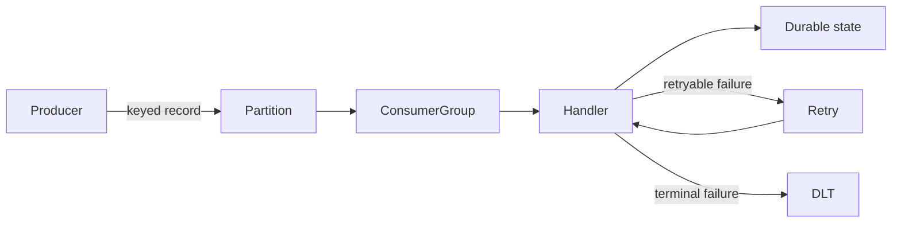

# Apache Kafka And Spring Kafka Revision Sheet

## Kafka Delivery Path



Use after the [Kafka Architect Overview](./KAFKA-ARCHITECT-OVERVIEW.md).

## One-Line Recall

| Concept | Revision answer |
|---|---|
| partition | Ordered log and primary parallelism/ownership unit. |
| offset | Position inside one partition, not a business acknowledgment. |
| consumer group | Members divide partitions for one logical subscription. |
| ISR | Replicas caught up enough for normal leadership and durability policy. |
| high watermark | Replicated visibility boundary for non-transactional committed records. |
| last stable offset | `read_committed` visibility boundary with transactions. |
| KRaft | Replicated metadata quorum replacing ZooKeeper. |
| idempotent producer | Prevents supported producer-retry duplicates in Kafka. |
| Kafka transaction | Atomically commits Kafka records and consumed offsets. |
| lag | Distance/age between available data and group progress. |

## Producer Recall

```text
serialize -> partition -> accumulator/batch -> sender -> leader
-> replication/acknowledgment -> future/callback
```

Know `acks`, minimum ISR, idempotence, retries, batch size, linger, compression,
buffer memory, maximum block time, delivery timeout, request size, producer identity,
sequence numbers, epochs, transactions, and fencing.

## Consumer Recall

```text
join group -> assignment -> fetch/poll -> process -> commit -> repeat
```

Know poll records/interval, session and heartbeat behavior, fetch sizing, assignment
strategies, static membership, cooperative rebalancing, offset reset, pause/resume,
seek, replay, and shutdown. Kafka consumers are not thread-safe.

## Spring Kafka Recall

| Component | Responsibility |
|---|---|
| `KafkaTemplate` | publishing and local transactional operations |
| listener container | poll ownership, conversion, invocation, commit, recovery, events, shutdown |
| `DefaultErrorHandler` | blocking retry and record recovery |
| retry topics | non-blocking delayed delivery with ordering trade-off |
| DLT recoverer | terminal publication with original failure metadata |
| transaction manager | Kafka transactional resource integration |

Non-blocking retry topics do not support batch listeners or container transactions.
Manual acknowledgment does not make business effects exactly once.

## Scenario Answers

**Lag rising:** split by partition; compare arrival/processing/commit rates; inspect
latency, retries, pools, GC, rebalances, poll budget, assignment, and skew. Scale the
actual bottleneck and calculate catch-up before retention.

**Duplicate:** expected after effect succeeds and commit fails. Protect the effect
with inbox/unique event identity, transactional state change, and external
idempotency keys.

**Ordering:** key by required business identity and preserve same-partition serial
processing. Account for partition increases, retry topics, replay, and async work.

**Broker failure:** eligible ISR replica becomes leader; clients refresh metadata.
Outcome depends on ISR, replication, acknowledgments, minimum ISR, election policy,
and timeouts.

## Core Kafka Interview Questions

### How do topic, partition, offset, replica, ISR, and leader relate?

A topic is a named log split into partitions. Each partition has an ordered sequence
of offsets, one leader serving reads/writes, and follower replicas. ISR is the set of
replicas caught up enough for the configured replication and election rules; it is
not the same as every configured replica.

### What does KRaft replace, and what happens when its quorum is unavailable?

KRaft replaces ZooKeeper with a replicated metadata log managed by controller
quorum voters. Brokers can continue some data-plane work during short controller
disruption, but metadata changes and elections requiring controller decisions cannot
progress without quorum. Keep controller failure domains and voters deliberate.

### How do `acks`, replication factor, ISR, and `min.insync.replicas` compose?

Replication factor defines copy count. With `acks=all`, the leader enforces the ISR
acknowledgment condition; `min.insync.replicas` rejects writes when too few ISR
members remain. A common RF=3/min-ISR=2 policy chooses durability over write
availability after enough replica loss.

### What does producer idempotence guarantee?

It suppresses duplicate appends caused by supported retries from one producer
session by using producer IDs, epochs, and per-partition sequence numbers. It does
not deduplicate an application creating and sending the same business command again,
nor does it make an external database effect exactly once.

### How do batching, linger, compression, and buffer pressure trade off?

Larger batches and a small linger can improve throughput and compression at the cost
of queueing latency. If production exceeds delivery, the accumulator reaches
`buffer.memory` and sends can block up to `max.block.ms`. Bound `delivery.timeout.ms`,
observe buffer exhaustion, and apply admission control instead of allowing unbounded
caller buildup.

### What ordering does Kafka guarantee?

Kafka orders records only within a partition. Use a stable business key when events
for one aggregate must share that partition, keep processing/commit completion
ordered, and account for retry topics, replay, asynchronous workers, and partition
count changes. Kafka provides no global topic order.

### Why do hot partitions occur, and how are they fixed?

Skewed keys, a dominant tenant, or low-cardinality routing can overload one partition
while others are idle. Confirm per-key/partition rates, then consider a better shard
key, bounded key salting with downstream merge logic, tenant isolation, quotas, or
an aggregate redesign without discarding required order.

### How do consumer groups and rebalances work?

Within a group, one partition is assigned to at most one member at a time. Membership
or subscription changes trigger reassignment. Cooperative assignment reduces
movement and static membership reduces restart churn, but neither fixes poll-budget
violations, network instability, or unsafe revoke/commit handling.

### Why does adding consumers sometimes add no throughput?

Effective parallelism is bounded by assigned partitions and then by the actual
bottleneck. Consumers beyond the partition count are idle; adding consumers also
cannot fix a hot partition, a saturated database, retry storms, or insufficient
broker/network capacity.

### What is the `max.poll.interval.ms` failure boundary?

The consumer must call `poll()` within the configured interval or the group can
revoke its partitions. Long processing, blocking retries, GC pauses, or an unbounded
worker handoff can cross that boundary. Size the poll batch and processing budget,
pause safely, or use bounded workers with contiguous completion tracking.

### Auto commit, synchronous commit, asynchronous commit, or manual acknowledgment?

All advance group progress; none proves an external business effect. Auto commit is
time-driven around poll progress. Sync commit reports failure directly but blocks;
async commit needs monotonic callback/error handling. Spring acknowledgment mode
controls when the container commits, not end-to-end exactly-once behavior.

### At-most-once, at-least-once, and exactly-once in Kafka?

Commit before the effect risks loss and approximates at-most-once; effect before
commit permits redelivery and is at-least-once. Kafka transactions can atomically
commit consumed offsets and produced Kafka records, and `read_committed` hides
aborted output. External HTTP/database effects still require their own idempotency,
outbox/inbox, or reconciliation boundary.

### Blocking retry, retry topic, DLT, or replay?

Use short blocking retry for transient failures that are likely to clear within the
poll budget. Retry topics free the original partition but trade away strict ordering.
A DLT quarantines terminal records; it is not completion. Replay must be authorized,
idempotent, audited, rate-limited, schema-compatible, and isolated from live traffic.

### How should poison pills and deserialization failures be handled?

Deserialization can fail before listener business code runs. Preserve raw bytes and
headers where policy allows, classify schema/configuration versus corrupt input,
route through an error-handling deserializer/recoverer, alert the owning producer,
and never create an infinite partition-blocking retry loop.

### Retention versus log compaction?

Time/size retention removes old log segments. Compaction eventually retains the
latest value per key while preserving offsets and may retain multiple versions until
cleaning runs; tombstones represent deletion and are themselves retained for a
configured window. Neither is an immediate record-by-record delete guarantee.

### How should event schemas evolve?

Define compatibility policy and test the deployed producer-consumer version matrix.
Prefer additive optional fields, stable meaning and units, explicit defaults, and a
controlled migration for breaking changes. A schema registry enforces configured
structural compatibility, not business-semantic correctness.

### What does consumer lag miss?

Offset lag does not show record age, business completion, retry/DLT backlog, a stuck
hot partition hidden by group totals, or an idle producer. Combine per-partition lag
and oldest-record age with arrival/completion rates, processing latency, rebalances,
errors, commits, and domain reconciliation evidence.

### How do Kafka security and multi-tenancy work?

TLS protects transport, SASL authenticates principals, and ACLs authorize topic,
group, cluster, and transactional-ID operations. Use workload identities, least
privilege, secret rotation, quotas, audited administration, and avoid sensitive data
in payloads, headers, topic names, keys, or metrics labels.

### What must a regional Kafka failover plan cover?

Asynchronous replication normally means non-zero RPO and does not preserve one
global order. Define failover authority, replicated topics/configs/schemas, offset
translation, write fencing, consumer startup, duplicate reconciliation, RTO, and
failback. Test the plan rather than treating MirrorMaker 2 as automatic disaster
recovery.

### How do Kafka Streams state stores recover?

Local state stores are backed by changelog topics; tasks restore state when placed
on another instance. Repartition topics support changed key/grouping boundaries,
and standby replicas can reduce recovery time at additional storage/network cost.
Capacity restore throughput and retained changelog data to the application RTO.

## Operations Checklist

- topic owner, key, schema, partitions, replication, retention, ACLs and quotas;
- controller quorum, offline/under-replicated partitions, ISR and disk;
- producer errors/retries/latency/buffer and consumer lag/rebalances/commit;
- retry/DLT ownership and audited replay;
- compatible rolling upgrade, credential rotation, and regional recovery.

## Final Checklist

- distinguish storage, visibility, group progress, and business completion;
- explain producer and consumer internals;
- calculate partitions, storage, throughput, and catch-up;
- preserve required order while handling failure;
- apply transactions, inbox, outbox, and CDC at correct boundaries;
- secure, monitor, upgrade, replay, and recover the platform.

Practice with the [Kafka Architect Labs](./kafka/KAFKA-ARCHITECT-LABS.md).

## Official References

- [Apache Kafka documentation](https://kafka.apache.org/documentation/)
- [Apache Kafka design](https://kafka.apache.org/documentation/#design)
- [Apache Kafka producer configuration](https://kafka.apache.org/40/configuration/producer-configs/)
- [Apache Kafka topic configuration](https://kafka.apache.org/40/configuration/topic-level-configs/)
- [Spring for Apache Kafka reference](https://docs.spring.io/spring-kafka/reference/)
