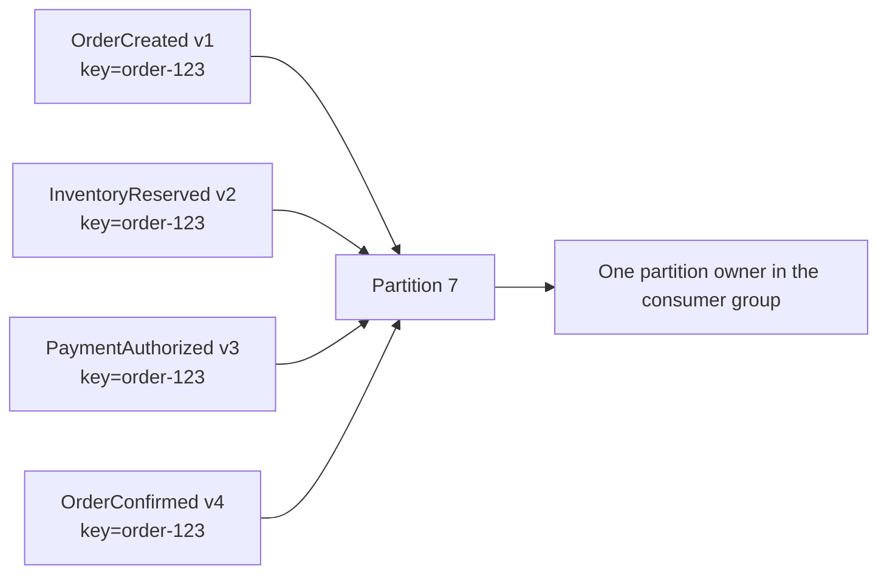
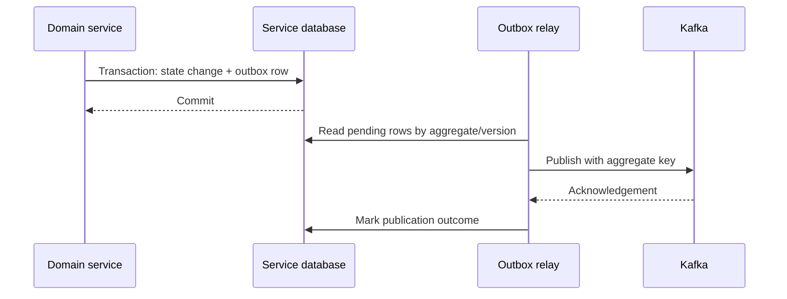
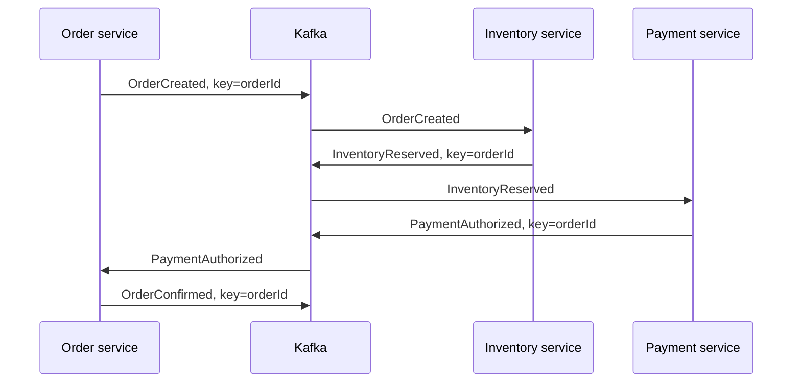

# Kafka Consumer Groups Rebalancing And Ordering

## Group Runtime

A group coordinator manages membership and committed offsets. Consumers join a
generation, receive partition assignments, maintain liveness, and rejoin when
membership or subscribed partitions change.

```text
bootstrap metadata
 -> locate coordinator
 -> join group
 -> assign/synchronize partitions
 -> fetch, process, commit, heartbeat
 -> rebalance on membership/assignment change
```

The classic protocol separates heartbeat/session liveness from the maximum delay
between polls. Newer consumer group protocol behavior is broker-coordinated and
must be adopted only with compatible brokers, clients, and rollout tests.

## Liveness Timers

| Setting | Question answered |
|---|---|
| session timeout | how long can the group miss liveness before eviction? |
| heartbeat interval | how frequently does classic membership report liveness? |
| max poll interval | how long may application processing delay the next poll? |
| max poll records | how much work can one poll expose to the application? |

Increasing the poll interval hides symptoms if the handler is unbounded. First
bound database/HTTP calls, retries, records per poll, and in-flight work.

## Assignment Strategies

- range assignment can create imbalance across multiple topics;
- round-robin distributes broadly but may move more partitions;
- sticky strategies try to balance while retaining ownership;
- cooperative assignment reduces stop-the-world movement by transferring
  partitions incrementally;
- static membership (`group.instance.id`) reduces churn from short restarts but
  requires unique, correctly managed instance identities.

Assignment choice affects movement and pause time, not business idempotency.

## Rebalance Storm Diagnosis

Look for repeated revoke/assign events, poll interval violations, authentication
resets, pod restarts, unstable network/DNS, duplicate static IDs, autoscaler
oscillation, and deployments that replace too many replicas at once.

Contain by stabilizing membership, reducing poll work, bounding retries, using
graceful shutdown/readiness, controlling rollout surge, and verifying protocol
compatibility. Avoid repeatedly scaling a group every few seconds from noisy lag.

## Ordering Boundary

Kafka orders records only within one partition. Select the key from the smallest
business scope that requires serialization:

```text
order lifecycle -> orderId
account ledger -> accountId
tenant-global order -> tenantId (may become hot)
```

Unkeyed or changing keys sacrifice that guarantee. Global topic ordering requires
one partition and usually rejects useful scalability.

The practical rule is: events that require ordering must use the same topic,
partition, and stable business key. Kafka does not provide ordering across
partitions, topics, consumer groups, databases, or external providers.



Records for other orders can map to other partitions and run concurrently. This
gives per-order serialization without forcing global serialization.

## Producer Key And Event Contract

Publish with the aggregate identity as the record key:

```java
kafkaTemplate.send(
        "order-lifecycle",
        event.orderId(),
        event);
```

An event envelope should also make ordering and recovery observable:

```json
{
  "eventId": "evt-9801",
  "eventType": "InventoryReserved",
  "aggregateType": "Order",
  "aggregateId": "order-123",
  "aggregateVersion": 2,
  "occurredAt": "2026-07-30T10:15:30Z",
  "correlationId": "checkout-778",
  "causationId": "evt-9800",
  "schemaVersion": 1
}
```

Do not order by timestamps. Clocks differ, timestamps can collide, and late
delivery is normal. `eventId` supports deduplication; `aggregateVersion` detects
duplicates, stale records, and gaps. Correlation and causation explain the
workflow but do not create ordering.

```java
if (event.aggregateVersion() <= state.lastAppliedVersion()) {
    recordStaleOrDuplicate(event);
    return;
}

if (event.aggregateVersion() != state.lastAppliedVersion() + 1) {
    parkGapAndReconcile(event, state);
    return;
}

applyGuardedTransition(event);
```

The consumer must store version progress durably with the business update.
Keeping it only in process memory fails after restart or reassignment.

## Producer Reliability And Outbox Order

The producer must not publish an event for a state change that later rolls back.
Commit domain state and outbox intent atomically, then relay the outbox to Kafka:



Multiple relay workers must not allow version 4 to overtake version 3 for the
same aggregate. Partition relay ownership by aggregate, select rows in a way
that preserves per-aggregate version order, and test concurrent publishers.
`SKIP LOCKED` improves throughput but does not by itself prove aggregate order.

Illustrative producer properties are:

```yaml
spring:
  kafka:
    producer:
      acks: all
      properties:
        enable.idempotence: true
        max.in.flight.requests.per.connection: 5
        delivery.timeout.ms: 120000
        request.timeout.ms: 30000
```

Verify compatible settings and defaults for the supported client version.
Idempotent production prevents specific duplicate/reordering windows within a
producer session; it does not make a database, Kafka consumer, or payment API
exactly once. Keep the same key on application retries.

## Consumer Processing Order

Kafka gives one consumer-group member ownership of a partition at a time, but
the application can still destroy order after polling. This listener is unsafe
when the executor has no per-partition or per-key serialization:

```java
@KafkaListener(topics = "order-lifecycle")
public void consume(OrderEvent event) {
    unorderedExecutor.submit(() -> process(event));
}
```

Versions 1, 2, and 3 may be submitted in order and complete as 3, 1, and 2.
Process synchronously when feasible, or use a bounded partition-aware/key-aware
executor with explicit offset ownership. Spring listener concurrency distributes
partitions among consumer threads; it cannot split a single hot key.

Commit the offset only after durable processing. A crash after the database
commit and before offset commit causes redelivery, which is why ordering must be
combined with idempotency. A rebalance can also reassign a partition while
in-flight work is incomplete; revoke handling, graceful shutdown, and bounded
processing must establish which offsets are safe to commit.

## Hot Keys And Skew

More partitions do not divide one hot key. Options include:

- redesign whether strict ordering is truly needed;
- controlled key bucketing with downstream sequence reconciliation;
- isolate extreme tenants/entities into dedicated topics;
- fair admission and tenant quotas;
- split independent sub-aggregates.

Measure bytes, records, and processing cost per partition; equal record count can
still hide unequal work.

## Adding Partitions

Adding partitions increases potential parallelism but can remap a key under the
default partitioning calculation. Old and new records for one key may reside in
different partitions and be processed concurrently.

Migration choices:

- accept ordering only from a documented cutover epoch;
- pause production and drain before expansion;
- version the partitioning strategy;
- use aggregate sequence/version validation at consumers;
- create a new topic and migrate with an explicit routing plan.

## Retry And Ordering

Blocking retry holds the partition and better preserves order but can stall other
keys on it. Retry topics free the main partition but allow later same-key records
to overtake the failed record. Choose explicitly:

- keep blocking retry short and bounded;
- use state/version-aware consumers;
- park or pause only the affected partition;
- route one aggregate through an ordered workflow;
- compensate/reconcile late events.

DLT recovery also removes a record from the main sequence. Advancing past it is a
business decision, not only an error-handler setting.

For example, a retry topic can produce this effective order:

```text
version 1 -> succeeds
version 2 -> fails and moves to retry topic
version 3 -> succeeds on the main topic
version 2 -> succeeds later from retry topic
```

If the aggregate requires strict order, choose deliberately:

1. Pause the original partition and retry version 2 with bounded backoff. This
   preserves order but blocks unrelated keys in that partition.
2. Persist later versions behind an aggregate-specific gap until version 2 is
   recovered. This preserves other-key throughput but needs durable buffering,
   expiry, monitoring, and replay.
3. Quarantine the affected aggregate after bounded retries and reject/park its
   later transitions while other aggregates continue.

A DLT is not recovery by itself. Preserve the original event ID, key, topic,
partition, offset, schema version, failure classification, and correlation. Name
the operational owner, repair procedure, replay authorization, ordering rule,
and evidence that replay did not duplicate the business effect.

## Inbox And Idempotent State Transition

Kafka delivery is at least once. A consumer can commit its database transaction
and crash before committing the offset, so the same event arrives again. Use a
database uniqueness constraint instead of `exists()` followed by `save()`:

```sql
CREATE TABLE processed_event (
    consumer_name VARCHAR(100) NOT NULL,
    event_id UUID NOT NULL,
    processed_at TIMESTAMP NOT NULL,
    PRIMARY KEY (consumer_name, event_id)
);
```

Inside one local database transaction:

```text
insert inbox marker
-> duplicate key means the effect already happened
-> validate aggregate version and current state
-> apply the business transition
-> optionally insert an outgoing outbox event
-> commit
-> acknowledge/commit the Kafka record
```

The inbox handles duplicate event identity; the aggregate version handles stale
or missing sequence; a guarded state transition enforces business validity. All
three are needed. An external side effect such as payment authorization needs a
stable provider operation ID plus query/callback reconciliation because the
database inbox cannot join the provider's transaction.

## Cross-Topic Ordering

Kafka cannot guarantee business observation order between `orders`, `inventory`,
and `payments` topics. Independent partitions, consumer groups, retries, and
service latency mean `PaymentAuthorized` can reach one projection before that
projection observes `InventoryReserved`.

If one ordered workflow view is required, publish compatible lifecycle facts to
one deliberately governed topic keyed by `orderId`. Services can retain their
domain-owned topics and databases; the lifecycle topic is an integration
contract, not a shared database. Otherwise, let each service consume only valid
prerequisite events and protect its own state machine.

## Retail Order, Inventory, And Payment Flow



This is a business state machine, not a distributed database transaction:

| Service | Authority and guarded transition |
|---|---|
| Order | `PENDING_PAYMENT + PaymentAuthorized -> CONFIRMED` |
| Inventory | sellable balance plus request identity -> durable reservation or rejection |
| Payment | eligible inventory/order state plus stable operation ID -> authorization attempt/outcome |

The exact aggregate keys differ by invariant:

| Required ordering | Candidate key |
|---|---|
| order lifecycle | `orderId` |
| one payment lifecycle | `paymentId` or a stable order-payment identity |
| inventory movements for one balance | `skuId + locationId` |
| shipment lifecycle | `shipmentId` |
| customer account changes | `customerId` |

One record cannot automatically be ordered by both order and SKU. Publish
separate domain facts or build explicit projections. For an order containing
five SKUs, order processing may be keyed by `orderId`, while inventory ledger
movements are keyed by `(skuId, locationId)` and independently versioned.

## Offset Expiration And Replay

Committed group offsets can expire according to broker policy when the group is
inactive and no longer subscribed. A returning group then follows its reset
policy. Important consumers need retention aligned to outage expectations,
monitoring, and a documented reset/replay procedure. Prefer a new group for
isolated rebuilds and make side effects replay-safe.

## Production Verification Checklist

1. Define the smallest aggregate whose events require ordering.
2. Prove the producer uses one stable key and compatible partitioner.
3. Keep records in one topic when direct cross-event ordering is mandatory.
4. Include immutable event ID, aggregate version, schema version, and correlation.
5. Prove concurrent outbox relays preserve per-aggregate version order.
6. Test producer timeout/retry and confirm the key does not change.
7. Ensure listener concurrency and async work preserve partition/key order.
8. Commit offsets only after durable idempotent processing.
9. Test duplicate, stale, gap, poison, retry-topic, DLT, and replay cases.
10. Monitor per-partition lag/age, hot keys, version gaps, stale events, parked
    aggregates, retry/DLT age, rebalance frequency, and reconciliation results.
11. Rehearse partition expansion, consumer restart, schema rollout, and recovery.

The interview answer is concise: Kafka orders only within a partition. Key by the
aggregate that needs order, add event ID and aggregate version, preserve order in
the outbox relay and consumer execution, prevent retries from allowing later
versions to overtake, apply inbox-backed idempotent transitions, and reconcile
because broker ordering alone does not prove correct end-to-end business state.

## Interview Questions

**Why do five consumers process only three partitions?** At most one consumer in
the group owns a partition; two are idle.

**Why did a rolling deployment produce duplicates?** Revocation/reassignment can
replay work completed after the last safe offset commit. Idempotency is required.

**Can cooperative rebalancing eliminate pauses?** It reduces partition movement
and disruption; it cannot eliminate failure, ownership transitions, or duplicate
windows.

## Official References

- [Kafka consumer configuration](https://kafka.apache.org/documentation/#consumerconfigs)
- [Kafka consumer API](https://kafka.apache.org/43/javadoc/org/apache/kafka/clients/consumer/KafkaConsumer.html)
- [Spring Kafka rebalance listeners](https://docs.spring.io/spring-kafka/reference/kafka/receiving-messages/rebalance-listeners.html)

## Recommended Next

Continue with [Consumer Offset Commits](./KAFKA-CONSUMER-OFFSET-COMMITS.md),
[Inbox Pattern](../../reliability/INBOX-PATTERN.md), and
[Retail Domain Interview Questions](../../architecture/retail/RETAIL-DOMAIN-INTERVIEW.md).
