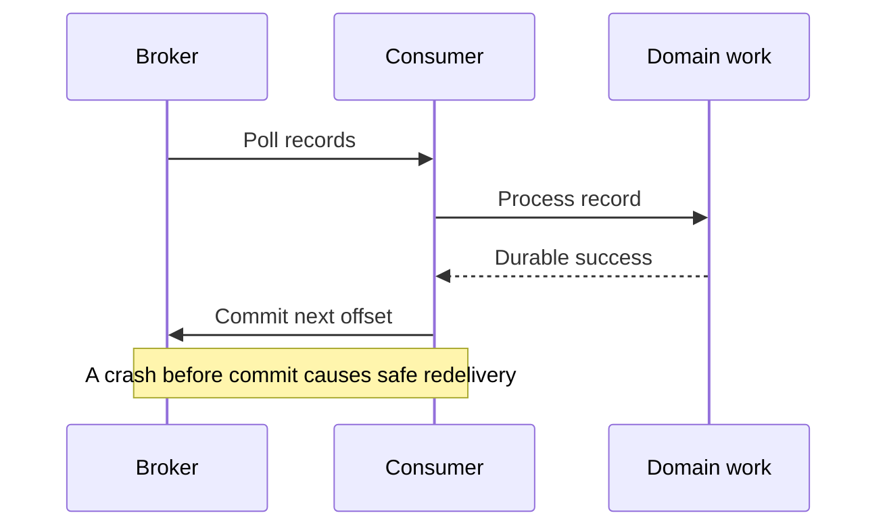

# Kafka Consumer Offset Commits In Depth

## Safe Offset Progression



An offset commit is a durable checkpoint for a **consumer group and topic
partition**. The committed value is normally the **next offset to read**, not the
last offset processed.

```text
records completed: 40, 41, 42
safe committed offset: 43
```

It does not prove that an email was sent, a payment settled, or a database write
committed. Those effects need their own transaction and idempotency evidence.

## Position, Completed Work, And Committed Offset

Keep these three positions separate:

| Position | Meaning |
|---|---|
| consumer position | next record the local consumer will fetch |
| completed watermark | next offset after all contiguous business work completed |
| committed offset | recovery point stored for the consumer group |

After `poll()` returns offsets 10 through 19, the consumer position may be 20
before any handler finishes. Committing 20 immediately can lose offsets 10–19
from this group's recovery path if the process crashes.

## `commitSync()`

```java
try {
    ConsumerRecords<String, OrderEvent> records =
            consumer.poll(Duration.ofSeconds(1));

    for (ConsumerRecord<String, OrderEvent> record : records) {
        orderService.process(record.value());
    }

    consumer.commitSync();
} catch (CommitFailedException failure) {
    // Group membership or assignment may have changed.
    // Do not claim that the batch is durably checkpointed.
}
```

`commitSync()` blocks until the coordinator acknowledges the commit or the call
fails. It gives a clear success/failure boundary, but adds commit latency to the
poll loop. Use explicit offsets when only a known subset is safe:

```java
Map<TopicPartition, OffsetAndMetadata> completed = Map.of(
        new TopicPartition("orders.events", 2),
        new OffsetAndMetadata(43L)
);
consumer.commitSync(completed);
```

Never construct this map from the highest **fetched** offset. Construct it from
the highest **contiguously completed** offset.

### What is blocked?

The thread calling `commitSync()` is blocked while the Kafka client waits for an
`OffsetCommitResponse`. The group coordinator is not globally blocked; it
continues serving other clients. Other consumers in the group also continue
processing their assignments.

If the calling consumer owns several partitions, however, that one consumer
thread cannot poll or invoke listeners for any of them until the call returns.
The practical pause therefore covers all partitions assigned to that consumer,
not the broker or the entire consumer group.

```text
consumer A: process -> commitSync -> wait -> next poll
consumer B: process -----------------------> next poll
broker:     handle commit + other requests concurrently
```

The acknowledgment is handled inside the Kafka client. Application code does
not receive a separate message later: a successful response makes
`commitSync()` return, while a timeout or unrecoverable response makes it throw.

## `commitAsync()`

```java
consumer.commitAsync((offsets, exception) -> {
    if (exception == null) {
        metrics.recordCommitSuccess(offsets);
    } else {
        log.warn("Asynchronous offset commit failed offsets={}", offsets, exception);
        metrics.recordCommitFailure(offsets);
    }
});
```

`commitAsync()` lets the poll loop continue while the coordinator handles the
request. It improves throughput when commit latency matters, but the callback is
the only place to observe failure. An async commit is not a business retry
mechanism.

Do not blindly retry a failed old callback:

```text
commit offset 101 sent
commit offset 151 sent
callback for 101 fails late
blind retry writes 101 after newer progress
```

The client orders asynchronous commit callbacks, but application retry logic can
still create stale writes if it submits old offsets later. Track a monotonic
generation/watermark, or allow the next regular commit to advance progress.

## Recommended Hybrid Pattern

Use asynchronous commits during normal processing and a synchronous commit at a
controlled shutdown or partition-revocation boundary:

```java
try {
    while (running.get()) {
        ConsumerRecords<String, OrderEvent> records = consumer.poll(POLL_TIMEOUT);
        processCompletely(records);
        consumer.commitAsync(commitObserver);
    }
} catch (WakeupException stopped) {
    if (running.get()) {
        throw stopped;
    }
} finally {
    try {
        consumer.commitSync(safeCompletedOffsets());
    } finally {
        consumer.close();
    }
}
```

The final synchronous commit reduces duplicate replay. It cannot make an
external side effect atomic with Kafka.

## Delivery Outcomes By Ordering

| Sequence | Crash result |
|---|---|
| commit, then process | possible loss from this group's view |
| process, then commit | possible duplicate processing |
| DB effect + inbox marker in one DB transaction, then commit | duplicate delivery is safe |
| Kafka consume + Kafka produce + offsets in one Kafka transaction | atomic Kafka-to-Kafka result |

For payments and other irreversible effects, pass a stable idempotency key to
the external provider and persist the provider result before committing progress.

## Rebalances And Commit Ownership

A commit may fail when the consumer is no longer an active member or no longer
owns the partition. On revocation:

1. stop accepting new work for revoked partitions;
2. wait only for bounded, already-started work;
3. commit the contiguous completed watermark while ownership is valid;
4. cancel or fence work that cannot finish;
5. let the new owner replay uncommitted records.

Static membership and cooperative assignment reduce disruption; they do not
remove the need for idempotency.

## Spring Kafka Mapping

Spring Kafka listener containers own the native poll and commit loop. Ack modes
express **when an offset becomes eligible for commit**. The `syncCommits`
container property separately controls **how that eligible offset is sent**:

| Concern | Spring Kafka setting | Example |
|---|---|---|
| commit boundary | `AckMode` | `RECORD` or `BATCH` |
| commit transport | `syncCommits` | `true` uses `commitSync()`; `false` uses `commitAsync()` |
| async result visibility | `commitCallback` | record failures and latency |

`syncCommits` defaults to `true`. With it enabled, the container's consumer
thread waits for the Kafka client to receive the commit response; the
`@KafkaListener` method does not receive that response. With it disabled, the
container uses an asynchronous commit and the callback observes completion.

Ack modes define the boundary:

| Ack mode | Simplified boundary |
|---|---|
| `RECORD` | after each successful listener record |
| `BATCH` | after the poll batch succeeds |
| `MANUAL` | after application acknowledgment, using container commit semantics |
| `MANUAL_IMMEDIATE` | immediate when called on the consumer thread; otherwise queued semantics apply |

Manual acknowledgment is not automatically safer. Acknowledging before durable
business completion creates loss; acknowledging after a non-idempotent effect
still leaves a duplicate window.

For example, a record listener using `RECORD` and `syncCommits=true` has this
simplified flow:

```text
poll -> invoke listener -> listener returns -> commitSync -> next listener/poll
```

When a listener throws, the configured error handler, retry, recovery, and
transaction policy determine seeking and committing. Avoid the oversimplified
claim that Spring "never commits on an exception": a recovery handler can be
configured to commit a recovered record.

### Can Spring use async normally and sync only at shutdown or rebalance?

The native Kafka client can use that hybrid pattern, as shown above. A Spring
listener container exposes one `syncCommits` choice for its container-managed
commits; it does not provide a declarative mode that automatically changes from
async during normal polling to sync only for shutdown or revocation.

A `ConsumerAwareRebalanceListener` can run code around revocation, but a manual
`consumer.commitSync()` is safe only when supplied with offsets known to
represent contiguously completed work. Committing the consumer's current
position can checkpoint records that were fetched but not durably processed.
Calling a `KafkaConsumer` from an arbitrary shutdown thread is also unsafe
because the consumer is not thread-safe.

Prefer one of these explicit policies:

| Goal | Policy |
|---|---|
| simpler recovery boundary | `BATCH` or `RECORD` with `syncCommits=true` |
| lower commit wait in the poll loop | `syncCommits=false`, a monitored commit callback, and idempotent processing |
| custom hybrid behavior | track completed offsets per partition and commit them on the consumer thread; justify the added complexity with measurements |

Synchronous commits reduce the replay window but do not eliminate duplicates.
Idempotent business transitions remain mandatory in every policy.

### ShopVerse Defaults

The shared configuration currently sets `enable-auto-commit=false`,
`ack-mode=record`, and listener concurrency to one unless an environment
override is supplied. ShopVerse does not override Spring Kafka's
`syncCommits=true` default, so the effective non-transactional happy path is a
container-managed synchronous commit after each successful record listener
return.

This is a reliability-first baseline, not proof that per-record synchronous
commits are optimal at every traffic level. Before changing it, measure commit
latency, consumer lag, duplicate replay, database throughput, and rebalance
frequency. If throughput requires asynchronous commits, add commit-failure
telemetry and retain inbox/business idempotency.

## Production Checklist

- disable native auto commit when the application needs processing-aligned control;
- monitor commit latency, commit failures, rebalance count, lag, and oldest-event age;
- keep the consumer poll thread responsive;
- commit per partition, because completion progresses independently;
- use bounded shutdown and a final safe synchronous commit;
- make processing idempotent even when using synchronous commits;
- never use offset reset as a casual incident fix;
- record topic, partition, offset, event ID, group, and business outcome together.

## Interview Questions

**Why does `commitAsync()` not simply retry every failure?** A late retry can
overwrite newer progress with an older offset. The next monotonic commit is often
safer; final shutdown uses a synchronous commit.

**Processing succeeded but commit failed. What happens?** The record can be
delivered again, so the handler must be idempotent.

**Does `commitSync()` give exactly once?** No. It synchronizes an offset commit,
not Kafka with a database or external API.

**What offset is committed after processing offset 42?** Normally 43, the next
offset to consume.

## Official References

- [Kafka Consumer API](https://kafka.apache.org/43/javadoc/org/apache/kafka/clients/consumer/KafkaConsumer.html)
- [Kafka consumer configuration](https://kafka.apache.org/documentation/#consumerconfigs)
- [Spring Kafka listener containers and commits](https://docs.spring.io/spring-kafka/reference/kafka/receiving-messages/message-listener-container.html)
- [Spring Kafka listener container properties](https://docs.spring.io/spring-kafka/reference/kafka/container-props.html)

## Recommended Next

Continue with [Kafka Consumer Multithreading](./KAFKA-CONSUMER-MULTITHREADING.md).
