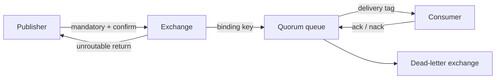

# RabbitMQ Internals, Reliability, And Interview Scenarios

A producer publishes to an exchange; bindings route the message to zero or more queues; consumers receive from
queues. Durability requires the exchange and queue definitions, message persistence, replication policy, publisher
confirms, and consumer acknowledgement behavior to agree. TCP success alone is not broker acceptance.

## Routing And Delivery Boundaries

- Direct exchanges match routing keys; topic exchanges match dot-separated patterns; fanout ignores routing keys;
  headers exchanges use header arguments.
- An unroutable publish can be silently discarded unless the publisher uses `mandatory` returns or an alternate
  exchange. A publisher confirm answers broker acceptance, not downstream business completion.
- Consumer acknowledgements transfer responsibility after processing. Ack too early and failures lose work; ack
  too late and crashes redeliver completed effects.
- Delivery is normally at least once when acknowledgements are used. Business handlers need idempotency and a
  durable processed-message or state-transition boundary.

## Queues, Ordering, And Pressure

Quorum queues replicate through a consensus group and confirm a persistent publish after a quorum accepts it.
They favor safety over minimum latency and are not intended for high-churn temporary queues. Ordering is queue-local
and can be disturbed operationally by multiple consumers, redelivery, priorities, and retry paths. If strict per-key
order matters, partition ownership deliberately and bound concurrency.

Prefetch limits unacknowledged deliveries per consumer. Too high creates unfairness, memory growth, and a large
redelivery wave; too low wastes capacity. Broker memory/disk alarms apply flow control, so publishers must handle
blocked connections and bounded confirm latency rather than retrying without limit.

## Retry And Dead-Letter Design

Avoid immediate requeue loops. Classify transient and permanent failures, cap attempts, add delay through governed
retry queues or delayed-message facilities, preserve the original message identifier, and route exhausted work to
a dead-letter exchange. A DLQ is not resolution: alert on age and volume, retain diagnostic metadata without secrets,
and provide inspect, repair, replay, quarantine, and audit procedures.

## Ten Interview Scenarios

### 1. Publisher confirm versus consumer acknowledgement?

A confirm transfers publish responsibility to the broker; an acknowledgement transfers delivery responsibility
from the broker to the consumer after the configured processing boundary. They close different failure windows.

### 2. What happens to an unroutable message?

Without `mandatory` handling or an alternate exchange it can be discarded. Validate topology and treat returns as
a publish failure with bounded recovery.

### 3. Classic queue versus quorum queue?

Choose quorum queues for replicated, consensus-backed safety. Account for replication cost, member placement,
availability during loss of quorum, and workload restrictions; classic queues remain useful for less critical or
temporary workloads under an explicit policy.

### 4. Why are duplicate deliveries expected?

The consumer may complete its database effect and crash before acking. The broker redelivers because it cannot know
the effect committed. Deduplicate by message identity or make the transition conditionally idempotent.

### 5. Does RabbitMQ guarantee ordering?

It preserves a queue-oriented delivery order under constrained conditions, not a universal processing order.
Multiple consumers, redelivery, priority, and retry topology can reorder completion.

### 6. How do you choose prefetch?

Balance handler latency, concurrency, message size, fairness, memory, and redelivery cost. Load-test the complete
consumer plus downstream system and monitor unacked count and queue age.

### 7. How do you stop a poison-message loop?

Reject or dead-letter permanent failures, cap transient retries with delay, and quarantine exhausted messages.
Never continuously requeue the same delivery at full speed.

### 8. Queue depth versus queue age?

Depth shows quantity; age shows user delay and can reveal starvation even at modest depth. Monitor ingress,
acknowledgement rate, ready/unacked counts, oldest age, redelivery, consumer capacity, disk, and confirm latency.

### 9. RabbitMQ versus Kafka?

RabbitMQ emphasizes flexible routing and broker-managed work queues. Kafka emphasizes retained partition logs,
consumer-owned offsets, replay, and high-throughput event streams. Select from semantics, not popularity.

### 10. What does a broker recovery test prove?

Prove quorum behavior, reconnect/topology recovery, publish ambiguity handling, consumer redelivery, idempotency,
backlog drain, DLQ operations, and recovery objectives under node and network failures.

## Official References

- [RabbitMQ reliability guide](https://www.rabbitmq.com/docs/reliability)
- [Consumer acknowledgements and publisher confirms](https://www.rabbitmq.com/docs/confirms)
- [RabbitMQ quorum queues](https://www.rabbitmq.com/docs/quorum-queues)
- [RabbitMQ dead lettering](https://www.rabbitmq.com/docs/dlx)

## Recommended Next

Continue with [RabbitMQ Operations And Interview Revision](./RABBITMQ-OPERATIONS-INTERVIEW.md) and
[Messaging Platform Selection](../MESSAGING-PLATFORM-SELECTION.md).
