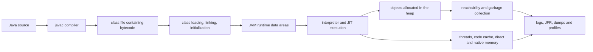

# Advanced Java Internals

**Java internals** are the runtime mechanisms beneath Java source code: class
loading, bytecode execution, stack frames, object allocation, garbage
collection, JIT compilation, synchronization, native memory, and diagnostic
tooling. Understanding them explains why valid Java code can still exhibit slow
startup, high allocation, long pauses, memory exhaustion, contention, or
unexpected optimization behavior.

This page is the canonical JVM and performance learning path. It orders the
topics from beginner runtime boundaries to implementation internals and
production diagnosis; it is not itself a replacement for the linked deep dives.

## Page Overview

This track separates five questions that are often mixed together: how classes
become executable code, where runtime state lives, how objects are allocated and
collected, how concurrency visibility is guaranteed, and which evidence proves a
performance hypothesis. The ordered route links the canonical page for each
question and ends with capacity and operational judgment.

Core terms used throughout the track are **runtime area** (a JVM-defined logical
storage area), **JIT compilation** (adaptive compilation of observed hot code),
**live set** (objects that remain reachable after collection), **safepoint** (a
state where selected VM operations can run safely), and **profile** (sampled or
recorded evidence about runtime activity).

## Core Terminology

- A **runtime area** is a logical storage region defined by the JVM contract.
- **JIT compilation** adaptively converts observed hot bytecode into machine code.
- The **live set** is the object graph that remains reachable after collection.
- A **safepoint** allows selected VM operations to observe or change runtime state safely.
- A **profile** is sampled or recorded evidence about CPU, allocation, waiting,
  locking, or retention during a named workload window.

## Prerequisites

Before starting, you should understand Java classes, objects, references,
methods, exceptions, collections, and basic threads. If those terms are not yet
comfortable, begin with [Java Fundamentals](./JAVA-FUNDAMENTALS.md), then
[Object-Oriented Programming](./JAVA-OOP.md) and
[Threads And JVM Thread Model](./JAVA-THREADING-UMBRELLA.md).

## Beginner Mental Model

Start with one source method and follow what must happen before a CPU can execute
it:

The JVM is one operating-system process. `-Xmx` limits only its Java heap, not
the whole process. Each platform thread has execution state and a stack; all
threads share loaded classes and heap objects. The interpreter and JIT execute
bytecode, while the garbage collector reclaims heap objects that are no longer
reachable.

*Use the atlas only after the process-level mental model above. Each focused
chapter separates specification guarantees from HotSpot implementation details.*

## Ordered Learning Route

### Stage 1: Runtime Foundations

1. [JVM Architecture And Runtime Boundaries](./JAVA-JVM-ARCHITECTURE-OPERATIONS.md)
   defines the JVM process, major subsystems, lifecycle, and evidence boundaries.
2. [JVM Execution Internals](./advanced-internals/JVM-EXECUTION-INTERNALS.md)
   traces class loading, bytecode, frames, interpretation, JIT compilation,
   speculative optimization, deoptimization, and safepoints.
3. [JVM Memory Areas](./JAVA-JVM-MEMORY.md) separates heap, method area,
   metaspace, stacks, frames, PC registers, native memory, TLABs, and the Java
   Memory Model. Do not study collectors before this storage model is clear.

### Stage 2: Allocation And Garbage Collection

4. [Object Layout, Allocation And Reachability](./JAVA-GC-OBJECT-LAYOUT-DEEP-DIVE.md)
   explains headers, fields, alignment, references, TLAB allocation, GC roots,
   barriers, shallow size, and retained size.
5. [Garbage Collectors](./JAVA-GC-COLLECTORS-ARCHITECT.md) compares Serial,
   Parallel, G1, ZGC, and Shenandoah only after shared collector mechanics are
   established.

### Stage 3: Process Memory And Runtime Integration

6. [Java Containers And Resource Limits](./JAVA-CONTAINERS-RESOURCE-LIMITS.md)
   connects heap and native regions to cgroup memory, CPU quotas, termination,
   and container diagnostics.
7. [FFM, Method Handles And Runtime Integration](./JAVA-FFM-METHOD-HANDLES-RUNTIME.md)
   covers native boundaries and dynamic invocation after the core runtime model.

### Stage 4: Measurement And Performance

8. [JVM Performance Diagnostics](./JAVA-PERFORMANCE-DIAGNOSTICS-TOOLING.md)
   starts from symptoms and selects JFR, thread dumps, heap dumps, NMT, GC logs,
   or profiling evidence.
9. [JVM Profiling And GC Diagnostics](./JVM-PROFILING-GC-NATIVE.md) applies
   profiling to CPU, allocation, locks, retention, and native-memory questions.
10. [NIO, Zero-Copy And JMH](./advanced-internals/NIO-PERFORMANCE-JMH.md) covers
    I/O mechanics and trustworthy microbenchmarking.
11. [Performance Engineering And Capacity](./JAVA-PERFORMANCE-ENGINEERING-CAPACITY.md)
    turns measurements into SLO, throughput, saturation, and capacity decisions.

### Separate Concurrency Track

The Java Memory Model is related to runtime execution but answers a different
question: which writes may be observed across threads. Study it through
[Java Memory Model And Safe Publication](./advanced-internals/JAVA-MEMORY-MODEL.md),
then [Concurrency Primitives And AQS](./advanced-internals/CONCURRENCY-AQS-VIRTUAL-THREADS.md)
and [Virtual Threads](./features-8-to-26/JAVA-VIRTUAL-THREADS.md).

## Concrete Example: How The Topics Connect

Consider a service whose resident memory grows while heap-after-GC remains flat:

1. the architecture page prevents equating the JVM process with the Java heap;
2. the memory page identifies metaspace, code cache, stacks, direct buffers, and
   other native consumers;
3. the container page checks the actual cgroup/process limit;
4. the diagnostics page selects Native Memory Tracking or direct-buffer evidence;
5. the profiling page verifies the dominant allocation or retention path.

This sequence turns an observation into a bounded hypothesis. Jumping directly
to GC tuning would address the wrong memory area.

## Common Learning Mistakes

- treating every HotSpot detail as a Java specification guarantee;
- assuming a source-level `new` always produces a surviving heap allocation;
- treating `-Xmx` as the complete process-memory budget;
- choosing a collector before measuring live set, allocation rate, pause SLO,
  CPU quota, and headroom;
- using a profiler without first naming the symptom and required evidence;
- mixing JVM storage areas with JMM visibility and happens-before rules.

## Completion Standard

You have completed this track when you can trace a class from bytecode to loaded
runtime state, explain a method frame and allocation path, distinguish shallow
size from retained size, separate heap from native-memory pressure, interpret GC
and JFR evidence, and defend a performance change with comparable measurements.

## Tricky Interview Questions

<ExpandableAnswer title="Can high latency with low CPU be a JVM execution problem?">

It may instead be parking, locks, queues or dependencies; require evidence.

</ExpandableAnswer>

<ExpandableAnswer title="Why is warm-up part of architecture?">

Tiered compilation changes startup behavior and capacity.

</ExpandableAnswer>

## Official References

- [Java Language Specification](https://docs.oracle.com/javase/specs/jls/se25/html/)
- [Java Virtual Machine Specification](https://docs.oracle.com/javase/specs/jvms/se25/html/)
- [Java SE 25 API](https://docs.oracle.com/en/java/javase/25/docs/api/)

## Recommended Next Page

Begin with [JVM Architecture And Runtime Boundaries](./JAVA-JVM-ARCHITECTURE-OPERATIONS.md).
