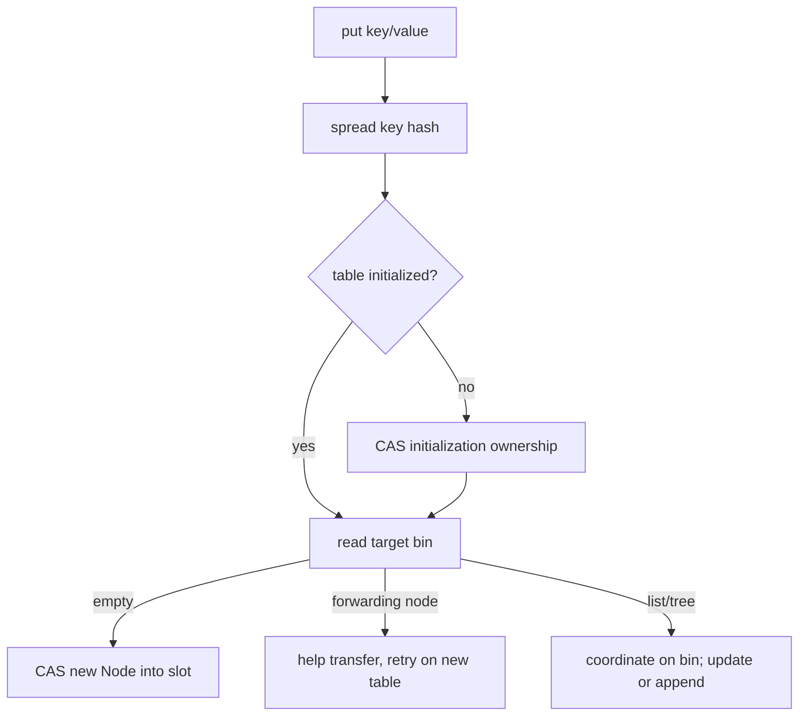
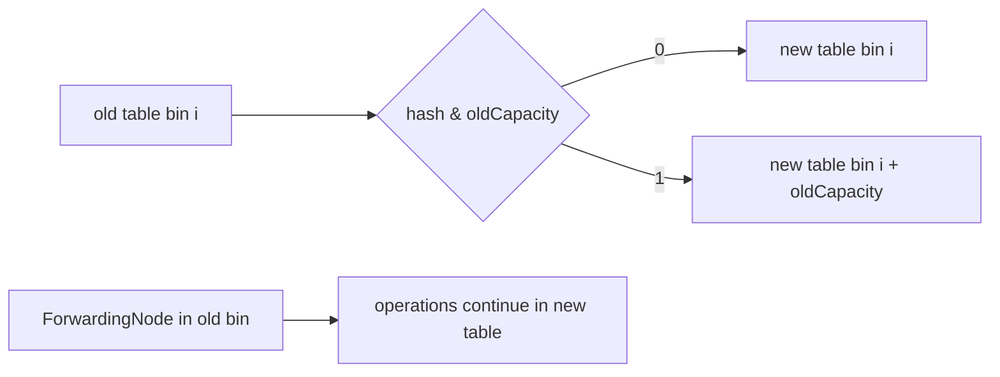

# ConcurrentHashMap OpenJDK Internals And Design Review

`ConcurrentHashMap` provides scalable concurrent access inside one JVM. It is
not a distributed map, transaction manager, or automatic guardian of multi-key
business invariants. Architectural use starts by identifying the atomicity
boundary the map actually offers. For a beginner, think of a hash table whose
independent bins can usually progress without one global lock. At deeper levels,
CAS, bin coordination, forwarding nodes, volatile publication, and striped
counters explain why reads and updates have different consistency costs.

## Page Overview

This guide traces the modern OpenJDK structure from initialization through
lookup, insertion, treeification, cooperative resize, counting, iteration, and
bulk operations. It then turns those mechanics into failure modes, diagnostic
experiments, architecture boundaries, and interview reasoning.

## Core Terminology And Mental Model

- **CAS** changes a location only if its observed value is still current.
- A **bin** is the list or tree rooted at one table slot.
- A **forwarding node** redirects operations during table transfer.
- **Weakly consistent** iteration is safe during updates but is not a snapshot.
- **Striped counters** spread contention while making aggregate reads non-transactional.

## How It Works: From Segments To Bin Coordination

Java 7 divided the map into fixed `Segment` regions backed by lock-bearing hash
tables. Modern implementations use one table and coordinate at finer granularity:

- volatile-style publication and reads for table elements;
- CAS for table initialization and empty-bin insertion;
- synchronization on a bin head for contended structural updates;
- tree-bin coordination for collision-heavy bins;
- forwarding nodes and cooperative transfer during resize;
- striped counters to avoid a single hot size counter.

Do not describe current `ConcurrentHashMap` as “segment locking.” That answer
confuses historical design with the implementation used by modern Java.

## Hashing And Table Initialization

The spread operation mixes high hash bits into lower bits because bucket
selection uses `(length - 1) & hash`. The table is initialized lazily. A control
field commonly called `sizeCtl` represents different state depending on sign
and phase: initialization coordination, resize threshold, or an encoded resize
state with participating workers.



The empty-bin path avoids a monitor. A collision path must recheck state after
acquiring coordination because another thread may have changed the bin.

## Node Roles

| Internal role | Purpose |
|---|---|
| ordinary node | immutable key/hash link plus visibility-managed value/next traversal |
| tree node | red-black-tree entry used inside a tree bin |
| tree bin | coordinates tree root, readers and writers for a dense bin |
| forwarding node | marks a transferred bin and points operations toward the new table |
| reservation node | temporarily reserves computation state for operations such as computation |

These are implementation details, not public API contracts. A lead should know
their purpose to understand profiles and thread dumps, while avoiding code that
depends on private thresholds or layout remaining identical across JDK releases.

## Read Path And Memory Visibility

`get` does not normally acquire an intrinsic lock. It obtains the table/bin
state with the visibility guarantees used by the implementation, compares the
first node, then traverses a list, tree, or forwarding structure. The API
specification establishes that a completed update for a key happens-before a
subsequent retrieval reporting that updated value.

That guarantee does not make operations across different keys atomic:

```java
if (balances.get(from) >= amount) {
    balances.compute(from, (key, old) -> old - amount);
    balances.compute(to, (key, old) -> old + amount);
}
```

Readers can observe an intermediate transfer. Use a domain-level lock,
transactional store, immutable aggregate replacement, or another design that
matches the invariant. In a replicated service, even a correct local critical
section cannot coordinate other JVMs.

## Treeification And Collision Behavior

When a bin becomes dense, the implementation may convert its linked structure
to a red-black tree, but only when the table is also sufficiently large;
otherwise resize is preferred. When density falls, a tree may become a list
again. Comparable keys can help ordering inside tree bins, while tie-breaking
still preserves correctness for non-comparable keys.

Tree bins constrain collision degradation but do not make adversarial or poor
hash functions harmless. A large collision domain still increases comparisons,
coordination and allocation.

## Cooperative Resizing

Resize creates a larger table and transfers bins. Threads encountering a
forwarding node can help move a range rather than waiting for one resizer. Each
old bin can be divided using the old capacity bit: entries stay at the old index
or move by `oldCapacity`, avoiding complete hash recomputation.



Resizing is incremental but not free. Poor initial sizing can create transfer
CPU, allocation and temporary memory pressure under peak traffic.

## Size Accounting

A single atomic counter would become a contention point. The implementation
uses a base count and, under contention, striped counter cells similar in spirit
to `LongAdder`. Aggregate size-related results during concurrent mutation are
observational, not a transactionally frozen snapshot. Do not use `size()` as a
check-then-act gate for correctness.

## Compound Operations

Use `putIfAbsent`, `replace`, `compute`, `computeIfAbsent`, and `merge` when the
operation fits one key. Mapping functions must be short and side-effect-aware.
They can coordinate other threads targeting the same bin, may be invoked under
contention semantics callers misunderstand, and must not recursively update the
same map in a way the implementation rejects.

```java
private final ConcurrentHashMap<String, LongAdder> counters = new ConcurrentHashMap<>();

void record(String productId) {
    counters.computeIfAbsent(productId, ignored -> new LongAdder()).increment();
}
```

This is appropriate for approximate/high-throughput counters. It is not an
inventory-decrement transaction, because `LongAdder` does not provide a linearizable
sum-and-update invariant.

## Iteration And Bulk Operations

Iterators are weakly consistent: they do not throw
`ConcurrentModificationException`, do not freeze the map, and may reflect some
updates that occur during traversal. Bulk operations accept a parallelism
threshold and can use the common pool. Avoid parallel bulk work when mapping
functions block or when the common pool is shared by unrelated latency paths.

## Failure Modes, Edge Cases, And Tradeoffs

- Long or blocking mapping functions hold coordination on relevant map state and
  can amplify hot-key latency. Keep them bounded and move remote I/O outside.
- Recursive updates involving the same key can be rejected or deadlock assumptions
  in surrounding code. Mapping functions should not re-enter structural logic.
- Mutable keys become unreachable just as in `HashMap`; concurrency does not fix
  equality or hashing defects.
- `size`, iteration, and multi-key reads are not atomic snapshots. Never use them
  to authorize inventory, quota, or payment transitions.
- Unbounded key growth turns the map into a retention root. Monitor cardinality,
  churn, allocation, blocked time, and the oldest entry age; define eviction or ownership.
- Per-key atomicity scales well but cannot enforce a cross-key, cross-process, or
  cross-service invariant. Choose a database transaction, durable log, or explicit
  distributed protocol when that is the actual consistency boundary.

## Lead Engineer Production Decisions

Review the key distribution, peak cardinality, lifecycle, callback duration,
hot-key behavior, resize headroom, and recovery semantics. Compare a concurrent
map with an immutable snapshot for read-mostly data, Caffeine for bounded local
caching, and an authoritative external store when replicas must agree.

## Design Review Checklist

- Is the state authoritative only inside one JVM?
- Is every correctness invariant confined to one atomic map operation/key?
- Are keys immutable with stable equality and hashes?
- Are mapping functions bounded and free from remote I/O?
- Can a hot key or collision concentrate bin contention?
- Is initial capacity appropriate for peak cardinality?
- Are weak iterator and aggregate-size semantics acceptable?
- Is lifecycle bounded, or can the map become a permanent retention root?
- Would Caffeine, a database, Redis, or an immutable snapshot be a better abstraction?

## Diagnostic Lab

1. Benchmark independent keys and one hot key separately.
2. Record JFR monitor-blocked, allocation and CPU evidence.
3. Force controlled collisions with a test key and inspect degradation.
4. Trigger resize from a deliberately small capacity and observe allocation.
5. Compare `LongAdder` counters with `merge` when exact per-operation results matter.

## Tricky Interview Questions

<ExpandableAnswer title="Are reads always lock-free in every internal path?">

Normal reads avoid locking, but describe API guarantees rather than claiming a universal implementation theorem.

</ExpandableAnswer>

<ExpandableAnswer title="What if one thread reads a key while another writes it?">

The map remains structurally safe: a reader does not observe a partially linked
or corrupted entry. If the read races with the write, it can return the value
from before or after that update, depending on timing. Once a completed update
is observed by a later retrieval for that key, the API's happens-before
guarantee applies. This is not a frozen, globally consistent snapshot: a
multi-key read can still observe a mixture of old and new values.

</ExpandableAnswer>

<ExpandableAnswer title="Why can maximum concurrency still collapse?">

Hot bins, mapping-function duration, CPU, allocation and downstream work remain shared bottlenecks.

</ExpandableAnswer>

<ExpandableAnswer title="Does computeIfAbsent guarantee its function never runs concurrently for different keys?">

No; coordination is scoped to relevant map state, not global execution.

</ExpandableAnswer>

<ExpandableAnswer title="Can size() authorize a capacity-sensitive business action?">

No; concurrent aggregate observations are not a transaction.

</ExpandableAnswer>

<ExpandableAnswer title="Does a concurrent map make a local cache coherent across replicas?">

No.

</ExpandableAnswer>


## Official References

- [`ConcurrentHashMap` API](https://docs.oracle.com/en/java/javase/25/docs/api/java.base/java/util/concurrent/ConcurrentHashMap.html)
- [OpenJDK ConcurrentHashMap source](https://github.com/openjdk/jdk/blob/master/src/java.base/share/classes/java/util/concurrent/ConcurrentHashMap.java)
- [`LongAdder` API](https://docs.oracle.com/en/java/javase/25/docs/api/java.base/java/util/concurrent/atomic/LongAdder.html)

## Recommended Next

Continue with the [Concurrency Design Review](./JAVA-CONCURRENCY-DESIGN-REVIEW.md)
and [HashMap internals](./collections/map/HASHMAP-INTERNALS.md) to place local
atomic operations inside a complete service-level invariant.
