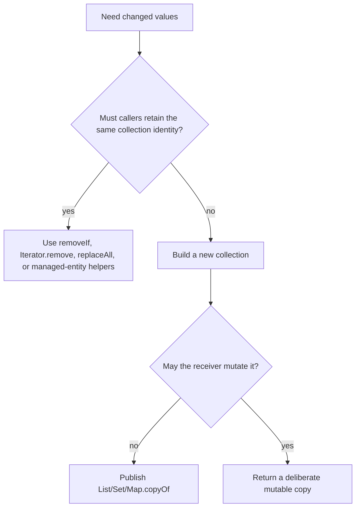

# Safe Collection Mutation

**Safe collection mutation** means changing elements or structure only through
an operation compatible with the collection's ownership, iterator, equality,
view, persistence, and concurrency contracts. A private working collection, a
JPA-managed association, an immutable snapshot, and shared concurrent state
therefore require different operations. Begin with who owns the state; method
choice comes after the required consistency boundary is clear.

## Page Overview

This guide covers supported removal and transformation, iterator ownership,
views and snapshots, hash identity, atomic map updates, ORM-managed collections,
concurrent iteration, failure diagnosis, and review questions.

## Core Terminology And Mental Model

- A **structural modification** changes collection size or iteration topology.
- A **backed view** delegates to another collection; a **snapshot** is separate state.
- An **alias** is another reference that can observe or mutate the same object.
- A **compound operation** combines steps whose invariant may require one lock or transaction.
- **Fail-fast** iteration detects some interference; it does not make access safe.

## How It Works: Match Ownership To The Mutation Operation

| Intent | Preferred operation |
|---|---|
| remove matching values | `removeIf(predicate)` |
| remove during traversal with custom logic | `Iterator.remove()` |
| replace each list value | `List.replaceAll(operator)` |
| accumulate a value by key | `Map.merge` |
| create a value only when missing | `Map.computeIfAbsent` |
| produce a new result | stream/map/filter into a new collection |
| replace published state | construct fully, then publish an immutable snapshot |

Do not structurally modify an ordinary collection through a second path while
its iterator is traversing it:

```java
// Unsafe: the enhanced for-loop owns an iterator.
for (CartItem item : items) {
    if (item.getProductId().equals(productId)) {
        items.remove(item);
    }
}
```

Use the collection's bulk operation when it expresses the intent:

```java
items.removeIf(item -> item.getProductId().equals(productId));
```

Or use the iterator for stateful traversal:

```java
for (Iterator<CartItem> it = items.iterator(); it.hasNext(); ) {
    if (shouldRemove(it.next())) {
        it.remove();
    }
}
```

`ConcurrentModificationException` is best-effort bug detection, not a thread
safety mechanism. Absence of the exception does not make concurrent mutation
correct.

## Transform In Place Or Build A Result?



`Stream.toList()` returns an unmodifiable list. When later mutation is part of
the contract, request a mutable result explicitly:

```java
List<Order> editable = orders.stream()
        .filter(Order::isActive)
        .collect(Collectors.toCollection(ArrayList::new));
```

## Snapshot, View, And Element Mutation

```java
List<Role> snapshot = List.copyOf(roles);
List<Role> view = Collections.unmodifiableList(roles);
```

- `snapshot` does not reflect later structural changes to `roles`.
- `view` rejects mutation through that reference but reflects changes made
  through the backing list.
- neither operation deep-copies `Role`; a mutable element can still change.

At service and DTO boundaries, immutable snapshots are usually easier to reason
about than backed views. Make a defensive copy of mutable elements when the
boundary also requires element isolation.

## Map Updates Express Intent

Avoid separate lookup and update when one map operation describes the change:

```java
quantitiesByProduct.merge(productId, requestedQuantity, Integer::sum);

eventsByOrder.computeIfAbsent(orderNumber, ignored -> new ArrayList<>())
        .add(event);
```

For an ordinary map these methods make code clearer. For `ConcurrentHashMap`,
they also provide atomicity for that single-key map operation. Keep the mapping
function short and free of recursive updates; an invariant spanning multiple
keys, a database row, or another service still needs coordination at that wider
boundary.

## Never Mutate Hash Identity While Stored

Changing a field used by `equals` or `hashCode` can strand an object in the
wrong bucket:

```java
Set<CartKey> keys = new HashSet<>();
keys.add(key);
key.setCustomerId(otherCustomer); // lookup/removal may now fail
```

Prefer an immutable key:

```java
record CartKey(String customerId, Long productId) {}
```

JPA entities with generated identifiers need an explicit equality strategy;
do not place a transient entity in a hash collection and then let persistence
silently change the identity used by that collection.

## Shopverse Managed Collections

Shopverse cart replacement mutates the collection owned by the managed `Cart`
inside a transaction:

```java
cart.getItems().clear();
request.items().forEach(item -> cart.getItems().add(toEntity(cart, item)));
```

Preserving the managed collection instance lets the ORM observe association
changes according to its mapping. Entity helper methods should maintain both
sides of bidirectional relationships when the model has them; do not replace a
persistent wrapper casually with a new list.

## Concurrent Iteration Semantics

| Collection family | Typical iterator behavior |
|---|---|
| ordinary `ArrayList` / `HashMap` | fail-fast on some structural interference |
| `CopyOnWriteArrayList` | immutable snapshot from iterator creation |
| `ConcurrentHashMap` | weakly consistent; may reflect some concurrent updates |

Weakly consistent does not mean transactionally consistent. If a report must
represent one point in time, create a snapshot under the appropriate ownership
or consistency boundary.

## Failure Modes, Edge Cases, And Diagnostics

- `ConcurrentModificationException` usually signals competing structural paths;
  capture the complete stack and identify every alias instead of catching it.
- `UnsupportedOperationException` commonly reveals a fixed-size, unmodifiable,
  or immutable result. State mutability in API contracts and tests.
- A mutable hash key causes lookup/removal misses. Log stable business identifiers,
  not mutable object dumps, and reproduce equality before and after mutation.
- A backed `subList`, `keySet`, or range view changes with its owner and may reject
  operations. Copy explicitly when isolation is required.
- `computeIfAbsent` protects one map operation, not a multi-key business invariant,
  remote side effect, or transaction across services.

## Tradeoffs, Architecture Decisions, And Production Evidence

In-place mutation minimizes copying but increases aliasing risk. Immutable
snapshots simplify publication and rollback at the cost of allocations. Concurrent
collections offer precisely scoped atomicity, not global snapshots. At design
review, record the owner, mutation boundary, maximum cardinality, contention,
publication mechanism, and recovery behavior.

## Tricky Interview Questions

1. **Does fail-fast mean thread-safe?** No; detection is best effort and races
   remain invalid without a synchronization contract.
2. **Can `Collections.unmodifiableList` make mutable elements immutable?** No; it
   blocks structural calls through that view only.
3. **Is `ConcurrentHashMap.compute` a transaction?** Only for the relevant key's
   map update; external systems and other keys are outside that atomic boundary.
4. **Why preserve a Hibernate collection wrapper?** Replacing it can bypass the
   ORM's dirty tracking, orphan handling, and relationship semantics.

## Review Checklist

- Identify the collection owner and every alias before mutating.
- Use the iterator or bulk operation that owns structural changes.
- State whether a returned value is live, copied, immutable, or mutable.
- Keep hash-key identity stable.
- Use atomic concurrent-map methods only for single-key atomicity.
- Preserve ORM-managed collection identity when required by the mapping.
- Test order, duplicates, null policy, and mutation behavior as API contracts.

For collision, iterator, and concurrent-hash mechanics, continue to
[Hash Collections Deep Dive](../JAVA-HASH-COLLECTIONS-DEEP-DIVE.md) and
[ConcurrentHashMap OpenJDK Internals](../JAVA-CONCURRENT-HASHMAP-OPENJDK.md).
Return to the [Collections umbrella](../JAVA-COLLECTIONS.md).

## Official References

- [Java `Collection` API](https://docs.oracle.com/en/java/javase/25/docs/api/java.base/java/util/Collection.html)
- [Java `Iterator` API](https://docs.oracle.com/en/java/javase/25/docs/api/java.base/java/util/Iterator.html)
- [Java `ConcurrentMap` API](https://docs.oracle.com/en/java/javase/25/docs/api/java.base/java/util/concurrent/ConcurrentMap.html)

## Recommended Next

- [HashMap internals](./map/HASHMAP-INTERNALS.md)
- [ConcurrentHashMap internals](../JAVA-CONCURRENT-HASHMAP-OPENJDK.md)
- [Collections learning guide](../JAVA-COLLECTIONS.md)
