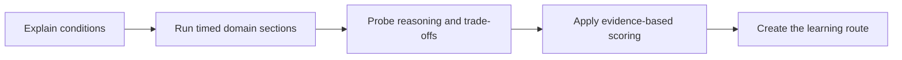

# Day-Zero Lead And Architect Diagnostic Assessment

## Diagnostic Assessment Sequence

<DocLabels items={[
  {label: 'Closed book', tone: 'interview'},
  {label: 'Baseline assessment', tone: 'advanced'},
  {label: 'No model answers here', tone: 'production'},
]} />

Take this assessment before starting the preparation programme. It measures what you can retrieve,
reason through, and communicate now—not what looks familiar when reading.

Do not open the [Assessor Guide](./DAY-ZERO-ASSESSOR-SCORING-ROUTING.md) until the assessment is
finished. That page contains expected signals and routing.

## Conditions

- Use no documentation, search, IDE assistant, or prepared notes.
- Draw diagrams on blank paper or an empty digital canvas.
- Speak answers aloud and record them when possible.
- State assumptions rather than silently inventing requirements.
- If you do not know, state what evidence you would request and how you would reduce risk.
- Stop each section when its timer ends; incomplete structure is useful diagnostic evidence.
- Keep every answer, including weak ones, for comparison after six and twelve weeks.

## Assessment Shape

| Section | Time | Output |
|---|---:|---|
| Java and JVM | 15 min | three spoken answers plus one diagnostic sequence |
| Spring runtime and transactions | 15 min | request/proxy trace and failure explanation |
| SQL, JPA and database | 15 min | query/transaction diagnosis |
| Kafka and eventing | 15 min | consumer/reliability reasoning |
| microservices correctness | 15 min | distributed workflow reasoning |
| Kubernetes and network diagnosis | 15 min | evidence-first incident response |
| system design | 30 min | diagram, calculations, decisions and failure model |
| production incident | 20 min | containment, diagnosis, recovery and prevention |
| leadership and architecture | 15 min | two decision narratives |
| optional financial systems | 20 min | payment/ledger/reconciliation answers |

Core duration is 155 minutes. Take a ten-minute break before system design. Complete the optional
financial section only when it matches the target role.

## Section 1 — Java And JVM (15 Minutes)

### Prompt 1: concurrency correctness

A shared configuration object is constructed on one thread and read by many request threads. Some
threads occasionally observe default field values. Explain safe publication, the Java Memory Model
relationship that is missing, and at least three correct publication mechanisms.

### Prompt 2: execution model

Compare platform threads, virtual threads, and a bounded asynchronous executor for a Spring service
that performs blocking database and HTTP calls. Explain what improves, what remains bounded, and
how pinning or downstream capacity changes the design.

### Prompt 3: collection choice

Select data structures for a read-heavy cache, an insertion-ordered unique collection, a concurrent
counter map, and a bounded work queue. State complexity, concurrency, memory, and iteration trade-offs.

### Prompt 4: incident

Service p99 rises from 200 ms to 8 seconds. CPU is 25%, heap use is stable, and request threads grow.
Give your ordered hypotheses, commands/tools, evidence, safe containment, and proof of recovery.

## Section 2 — Spring Runtime And Transactions (15 Minutes)

### Prompt 1: request trace

Trace one authenticated HTTP request through the servlet container, filters, Spring Security,
`DispatcherServlet`, handler mapping, controller, service proxy, transaction manager, connection
pool, Hibernate/JDBC, exception handling, and response.

### Prompt 2: ignored transaction

`@Transactional` appears not to work on a private method called from another method in the same
class. Explain why, which cases also fail or behave differently, and give three correct ways to
place the transaction boundary.

### Prompt 3: boundary design

A transactional service saves an order, calls a payment API, and publishes Kafka. Identify every
failure window. Redesign it without claiming one ACID transaction spans all three systems.

### Prompt 4: startup failure

A custom `SecurityFilterChain` causes unexpected endpoint access after a Spring Boot upgrade.
Explain auto-configuration back-off, multiple-chain matching/order, and how you would test the result.

## Section 3 — SQL, JPA And Database (15 Minutes)

### Prompt 1: query regression

One SQL query becomes slow only for a large tenant after data growth. Explain statistics,
cardinality, selectivity, parameter values, join choice, spills, indexes, and the evidence required
before changing the query or index.

### Prompt 2: ORM behavior

An endpoint loads 100 orders and their items, producing hundreds of SQL statements. Compare fetch
join, entity graph, projection, batch fetching, and two-step pagination. Name the traps in each.

### Prompt 3: transaction concurrency

Two requests update the same account balance. Explain lost update, optimistic and pessimistic
locking, deadlocks, retry safety, transaction isolation, and the invariant you would enforce.

### Prompt 4: pool incident

Hikari pending requests rise while database CPU remains low. Give hypotheses that distinguish slow
SQL, lock wait, connection leak, remote work inside a transaction, network failure, and pool sizing.

## Section 4 — Kafka And Eventing (15 Minutes)

### Prompt 1: lag

Consumer lag grows on one partition while other partitions are current. Diagnose key skew, a poison
record, downstream latency, retries, poll timing, and partition ownership. Explain containment.

### Prompt 2: offset correctness

A poll returns 100 records; 99 succeed and one fails. Compare record and batch processing, sync and
async commits, partial acknowledgement, retry/DLT, ordering, and duplicate business effects.

### Prompt 3: ambiguous success

A payment database update succeeds but the consumer's offset commit fails. Explain what happens,
why producer idempotence is insufficient, and how inbox/idempotency constraints protect the effect.

### Prompt 4: capacity

Estimate partitions and consumers for 20,000 events/second when one consumer thread sustains 1,200
events/second. Add headroom, ordering, hot-key, rollout, and future partition-change considerations.

## Section 5 — Microservices Correctness (15 Minutes)

### Prompt 1: stuck Saga

Inventory consumes a reservation command and commits, then crashes before publishing its result.
What does the orchestrator know? Design timeout, status query, safe retry, compensation,
reconciliation, and operator handling.

### Prompt 2: cascading failure

A downstream pricing service slows from 100 ms to 10 seconds. Explain deadline propagation,
connection/read timeouts, retries, circuit breaking, bulkheads, concurrency limits, load shedding,
fallback correctness, and observability.

### Prompt 3: service boundary

Choose whether order and inventory should be one module, two services with synchronous calls, or
event-driven services. State invariants, ownership, scale, failure, deployment, and team trade-offs.

### Prompt 4: contract evolution

An event field must change while old producers, consumers, and replay data remain. Give a compatible
migration, schema-governance checks, observability, and rollback plan.

## Section 6 — Kubernetes And Network Diagnosis (15 Minutes)

### Prompt 1: rollout 503s

Pods report ready during rollout, but users see intermittent `503`. Trace client DNS, ingress or
gateway, Service, EndpointSlice, readiness, application startup, connection draining, pre-stop,
termination grace, and observability.

### Prompt 2: DNS/TLS

One pod resolves and calls a service successfully; another gets TLS failures. Give commands and
evidence to distinguish DNS, route/policy, SNI, certificate SAN/chain, truststore, clock, protocol,
proxy, and application configuration.

### Prompt 3: resource pressure

A pod restarts with `OOMKilled` although average memory looks normal. Explain limits, working set,
heap/native memory, spikes, JVM container ergonomics, probes, events, and safe remediation.

### Prompt 4: kubeconfig and access

Explain how `kubectl` chooses cluster, user and namespace from kubeconfig, what a context contains,
how authentication differs from RBAC authorization, and how to diagnose a forbidden response safely.

## Section 7 — System Design (30 Minutes)

Design a multi-region notification platform supporting email, SMS, and push.

Requirements to clarify:

- 50,000 notification requests/second peak;
- per-user and per-tenant preferences and rate limits;
- priority and scheduled delivery;
- provider outages and callbacks;
- no duplicate chargeable provider submission for one operation;
- delivery status query and audit;
- regional failure, data residency, and cost constraints.

Your output must include:

1. functional and non-functional requirements plus explicit non-goals;
2. rough throughput, storage, queue, partition, worker and connection estimates;
3. API/event contracts and stable identities;
4. critical write/read paths and ownership boundaries;
5. retry, ordering, backpressure, DLT/reconciliation, and provider failover;
6. storage, cache, Kafka/queue, and partition-key decisions;
7. security, privacy, tenant isolation, secrets, and audit;
8. observability, SLOs, deployment, regional failure, RPO/RTO, and cost;
9. two rejected alternatives and a migration plan.

## Section 8 — Production Incident (20 Minutes)

At 10:05 UTC checkout p99 rises from 1.2 seconds to 18 seconds. Error rate grows to 12%.
Kafka order lag rises, payment timeouts increase, Hikari pending reaches the pool maximum, database
CPU is 45%, and a new checkout version reached 30% of pods at 09:58. The rollback pipeline is ready.

Answer in incident order:

1. What is the user/business impact and current severity?
2. What do you contain in the first five minutes, and why?
3. Which signals distinguish trigger, mechanism, and amplifiers?
4. What exact evidence do you request from application, JVM, pool, database, Kafka, network, and rollout?
5. When do you roll back, pause consumers, shed traffic, or disable retries?
6. How do you protect uncertain payments and duplicate order processing?
7. What proves recovery?
8. What follow-up controls, tests, dashboards, and ownership changes do you create?

## Section 9 — Leadership And Architecture (15 Minutes)

### Prompt 1: technical disagreement

A platform team wants a service mesh for every service; application teams expect cost, latency, and
debugging overhead. Explain how you frame the decision, gather evidence, run a reversible evaluation,
handle disagreement, decide ownership, and communicate the result.

### Prompt 2: unsafe deadline

A product deadline requires a database migration that has not been tested at production scale.
Explain how you quantify and escalate risk, propose options, create checkpoints/rollback, preserve
the relationship, and own the outcome.

### Prompt 3: personal evidence

Present one five-minute sanitized case in this order: stakes, your responsibility, constraints,
evidence, options, decision, influence, execution, measurable result, and what you would change.

## Optional Section 10 — Financial Systems (20 Minutes)

### Prompt 1: money and ledger

Design a multi-currency transfer posting. Explain representation, rounding, double-entry postings,
balances, atomicity, reversal, audit, and concurrent spending protection.

### Prompt 2: payment uncertainty

A capture times out, a callback arrives twice, and a settlement file later reports success. Explain
identity, state transitions, provider verification, ledger entries, reconciliation, and customer state.

### Prompt 3: batch and reconciliation

An end-of-day file has 100,000 rows; one is malformed after 99,999 process successfully. Explain
control totals, job identity, chunk semantics, quarantine policy, restartability, breaks, and close gates.

### Prompt 4: controls

Design a manual financial adjustment workflow with maker-checker, entitlements, approval binding,
idempotent execution, immutable correction, secrets, audit evidence, and incident handling.

## Finish

Record section timing, unanswered prompts, moments where structure failed, and claims made without
evidence. Only now open the [Day-Zero Assessor Guide](./DAY-ZERO-ASSESSOR-SCORING-ROUTING.md).

## Official References

- [US OPM structured interviews](https://www.opm.gov/policy-data-oversight/assessment-and-selection/structured-interviews/)
- [US OPM assessment strategy](https://www.opm.gov/policy-data-oversight/assessment-and-selection/)
