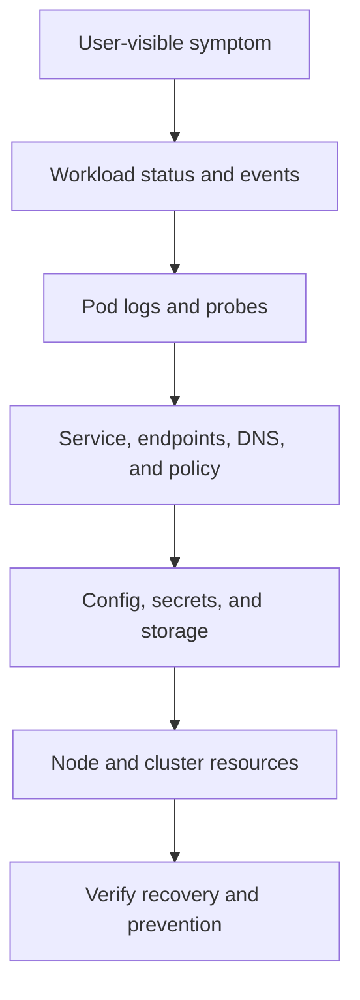

# Kubernetes Troubleshooting, Incident Labs, Interviews, And Revision

## Kubernetes Diagnostic Path



## Diagnostic Method

Use `user symptom -> scope -> recent change -> object status/conditions -> events -> logs/metrics
-> control-plane/node/data-plane evidence -> containment -> root cause -> prevention`. Start with the
least invasive read. Restarting or deleting first destroys evidence and can multiply failures.

```bash
kubectl get pod -A -o wide
kubectl describe pod <pod> -n <ns>
kubectl logs <pod> -n <ns> --all-containers --previous
kubectl get events -A --sort-by=.metadata.creationTimestamp
kubectl get deploy,rs,pod,svc,endpointslice -n <ns>
kubectl top pod,node
kubectl rollout status deployment/<name> -n <ns>
kubectl diff -f manifests/
```

Use `kubectl debug`/ephemeral containers and node debugging only under governed access. Capture
timestamps, namespace, Pod UID, node, image digest, resourceVersion and rollout revision.

## Failure Matrix

| Symptom | Trace |
|---|---|
| API timeout | client DNS/TLS/LB -> API saturation -> admission -> etcd |
| Forbidden | authenticated identity -> RBAC verb/resource/subresource/scope -> admission |
| Pending Pod | scheduler condition -> requests -> taints/affinity/topology -> quota/PVC |
| ImagePullBackOff | image reference/digest -> registry DNS/TLS/auth/rate -> node disk/runtime |
| CrashLoopBackOff | previous log/exit -> command/config -> dependency -> probe -> OOM |
| Running but unavailable | readiness -> EndpointSlice -> Service targetPort -> policy/gateway |
| Terminating forever | finalizer -> preStop/grace -> volume detach -> unavailable controller |
| Node NotReady | Lease/status -> kubelet -> runtime -> network -> disk/memory/PID pressure |
| DNS failure | resolver/search -> CoreDNS -> Service/endpoints -> upstream/policy |
| PVC/mount failure | PVC/PV/class -> topology -> CSI controller -> attach -> CSI node/mount |

## Production Scenarios

### New rollout causes intermittent 503

Segment errors by Pod/node/revision, inspect readiness transition and EndpointSlices, compare
gateway upstream errors, check termination/draining and application startup. Contain by pausing or
rolling back traffic/workload revision; prove recovery with error rate and invariant checks.

### Cluster has spare CPU but Pods remain Pending

Aggregate CPU is irrelevant if no eligible node satisfies each Pod's request plus taints, affinity,
topology, ports and volumes. Read scheduler events and per-node allocatable/requested resources.

### Node drain blocks

Identify PDB, unmanaged Pod, local storage, finalizer or unhealthy eviction target. Decide whether
availability or maintenance is the priority; add capacity or repair readiness before overriding.

### Control plane slow after policy rollout

Check API request/admission timing, webhook endpoints/certificates/timeouts and etcd latency. Narrow
or disable only through the governed emergency path. A fail-closed webhook can preserve policy while
blocking all matching writes.

## Required Labs

1. Build a local multi-node cluster; label/taint nodes and explain component placement.
2. Deploy a three-replica service with resources, probes, PDB and topology spread.
3. Break a selector and `targetPort`; diagnose from Service through endpoint to socket.
4. Apply default-deny networking, then allow DNS and one precise service flow.
5. Force Pending with requests/affinity/taints and resolve from scheduler evidence.
6. Trigger CrashLoop, probe failure and OOM; collect previous logs and cgroup/resource evidence.
7. Provision, expand, snapshot/backup and restore a PVC; verify checksums.
8. Cordon/drain a node during load; measure errors and disruption behavior.
9. Install an admission policy and prove both allow and deny tests.
10. Simulate DNS or CoreDNS degradation and trace resolver-to-upstream latency.
11. Perform a supported minor-version test upgrade with API-deprecation scan and rollback/recovery plan.
12. Restore an etcd snapshot in an isolated lab and reconcile application data separately.

Use disposable environments for destructive exercises and preserve raw commands, events, metrics
and results as portfolio evidence.

## Top Interview Questions

**Deployment versus StatefulSet?** Deployment manages interchangeable replicas; StatefulSet adds
stable identity and volume association. Neither supplies application replication correctness.

**Requests versus limits?** Requests drive placement/share; limits constrain usage. CPU throttles,
memory can OOM. Size from measurement and include native/off-heap and startup.

**Readiness versus liveness?** Readiness controls traffic; liveness restarts a locally wedged process.
Shared dependency outage normally should not trigger a restart storm.

**Why can more replicas reduce reliability?** They multiply connections, retries, cache cold starts,
downstream load and rollout demand when the real bottleneck is fixed.

**How does a Service reach a Pod?** Selection creates EndpointSlices; the cluster's Service data
plane routes/translates the virtual endpoint to an eligible Pod IP. Exact implementation varies.

**What happens when a node dies?** Heartbeats stop, node status becomes unhealthy/unknown, taints and
controller behavior eventually replace eligible controller-owned Pods elsewhere; local data and
in-flight work need application-level recovery.

**Does a PDB guarantee availability?** No. It limits voluntary simultaneous disruption; crashes,
resource pressure, bad readiness and insufficient capacity can still violate availability.

**How do you secure a tenant?** Identity/RBAC, quotas, Pod/admission policy, network isolation,
secret scope, supply-chain/runtime controls, observability and possibly separate nodes/clusters.

**How do you upgrade safely?** Inventory compatibility/deprecations, back up and restore-test,
canary control plane/node/add-ons in supported order, preserve surge capacity, validate SLOs and
have recovery boundaries.

**When should you avoid Kubernetes?** When workload/team scale does not justify its platform cost,
or simpler managed/serverless/container hosting meets the constraints with lower operational risk.

## Additional Production Interview Questions

### Pod, Deployment, StatefulSet, DaemonSet, Job, or CronJob?

A Pod is the scheduling unit, not a durable singleton. Deployment manages interchangeable long-running
replicas; StatefulSet adds stable ordinal identity and volume association; DaemonSet targets eligible
nodes; Job owns finite completion; CronJob creates Jobs on a schedule. Choose from lifecycle and state,
not from the desire to “keep one Pod running.”

### What do requests, limits, QoS, CPU throttling, and OOMKills mean?

Requests influence scheduling and resource shares; limits bound usage. CPU is compressible and normally
throttles at quota, while memory pressure can terminate a container. QoS class affects eviction priority
but is not an availability guarantee. Include heap, native/off-heap, sidecars and startup peaks in sizing.

### Startup, readiness, and liveness probes?

Startup protects slow initialization from premature liveness failure. Readiness removes an endpoint from
service traffic without restarting it. Liveness restarts a locally unrecoverable process. Keep probes
cheap and local; a shared dependency outage in liveness can create a cluster-wide restart storm.

### Why can a Pod remain Pending when the cluster has spare resources?

The scheduler needs one eligible node satisfying the Pod's requests, taints/tolerations, selectors,
affinity, topology constraints, ports and volume topology, plus quota/policy. Aggregate free CPU cannot
combine fragments from several nodes. Read scheduler events and node allocatable/requested evidence.

### Affinity, anti-affinity, taints, tolerations, and topology spread?

Affinity attracts based on labels; anti-affinity separates; taints repel unless tolerated; topology
spread controls skew across domains. Hard rules can make workloads unschedulable during failures or
rollouts, so distinguish required correctness/isolation from preferred resilience and test degraded
capacity.

### What does a PodDisruptionBudget guarantee?

A PDB constrains voluntary evictions such as drain; it does not prevent crashes, OOM, node loss, broken
readiness or an application rollout controller's own availability mistakes. It can block maintenance when
healthy replicas/capacity are insufficient, so pair it with topology, surge capacity and tested drains.

### How does Horizontal Pod Autoscaling fail in production?

HPA adjusts desired replicas from observed metrics relative to targets. Missing/stale metrics, absent or
incorrect requests, slow startup, stabilization windows, max-replica caps, noisy signals and a saturated
downstream can make scaling late or harmful. Scale on a causal signal and protect dependencies with
admission control.

### HPA versus VPA versus Cluster Autoscaler?

HPA changes replica count, VPA recommends or changes Pod requests, and Cluster Autoscaler changes node
capacity for unschedulable demand. Their control loops interact: new replicas may wait for nodes, VPA may
restart Pods, and scaling cannot split a hot key or repair a fixed database bottleneck. Coordinate limits
and disruption policy.

### How does a rolling update avoid sending traffic to terminating or unready Pods?

Use correct readiness, bounded surge/unavailable settings, preStop only where useful, sufficient
termination grace, endpoint/load-balancer drain, and an application that stops accepting work before
finishing in-flight work. Keep old/new API, event and schema versions compatible throughout overlap.

### How do ConfigMap and Secret updates reach running Pods?

Environment values are fixed at process start. Mounted projected files may update eventually, but apps
must reload safely and `subPath` mounts do not receive normal projection updates. Use immutable/versioned
configuration with a rollout or a deliberately tested reload controller; never assume changing an object
restarts its consumers.

### ServiceAccount and RBAC design?

Each workload should use a dedicated service account with the smallest verbs, resources, namespaces and
names required. Disable unnecessary token automounting, prefer bounded projected tokens, avoid wildcard
cluster roles, and test direct API calls. RBAC authorization does not replace admission, network or cloud
IAM controls.

### What does a NetworkPolicy actually enforce?

It expresses allowed Pod ingress/egress for a supporting CNI; creating policy on an unsupported data
plane changes nothing. Start with default deny, then allow DNS and exact flows, cover ingress and egress,
and test real traffic. It does not govern every node-host, load-balancer or control-plane path automatically.

### How should stateful storage and disaster recovery be designed?

PVC/PV/StorageClass/CSI automate provisioning and attachment, not application consistency, replication or
backup. Model topology, access modes, reclaim policy, expansion, detach/failover and corruption. Back up
with application-aware tooling, restore into isolation and reconcile external state to measured RPO/RTO.

### Ingress versus Gateway API versus Service?

A Service gives stable in-cluster discovery/virtual access to endpoints. Ingress models common external
HTTP routing through an implementation-specific controller. Gateway API provides role-oriented, more
expressive routing resources across protocols. None is the workload itself; trace DNS/LB/controller,
listener, route, Service, EndpointSlice, policy and Pod readiness.

### Why can a resource remain Terminating forever?

Finalizers intentionally block deletion until a controller completes cleanup; Pods can also wait on
preStop/grace, process exit, volume detach or node reachability. Identify the owning finalizer/controller
and failed cleanup dependency. Removing finalizers blindly can orphan cloud resources or violate data
recovery, so do it only through an approved recovery decision.

## One-Page Revision

```text
API: authenticate -> authorize -> mutate -> validate -> persist -> watch
Control: API server + etcd + scheduler + controllers
Node: kubelet + CRI runtime + CNI + CSI (+ Service data plane)
Placement: requests + selectors/affinity + taints + topology + volumes
Traffic: DNS -> Service -> EndpointSlice -> Pod; Gateway for external routing
State: PVC -> PV -> StorageClass -> CSI; backup/restore remains application-aware
Security: identity + RBAC + admission + Pod policy + network + secrets + supply chain
Operations: SLO + capacity + node lifecycle + upgrades + etcd/app recovery
Diagnosis: conditions/events first, then logs/metrics and node/data-plane evidence
```

## Completion Checklist

- Draw and explain the full API-to-container path without notes.
- Write and defend a secure production Deployment.
- Diagnose every row in the failure matrix in a disposable cluster.
- Restore cluster state and application data, measuring RPO/RTO.
- Present one capacity model, threat model, upgrade plan and incident review.
- Score at least three out of four in three consecutive Kubernetes mocks.

## Official References

- [Debug applications](https://kubernetes.io/docs/tasks/debug/debug-application/)
- [Troubleshoot clusters](https://kubernetes.io/docs/tasks/debug/debug-cluster/)
- [Kubernetes documentation](https://kubernetes.io/docs/home/)

## Recommended Next

Return to the [Kubernetes Beginner-To-Architect Path](../KUBERNETES-ARCHITECT-PATH.md), complete all labs, then apply Helm and Argo CD to the same workloads.
