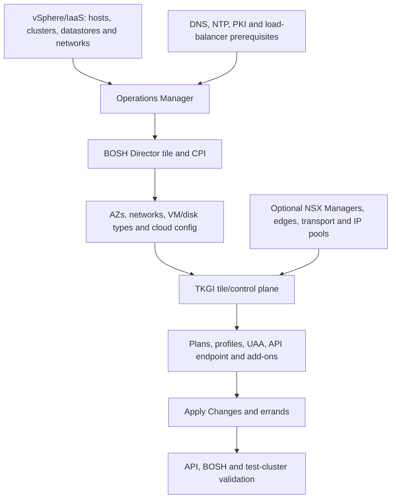

# TKGI Installation Foundations And Platform Topology

TKGI installation is a dependency graph, not merely importing and clicking a tile. The
platform must reconcile management VMs, workload-cluster placement, identity, certificates,
networking, storage and IaaS permissions across Operations Manager and BOSH.

## Dependency Order



## Pre-Installation Decisions

- supported TKGI, Operations Manager, BOSH stemcell, vSphere and NSX versions;
- Management Console versus Operations Manager deployment workflow;
- Antrea or NSX-backed networking;
- standard or HA TKGI API/database VM groups;
- management and workload availability zones;
- dedicated management, service, Pod and node networks;
- API endpoint DNS, TLS and load-balancer/DNAT design;
- storage/datastore placement and failure domains;
- identity provider, UAA roles and administrator bootstrap;
- proxy and `no_proxy` behavior for every internal endpoint;
- Harbor/private registry trust if used;
- backup destination, RPO/RTO and restore ownership.

## IaaS Foundation

For vSphere, inventory and validate:

| Area | Required evidence |
|---|---|
| compute | compatible ESXi/vCenter, host clusters, reservations and failure-domain capacity |
| storage | datastore accessibility, latency, free space and failure behavior |
| networking | port groups/VLANs or NSX transport topology, MTU, routing and IP pools |
| permissions | dedicated least-privilege service accounts tested with required CPI operations |
| DNS/NTP | forward/reverse resolution where required and synchronized clocks |
| PKI | correct SANs, chains, key protection and expiry monitoring |

Capacity must cover normal demand plus upgrades, BOSH canaries, VM recreation, failed-host
evacuation and cluster growth. A design that consumes all resources on day one cannot heal.

## Operations Manager

Operations Manager stores product configuration and orchestrates tile deployment through
BOSH. Protect its credentials, configuration and backups. Its UI is not a substitute for
reading the exact failed BOSH task.

Configuration sources can include the Management Console wizard/YAML workflow or direct
Operations Manager tile configuration. Choose one governed source and prevent unreviewed
drift between automation and UI changes.

## BOSH Director Foundation

BOSH needs valid:

- CPI and IaaS credentials;
- availability zones;
- networks and reserved/static/dynamic ranges;
- VM types and disk types;
- stemcells and releases;
- NTP and DNS;
- blobstore/database health;
- global cloud config consumed by TKGI-generated named configs.

Validate before installing TKGI:

```bash
bosh environments
bosh env
bosh cloud-config
bosh configs
bosh stemcells
bosh releases
bosh vms --vitals
```

## Network Topology Choices

### Antrea / vSphere Without NSX Integration

The platform relies on configured infrastructure networking plus Kubernetes/Antrea for
cluster dataplane behavior. Operators provide TKGI API, Kubernetes API and workload
load-balancing paths appropriate to the IaaS.

### vSphere With NSX Integration

Prerequisites expand to NSX Managers, certificates/principal identity, transport zones,
VTEP pools, edge/transport nodes, Tier-0/Tier-1 topology, IP pools and management/cluster
objects. TKGI uses its NSX proxy/broker integration during cluster lifecycle.

Installation success does not prove NSX realization for every later cluster. Validate a
real test cluster and representative `LoadBalancer`/Ingress traffic.

## Endpoint And Certificate Plan

Inventory these separately:

```text
Operations Manager endpoint
BOSH Director API/UAA
TKGI API/UAA endpoint
each workload-cluster Kubernetes API endpoint
NSX Manager and vCenter endpoints
Harbor and observability destinations
```

For each, record DNS name, address/LB/DNAT, server certificate, client trust stores,
rotation owner and alert threshold. A wildcard or generic certificate does not remove the
need for correct SANs and chain distribution.

## Apply Changes Flow

```text
Save product configuration
 -> Operations Manager validates configuration
 -> BOSH computes deployment changes
 -> canary VM changes first where configured
 -> remaining API/database VMs update
 -> post-deploy errands execute
 -> product reports apply result
```

A failed Apply Changes is not corrected by repeatedly clicking Apply. Capture the product
step and BOSH task ID, find the first failure, correct the owning configuration and retry.

## Post-Installation Validation

```bash
tkgi login -a api.tkgi.example.com
tkgi plans
tkgi clusters
bosh deployments
bosh -d pivotal-container-service-<guid> instances
bosh -d pivotal-container-service-<guid> vms --vitals
```

Then create a disposable validation cluster and prove:

- cluster creation completes and maps to a `service-instance_<guid>` deployment;
- credentials populate the intended kubeconfig/context;
- Kubernetes `/readyz`, nodes, DNS and system Pods are healthy;
- image pull from the approved registry works;
- storage provisioning works;
- ingress/load-balancer flow works;
- logs and metrics reach their destinations;
- cluster update and delete clean up supported resources.

## Common Installation Failures

| Symptom | First evidence |
|---|---|
| Ops Manager validation fails | exact field, DNS/NTP/SSH prerequisite and product logs |
| BOSH cannot create VM | CPI debug task, permissions, capacity, datastore and network |
| Agent never responds | boot, route, DNS/NTP, stemcell and agent path |
| API certificate error | SAN, chain, listener, LB/DNAT and clock |
| TKGI API healthy but test cluster fails | broker, named config, CPI or add-on errand |
| NSX cluster creation fails | Proxy Broker logs, NSX realization, pools and edge capacity |
| image pull fails | node DNS/TLS trust, credential and registry policy |

## Interview Questions

**Why create a validation cluster after installation?** Management services can be green
while broker, CPI, NSX, Kubernetes bootstrap, storage or load-balancer paths are broken.

**Which configuration is foundational to every TKGI cluster?** BOSH global cloud config
defines the physical AZ/network/VM/disk world; TKGI-generated named configs and manifests
must resolve against it.

## Official References

- [Broadcom TKGI 1.25 installation documentation](https://techdocs.broadcom.com/us/en/vmware-tanzu/standalone-components/tanzu-kubernetes-grid-integrated-edition/1-25/tkgi/installing.html)
- [TKGI Control Plane Architecture](./TKGI-CONTROL-PLANE-ARCHITECTURE.md)

