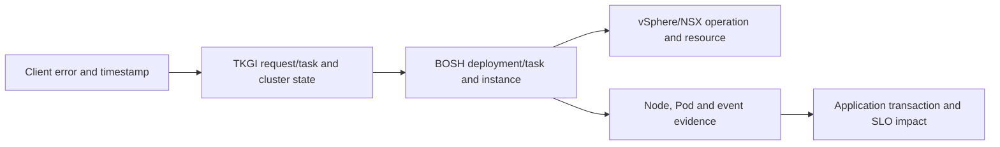

# TKGI Production Incidents CLI And Interview Revision

The fastest reliable diagnosis begins by naming the failing plane. TKGI manages cluster
lifecycle, BOSH reconciles VMs and jobs, Kubernetes reconciles workload objects, and the
IaaS/network realizes infrastructure. A red symptom in one UI does not identify which
plane owns the cause.

## Sixty-Second Triage Model

```text
1. Scope: one user, one cluster, one AZ, one service, or the whole platform?
2. Time: exact start, last known good, recent change, certificate/credential event?
3. Plane: identity/API, TKGI lifecycle, BOSH, IaaS/network, Kubernetes, or workload?
4. Evidence: request/task ID, timestamps, error text, health and dependency test?
5. Safety: is the next action read-only, reversible, supported and within authority?
```

Avoid simultaneous restarts across layers. They erase evidence, create new failures and
make causality harder to establish.

## CLI Mental Map

Exact command flags vary by installed CLI and release. Use `--help` and the versioned
reference before production changes.

### TKGI lifecycle inspection

```bash
tkgi login -a https://TKGI-API-FQDN -u USER
tkgi plans
tkgi clusters
tkgi cluster CLUSTER-NAME
tkgi get-credentials CLUSTER-NAME
tkgi tasks
```

Common lifecycle operations include `tkgi create-cluster`, `tkgi update-cluster`,
`tkgi resize`/release-specific scale operations, and `tkgi delete-cluster`. Treat create,
update, resize and delete as mutating operations requiring change control.

### BOSH correlation

```bash
bosh env
bosh deployments
bosh tasks --recent
bosh task TASK-ID
bosh -d DEPLOYMENT instances
bosh -d DEPLOYMENT vms --vitals
bosh -d DEPLOYMENT logs --job JOB-NAME
bosh cloud-config
bosh cloud-config --name NAMED-CONFIG
```

`bosh task TASK-ID --debug` can provide deeper task detail. Logs and task output may
contain sensitive endpoints or credentials; collect and share them according to policy.

### Kubernetes evidence

```bash
kubectl cluster-info
kubectl get nodes -o wide
kubectl get pods -A -o wide
kubectl get events -A --sort-by=.metadata.creationTimestamp
kubectl describe node NODE
kubectl describe pod POD -n NAMESPACE
kubectl get endpoints,endpointslices -A
kubectl auth can-i VERB RESOURCE -n NAMESPACE
kubectl config current-context
kubectl config view --minify
```

Before any `kubectl` mutation, verify the current context and namespace. Prefer explicit
`--context` and `--namespace` in production procedures.

## Cross-Plane Correlation



Build a timeline with stable identifiers. The same incident might appear as a TKGI task,
BOSH task, CPI request, VM UUID, NSX object and Kubernetes node name.

## Production Scenarios

### `tkgi login` fails but workloads are healthy

Check client DNS/time, API TLS chain, load-balancer health and UAA/API BOSH instances.
Do not restart workload clusters: their independence explains why applications can remain
healthy. Determine whether existing tokens or only new authentication is affected.

### Cluster creation remains in progress

Start with the TKGI task and identify the delegated BOSH task. Inspect the exact stage:
cloud-config validation, IP/quota allocation, VM creation, job start or post-deploy errand.
Then query the owning system. A generic “timeout” at the TKGI layer is not root cause.

### BOSH repeatedly recreates a VM

Inspect instance process health, resurrection/task history, infrastructure events and
persistent disk attachment. Compare desired deployment configuration. Do not manually
repair a BOSH-managed VM without understanding reconciliation; BOSH may overwrite it.

### Nodes are Ready but applications cannot communicate

Trace DNS -> Service/EndpointSlice -> network policy -> CNI/NSX realization -> load
balancer/ingress -> application listener. Node readiness does not validate every data
plane path.

### One cluster loses telemetry

Compare its sink resources, observability manager, Fluent Bit/Telegraf agents, DNS/TLS,
proxy and destination credentials with a healthy cluster. Emit a unique synthetic marker
to prove end-to-end delivery.

### TKGI database or management state appears inconsistent

Stop ad-hoc mutations. Preserve TKGI API/broker, database and BOSH task evidence. Check
quorum/member health and supported backup state. Reconcile through documented product
procedures or vendor support because manual edits can make recovery harder.

### NSX object exists but traffic fails

Separate declared from realized state. Inspect TKGI network profile, NSX Proxy Broker,
logical resources, virtual-server/backend health, routes, firewall/policy and endpoint
membership. Test both control-plane API and workload traffic paths.

### Certificate expiry causes partial outage

Inventory the certificate's clients and servers, chain, SANs, validity, trust distribution
and rotation owner. Renewing a certificate is incomplete until every consumer receives
the right chain and establishes a new successful connection.

## Escalation Package

Provide a concise, sanitized evidence package:

- environment and exact TKGI/Operations Manager/BOSH/Kubernetes/integration versions;
- business impact, scope, start time, timezone and last known good;
- recent changes and whether rollback/pause occurred;
- TKGI request/task IDs, BOSH task/deployment/instance identifiers and IaaS object IDs;
- relevant logs/events with timestamps and secrets removed;
- expected versus observed behavior and reproduction frequency;
- read-only checks performed and their outputs;
- current mitigation, residual risk and owner/contact.

## Interview Answer Framework

For every production question answer in this order:

1. **Impact and scope** — what is broken and for whom?
2. **Internals** — which control plane and reconciliation loop owns it?
3. **Evidence** — what metric, task, event or synthetic test distinguishes hypotheses?
4. **Mitigation** — safest reversible action that restores service.
5. **Root cause and prevention** — capacity, design, automation, alert or test change.
6. **Trade-off** — availability, consistency, security, cost or operational complexity.

## Top Interview Questions

**How does TKGI provide Kubernetes as a service?** The authenticated TKGI API accepts a
plan-governed cluster request and records lifecycle state. Its service-broker path
generates desired cluster deployment configuration. BOSH provisions and reconciles the
VMs and Kubernetes software through the CPI. Users then access the independent workload
cluster Kubernetes API.

**What can fail while existing workloads continue?** TKGI API, UAA, Management Console or
some management database functions can impair lifecycle operations without immediately
stopping already-running cluster control planes and Pods.

**Why does adding workers require more than CPU capacity?** The design also consumes IPs,
load-balancer resources, datastore capacity, quotas, routes and failure-domain headroom.

**How do you prove a cluster upgrade is safe?** Use a representative canary, observe BOSH
and Kubernetes reconciliation, validate system dependencies and synthetic business
transactions, then compare SLIs/SLOs before promoting the next cohort.

**How would you recover TKGI after a regional loss?** Start from documented RPO/RTO and
state ownership. Recover infrastructure/network/trust, BOSH, TKGI management state,
clusters, Kubernetes objects and persistent data using supported procedures; then prove
cross-layer consistency and application transactions.

**Why might a restart be harmful during diagnosis?** It destroys process state/log context,
can cause additional reconciliation and may temporarily mask the cause without correcting
configuration, capacity or dependencies.

## Rapid Revision Sheet

| Topic | One-line recall |
|---|---|
| TKGI API | cluster-lifecycle front door, not Kubernetes API |
| UAA | OAuth2 identity/token boundary for TKGI operations |
| TKGI database | management metadata, not cluster etcd or BOSH DB |
| BOSH | desired-state VM/job deployment and reconciliation |
| CPI | BOSH adapter to IaaS resources |
| plan | governed cluster shape and allowed capabilities |
| network profile | network behavior overrides/inputs for cluster realization |
| NSX Proxy Broker | TKGI-to-NSX integration path for networking objects |
| Harbor | optional registry whose pull path needs DNS, TLS and credentials |
| BBR | supported backup/restore tooling for applicable management components |
| Velero | Kubernetes resource/workload backup, not whole-platform backup |
| Fluent Bit | log/event forwarding agent in documented sink architecture |
| Telegraf | metric forwarding agent in documented sink architecture |
| canary | first BOSH instance used to detect rollout failure early |

## Recommended Next

Return to [TKGI Beginner-To-Architect Overview](./TKGI-OVERVIEW-PATH.md), then practise
explaining one request and one incident from client DNS/TLS through TKGI, BOSH, IaaS,
Kubernetes and the application SLO.

## Official References

- [Broadcom TKGI 1.25 documentation](https://techdocs.broadcom.com/us/en/vmware-tanzu/standalone-components/tanzu-kubernetes-grid-integrated-edition/1-25/tkgi/index.html)
- [Kubernetes debugging documentation](https://kubernetes.io/docs/tasks/debug/)
