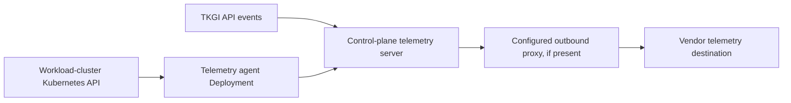
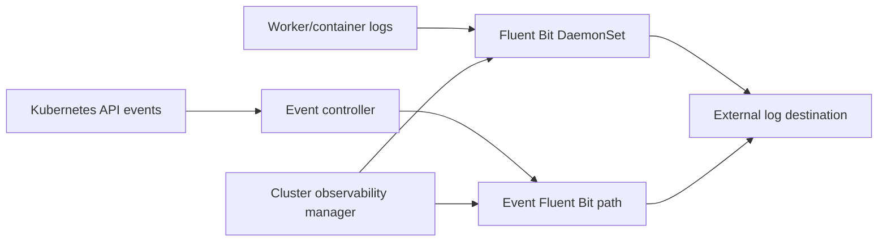
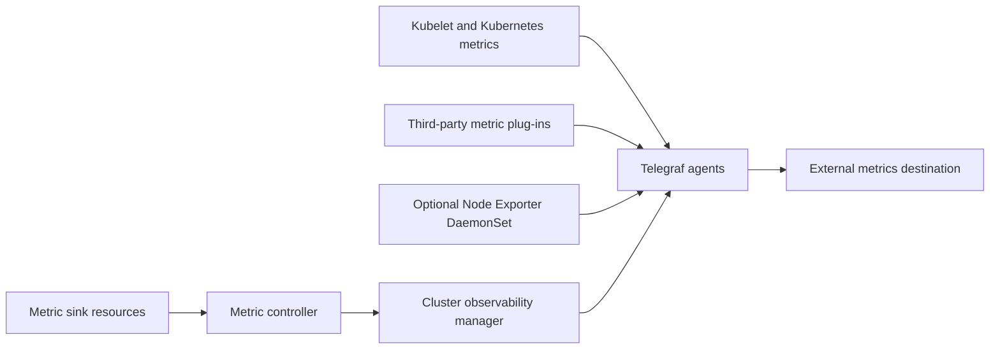

# TKGI Telemetry Sinks And Observability

TKGI has several data paths that are easy to confuse. Product telemetry, platform logs,
cluster events, infrastructure metrics and application observability serve different
owners and must have separate privacy, retention and reliability decisions.

## Four Data Classes

| Data class | Purpose | Typical consumer |
|---|---|---|
| product telemetry/CEIP | product usage and operational information sent under the configured participation policy | vendor telemetry service |
| platform/component logs | diagnose TKGI, BOSH, Kubernetes and integration processes | platform operations/SIEM |
| platform and node metrics | availability, capacity, saturation and error trends | monitoring/alerting system |
| application telemetry | business SLIs, traces, logs and workload metrics | application/SRE teams |

Enabling CEIP is not a substitute for production monitoring. Shipping logs is not proof
that alerts work. A dashboard is not an SLO.

## TKGI Product Telemetry Path

Broadcom documents a telemetry server on the TKGI control plane. TKGI API events and
metrics gathered by telemetry-agent Pods are delivered to it and then sent to the
configured vendor data service. Each workload cluster has a telemetry-agent Deployment
with one replica that polls its Kubernetes API. Configured proxy settings affect the
outgoing CEIP path.

Govern participation, data classification, egress and retention using organization
policy. Broadcom states that its documented TKGI telemetry does not contain personally
identifiable information; still validate the current release's data dictionary and your
own compliance requirements.

## Log Sink Architecture

With cluster log sinks enabled, the documented architecture uses:

- a Fluent Bit DaemonSet on worker nodes for node/container log collection;
- an event controller that reads Kubernetes API events;
- a second Fluent Bit path for those events;
- sink custom resources/configuration managed by the cluster observability manager;
- the configured common destination, such as an external logging system.

When sink configuration changes, the manager refreshes the relevant Fluent Bit Pods so
the desired destination is applied.

## Metric Sink Architecture

Broadcom's TKGI 1.25 sink model uses Telegraf for metric forwarding. Third-party metric
plug-ins and Kubernetes node/kubelet inputs feed Telegraf. An optional Node Exporter
DaemonSet exposes node metrics. A metric controller watches configured sink resources;
the observability manager refreshes Telegraf Pods after a sink change.

## Observability By Layer

### TKGI management plane

Measure API availability/latency, authentication failures, lifecycle operation duration,
broker failures, database health and certificate expiry.

### BOSH and infrastructure

Measure failed/running task age, unhealthy instances, resurrection loops, CPI latency,
resource quota, IP exhaustion, datastore capacity and NSX realization errors.

### Kubernetes clusters

Measure API health, etcd/control-plane health, node readiness, pending Pods, restart rate,
DNS/CNI health, storage failures, ingress success and resource saturation.

### Applications

Measure user-visible availability, latency, error rate, throughput, queue/consumer lag,
dependency health and business correctness. Platform green does not prove application
green.

## Minimum Alert Set

- TKGI API or UAA unavailable from more than one probe location;
- lifecycle task exceeds its expected duration or fails;
- BOSH instance unhealthy or repeatedly recreated;
- Kubernetes API unavailable or control-plane quorum threatened;
- node NotReady, pressure conditions or rapid eviction/restart growth;
- IP, CPU, memory, datastore or load-balancer capacity approaching an action threshold;
- Fluent Bit/Telegraf not ready, sink queue/backpressure or delivery failures;
- log or metric destination receives no data for a defined interval;
- certificate expiry within operational renewal lead time;
- backup or restore verification failure;
- application SLO burn-rate alert.

Prefer symptom/SLO alerts over raw noise. Route every alert to an owner and runbook, and
test that it fires before relying on it.

## Missing-Telemetry Runbook

Trace the complete path instead of restarting collectors immediately:

1. Define what is missing: one workload, one node, one cluster, one data type or all data.
2. Confirm the source produces new records/metrics with a timestamp and known marker.
3. Inspect the sink resource and cluster observability manager reconciliation.
4. Check Fluent Bit, Telegraf, controllers and optional Node Exporter readiness/logs.
5. Validate DNS, TLS, proxy, credentials, routing and destination quotas.
6. Check buffers, retry/backoff, drops and cardinality/volume limits.
7. Query the destination using the marker; account for ingest and index delay.
8. Compare a healthy cluster and preserve correlated evidence before remediation.

## Production Evidence

An end-to-end synthetic marker is stronger than “collector Pod is Running.” A sound test
emits a uniquely identifiable log/metric, proves it crossed the network, appears in the
destination within an SLO, triggers a test alert when appropriate and records latency.

Also monitor the monitoring system: collector restarts, queue depth, dropped records,
destination acknowledgements, scrape gaps and last-success timestamps.

## Interview Questions

**What does the cluster observability manager do?** It reconciles configured log/metric
sink intent and refreshes collection agents when configuration changes; it is not the
external log or metric store.

**Why is a Running Fluent Bit Pod insufficient evidence?** It proves only the container
state. Collection, parsing, buffering, network/TLS authentication, destination acceptance
and indexing can still fail.

**How would you diagnose telemetry missing from one cluster only?** Compare that cluster's
sink resources, manager reconciliation, agents, network/proxy and credentials against a
healthy cluster before investigating a global destination.

## Official References

- [Broadcom TKGI 1.25 telemetry architecture](https://techdocs.broadcom.com/us/en/vmware-tanzu/standalone-components/tanzu-kubernetes-grid-integrated-edition/1-25/tkgi/telemetry.html)
- [Broadcom TKGI 1.25 sink architecture](https://techdocs.broadcom.com/us/en/vmware-tanzu/standalone-components/tanzu-kubernetes-grid-integrated-edition/1-25/tkgi/sink-architecture.html)

