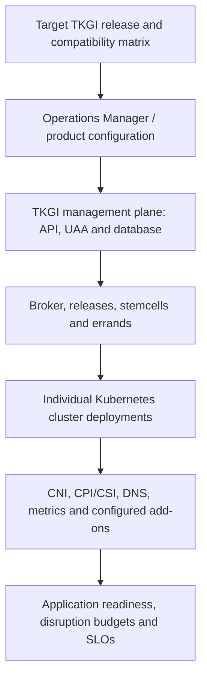

# TKGI Upgrade Architecture And Lifecycle

A TKGI upgrade is a coordinated change across several independently stateful systems.
Treating it as a single binary replacement hides the real risks: management-plane API
availability, BOSH VM replacement, Kubernetes version skew, add-on reconciliation,
network integration and application disruption budgets.

## Upgrade Domains



The management-plane upgrade and cluster upgrades are related but not identical.
Broadcom documents two principal strategies for TKGI 1.25:

- **Full upgrade:** update the management plane and run the upgrade-all-clusters
  errand in the same product deployment workflow.
- **Control-plane-first:** update TKGI API, UAA and database while deferring selected
  workload clusters for later, controlled upgrades.

The staged option supports environment waves and canaries, but every cluster must reach
the supported version before the next TKGI product upgrade. A cluster more than one
supported version behind can block or complicate the next step.

## Why BOSH Matters

BOSH applies the desired product deployment through tasks. It creates a canary VM first
for a rolling update; a canary failure stops the remaining update instead of proving the
whole deployment safe by assumption. Successful canary replacement only proves that
one representative instance reconciled. You must still observe the rest of the rollout.

For a singleton management-plane job, VM recreation can temporarily make `tkgi` API
operations unavailable. Existing Kubernetes clusters and `kubectl` access can continue
because their control planes are separate. This distinction is an important availability
and interview point.

## Pre-Upgrade Gate

Do not begin until these questions have evidence-backed answers:

1. Is the exact source-to-target path supported, including Kubernetes versions,
   infrastructure integration, NSX, Harbor and Operations Manager?
2. Are BOSH Director, TKGI deployments, databases and infrastructure healthy before
   change? An upgrade is not a repair strategy for unexplained drift.
3. Are management-plane, workload and required infrastructure backups current, and has
   the relevant restore procedure been tested?
4. Is there enough spare IP, compute, memory and disk capacity for temporary replacement
   VMs and cluster surge?
5. Do application PodDisruptionBudgets, replicas, topology spread and external
   dependencies tolerate node replacement?
6. Are certificates and credentials valid beyond the change window?
7. Are automation, admission controllers, APIs and manifests compatible with the target
   Kubernetes release?
8. Is there a documented stop condition, owner and escalation path for every wave?

## Recommended Wave Model

```text
lab/non-production management plane
  -> representative non-production clusters
  -> production management plane
  -> low-risk production canary cluster
  -> controlled cluster cohorts
  -> final stragglers before the next product upgrade
```

Select canaries by architectural representativeness, not only business importance. A
useful canary exercises the same CNI, storage classes, ingress, admission policies,
stateful workloads and external integrations as later cohorts.

## Cluster Upgrade Flow

1. Capture the TKGI cluster state, BOSH deployment, node versions and application SLOs.
2. Submit the supported cluster upgrade operation and record its task identifier.
3. TKGI generates the target cluster deployment intent.
4. BOSH reconciles control-plane and worker instances using the supported rollout policy.
5. Kubernetes reschedules evicted workloads subject to capacity and disruption rules.
6. Product errands/add-ons reconcile integrations.
7. Operators validate the Kubernetes API, nodes, system Pods, networking, storage,
   ingress, DNS, monitoring and representative application transactions.
8. Only then promote the next cohort.

## Failure Boundaries And Diagnosis

| Symptom | Likely boundary | Evidence to collect |
|---|---|---|
| product apply fails on canary | BOSH release, stemcell, job or infrastructure | Ops Manager apply output, BOSH task debug result, failing VM logs, CPI event |
| TKGI login fails after upgrade | API/UAA endpoint, certificate or singleton recreation | DNS/TLS checks, UAA/API deployment state, load-balancer health, BOSH task |
| cluster operation remains busy | broker/TKGI state or cluster BOSH task | TKGI task, broker request correlation, BOSH tasks and deployment instances |
| node replacement stalls | capacity, IP, quota, CPI or datastore | cloud config, quotas, network allocation, CPI errors, IaaS events |
| workloads unavailable during workers rollout | insufficient replicas/capacity or bad disruption policy | events, PDB status, pending Pods, scheduler reasons, application SLI |
| nodes ready but traffic fails | CNI, ingress, load balancer, policy or DNS | system Pods, routes, NSX realization, Service endpoints, probes |

Correlate by time and identifier. A TKGI task may delegate to a BOSH task that creates an
IaaS operation and later triggers a Kubernetes event. Reading only the last layer can
misidentify the root cause.

## Rollback Is Not One Button

Separate these actions:

- **Stop/pause:** prevent promotion to later cohorts.
- **Retry/reconcile:** correct a transient prerequisite and rerun a supported operation.
- **Restore:** recover data or management state from a supported backup.
- **Product downgrade:** often restricted or unsupported because schemas, releases and
  Kubernetes state may have advanced.
- **Application rollback:** restore workload manifests/images without reverting TKGI.

Never promise downgrade as the default rollback without the release-specific support
procedure. A safer plan emphasizes tested backups, small cohorts, acceptance gates and
early stop conditions.

## Production Acceptance Evidence

- desired product and cluster versions are reported consistently by TKGI, BOSH and Kubernetes;
- all BOSH instances are healthy and no unexplained tasks remain active or failed;
- Kubernetes nodes are Ready and critical system workloads are healthy;
- CNI, DNS, ingress/load balancers and storage provisioning pass synthetic tests;
- application error rate, latency, saturation and availability remain within SLO;
- logs, metrics, alerts and backups continue after upgrade;
- deprecated API scans and audit results have no unresolved blockers;
- the change record contains timestamps, owners, task IDs, anomalies and final decision.

## Interview Questions

**Why might Kubernetes workloads remain healthy while `tkgi login` is unavailable?**
The TKGI management plane and each workload cluster have different failure domains. A
singleton TKGI API/UAA VM can be recreated during an upgrade while existing cluster API
servers, kubelets and Pods continue running.

**Why choose control-plane-first upgrades?** It shortens the management-plane change for
large estates and permits controlled cluster canaries and cohorts. The trade-off is a
temporary mixed-version estate that requires compatibility governance and completion
before the next product upgrade.

**What proves an upgrade succeeded?** Version strings are necessary but insufficient.
Success requires healthy platform reconciliation plus working networking, storage,
observability and representative business transactions under the target SLO.

## Official References

- [Broadcom TKGI 1.25 understanding upgrades](https://techdocs.broadcom.com/us/en/vmware-tanzu/standalone-components/tanzu-kubernetes-grid-integrated-edition/1-25/tkgi/understanding-upgrades.html)
