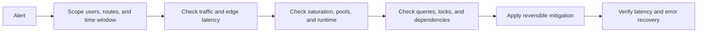

# Production Slowness Diagnosis And Rapid Mitigation Runbook

## Slowness Triage Flow



<DocLabels items={[{label: 'Incident response', tone: 'production'}, {label: 'Performance', tone: 'advanced'}, {label: 'Evidence first', tone: 'intermediate'}]} />

The fastest safe response is not “restart it and see.” First bound the impact, preserve evidence,
identify the waiting or saturated resource, apply one reversible mitigation, and verify user-visible
recovery. Restarting or scaling can erase evidence and may multiply pressure on a shared dependency.

## The First Five Minutes

1. Declare an owner and incident channel; record start time and current user impact.
2. Confirm the symptom from the user edge: endpoint, region, tenant, status code, p50/p95/p99,
   throughput, and error/timeout rate.
3. Compare now with a known-good baseline and inspect recent deployments, configuration, traffic,
   schema, feature, infrastructure, and dependency changes.
4. Check saturation and queues before averages: CPU throttling, heap/GC, threads, connection pools,
   executor queues, database locks, Kafka lag, network retransmits, and downstream latency.
5. Select one affected trace and find the longest span or uninstrumented gap.
6. Preserve thread/profile/query evidence before restart, rollback, or Pod replacement.

<StepByStepDryRun
  title="Localize a slow checkout request"
  steps={[
    {title: 'Confirm impact', action: 'Compare checkout p50, p95, p99, errors, rate, and affected dimensions.', state: 'p50=120ms, p99=8s, version=v42 only', result: 'The problem is a tail-latency regression isolated to one version.'},
    {title: 'Trace the wait', action: 'Compare one slow trace with a fast trace for the same operation.', state: '7.2s in order-lines database span', result: 'Elapsed time is localized to database work rather than CPU or network edge.'},
    {title: 'Prove the mechanism', action: 'Correlate query count, pool wait, locks, plan, and recent code change.', state: '102 queries/request; no pool wait; no blocker', result: 'A new lazy mapping loop introduced an N+1 query regression.'},
    {title: 'Mitigate', action: 'Roll back v42 while preserving traces and query evidence.', state: 'traffic returns to v41', result: 'p99 and query count return to baseline without increasing database capacity.'},
    {title: 'Prevent recurrence', action: 'Add bounded fetching and a query-count integration test.', result: 'The durable fix is verified before redeployment and canary SLO gates watch the same signal.'},
  ]}
/>

```text
scope -> recent change -> RED signals -> trace critical path -> saturation/queue
      -> reversible mitigation -> user verification -> root cause -> prevention
```

## Define “Slow” Precisely

| Question | Example evidence |
|---|---|
| which operation? | `POST /orders`, not “orders service” |
| which users/scope? | one tenant, AZ, instance, version, dependency, or all traffic |
| when did it start? | exact timestamp aligned with change and telemetry |
| which percentile? | p99 rose from 600 ms to 8 s while p50 stayed 120 ms |
| load or service-time change? | request rate doubled versus one query becoming slower |
| errors too? | timeouts, 429, 5xx, retries, cancellations |
| backlog? | active requests, queue age, connection wait, consumer lag |

Averages hide tail failures. A stable p50 with a bad p99 often points to a subset: one instance,
query shape, shard, downstream, cache miss, lock, GC pause, or cold path.

## Use RED And USE Together

- **RED for requests:** rate, errors, duration.
- **USE for resources:** utilization, saturation, errors.

High utilization without queueing may be healthy. Saturation means demand is waiting: runnable
threads, pool waiters, backlog, throttling, disk queue, locks, or dropped work. Queue growth is often
the earliest signal that latency will continue worsening.

## Layer-By-Layer Evidence Matrix

| Layer | High-value evidence | Typical bottleneck |
|---|---|---|
| edge/load balancer | upstream/connect/response time, 4xx/5xx, retries | unhealthy instance, TLS/connect, queue |
| application | route percentiles, active requests, traces, thread dump | blocking, lock, slow code, executor exhaustion |
| JVM | allocation, live set, pause, CPU, safepoint, JFR | allocation storm, leak, GC pause, hot loop |
| container/node | CPU throttling, memory pressure, restarts, network | limit too low, noisy neighbor, node fault |
| database | query latency, plan, rows, locks, connections, I/O | N+1, scan, lock wait, pool exhaustion |
| HTTP dependency | connect/TLS/TTFB, pool wait, timeout, status | dependency slowdown, retry amplification |
| Kafka/queue | lag, oldest age, processing time, rebalance | slow consumer, poison event, partition skew |
| cache | hit rate, load latency, eviction, connection wait | miss storm, hot key, undersized pool |
| network/DNS | DNS, handshake, RTT, retransmit, loss | resolution, MTU, packet loss, cross-zone path |

## Spring Boot Evidence

Expose Actuator only through authenticated, restricted management access.

```bash
curl -s http://management-host/actuator/health
curl -s http://management-host/actuator/metrics/http.server.requests
curl -s http://management-host/actuator/metrics/jvm.gc.pause
curl -s http://management-host/actuator/metrics/hikaricp.connections.pending
curl -s http://management-host/actuator/threaddump
```

Useful signals include HTTP server duration/count, executor active/queued, datasource active/pending,
JVM CPU, process CPU, allocation, live data, GC pause, and dependency-client observations. Metric
names vary with Spring/Micrometer versions and instrumentation; inspect available meters instead of
assuming a dashboard is complete.

```java
return Observation.createNotStarted("checkout", observationRegistry)
        .lowCardinalityKeyValue("operation", "place-order")
        .observe(() -> checkout(command));
```

Instrumentation should surround the operation transparently through framework observations or a
focused custom `Observation`; business behavior must not depend on telemetry being enabled.

## Trace The Critical Path

For one slow trace:

1. confirm total server duration and sampling/time alignment;
2. identify the longest child span and parent-child gaps;
3. separate connection-pool wait, connect, server processing, and response read;
4. compare a slow trace with a fast trace for the same operation and data class;
5. correlate instance, version, node, database, and dependency IDs;
6. add temporary bounded instrumentation only where an important gap remains.

Tracing localizes elapsed time but does not prove CPU cause. A long database span needs query/lock
evidence; a gap inside Java needs threads/JFR; a long client span may include pool wait or retries.

<ExpandableAnswer title="Dry run: checkout p99 rises to eight seconds">

1. p50 is stable, p99 and timeout errors affect one new application version.
2. Slow traces spend 7.2 seconds in `SELECT order_lines`; fast traces execute one query.
3. Database metrics show query count per request rose from 2 to 102, but CPU is not yet saturated.
4. The deployment added lazy access in a mapping loop: an N+1 query regression.
5. Roll back the version as the fastest reversible mitigation; do not scale the database first.
6. p99 and query count return to baseline. Add a fetch-plan/query-count integration test and deploy
   a bounded join/entity-graph fix through normal review.

</ExpandableAnswer>

## JVM And Thread Diagnosis

```bash
jcmd <pid> Thread.print -l
jcmd <pid> JFR.start name=incident settings=profile duration=120s filename=/safe/path/incident.jfr
jcmd <pid> GC.class_histogram
```

Interpret repeated evidence:

| Observation | Likely direction |
|---|---|
| many request threads waiting for one pool | downstream or pool bottleneck, not “need more threads” |
| many `BLOCKED` threads on same monitor | lock contention or oversized critical section |
| high runnable CPU plus hot JFR method | CPU algorithm, serialization, regex, compression, spin |
| high allocation plus GC CPU/pause | allocation pressure; inspect allocation flame graph/live set |
| stable live set but frequent young GC | allocation rate/young-gen sizing, not necessarily leak |
| rising post-GC live set | retention/leak; use heap dominators and GC-root paths |
| virtual threads pinned/carrier saturation | blocking inside synchronized/native boundary; inspect JFR |

Take multiple thread dumps several seconds apart. One dump is a snapshot; repeated identical stacks
show persistence. Never enable an expensive profiler or heap dump blindly on a fragile production
instance—use an approved, capacity-aware runbook.

## Database Diagnosis

Check connection acquisition time separately from query time. A request waiting five seconds for a
connection may make every query look innocent.

1. inspect pool active, idle, pending, timeout, and max;
2. find top normalized queries by total time and p95/p99;
3. inspect actual execution plan, estimates versus actual rows, I/O, and temp spill;
4. inspect lock blockers and long transactions;
5. compare query count per request for N+1;
6. verify indexes, statistics, parameter/data skew, and recent schema/query changes.

Increasing the connection pool can overload the database and worsen queueing. Tune only from the
database's concurrency capacity and end-to-end workload.

## Kubernetes And Infrastructure Checks

<CopyableCommandGroup
  title="Preserve Kubernetes evidence"
  shell="bash"
  commands={'kubectl top pod -n shopverse\nkubectl get pod -n shopverse -o wide\nkubectl describe pod <pod> -n shopverse\nkubectl get events -n shopverse --sort-by=.lastTimestamp\nkubectl logs <pod> -n shopverse --previous'}
/>

Compare slow versus healthy Pods for version, node, restarts, readiness, CPU throttling, memory,
network, DNS, and dependency routing. CPU usage at the limit plus throttling is different from low
CPU while every thread waits on a database pool.

## Rapid Mitigation Decision Table

| Evidence | Reversible mitigation | Risk to verify |
|---|---|---|
| regression aligns with deployment/config | rollback or disable feature flag | schema/event compatibility |
| one unhealthy instance/node | drain/remove after preserving evidence | reduced capacity and correlated failures |
| safe stateless saturation | bounded scale-out | downstream/database headroom |
| retry storm | reduce retries, enforce deadline, open circuit | dropped work and recovery behavior |
| optional expensive feature | shed/degrade it | correctness and customer contract |
| hot query/lock | stop offending job/query or route traffic | transaction consistency and recurrence |
| queue overload | admission control/backpressure | accepted-work ownership and client behavior |
| cache miss storm | controlled warming or fallback | stale data and backend overload |

Mitigation restores service; it is not automatically the root-cause fix. Change one variable when
possible, record the exact action/time, and retain a rollback for the mitigation itself.

## 15-Minute Incident Workflow

### Minutes 0-5: Scope And Protect

- confirm user impact and SLO breach;
- assign incident owner and freeze risky changes;
- inspect rate/errors/duration, saturation, recent changes, and affected dimensions;
- apply an emergency abort threshold if the system is approaching unsafe failure.

### Minutes 5-10: Localize

- compare fast and slow traces;
- identify the queue/pool/resource where time accumulates;
- capture bounded thread, JFR, query, Pod, and dependency evidence;
- form one falsifiable hypothesis.

### Minutes 10-15: Mitigate And Verify

- choose the smallest reversible mitigation tied to evidence;
- watch p95/p99, errors, throughput, backlog, saturation, and business correctness;
- verify from outside the service and across all affected dimensions;
- continue root-cause work even after the graph turns green.

## What Not To Do

- do not restart all instances before preserving evidence;
- do not increase every timeout—this lengthens queues and resource occupancy;
- do not add threads or connections without finding the saturated downstream resource;
- do not scale stateless Pods when the database is already overloaded;
- do not enable verbose synchronous logging during overload;
- do not optimize from one average, one trace, one thread dump, or one local benchmark;
- do not call a mitigation successful until backlog and correctness recover.

## Code Explanation: Measure Pool Wait Separately

<ExpandableAnswer title="Why separate acquisition time from operation time?">

```java
Timer.Sample sample = Timer.start(registry);
Connection connection = dataSource.getConnection();
sample.stop(registry.timer("db.connection.acquire", "pool", "orders"));
```

If acquisition consumes most latency, optimizing SQL does not remove the wait. The pool may be too
small, connections may be leaked, transactions may be too long, or the database may be saturated.
Use datasource instrumentation where possible, keep tags low-cardinality, and never tag by customer,
order ID, raw URL, or exception message.

</ExpandableAnswer>

## Recovery Proof And Follow-Up

Recovery evidence must include:

- user-visible p50/p95/p99 and error rate at representative traffic;
- throughput and dropped/rejected work;
- backlog/queue returning to baseline;
- saturated resource recovering;
- business correctness and reconciliation;
- all instances, zones, versions, tenants, and dependencies checked;
- exact mitigation, timeline, root cause, and prevention owner.

Add a regression test at the layer that failed: query-count assertion, load threshold, pool-leak test,
JFR profile comparison, bounded queue test, timeout/retry scenario, or canary SLO gate.

## Interview Questions

<ExpandableAnswer title="A Spring Boot API is suddenly slow. What do you check first?">

Define the affected operation, users, start time, percentiles, traffic, errors, and recent changes.
Then correlate RED signals with saturation/queues and compare a slow trace to a fast one. Preserve
thread, JVM, database, and instance evidence before a restart or rollback.

</ExpandableAnswer>

<ExpandableAnswer title="Why can adding more application instances make latency worse?">

If the bottleneck is a shared database, cache, broker, or dependency, more instances create more
connections and concurrent work, increasing queueing and retries. Scale only after checking
downstream headroom and the full capacity chain.

</ExpandableAnswer>

<ExpandableAnswer title="How do you distinguish a memory leak from normal heap growth?">

Compare the live set after equivalent GC cycles under stable workload. A leak shows retained growth
and a GC-root path; sawtooth allocation that returns to a stable baseline is normal. Use heap
dominators, histograms, and allocation evidence rather than one heap-used graph.

</ExpandableAnswer>

<ExpandableAnswer title="What is the quickest safe production fix?">

The smallest reversible action supported by evidence—often rollback, feature disablement, bounded
load shedding, or isolating one unhealthy instance. Verify user latency, errors, backlog, saturation,
and correctness; then implement and test the durable root-cause fix.

</ExpandableAnswer>

## Official References

- [Spring Boot observability](https://docs.spring.io/spring-boot/reference/actuator/observability.html)
- [Spring Boot Actuator endpoints](https://docs.spring.io/spring-boot/reference/actuator/endpoints.html)
- [Micrometer observations](https://docs.micrometer.io/micrometer/reference/observation.html)
- [Java Flight Recorder runtime guide](https://docs.oracle.com/en/java/javase/25/jfapi/)
- [`jcmd`](https://docs.oracle.com/en/java/javase/25/docs/specs/man/jcmd.html)
- [Kubernetes application debugging](https://kubernetes.io/docs/tasks/debug/debug-application/)

## Recommended Next

Continue with [Distributed Tracing Internals And Performance Analysis](../../observability/DISTRIBUTED-TRACING-INTERNALS-PERFORMANCE.md)
and the [Performance And Chaos Labs](./PERFORMANCE-CHAOS-LABS-INTERVIEW.md).
