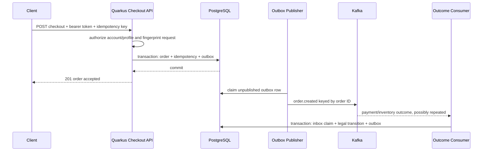

# Build A Failure-Aware Checkout Service With Quarkus

This capstone applies Quarkus mechanics to a generic checkout domain. It is a
learning design, not a complete runnable module and not an internal system
specification.

Read the [Amway Commerce And Checkout Domain Primer](../architecture/AMWAY-CHECKOUT-DOMAIN-PRIMER.md)
for the public business context behind account/profile terminology. Confirm real
field meanings from the owning schema and team.

## Outcome

The service accepts one checkout command exactly once at the business level,
creates an owned order and durable event intent atomically, publishes through an
outbox worker, consumes duplicate-prone outcomes safely, and exposes an
authorized order status.



## Step 1: State The Invariants

Before writing annotations:

- the authenticated subject may use the selected account and profile;
- market, currency, account, profile, cart, and items form one compatible
  shopping context;
- the server revalidates price, eligibility, inventory, tax, and delivery;
- one owner-scoped idempotency key identifies one canonical request;
- accepted money, item, market, profile, and attribution facts are snapshotted;
- order state and event intent commit atomically in one local database;
- Kafka delivery is at least once and transitions tolerate duplicates;
- callers can recover an unknown HTTP outcome using the same key or order query;
- no raw payment credential or sensitive account/profile body enters logs or
  event payloads.

## Step 2: Suggested Extensions

```xml
<dependencies>
  <dependency>
    <groupId>io.quarkus</groupId>
    <artifactId>quarkus-rest-jackson</artifactId>
  </dependency>
  <dependency>
    <groupId>io.quarkus</groupId>
    <artifactId>quarkus-hibernate-validator</artifactId>
  </dependency>
  <dependency>
    <groupId>io.quarkus</groupId>
    <artifactId>quarkus-hibernate-orm-panache</artifactId>
  </dependency>
  <dependency>
    <groupId>io.quarkus</groupId>
    <artifactId>quarkus-jdbc-postgresql</artifactId>
  </dependency>
  <dependency>
    <groupId>io.quarkus</groupId>
    <artifactId>quarkus-liquibase</artifactId>
  </dependency>
  <dependency>
    <groupId>io.quarkus</groupId>
    <artifactId>quarkus-messaging-kafka</artifactId>
  </dependency>
  <dependency>
    <groupId>io.quarkus</groupId>
    <artifactId>quarkus-oidc</artifactId>
  </dependency>
</dependencies>
```

Use artifact names from the platform BOM in the real project. Extension names can
evolve, so review the migration guide before upgrading.

## Step 3: Define The Command

```java
public record CheckoutRequest(
        @NotBlank String cartId,
        @NotBlank String accountId,
        @NotBlank String selectedProfileId,
        @NotBlank String market,
        @NotEmpty List<@Valid CheckoutItem> items,
        @Valid DeliverySelection delivery,
        @NotBlank String paymentIntentReference) {}
```

The request carries references and choices. It should not carry a client-trusted
price, role, order owner, PV/BV calculation, or unrestricted upstream account
document.

Create a canonical fingerprint from stable, security-relevant command fields.
Normalize deliberately: array order may be significant, decimal and Unicode
forms need rules, and excluded fields need justification. Version the fingerprint
algorithm if it may evolve.

## Step 4: Resolve Authorized Context

```java
@ApplicationScoped
public class ShoppingContextResolver {

    public AuthorizedContext resolve(
            SecurityIdentity identity,
            CheckoutRequest request) {
        Account account = accounts.findRequired(request.accountId());

        if (!account.mayBeUsedBy(identity.getPrincipal().getName())) {
            throw new ForbiddenException();
        }

        Profile profile = account.findActiveProfile(request.selectedProfileId());
        profile.requireCheckoutEligibility(request.market());
        return AuthorizedContext.from(account, profile, request.market());
    }
}
```

Do not select the first profile automatically when the requested profile is
missing or invalid. Return a safe, explicit outcome and avoid revealing another
party's relationship data.

## Step 5: Price And Validate Before The Local Transaction

Remote price, inventory, tax, or delivery calls should use a bounded overall
deadline and stable correlation. Do not keep a JDBC transaction open across
these calls.

```java
ValidatedCheckout validated = validator.validate(
        context,
        request,
        deadline);
```

If inventory requires a reservation before order creation, define reservation
expiry, idempotency, ownership, and compensation. A synchronous call chain is not
a distributed transaction.

## Step 6: Persist Order, Idempotency, And Outbox

```java
@ApplicationScoped
public class CheckoutCommandHandler {

    @Transactional
    public CheckoutResult handle(
            AuthorizedContext context,
            ValidatedCheckout checkout,
            String idempotencyKey,
            String fingerprint) {

        return attempts.find(context.subject(), idempotencyKey)
                .map(existing -> existing.replayOrReject(fingerprint))
                .orElseGet(() -> createNew(
                        context, checkout, idempotencyKey, fingerprint));
    }
}
```

`createNew` persists:

- the order and immutable commercial snapshot;
- an idempotency record linked to the stable response;
- timeline or audit evidence required by the domain;
- an `order.created` outbox record with event ID, aggregate ID, schema version,
  occurred time, correlation, and minimum necessary payload.

Database uniqueness remains required because concurrent first requests can both
miss the lookup.

## Step 7: HTTP Resource

```java
@Path("/api/checkouts")
@Authenticated
@Consumes(MediaType.APPLICATION_JSON)
@Produces(MediaType.APPLICATION_JSON)
public class CheckoutResource {

    @POST
    public Response checkout(
            @HeaderParam("Idempotency-Key") String key,
            @Valid CheckoutRequest request) {
        requireValidKey(key);
        CheckoutResult result = facade.checkout(key, request);
        return Response.status(result.created() ? 201 : 200)
                .entity(result.response())
                .build();
    }
}
```

Return `201` for the first creation and the documented replay status for a
matching retry. Conflicting reuse returns `409`. If the client times out, it
reuses the same key rather than inventing a new checkout.

## Step 8: Outbox Publisher

A scheduled or continuously running publisher claims a bounded batch of
unpublished rows, publishes, and records progress. Design for a crash after Kafka
accepts a record but before the row is marked published; that produces a
duplicate and is normal under at-least-once delivery.

The claim algorithm needs:

- concurrency control across replicas;
- stable ordering where the domain requires it;
- retry count and backoff;
- poison-row quarantine or operator workflow;
- lag, oldest-row age, success, retry, and failure metrics;
- retention and cleanup after a safe period.

## Step 9: Idempotent Outcome Consumer

```java
@ApplicationScoped
public class PaymentOutcomeConsumer {

    @Incoming("payment-outcomes")
    @Blocking
    @Transactional
    public void consume(PaymentOutcome event) {
        if (!inbox.claim(event.eventId())) {
            return;
        }

        OrderEntity order = orders.findRequired(event.orderId());
        order.applyPaymentOutcome(event);
        outbox.persist(OrderTimelineEvent.from(order, event));
    }
}
```

An inbox uniqueness constraint makes the duplicate check concurrency-safe. The
order aggregate must also reject illegal transitions, such as changing a
cancelled order back to paid because an old event was replayed.

## Step 10: Post-Checkout Query

```java
@GET
@Path("/api/orders/{orderId}")
@Authenticated
public OrderResponse find(@PathParam("orderId") String orderId) {
    return queryService.findOwnedOrder(
            identity.getPrincipal().getName(), orderId);
}
```

The response can expose pending, confirmed, failed, cancelled, refunded, or
fulfillment states according to the public API. Do not imply final payment or
shipment merely because order creation succeeded.

## Step 11: Configuration Baseline

```properties
quarkus.datasource.db-kind=postgresql
quarkus.hibernate-orm.schema-management.strategy=validate
quarkus.liquibase.migrate-at-start=true

mp.messaging.outgoing.orders-out.connector=smallrye-kafka
mp.messaging.outgoing.orders-out.topic=orders.created.v1
mp.messaging.incoming.payment-outcomes.connector=smallrye-kafka
mp.messaging.incoming.payment-outcomes.topic=payments.outcome.v1

quarkus.oidc.application-type=service
```

Supply production URLs, credentials, serializers, consumer group, TLS, timeouts,
and retry/DLT policy through approved configuration. Never rely on omitted
defaults without reviewing their effective behavior.

## Step 12: Test Matrix

### Fast tests

- canonical fingerprint stability and conflict detection;
- legal and illegal order transitions;
- snapshot mapping and sensitive-field exclusion;
- error-code mapping.

### Quarkus integration tests

- validation and JSON error contract;
- OIDC identity and other-owner authorization;
- real PostgreSQL uniqueness under concurrent requests;
- order/outbox atomic commit and rollback;
- migration from the last released schema;
- duplicate Kafka outcome and inbox behavior;
- REST-client timeout and retry classification.

### Packaged and failure tests

- run the JVM or selected native artifact, not developer mode;
- kill the process after order commit and prove the outbox later publishes;
- kill after Kafka acknowledgement and prove duplicate safety;
- pause a dependency and verify deadline, pool, breaker, and recovery behavior;
- terminate the pod during processing and prove bounded shutdown;
- load test queueing, JDBC pool, Kafka lag, CPU, memory, and p99 latency.

## Step 13: Observability Contract

Every checkout should be explainable using:

- one trace spanning authorized request, validation, local commit, and supported
  downstream calls;
- structured transition logs with bounded outcome codes;
- metrics for accepted, replayed, conflicted, failed, and unknown outcomes;
- outbox and inbox lag/duplicate evidence;
- database and HTTP pool saturation;
- Kafka consumer lag and DLT growth;
- an order timeline or audit record for customer support.

Keep account/profile IDs, order IDs, idempotency keys, emails, addresses, tokens,
and payment references out of metric labels. Log only approved identifiers and
redact sensitive payloads.

## Review Checklist

- Is checkout the correct owner of every persisted field?
- Can the caller use the account/profile, not merely name it?
- Is idempotency scoped and fingerprinted?
- Are remote calls outside the local transaction?
- Do order and event intent commit atomically?
- Are event schemas versioned and consumers duplicate-safe?
- Are compensation and post-checkout transitions auditable?
- Can operators reconcile an unknown outcome without database editing?
- Do tests cover negative authorization, concurrency, crash windows, replay, and
  native packaging when selected?

## Official References

- [Quarkus REST](https://quarkus.io/guides/rest)
- [Hibernate ORM With Panache](https://quarkus.io/guides/hibernate-orm-panache)
- [Using Transactions](https://quarkus.io/guides/transaction)
- [Apache Kafka Reference](https://quarkus.io/guides/kafka)
- [OIDC Bearer Token Authentication](https://quarkus.io/guides/security-oidc-bearer-token-authentication)
- [Testing Your Application](https://quarkus.io/guides/getting-started-testing)
- [OpenTelemetry](https://quarkus.io/guides/opentelemetry)

## Related ShopVerse Guides

- [Checkout, Security, And Event Flows](../architecture/CHECKOUT-SECURITY-EVENT-FLOWS.md)
- [API And Event Compatibility](../architecture/API-EVENT-COMPATIBILITY.md)
- [Idempotent Commands](../development/spring-rest/REST-IDEMPOTENT-COMMANDS.md)
- [Transactional Outbox](../reliability/OUTBOX-PATTERN.md)
