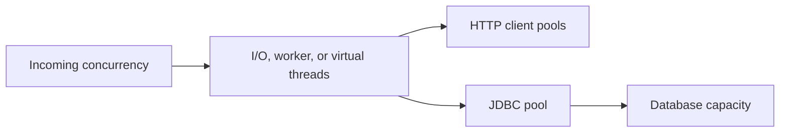

# Quarkus Native Images, Containers, And Kubernetes Production

Quarkus is designed for container workloads, but production readiness comes from
measured packaging, secure images, correct lifecycle signals, capacity limits,
and recovery evidence.

## 1. Package Options

### JVM fast-jar

```powershell
.\mvnw.cmd clean verify package
java -jar target\quarkus-app\quarkus-run.jar
```

The JVM path usually provides the richest operational tooling and simplest build.
Copy the full `target/quarkus-app` layout into the image.

### Native executable

On Windows or macOS, a container build can produce a Linux executable:

```powershell
.\mvnw.cmd clean verify package -Dnative -Dquarkus.native.container-build=true
```

Native compilation uses a closed-world analysis. Dynamic reflection, proxying,
resource loading, serialization, JNI, security providers, and class initialization
may need explicit support from extensions or application registration.

<DocCallout type="mistake" title="Native is a deployment option, not a maturity level">

A native binary can start quickly and use less memory for some workloads, but it
costs more build time and has different diagnostic constraints. Choose it from
measured workload and operational evidence, not because it sounds more advanced.

</DocCallout>

## 2. Benchmark The Decision

Compare equivalent release artifacts using:

- cold and warm startup time;
- idle, steady-state, and peak resident memory;
- throughput and p50/p95/p99 latency after warmup;
- CPU per request;
- image size and pull time;
- build time, build memory, and CI cost;
- scale-out and restart recovery time;
- thread dump, heap, JFR, profiler, and incident capabilities;
- reflection/resource maintenance and native-only failures.

Control Java version, CPU architecture, base image, resource limits, traffic,
dependencies, dataset, and warmup. One laptop request is not a capacity test.

## 3. Container Image Principles

A production image should:

- use a pinned, approved base image;
- run as a non-root user;
- contain only the required application and runtime files;
- avoid package managers, shells, and build tools unless operations require them;
- expose no credentials in layers, build arguments, history, or environment
  dumps;
- use immutable tags or digests in deployment;
- include provenance, SBOM, vulnerability scan, and signature according to policy;
- write logs to standard output and store durable state externally.

Quarkus container-image extensions can build images with Jib, Docker, Podman, or
other supported integrations. Review the generated Dockerfiles and resources;
generation does not replace supply-chain review.

## 4. Kubernetes Resource Generation

The Kubernetes extension can generate manifests from application configuration.
It does not know business capacity or organizational policies automatically.

```properties
quarkus.kubernetes.name=checkout-service
quarkus.kubernetes.replicas=2
quarkus.kubernetes.resources.requests.memory=256Mi
quarkus.kubernetes.resources.requests.cpu=250m
quarkus.kubernetes.resources.limits.memory=512Mi
quarkus.kubernetes.resources.limits.cpu=1
```

Treat these values as illustrative. Derive requests and limits from load tests,
pool sizes, allocation behavior, dependency latency, and failure scenarios.

Generated resources need review for:

- namespace, labels, annotations, service account, and workload identity;
- network policies and egress destinations;
- secrets and configuration mounting;
- probes and graceful shutdown;
- resource requests, limits, autoscaling, and disruption budgets;
- topology, anti-affinity, zones, and failure domains;
- deployment rollout and rollback strategy;
- ingress, TLS, rate limits, and maximum request size.

## 5. Probes And Lifecycle

| Probe | Meaning | Incorrect use |
|---|---|---|
| startup | application is still initializing | using an arbitrarily large delay to hide slow or broken startup |
| readiness | instance can accept promised traffic now | failing because any optional downstream is unavailable |
| liveness | process cannot recover without restart | using it as a dependency monitor and creating restart storms |

Graceful termination should:

1. mark the instance unready;
2. stop accepting new work;
3. allow bounded in-flight HTTP requests to complete;
4. stop or drain message consumption according to connector behavior;
5. flush or persist required progress;
6. close pools and exit before the termination grace period.

Test shutdown during an HTTP checkout, an outbox publish, a Kafka record, and a
database transaction. Kubernetes manifest inspection alone does not prove the
behavior.

## 6. Resource And Pool Alignment



The smallest constrained resource becomes a queue. Align:

- server request concurrency and request-body limits;
- worker or virtual-thread use;
- JDBC pool size and database connection budget;
- outbound HTTP connection pools;
- Kafka partitions and consumer concurrency;
- CPU quota and throttling;
- heap/native memory and container limit;
- timeout and queue-wait budgets.

More threads do not create more database connections or CPU. An unlimited queue
turns overload into high latency and memory pressure.

## 7. Native-Specific Verification

When native packaging is selected, add a packaged-artifact test gate that covers:

- JSON serialization and deserialization of every contract family;
- validation and exception mappers;
- ORM entities, projections, and migrations;
- REST client proxies and TLS;
- OIDC/JWT algorithms and security providers;
- Kafka serializers, deserializers, and reflection;
- templates, static resources, and resource bundles;
- observability exporters and context propagation;
- locale, time zone, charset, and certificate behavior.

Quarkus extensions often register their own requirements. Custom libraries and
dynamic frameworks need special review.

## 8. Deployment Gate

Before promotion, prove:

- unit, JVM integration, contract, and packaged-artifact tests pass;
- schema migration is compatible with old and new application versions during
  rollout;
- readiness, graceful shutdown, and rollback work;
- load and soak tests remain inside latency and resource objectives;
- dependency failure causes bounded degradation, not retry storms;
- logs, metrics, traces, and alerts identify customer impact;
- security scanning, signing, SBOM, secrets, and least privilege meet policy;
- operators can reconcile unknown checkout and event outcomes.

## Official References

- [Building A Native Executable](https://quarkus.io/guides/building-native-image)
- [Native Reference Guide](https://quarkus.io/guides/native-reference)
- [Container Images](https://quarkus.io/guides/container-image)
- [Kubernetes Extension](https://quarkus.io/guides/deploying-to-kubernetes)
- [SmallRye Health](https://quarkus.io/guides/smallrye-health)
- [Application Initialization And Termination](https://quarkus.io/guides/lifecycle)

## Next

Apply the complete track in the [Failure-Aware Checkout Tutorial](./QUARKUS-CHECKOUT-TUTORIAL.md).

