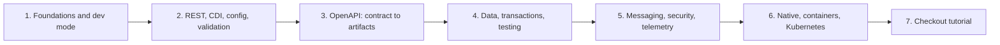
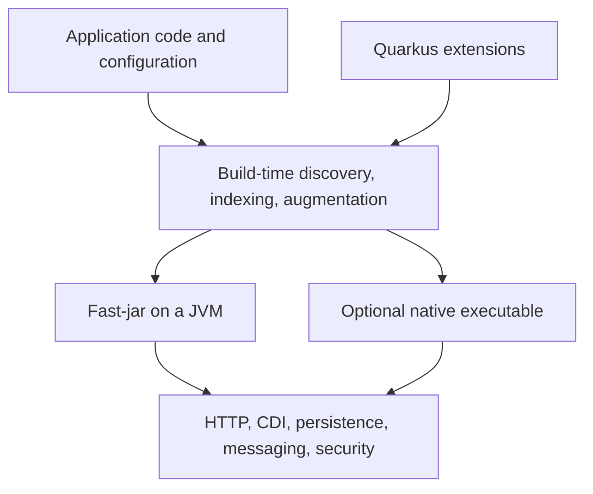

# Quarkus Beginner-To-Advanced Learning Path

<DocLabels items={[{label: 'Beginner to advanced', tone: 'intermediate'}, {label: 'Hands-on', tone: 'shopverse'}, {label: 'Production', tone: 'production'}]} />

Quarkus is a Java framework for REST APIs, microservices, event-driven services,
and container or Kubernetes workloads. It combines Jakarta standards with a
build-time augmentation model, a curated extension ecosystem, developer mode,
and optional native compilation.

This route starts with the runtime model and ends with a failure-aware checkout
service. It teaches Quarkus concepts without pretending that framework choice
solves domain boundaries, distributed consistency, security, or operations.

<DocCallout type="shopverse" title="ShopVerse remains a Spring implementation">

The ShopVerse services in this repository use Spring Boot. Quarkus examples in
this track are independent learning material and are not claims about the
implemented ShopVerse runtime or the proprietary architecture of another
project.

</DocCallout>

## Learning Map



| Stage | What you learn | Evidence to produce |
|---|---|---|
| Beginner | project shape, extensions, dev mode, JVM packaging, build-time augmentation | run a health endpoint and explain the build output |
| Application | Jakarta REST, JSON, validation, CDI, configuration, errors | implement and test a validated resource |
| Data | Panache, repository choices, transactions, migrations, Dev Services, test boundaries | prove rollback and database behavior |
| Distributed | REST clients, timeouts, Kafka, idempotency, OIDC, metrics, logs, traces | follow one correlation ID across boundaries |
| Advanced | blocking versus reactive, native images, containers, Kubernetes, capacity and recovery | compare JVM and native artifacts using measurements |
| Domain tutorial | cart, account/profile context, checkout, outbox, post-checkout transitions | defend invariants and unhappy-path tests |

## Recommended Order

1. [Quarkus Foundations](./QUARKUS-FUNDAMENTALS.md)
2. [REST, CDI, Configuration, And Validation](./QUARKUS-REST-CDI-CONFIG.md)
3. [OpenAPI Fundamentals](./QUARKUS-OPENAPI-FUNDAMENTALS.md)
4. [Generate And Verify A Provider Contract](./QUARKUS-OPENAPI-PROVIDER.md)
5. [Generate, Package, And Consume Clients](./QUARKUS-OPENAPI-CLIENT-ARTIFACTS.md)
6. [Data, Transactions, And Testing](./QUARKUS-DATA-TRANSACTIONS-TESTING.md)
7. [Messaging, Security, And Observability](./QUARKUS-INTEGRATION-SECURITY-OBSERVABILITY.md)
8. [Native Images, Containers, And Kubernetes](./QUARKUS-NATIVE-KUBERNETES-PRODUCTION.md)
9. [Failure-Aware Checkout Tutorial](./QUARKUS-CHECKOUT-TUTORIAL.md)

## Quarkus Mental Model



Quarkus moves work such as metadata discovery and framework wiring toward build
time. That can reduce runtime startup work, but it also makes build inputs,
extension compatibility, reflection requirements, and configuration phase more
important.

### What Quarkus is not

- It is not automatically reactive; imperative and reactive models are both
  supported.
- It does not require native compilation; JVM mode is a normal production
  choice.
- It does not make every application stateless or Kubernetes-ready by itself.
- Panache does not remove transaction, query, locking, or schema responsibilities.
- Dev Services are development conveniences, not production infrastructure.
- An annotation does not establish correct authorization, idempotency, or event
  delivery semantics.

## Spring Boot Translation Guide

| Concern | Spring-style term | Common Quarkus mechanism |
|---|---|---|
| HTTP resource | `@RestController` | Jakarta REST `@Path` resource |
| HTTP method | `@GetMapping`, `@PostMapping` | `@GET`, `@POST` |
| injection | constructor injection, `@Autowired` | CDI constructor injection or `@Inject` |
| singleton service | `@Service` | `@ApplicationScoped` bean |
| configuration binding | `@ConfigurationProperties` | SmallRye Config `@ConfigMapping` |
| validation | Jakarta Validation | Jakarta Validation |
| transaction | `@Transactional` | Jakarta Transaction `@Transactional` |
| persistence convenience | Spring Data | Hibernate ORM with Panache or plain Hibernate ORM |
| HTTP client | HTTP interface or OpenFeign | Quarkus REST Client |
| integration test | `@SpringBootTest` | `@QuarkusTest` or `@QuarkusIntegrationTest` |
| health and metrics | Actuator and Micrometer | SmallRye Health and Micrometer/OpenTelemetry extensions |

The mapping is conceptual, not one-to-one. CDI discovery, interceptors,
configuration precedence, HTTP execution, test startup, and native-image behavior
have different rules and must be learned directly.

## Toolchain Quick Reference

For a Maven wrapper on Windows:

```powershell
.\mvnw.cmd quarkus:dev
.\mvnw.cmd test
.\mvnw.cmd verify
.\mvnw.cmd package
java -jar target\quarkus-app\quarkus-run.jar
```

Useful project evidence:

```text
pom.xml
src/main/java/
src/main/resources/application.properties
src/test/java/
target/quarkus-app/
src/main/docker/
```

Do not copy command versions blindly. Prefer the Maven or Gradle wrapper and the
platform BOM already committed by the project.

## Completion Standard

You are ready to work independently when you can:

- identify every extension and why it exists;
- trace an HTTP request through resource, service, transaction, repository, and
  integration boundaries;
- explain whether code runs on an I/O thread or worker thread;
- identify which configuration is fixed at build time and which changes at
  runtime;
- demonstrate resource authorization and negative security tests;
- prove database rollback, idempotent retry, Kafka duplicate handling, and
  unknown-outcome recovery;
- compare JVM and native deployment with measured startup, memory, throughput,
  tail latency, build time, and diagnostic needs;
- locate logs, metrics, traces, health checks, and recovery procedures.

## Official Starting Points

- [Quarkus Getting Started](https://quarkus.io/guides/getting-started)
- [Quarkus REST](https://quarkus.io/guides/rest)
- [Quarkus OpenAPI And Swagger UI](https://quarkus.io/guides/openapi-swaggerui)
- [CDI Reference](https://quarkus.io/guides/cdi-reference)
- [Configuration Reference](https://quarkus.io/guides/config-reference)
- [Testing Your Application](https://quarkus.io/guides/getting-started-testing)
- [Quarkus Guides](https://quarkus.io/guides/)
