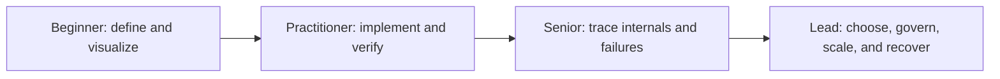

# Documentation Guide

Documentation is structured teaching that lets a reader move from a plain-language
definition to implementation and lead-engineer judgment. This guide explains how
to navigate and maintain that system without duplicating canonical content.

## Page Overview

- **Reader paths** choose the right entry point for learning, operating, or
  maintaining Shopverse.
- **Learning depth** defines what beginner, practitioner, senior, and lead-level
  coverage means.
- **Content types** separate concepts, examples, operations, and case-study proof.
- **Quality rules** link the standards and measurable audit backlog.

After reading, you should be able to select the canonical page for a topic,
recognize when a large page should be segregated, and review whether a page has
real depth rather than merely sufficient length.

## Prerequisites

No technical prerequisite is required. Maintainers should know basic Markdown,
relative links, and that Docusaurus document IDs may be public URLs.

## Reader Paths

| Goal | Start here | Then use |
|---|---|---|
| learn backend engineering | [Learning Path](./LEARNING-PATH.mdx) | ordered concept, tutorial and lab pages |
| understand Shopverse | [Shopverse Case Study](../case-study/SHOPVERSE.mdx) | code flows, demos and operations |
| find terminology | [Glossary](./GLOSSARY.md) | canonical concept pages linked from definitions |
| run a feature | [Features And Demonstrations](./FEATURES-AND-DEMOS.md) | implementation guide and troubleshooting |
| maintain the docs | [Documentation Structure](./DOCUMENTATION-STRUCTURE.md) | maintenance map, standards and audits |

## Content Types

- **Concept:** mental model, internals and trade-offs.
- **Tutorial:** ordered learning with examples and exercises.
- **Decision guide:** requirements, alternatives and selection rules.
- **Lab:** bounded executable proof with assertions and cleanup.
- **Runbook:** operational detection, response and recovery.
- **Case study:** application of canonical concepts to a system.
- **Interview/reference:** revision and evaluation, not canonical ownership.

Generic pages own reusable explanations. Shopverse pages own repository code,
configuration, evidence and known gaps. Labs prove behavior; runbooks operate it.

## Learning Depth



Every topic must provide an entry at the beginner layer. Focused pages may own
later layers, provided the overview briefly explains each topic and links the
pages in dependency order. A reader should never need an external assistant merely
to discover the definition, the first valid example, a critical edge case, or
the next page in the track.

## Page Completion Checklist

A topic page is editorially complete only when a reviewer can point to:

- a bounded definition, purpose, overview, prerequisites, and terminology;
- a correct mental model and examples from minimal through failure/edge cases;
- causal internals, guarantees, non-guarantees, and trade-offs;
- production security, performance, diagnostics, recovery, and compatibility;
- tricky reasoning questions with model-answer signals;
- canonical cross-links, recommended next steps, and authoritative references.

`documentation/governance/learning-progression-standard.md` is the complete
authoring contract. Automated checks create review queues; they do not prove
technical correctness.

## Overview And Revision Pages

An **overview page** is the first read for a large domain. It owns the domain mental
model, a brief topic map, important decisions and misconceptions, the recommended
learning order, and links to canonical deep dives. It explains how subjects relate
without copying their full implementation details.

A **revision page** is a compact recall aid used after the deep dives. It owns
one-sentence definitions, comparison tables, guarantee boundaries, common failure
prompts, rapid interview answers, and a final checklist. Revision pages link back
to canonical explanations instead of becoming a second source of truth.

Use this route consistently:

```text
Overview -> Fundamentals -> Deep dives -> Production/Labs -> Revision -> Interview practice
```

Do not add a new overview or revision page when an existing landing page or
cheatsheet already serves that purpose. Strengthen and link the existing canonical
page instead.

## Authoring And Quality

- [Documentation Structure](./DOCUMENTATION-STRUCTURE.md)
- [Canonical Maintenance Map](./DOCUMENTATION-MAINTENANCE-MAP.md)
- [Reusable Components](./DOCUMENTATION-COMPONENTS.mdx)
- [Visual And Reference Standard](./VISUAL-REFERENCE-STANDARD.md)
- [Quality Audit And Backlog](./DOCUMENTATION-QUALITY-AUDIT.md)
- [Final Audit Evidence](./FINAL-DOCUMENTATION-AUDIT.md)
- [Code Cross-Check](./CODE-CROSS-CHECK.md)

## Recommended Next Page

Begin the curriculum with the [Backend Engineering Learning Path](./LEARNING-PATH.mdx).

## Official References

- [Docusaurus documentation](https://docusaurus.io/docs)
- [CommonMark specification](https://spec.commonmark.org/)
