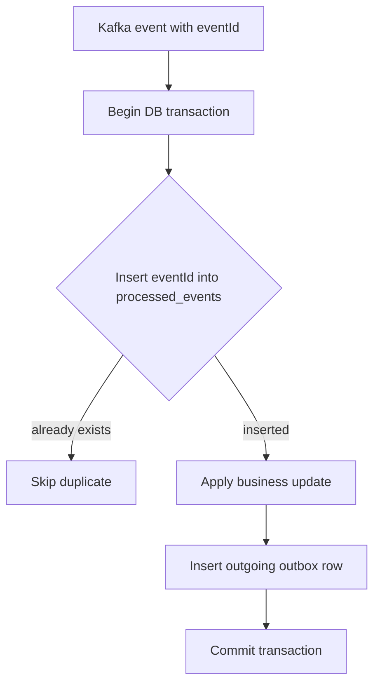

# Inbox Pattern And Idempotent Consumers

The inbox pattern solves the consumer-side duplicate-processing problem:

> How do we make sure the same received event does not apply the same business
> effect twice?

It is the natural partner of the transactional outbox pattern.

## Guarantee And Boundary

The inbox provides **effectively-once application of a local transactional
business effect** when the same event is delivered more than once. It does not
make the broker exactly-once, create global event ordering, or make a database
transaction atomic with an external HTTP call.

The guarantee is precise:

```text
For one logical consumer and one immutable event ID,
the inbox marker, local business change, and outgoing outbox intent
either commit together once or roll back together.
```

The logical consumer is a stable handler identity such as
`inventory-order-created`; it is not a Pod name, thread, consumer instance, or
deployment version. All replicas of the same handler must compete on the same
uniqueness key.

## Problem Statement

Kafka and most message brokers are commonly used with at-least-once delivery.
That means a record should not be lost, but it can be delivered more than once.

Duplicate delivery can happen when:

- a consumer updates its database but crashes before committing the Kafka
  offset;
- Kafka rebalances partitions before the previous consumer commits progress;
- retry topics redeliver a failed event;
- a DLT replay republishes the original payload;
- an outbox publisher republishes after crash recovery.

Without idempotent consumers, duplicate delivery can repeat business effects:

```text
Duplicate order.created      -> reserve stock twice
Duplicate inventory.reserved -> charge payment twice
Duplicate payment.completed  -> append duplicate confirmation work
```

## Solution

Every event carries an immutable event ID. Each consumer records that event ID
before applying business logic.

```json
{
  "eventId": "evt-7b0b8c8f",
  "orderNumber": "ORD-1003",
  "correlationId": "SAGA-ORD-1003"
}
```

Each consuming service owns a table. A production-oriented PostgreSQL schema is:

```sql
CREATE TABLE processed_events (
  event_id          VARCHAR(100) NOT NULL,
  consumer_name     VARCHAR(100) NOT NULL,
  event_type        VARCHAR(150) NOT NULL,
  aggregate_id      VARCHAR(150),
  aggregate_version BIGINT,
  source_topic      VARCHAR(200),
  source_partition  INTEGER,
  source_offset     BIGINT,
  received_at       TIMESTAMPTZ NOT NULL,
  processed_at      TIMESTAMPTZ NOT NULL,
  PRIMARY KEY (consumer_name, event_id)
);

CREATE INDEX idx_processed_events_processed_at
  ON processed_events (processed_at);
```

Only `(consumer_name, event_id)` decides duplication. Topic, partition, offset,
aggregate information, and timestamps are operational evidence. Do not use a
payload hash as the primary identity: two valid events can have identical
payloads, while serialization or metadata changes can alter the hash of the
same logical event.

Then the handler performs the inbox insert, business update, and outgoing
outbox insert in one local transaction:

```java
@Transactional
public void handle(OrderCreatedEvent event) {
    if (!processedEventRepository.tryInsert(
            event.eventId(),
            "inventory-service"
    )) {
        return;
    }

    inventoryService.reserve(...);
    outboxService.enqueue(...);
}
```

If the event was already processed, the unique constraint prevents a second
insert and the handler skips the business effect.

## Concurrency-Safe Insert

Do not implement deduplication as an unprotected `existsById()` followed by
`save()`. Two consumer threads can both observe absence and apply the effect.
Let the database arbitrate through one atomic insert and a unique constraint.

With PostgreSQL:

```sql
INSERT INTO processed_events (
  event_id, consumer_name, event_type, aggregate_id,
  aggregate_version, source_topic, source_partition, source_offset,
  received_at, processed_at
)
VALUES (
  :eventId, :consumerName, :eventType, :aggregateId,
  :aggregateVersion, :topic, :partition, :offset,
  CURRENT_TIMESTAMP, CURRENT_TIMESTAMP
)
ON CONFLICT (consumer_name, event_id) DO NOTHING;
```

An affected-row count of `1` means this transaction owns processing. A count of
`0` means another successful transaction already processed the event, so the
handler returns normally and allows Kafka to commit the offset.

For a database without an equivalent insert-if-absent statement, attempt the
insert and treat a unique-key violation as a duplicate **after rolling back that
transaction**. Do not catch a JPA constraint exception and continue using a
transaction that the persistence provider has marked rollback-only.

## Spring And Kafka Implementation

Keep the Kafka listener thin and put the inbox, domain write, and outgoing
outbox write behind one transactional service method:

```java
@KafkaListener(topics = "order-events", groupId = "inventory-service")
public void onOrderCreated(OrderCreatedEvent event) {
    eventProcessor.process(event);
}
```

```java
@Transactional
public ProcessingResult process(OrderCreatedEvent event) {
    int inserted = processedEventRepository.insertIfAbsent(
        event.eventId(),
        "inventory-order-created",
        event.eventType(),
        event.orderNumber(),
        event.aggregateVersion()
    );

    if (inserted == 0) {
        return ProcessingResult.DUPLICATE;
    }

    inventoryService.reserveWithExpectedVersion(
        event.orderNumber(),
        event.items(),
        event.aggregateVersion()
    );

    outboxService.enqueueInventoryReserved(event);
    return ProcessingResult.APPLIED;
}
```

The repository can expose a database-specific native insert returning the
affected-row count. Keep that choice isolated in the persistence adapter so the
domain handler remains portable.

The listener should complete successfully for an already-processed event.
Unexpected database, validation, or business-transition failures should escape
the transaction so the inbox insert, domain update, and outbox row all roll back.
Configure Spring Kafka acknowledgement and error handling so the source offset
is committed only after the listener returns successfully.

## Why This Must Be Transactional

The inbox row and business change must commit together.

```text
processed_events insert
business update
outgoing outbox row
= one local transaction
```

If the business update fails, the processed-event insert must roll back too.
Otherwise the service would remember the event as processed even though it did
not complete the work.

## Database Commit And Kafka Offset Sequence

The database and Kafka consumer offset are normally not one atomic transaction.
The safe sequence is:

```text
poll event
-> begin local database transaction
-> insert inbox marker
-> apply guarded business change
-> insert outgoing outbox intent
-> commit database transaction
-> return from listener
-> commit Kafka offset
```

The remaining crash windows are safe when the inbox is correct:

| Failure point | Result | Recovery |
|---|---|---|
| before database commit | no durable inbox or business effect | Kafka redelivers and processing starts again |
| during business processing | entire local transaction rolls back | fix transient cause and retry |
| after database commit, before offset commit | business effect exists but Kafka redelivers | inbox detects the event and skips the effect |
| after offset commit | database effect and offset are durable | normal continuation |
| outgoing outbox relay publishes twice | downstream receives duplicates | downstream inbox or business idempotency deduplicates |

Do not commit the Kafka offset before the database transaction succeeds. Kafka
producer idempotence or Kafka transactions do not automatically deduplicate an
ordinary SQL update or external provider call.

## Why Not Use Consumer ID, Offset, Or Trace ID?

Technical identifiers do not represent durable business identity.

| Identifier | Why it is not enough |
|---|---|
| consumer ID | changes after restart, scaling, and rebalance |
| group ID | identifies a whole consumer group, not one event |
| topic + partition + offset | identifies one physical Kafka record only; retry, DLT, and replay can create another physical record for the same business event |
| Kafka key | controls partitioning and ordering, but Kafka allows many records with the same key |
| trace ID | tracks one technical execution path, not durable business identity |
| correlation ID | useful for searching a business journey, but not necessarily unique per event |

The duplicate-detection key must identify the event itself. That is why the
inbox pattern uses an immutable `eventId`.

## Event Identity, Replay, And Consumer Scope

The producer creates `eventId` once when it creates the event, preferably in the
same transaction as its outbox row. Relays, retry topics, DLT replay, replication,
and operator replay must preserve that ID. A consumer must never generate a new
ID merely because it received the record again.

Use a different identity for a genuinely new business fact. For example, two
separately approved refunds require two event IDs even when their amounts match.
A retry of the first refund keeps the first event and operation IDs.

`consumer_name` defines which effect is protected:

```text
(inventory-order-created, evt-123) -> inventory reservation effect
(analytics-order-created, evt-123) -> analytics projection effect
```

Both consumers can legitimately process the same event once. Keep the name
stable across replicas and ordinary deployments. For an intentional projection
rebuild, use a controlled replay namespace or a fresh projection store rather
than deleting live inbox history casually.

## Ordering And Aggregate Versions

Inbox deduplication answers, "Have I applied this event?" It does not answer,
"Is this event currently valid?" Use both Kafka partitioning and guarded domain
state:

- key related events by the required ordering identity, such as `orderNumber`;
- carry an aggregate version or business sequence when order matters;
- compare the incoming version with the stored version;
- make state transitions conditional on the expected current state/version;
- treat a version gap as a retry, parking, or reconciliation case according to
  an explicit late-event policy;
- treat a stale event as an observable no-op, not permission to move state
  backward.

Insert the inbox marker and make the guarded transition in the same transaction.
Decide explicitly whether a valid but stale no-op counts as processed; otherwise
it can retry forever.

## External Side Effects

An inbox row and an HTTP call, email, payment-provider request, or warehouse
command cannot share an ordinary local database transaction. A crash after the
external system accepts the request but before the inbox transaction commits
can cause the call to be repeated.

Prefer this design:

```text
incoming inbox + local state + outgoing command outbox
                    commit atomically
                              |
                              v
worker sends command using stable provider idempotency key
                              |
                              v
record verified result or UNKNOWN, then reconcile
```

If the provider does not support idempotency, define a status-query or
reconciliation mechanism and a manual decision boundary. The inbox alone cannot
promise exactly-once external effects.

## Retry, DLT, And Poison Events

- Retry transient infrastructure failures with bounded backoff and preserve the
  original event ID.
- Do not retry permanent schema or business rejections forever. Route them to a
  governed DLT or failed-event store with reason and source metadata.
- Do not commit an inbox marker for an event whose required business effect was
  not completed, unless the recorded terminal rejection is itself the intended
  durable business outcome.
- Replay through an audited path that preserves identity, validates current
  schema support, limits rate, and records actor and reason.
- Monitor events parked behind an ordering-sensitive failure; allowing later
  events to overtake it can violate the aggregate state machine.

## Retention And Cleanup

Inbox history must live at least as long as a duplicate can return. Set retention
from the maximum of:

```text
broker retention
retry and DLT retention
backup restore window
cross-region replication delay
approved operational replay/backfill horizon
```

If indefinite replay is required, retain compact deduplication keys indefinitely
or rebuild into a new consumer namespace/store. Deleting markers and then
replaying old events repeats their effects.

For large tables, index cleanup by `processed_at`, delete in bounded batches or
drop validated time partitions, and rate-limit maintenance so it does not block
live inserts. Archive audit metadata when policy requires it. Cleanup must never
remove records newer than the documented replay horizon.

## Observability And Operations

Track low-cardinality metrics by service, logical consumer, event type, and
outcome:

| Signal | Why it matters |
|---|---|
| `inbox_processed_total` | accepted first-time events |
| `inbox_duplicate_total` | broker, relay, retry, or replay duplication rate |
| `inbox_processing_failures_total` | rolled-back handler attempts |
| processing latency | slow database or business handler |
| oldest retry/DLT age | customer-impacting stuck work |
| aggregate version-gap count | missing, delayed, or incorrectly keyed events |
| inbox table size and cleanup age | retention and capacity risk |
| inbox/outbox reconciliation mismatch | committed effects without expected continuation |

Do not use `eventId`, order number, or customer ID as metric labels. Put those
high-cardinality identifiers in structured logs and traces with correlation and
causation IDs.

An operational runbook should answer:

1. Is the event a duplicate, stale, out of order, malformed, or transiently failing?
2. Did the inbox, domain change, and outgoing outbox commit together?
3. Was the Kafka offset committed, retried, or moved to DLT?
4. Did an external side effect occur despite an unknown local outcome?
5. Should operators retry, replay, compensate, reconcile, or suppress?
6. What evidence proves recovery did not repeat the business effect?

## Shopverse Current Status

Shopverse has not fully implemented the inbox pattern yet.

Current implementation uses state-based idempotency:

| Service | Current duplicate protection |
|---|---|
| Order checkout | mandatory `Idempotency-Key` and unique order column |
| Inventory consumer | checks reservation by `orderNumber` before reserving stock |
| Payment consumer | checks payment by `orderNumber` before processing payment |
| DLT persistence | suppresses common duplicate unresolved records by source topic and payload |

Inventory example:

```java
if (reservationRepository.findByOrderNumber(orderNumber).isPresent()) {
    return true;
}
```

Payment example:

```java
return repository.findByOrderNumber(orderNumber).orElseGet(() -> {
    // create and process payment once
});
```

This is acceptable for the POC because the business invariant is simple:

```text
one order -> one reservation
one order -> one payment
```

## Recommended Shopverse Enhancement

To make Shopverse stronger, add:

1. `eventId` to every SAGA event.
2. `processed_events` table in Order, Inventory, and Payment services.
3. unique constraint on `(event_id, consumer_name)`.
4. inbox insert inside the same transaction as business state update.
5. outgoing outbox enqueue in the same transaction when the consumer emits the
   next SAGA event.
6. aggregate version and guarded state transitions for late events.
7. retention, cleanup, metrics, alerts, DLT replay, and reconciliation policies.

Example consumer flow:



## Benefits

- duplicate Kafka records do not repeat business effects;
- replay becomes safer;
- event processing is auditable;
- consumer deduplication is explicit instead of inferred only from current
  business state;
- outbox and inbox together form a reliable at-least-once event-processing
  model.

## Limits

Inbox does not remove the need for:

- business-level idempotency for external providers;
- payment-provider idempotency keys;
- careful schema compatibility;
- monitoring of poison events, retries, and DLT;
- compensation for valid business failures.

It also does not replace aggregate-version checks, authorization, payload
validation, schema governance, ordering design, or reconciliation.

## Deployment And Migration

Use an expand-first rollout:

1. Add immutable event IDs to event contracts and producer outboxes while old
   consumers continue to work.
2. Validate that normal publication, retry, DLT, and replay paths preserve IDs.
3. Create `processed_events`, its unique key, cleanup index, permissions, and
   capacity alerts in each consuming database.
4. Deploy consumers that atomically insert inbox + update domain + enqueue
   outbox; keep `consumer_name` stable across the rolling deployment.
5. Exercise duplicate and crash-window tests before enabling broad replay.
6. Monitor duplicate rate, failures, table growth, lag, and version gaps.
7. Only then retire weaker read-before-write deduplication where the business
   uniqueness constraint is no longer the primary defense.

Keep business uniqueness constraints even after inbox adoption. They provide a
second line of defense against different events requesting the same forbidden
business effect.

## Verification Matrix

Automate these cases with a real database and Kafka/Testcontainers where
possible:

| Test | Expected evidence |
|---|---|
| deliver one event twice sequentially | one domain effect, one inbox row, duplicate metric increments |
| deliver the same event concurrently | unique constraint chooses one winner; one domain effect |
| fail after inbox insert | transaction rolls back; retry later succeeds |
| fail after domain update | inbox and domain update roll back together |
| crash after DB commit before offset commit | redelivery is skipped; outgoing effect is not duplicated |
| duplicate outgoing outbox publication | downstream inbox applies one effect |
| replay from retry topic or DLT | original event ID is retained and deduplicated |
| receive stale aggregate version | no backward transition; observable stale outcome |
| receive version gap | event is parked/retried and reconciled by policy |
| cleanup boundary test | no marker within the supported replay horizon is removed |
| external provider timeout | stable operation ID is reused and outcome is reconciled |

The production acceptance criterion is not merely "the consumer returned
success." Prove the invariant using the inbox row, domain state, outgoing outbox,
offset/retry evidence, metrics, and reconciliation result.

## Interview Questions

### Why is `exists()` followed by `save()` unsafe?

It is a check-then-act race. Concurrent deliveries can both observe absence.
Use one atomic insert protected by a database unique constraint.

### Why include `consumer_name` in the primary key?

Different logical handlers may legitimately apply different effects for the
same event. The key prevents repetition per effect, not globally across every
consumer.

### What happens if the database commits but the Kafka offset does not?

Kafka redelivers. The committed inbox marker makes the second attempt a no-op,
after which the listener can commit the offset safely.

### Does inbox provide exactly-once processing?

It provides effectively-once application of a local transactional effect for
one event ID and logical consumer. It does not make broker delivery or external
side effects globally exactly-once.

### How long should inbox rows be retained?

At least as long as any supported retry, DLT replay, restore, replication, or
backfill can reintroduce the event. Indefinite replay requires indefinite compact
deduplication state or a controlled new consumer namespace.

## Related Guides

- [Transactional outbox pattern](OUTBOX-PATTERN.md)
- [SAGA and transactional outbox patterns](SAGA-GENERIC.md)
- [Shopverse SAGA and outbox](SAGA-OUTBOX.md)
- [Spring Kafka](../spring/SPRING-KAFKA.md)
- [Kafka Consumer Groups, Rebalancing, And Ordering](../integration/kafka/KAFKA-CONSUMER-GROUPS-REBALANCING-ORDERING.md)
