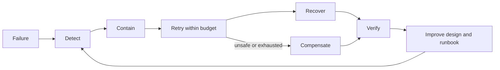

# Distributed Reliability Revision Sheet

## Reliability Control Loop



## Core Rule

A timeout means the caller stopped waiting; it does not prove whether the remote
effect committed. Design an idempotent retry or reconciliation path for unknown
outcomes.

## Pattern Recall

| Pattern | Solves | Does not solve |
|---|---|---|
| timeout | unbounded waiting/resource use | unknown remote outcome |
| retry | selected transient failure | permanent error or non-idempotent duplication |
| circuit breaker | repeated calls to an unhealthy dependency | dependency recovery or backlog |
| bulkhead | shared-resource blast radius | total capacity shortage |
| rate limiter | admission rate | already admitted work or downstream correctness |
| idempotency | duplicate logical attempts | unrelated commands or missing authorization |
| outbox | database state plus publish intent | exactly-once relay delivery |
| inbox | duplicate event business effects | bad ordering or invalid events |
| saga | multi-service business progress/compensation | global ACID rollback |
| fencing | stale owner writes | ownership selection by itself |
| reconciliation | uncertain/divergent state | immediate response latency |

## Retry Budget

```text
worst calls = original attempt + retries
amplified traffic = logical traffic * attempts
total deadline >= attempt timeouts + backoff + queue/processing overhead
```

Retry only classified transient failures, add jitter, respect an overall deadline,
and stop before amplified work destroys the recovering dependency.

## Idempotency Checklist

- stable client/event identity;
- scoped to actor and operation;
- request fingerprint or conflict behavior;
- unique database constraint;
- business effect and identity record in one transaction;
- stored authoritative response/outcome;
- retention longer than retry/replay window;
- concurrent and crash-window tests.

## Saga Recall

Choreography distributes reactions through events; orchestration centralizes
workflow decisions. Both need state transitions, idempotency, timeouts, late-event
policy, compensation, reconciliation, observability, and manual recovery.

## Incident Prompts

- retries spike during dependency recovery;
- payment completes after order expiry;
- outbox backlog grows while broker is unavailable;
- the same scheduled job runs on multiple replicas;
- lock holder pauses and later resumes stale work;
- DLT replay repeats old side effects;
- region recovery restores inconsistent workflow stages.

## Distributed Systems Interview Questions

### Why is partial failure different from total failure?

One node or link can fail while every other component continues. The caller may
therefore see a timeout without knowing whether the remote operation never started,
is still running, or committed and lost its response. Model those outcomes
explicitly instead of treating every exception as a rollback.

### What do CAP and PACELC actually say?

CAP forces a consistency-versus-availability choice only while a network partition
prevents required communication. PACELC adds the normal-path trade-off: else, when
there is no partition, systems still trade latency against consistency. State the
operation and invariant before calling an entire product "CP" or "AP."

### Linearizability, serializability, and eventual consistency?

Linearizability is a real-time visibility guarantee for operations on an object;
serializability is a transaction-isolation guarantee equivalent to some serial
execution; neither implies the other. Eventual consistency promises convergence
when updates stop, not fresh reads at every moment.

### What are session and causal consistency useful for?

Session guarantees such as read-your-writes and monotonic reads give one client a
coherent experience without global linearizability. Causal consistency preserves
the order of causally related operations while allowing concurrent independent
updates to be observed in different orders.

### How do quorums affect consistency and availability?

For `N` replicas, overlapping read/write quorums such as `R + W > N` can help a read
contact a replica containing the latest acknowledged version. That formula alone is
not a full consistency proof: sloppy quorums, concurrent writes, failover,
read-repair, and conflict resolution still matter. Larger quorums usually improve
freshness/durability at a latency and availability cost.

### Replication versus consensus?

Replication copies state. Consensus lets nodes agree on one value or ordered log
despite defined failures. A replicated store still needs a safe authority/election
mechanism if more than one replica could accept conflicting leadership.

### How do Raft leader election and quorum loss behave?

Raft elects a leader for a term through a majority and commits log entries after
majority replication under its safety rules. A minority partition cannot elect a
valid leader or commit new decisions, so safety is preserved by giving up write
availability there.

### What causes split-brain, and how is it prevented?

Ambiguous ownership during partitions, pauses, or failover can leave two actors
believing they are leader. Quorum-based election limits valid authority; monotonically
increasing fencing tokens let the protected resource reject work from a stale owner.
A lease without fencing is unsafe when an old holder pauses and resumes.

### How should timeouts, deadlines, retries, backoff, and jitter compose?

Propagate one end-to-end deadline, reserve time for downstream work, use per-attempt
timeouts, retry only classified transient failures, apply exponential backoff with
jitter, and cap attempts with a retry budget. Retries at every layer multiply load,
so choose one owning layer and require idempotency for ambiguous outcomes.

### Circuit breaker, bulkhead, backpressure, or load shedding?

A breaker stops repeated calls to a failing dependency; a bulkhead isolates a
bounded pool; backpressure slows or bounds producers when consumers cannot keep up;
load shedding rejects low-priority work before saturation. They solve different
failure modes and are commonly composed with deadlines and admission control.

### How do idempotency and deduplication differ?

Idempotency guarantees repeated attempts of the same logical operation have one
authoritative effect. Deduplication is one implementation technique, normally using
a stable scoped key, request fingerprint, unique constraint, transactional outcome,
and retention at least as long as the retry/replay window.

### Two-phase commit versus saga?

Two-phase commit coordinates resource managers for one atomic decision but can hold
resources while the outcome is uncertain. A saga uses independently committed local
transactions plus compensating business transitions, preserving autonomy while
accepting intermediate states and more recovery logic.

### What do outbox and inbox patterns guarantee?

An outbox atomically stores local state and publication intent; its relay remains
at-least-once. An inbox atomically records event identity with the consumer's local
effect. Together they close common dual-write and duplicate-effect windows, but do
not create a global transaction or automatically solve ordering.

### Why do distributed locks require leases and fencing tokens?

A lease bounds ownership duration, but clock pauses and delayed processes can let an
expired holder continue. Give each new owner a higher fencing token and require the
resource being protected to reject lower tokens. If that resource cannot validate
the token, the lock is only advisory.

### How should a system reconcile divergent state?

Choose an authority, compare durable business identifiers and versions, classify
missing, duplicate, late, and conflicting records, and repair through an idempotent,
audited, rate-limited path. Reconciliation is a correctness mechanism, not merely an
incident script.

### What do RPO and RTO mean during regional recovery?

RPO bounds acceptable data loss measured from replication/backup evidence; RTO
bounds time to restore the service. A credible plan also defines write authority,
DNS/routing, dependency order, credentials, offset/state translation, duplicate
reconciliation, failback, and regularly tested recovery evidence.

## Interview Answer Shape

State the invariant, enumerate definite/unknown outcomes, identify the authority,
select the pattern, bound resources and retry, define durable evidence, then explain
recovery and remaining limitations.

## Final Checklist

- deadlines bound every remote/resource wait;
- retries are classified, bounded, jittered, and idempotent;
- overload has an admission and shedding policy;
- local transactions protect local invariants;
- cross-system workflows use durable intent and reconciliation;
- stale ownership is fenced;
- every terminal failure has an owned recovery path.

## Official References

- [Google SRE books](https://sre.google/books/)
- [AWS Well-Architected Reliability Pillar](https://docs.aws.amazon.com/wellarchitected/latest/reliability-pillar/welcome.html)
- [The Raft consensus paper](https://raft.github.io/raft.pdf)
