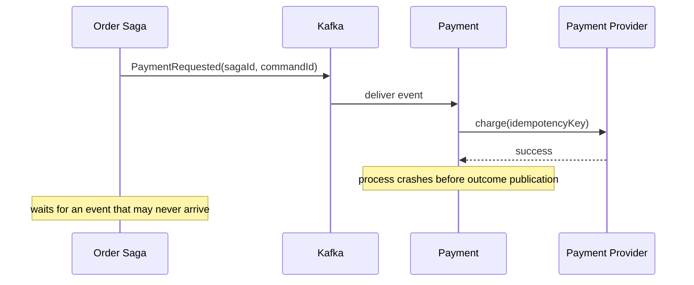

# Saga Liveness Timeout And Recovery

A Saga is not complete merely because every service can consume and publish an
event. It also needs a durable answer to: **what detects that the expected next
event never arrived?**

## The Missing-Reply Scenario

Assume Payment consumes `PaymentRequested`, charges the customer, but never
publishes `PaymentCompleted`:



What happens depends on Payment's transaction boundary:

| Payment implementation | Likely result |
|---|---|
| commits Kafka offset before work | input may be lost to this group |
| charges provider, crashes before offset commit | input replays; stable provider idempotency key is essential |
| commits DB state and offset, publishes later without outbox | payment exists but reply can be missing forever |
| commits payment state and outbox row atomically | relay can eventually publish the outcome |

The robust local boundary is:

```text
one local DB transaction:
  deduplicate command
  record payment state/provider reference
  insert PaymentCompleted outbox row
commit

then commit input progress
```

This closes the application-crash publication gap. It does not solve permanent
service downtime, a stuck relay, an ambiguous provider result, or an operational
mistake. The Saga still needs liveness controls.

## Durable Saga State

Persist a state machine, not an in-memory chain:

```sql
CREATE TABLE saga_instance (
    saga_id              UUID PRIMARY KEY,
    saga_type            VARCHAR(80) NOT NULL,
    state                VARCHAR(40) NOT NULL,
    expected_event       VARCHAR(100),
    step                 INTEGER NOT NULL,
    version              BIGINT NOT NULL,
    deadline_at          TIMESTAMP,
    last_event_id        UUID,
    failure_code         VARCHAR(100),
    updated_at           TIMESTAMP NOT NULL
);
```

The version enables compare-and-set transitions so a timeout and late success
cannot both advance the same state.

## Timeout Is A Business Decision

Kafka consumer session timeouts detect group members, not business workflow
deadlines. A Saga deadline must be stored durably and evaluated after restarts.

```text
WAITING_FOR_PAYMENT until 10:05
deadline fires at 10:05
probe payment status before deciding
```

Do not compensate immediately on silence when the action may have occurred. For
payments, shipments, and external reservations, silence means **unknown**, not
failure.

### Inventory Reservation Example

For checkout, Order should remain in an explicit state such as
`PENDING_INVENTORY` until it receives a durable outcome. A practical deadline
flow is:

```text
OrderCreated
-> PENDING_INVENTORY
-> wait for InventoryReserved or InventoryFailed
-> deadline expires
-> determine the authoritative reservation outcome
-> continue, retry, compensate, or reconcile
```

The timeout is not evidence that reservation failed. Inventory might have
committed the reservation while its outcome event or outbox relay was delayed.
Use the original reservation operation ID for every retry so a repeated command
cannot reserve stock twice.

| Authoritative inventory result | Order/Saga action |
|---|---|
| `RESERVED` | continue from the existing reservation; repair or republish the missing outcome if policy permits |
| `NOT_RESERVED` | retry with the same operation ID while the business deadline and retry budget allow |
| `REJECTED` | mark the order rejected and run any required compensation |
| `UNKNOWN` or participant unavailable | keep an explicit uncertain/reconciliation state, alert, and investigate; do not guess |

### Never Read Another Service's Database

Order must not query Inventory's tables directly. Inventory owns its schema,
transaction semantics, authorization, and interpretation of reservation state.
After retries are exhausted, use one of these owned contracts:

- a status API such as `GET /inventory/reservations/{operationId}`;
- an asynchronous `CheckInventoryReservationStatus` command followed by an
  `InventoryReservationStatusReported` event; or
- a separately owned and documented operational read model populated from
  Inventory events.

The participant reads its own database and returns a business result. A direct
cross-service database read creates schema coupling and can expose internal or
partially meaningful state.

### Bounded Retry And Parking

Retry only failures classified as transient, with bounded exponential backoff
and jitter. Reuse the same command/operation ID on every attempt. A new ID turns
a transport retry into a new business request.

```text
attempt 1: initial command
attempt 2: short backoff
attempt 3: longer backoff
retry budget exhausted: status probe or reconciliation
```

A DLT or failed-event store preserves poison-message evidence; it does not tell
the Saga whether inventory was reserved and is not a terminal business state by
itself. Persist the source event ID, key, topic, partition, offset, schema
version, failure class, attempt count, and correlation identifiers. Alert an
owner and replay only through an audited, idempotent path after the cause is
understood.

## Recovery Algorithm

When the expected event is overdue:

1. atomically claim the overdue Saga instance;
2. inspect its current version and expected event;
3. query the participant or external provider using the original command/idempotency ID;
4. if completed, repair the missing outcome or advance from authoritative state;
5. if definitely not started, retry the idempotent command;
6. if definitely failed, begin compensation or alternate forward recovery;
7. if ambiguous, move to `RECONCILIATION_REQUIRED` and alert an owner;
8. record every decision and correlation ID.

```java
@Transactional
public void handlePaymentDeadline(UUID sagaId, long expectedVersion) {
    Saga saga = repository.lockById(sagaId).orElseThrow();

    if (saga.version() != expectedVersion || !saga.waitingForPayment()) {
        return; // stale timer or an outcome already won the race
    }

    saga.markReconciling();
    outbox.add(PaymentStatusRequested.forSaga(saga));
}
```

Publish the probe through the outbox. Do not hold a database transaction open
while making a remote status call.

## Orchestration Versus Choreography

An orchestrator naturally stores expected command, deadline, and next state. A
choreographed Saga still needs a process manager, watchdog, or domain-specific
expiry event; otherwise no component owns missing-event detection.

```text
Choreography does not mean no coordination.
It means coordination is distributed and must still have explicit ownership.
```

## Late Outcomes And Compensation Races

Example:

```text
timeout starts RefundPayment
late PaymentCompleted arrives
```

Handle with a transition table and optimistic version:

| Current state | Incoming event | Action |
|---|---|---|
| `WAITING_PAYMENT` | `PaymentCompleted` | advance |
| `COMPENSATING_PAYMENT` | late `PaymentCompleted` | record and ensure refund completes |
| `CANCELLED` | duplicate failure | ignore idempotently |
| terminal success | stale timeout | ignore |

Never “last event wins” without business rules. Keep event ID, causation ID,
participant command ID, Saga ID, aggregate version, and occurred/received times.

## Compensation Can Fail

Compensation is another distributed operation, not rollback magic. It needs:

- a durable command and state;
- idempotency key;
- bounded retry and backoff;
- its own timeout and reconciliation;
- a terminal/manual-repair state;
- alerts and business ownership.

Some actions cannot be perfectly reversed. A shipped parcel may require a return;
a settled payment may require a refund. Model semantic compensation explicitly.

## Other Production Saga Failures

| Failure | Control |
|---|---|
| duplicate event | inbox/unique event ID and idempotent transition |
| out-of-order event | state/version guard, defer or reject invalid transition |
| participant down | durable deadline, retry budget, probe, alternate/manual state |
| orchestrator down | persisted state, leased timer workers, outbox |
| retry storm after recovery | jitter, rate limits, tenant fairness, gradual drain |
| schema mismatch | compatible schemas, quarantine, producer/consumer contract tests |
| poison Saga blocks partition | bounded retry, isolate recovery, preserve audit |
| compensation partly complete | step-level compensation state and reconciliation |
| event retained less than outage | retention/capacity design or authoritative repair path |

## Observability And SLOs

Track:

- Sagas by state and age;
- time spent in each step;
- overdue deadlines;
- missing expected events;
- command retry and duplicate rate;
- compensation success, age, and failure;
- outbox oldest pending age for every participant;
- reconciliation queue and manual cases;
- late-outcome frequency.

Use a business SLO such as “99.9% of orders reach a terminal state within 10
minutes,” not only Kafka transport metrics.

## ShopVerse Coverage And Remaining Gap

The current ShopVerse reference implementation already demonstrates several
parts of this design:

- `OrderStatus.PENDING_INVENTORY` is the intermediate order state;
- Order, Inventory, and Payment use service-owned databases and local
  transactional outboxes;
- Saga listeners use bounded retry topics and persist exhausted records through
  DLT handlers;
- Inventory reservation and release paths are idempotent by order number;
- Order cancellation and payment failure trigger inventory release;
- the order number is the Kafka key/aggregate identifier used for per-order
  processing.

The runtime does **not yet implement** a durable per-step Saga deadline, an
Inventory reservation-status contract, or an automated stuck-order
reconciliation worker. Therefore, ShopVerse can recover publication and
listener failures through outbox/DLT replay, but it does not yet automatically
resolve every case where an expected outcome never arrives. Treat the deadline,
status probe, versioned race handling, and reconciliation algorithm on this page
as the target production design until code, migrations, tests, metrics, and a
runbook prove them.

The current Saga listeners declare three delivery attempts, but their annotations
do not declare an explicit transient/permanent exception policy, exponential
backoff, jitter, or recovery drain-rate limit. Treat those retry controls as an
additional implementation gap. Closing it requires failure-classification tests,
timing evidence, DLT publication evidence, and proof that recovery does not
overload Inventory, Payment, Order, or their databases.

## Interview Answer

If a service consumed an event but emitted no reply, first determine whether its
business effect committed. Atomic inbox/business/outbox storage prevents a local
commit from losing its outcome event, while an idempotency key makes input replay
safe. The Saga stores an expected outcome and durable deadline. On timeout it
probes authoritative participant/provider state before retrying or compensating,
uses versioned transitions to handle late replies, and moves ambiguous cases to
reconciliation. Compensation is itself idempotent, retriable, observable work.

## Related Guides

- [Saga Consistency And Compensation](./SAGA-CONSISTENCY-COMPENSATION.md)
- [Outbox Production Failure Modes](./OUTBOX-PRODUCTION-FAILURE-MODES.md)
- [Inbox Pattern](./INBOX-PATTERN.md)
- [Kafka Offset Commits](../integration/kafka/KAFKA-CONSUMER-OFFSET-COMMITS.md)
- [Spring Cloud Stream Overview](../integration/streaming/SPRING-CLOUD-STREAM-OVERVIEW.md)

## Recommended Next

Study [Outbox Production Failure Modes](./OUTBOX-PRODUCTION-FAILURE-MODES.md).
