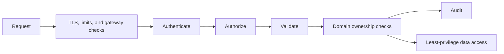

# Application And Platform Security Revision Sheet

## Request Security Layers

## Core Rule

Authentication establishes identity. Authorization decides whether that identity
may perform this action on this object in this context. Every service protecting a
resource must enforce its authoritative policy.

## One-Line Recall

| Concept | Revision answer |
|---|---|
| threat model | Assets, actors, trust boundaries, threats, controls, and residual risk. |
| least privilege | Grant only required operations, resources, scope, and duration. |
| defense in depth | Independent controls limit failure of any single boundary. |
| OAuth2 | Delegated authorization framework for obtaining scoped access tokens. |
| OIDC | Identity layer over OAuth2 that adds authentication and ID tokens. |
| JWT | Signed claims container; not encryption and not automatically safe authorization. |
| JWKS | Published public keys used to validate token signatures and rotation. |
| CSRF | Attacker causes a browser to send authenticated state-changing requests. |
| CORS | Browser policy controlling which origins may read cross-origin responses. |
| workload identity | Verifiable identity for a service, job, or machine. |

## Token Validation

Validate signature/algorithm, issuer, audience, expiry/not-before, key selection,
token type, and required claims. Map claims to application authorities deliberately.
Never trust a token merely because it can be decoded.

Short-lived access tokens limit exposure. Refresh tokens need rotation, reuse
detection, secure storage, revocation, and session/device ownership. API keys need
hashing or secure secret storage, scopes, rotation, expiry, audit, and rate limits.

## Authorization Review

- endpoint permission and HTTP method;
- object ownership and tenant boundary;
- role/scope/attribute semantics;
- state-dependent business permission;
- service-to-service identity and delegation;
- administrative separation of duties;
- deny and audit behavior;
- cache and policy-change propagation.

## Common Failures

- gateway authenticates but services omit authorization;
- ID token is used as an API access token;
- user-controlled role or tenant claims are trusted;
- wildcard CORS with credentials;
- secrets appear in source, images, logs, or telemetry;
- symmetric keys are shared across unrelated verifiers;
- long-lived credentials have no rotation path;
- object-level authorization is replaced by UI hiding;
- sensitive error/log data crosses tenant boundaries.

## Core Security Interview Questions

### How does a Spring Security request move through the filter chain?

The servlet container enters `DelegatingFilterProxy`, which delegates to Spring's
`FilterChainProxy`. It selects the first matching `SecurityFilterChain`; exploit
protections run, an authentication filter/provider may establish an
`Authentication` in the `SecurityContext`, and authorization evaluates the request.
Inspect the runtime chain instead of memorizing every version-specific filter index.

### What is the difference between 401 and 403?

Return 401 when usable authentication is absent or invalid and the client may need
to authenticate. Return 403 when the request is understood but the authenticated
principal is not permitted, and for some exploit-protection failures such as an
invalid CSRF token. Do not leak whether a protected object exists through different
responses.

### How is the SecurityContext handled across requests and threads?

The context is loaded or created for a request, associated with the current
execution, and must be cleared afterwards. Stateless bearer APIs reconstruct it
per request; session applications may persist it. Thread-local state does not
automatically propagate safely to arbitrary executors, async work, or reactive
pipelines—use the framework's context-aware mechanisms and clear stale context.

### Authentication, authorization, ownership, and tenant isolation?

Authentication establishes the caller. Authorization evaluates action, resource,
attributes, and context. Ownership and tenant membership are domain authorization,
not identity claims alone. Every service must scope repository access and state
transitions to the authoritative tenant/resource relationship.

### OAuth2 versus OpenID Connect?

OAuth2 delegates authorization and issues access tokens for resource servers. OIDC
adds an identity layer, ID tokens, user authentication semantics, and discovery.
An ID token tells the client about an authentication event; it is not the access
token an API should accept.

### Authorization Code with PKCE or Client Credentials?

Use Authorization Code with PKCE for interactive user clients so a stolen code
cannot be redeemed without its verifier. Use Client Credentials for a confidential
workload acting as itself, with no end-user identity implied. Avoid implicit and
password grants in new designs; choose the flow from client type and acting party.

### Why rotate refresh tokens and detect reuse?

Refresh tokens are long-lived credentials. Bind them to client/session, scope and
resource; store them securely; rotate on use; retain the token family; and revoke
the family when an invalidated token is replayed. Also expire inactive grants and
revoke on logout, credential compromise, or relevant account-security changes.

### Access token versus ID token versus refresh token?

The access token authorizes calls to its intended resource and audience. The ID
token is consumed by the OIDC client and describes authenticated identity. The
refresh token is presented only to the authorization server to obtain new tokens.
Sending all three to every service expands the attack surface and confuses trust.

### What must a JWT resource server validate?

Verify the allowed algorithm and signature using a trusted issuer/key source, then
validate issuer, audience, expiry, not-before, token/type intent, and required
claims. Constrain key selection, clock skew, token size, and claim types. Decode is
not validation, and signature validity is not authorization.

### How do JWKS and signing-key rotation work safely?

Publish public verification keys with stable key IDs, introduce the new key before
signing with it, keep the old public key through the maximum validation overlap,
and then retire it. Resource servers need bounded caching and a safe refresh path;
an unknown `kid` must not trigger unbounded attacker-controlled network fetches.

### JWT or opaque access token?

JWTs permit local verification and resilient low-latency reads but authorization
claims can remain valid until expiry and rotation is distributed. Opaque tokens
support current introspection/revocation policy but add a control-plane dependency,
latency, caching, and outage decisions. Choose from revocation SLA and operating
model, not fashion.

### Roles, scopes, authorities, and business permissions?

Scopes describe delegated capabilities, roles group organizational privileges,
and Spring authorities are the runtime representation used by authorization rules.
Business permissions frequently depend on resource ownership, tenant, amount,
state, or separation of duties. Map external claims explicitly and do not trust
client-supplied role or tenant values.

### URL security, method security, and object-level authorization?

URL rules protect request routes and methods; method rules protect service entry
points and alternate invocation paths. Neither automatically proves access to a
specific record. Load or query the resource within the authorized tenant/owner
scope and test direct identifiers, bulk operations, nested objects, and admin paths.

### When is CSRF protection required?

CSRF matters when a browser automatically attaches credentials, especially cookies,
to a state-changing request. Use framework CSRF tokens and appropriate SameSite
cookies for session/BFF designs. A bearer token sent explicitly in an authorization
header changes the threat, but disabling CSRF is justified by credential transport,
not merely because the endpoint is called REST.

### What does CORS protect, and what does it not protect?

CORS is a browser response-reading policy, not authentication, authorization, CSRF
protection, or a firewall. Allow exact trusted origins, methods, and headers; place
preflight handling before authentication; and never combine credentialed requests
with a wildcard origin. Non-browser callers are not constrained by CORS.

### Session cookie, browser-held bearer token, or BFF?

An HttpOnly Secure SameSite session/BFF cookie limits JavaScript token exposure but
requires CSRF protection and server/session operations. Browser-held bearer tokens
reduce server session state but increase theft/exfiltration risk. Choose from the
threat model, client architecture, logout/revocation needs, and deployment topology.

### How should passwords and login endpoints be protected?

Store passwords with a current adaptive one-way password hash and per-password salt;
never encrypt them for recovery. Use upgrade-on-login, breached-password policy,
rate limits, progressive delay/lockout designed against denial of service, MFA where
risk requires it, generic failures, session rotation, and auditable recovery flows.

### Why is gateway authentication insufficient?

A gateway is an external traffic control, not the owner of each service's objects
and state transitions. Services must validate trusted identity/delegation and enforce
authorization at their boundary because calls can arrive through internal paths,
misconfiguration, replay, or a compromised upstream.

### How do workload identity and mTLS relate?

Workload identity identifies a service instance or workload; mTLS can authenticate
both transport peers and encrypt traffic. Neither alone grants a business action.
Bind certificates/tokens to workload identity, authorize least privilege at the
callee, rotate automatically, validate trust domains, and define fail-closed expiry
and revocation behavior.

### What is the confused-deputy problem in service calls?

A privileged service becomes a deputy when it uses its own authority on behalf of a
caller without preserving or constraining caller intent. Separate workload identity
from delegated user context, audience-limit downstream tokens, propagate only needed
claims, and have the callee authorize both the calling service and delegated action.

### How should secrets and certificates rotate without downtime?

Keep secrets in a managed store, grant retrieval through workload identity, avoid
source/images/logs, and support overlapping old/new material. Roll out consumers,
verify reconnection and use, switch issuance, revoke old material, and test expiry.
Rotation is incomplete while an old credential remains accepted or a process keeps
it indefinitely in memory.

### How are API keys different from user access tokens?

API keys usually identify a calling application or integration, not a human login.
Generate high entropy, show once, store a hash where lookup permits, scope and expire,
rate-limit, rotate, audit, and never put them in URLs. They still require transport
security and resource authorization; possession must not imply unlimited access.

### How do you prevent broken object and function-level authorization?

For every client-controlled identifier and bulk/nested operation, query and mutate
within the caller's permitted tenant/owner scope. Enforce privileged functions on
the server regardless of UI visibility or HTTP route discoverability. Include
horizontal, vertical, cross-tenant, alternate-path, and stale-role negative tests.

### How do you defend against injection, SSRF, and unsafe deserialization?

Use parameterized database access and context-appropriate output encoding; never
build commands or queries by concatenating untrusted input. For outbound URLs,
allowlist destinations/protocols, resolve and revalidate addresses, block internal
and metadata networks, limit redirects/response size/time, and isolate egress.
Accept only expected media types and bounded, explicitly mapped object shapes.

### What belongs in security audit logs?

Record who attempted what action on which protected resource/tenant, decision,
policy/version, time, correlation identifier, and trusted source context. Protect
integrity, access and retention, and alert on meaningful behavior. Never log raw
passwords, tokens, API keys, session IDs, private keys, or unnecessary sensitive
payloads; hash/redact identifiers where investigation permits.

### How should a leaked credential incident be handled?

Contain first: identify credential type, scope and affected workloads; revoke or
rotate; block abuse; and preserve evidence. Determine issuance, access and data
impact from audit trails, restore service with new trust, notify required owners,
and remove the storage/logging/control weakness. Prove old material no longer works.

### How do threat modeling and supply-chain security change design?

Threat modeling identifies assets, actors, entry points, trust boundaries, abuse
cases, controls, verification, and residual risk before selecting mechanisms.
Supply-chain controls add pinned/reviewed dependencies, provenance, SBOM and
vulnerability response, isolated least-privilege builds, signed artifacts, secret-
free build logs, and deployment verification rather than trusting a successful CI job.

## Incident Prompt

For a leaked credential: identify scope, revoke/rotate, preserve evidence, block
abuse, inspect audit and data access, notify owners, restore service with new trust,
and correct the issuance/storage/control weakness. Rotation is incomplete until old
material is unusable and every workload reconnects.

## Final Checklist

- trust boundaries and assets are modeled;
- user and workload identities are distinct;
- token validation and authorization occur at resource boundaries;
- secrets, keys, and certificates rotate without downtime;
- data is minimized, encrypted, redacted, retained, and deleted by policy;
- dependencies and build artifacts are verified;
- security events are auditable and incident response is tested.

Continue with the [Security Interview Workbook](./platform/SECURITY-INTERVIEW-WORKBOOK.md).

## Official References

- [OWASP Application Security Verification Standard](https://owasp.org/www-project-application-security-verification-standard/)
- [OWASP Cheat Sheet Series](https://cheatsheetseries.owasp.org/)
- [NIST Cybersecurity Framework](https://www.nist.gov/cyberframework)
- [OAuth 2.0 Security Best Current Practice](https://www.rfc-editor.org/rfc/rfc9700)
- [Spring Security reference](https://docs.spring.io/spring-security/reference/)
- [OWASP API Security Top 10](https://owasp.org/www-project-api-security/)
