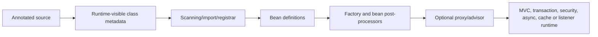

# Spring Boot Annotations Beginner-To-Architect Path

An annotation is metadata. It does nothing by itself unless the Java compiler, JVM, Spring
container, Boot auto-configuration, a proxy/advisor, MVC infrastructure, repository factory
or test framework discovers and interprets it.

## Processing Mental Model

The first interview question for any annotation should be: **who reads it, when, and what
runtime object or behavior is created?**

## Complete Route

1. [Container, Dependency Injection And Conditional Annotations](./annotations/SPRING-CONTAINER-CONDITIONAL-ANNOTATIONS.md)
2. [MVC, REST, Binding, Validation And Error Annotations](./annotations/SPRING-WEB-VALIDATION-ANNOTATIONS.md)
3. [Data, Transactions, Async, Scheduling And Cache Annotations](./annotations/SPRING-DATA-TRANSACTION-ASYNC-ANNOTATIONS.md)
4. [Security, Messaging And Testing Annotations](./annotations/SPRING-SECURITY-MESSAGING-TEST-ANNOTATIONS.md)
5. [Annotation Internals, Composition, Proxies And Interview Traps](./annotations/SPRING-ANNOTATION-INTERNALS-COMPOSITION.md)

After section 3, use [Transaction Proxy Mechanics And Boundary Design](./transactions/SPRING-TRANSACTION-PROXY-BOUNDARY-DESIGN.md)
for the full `@Transactional` execution path and boundary-design patterns.

## Classification Cheat Sheet

| Family | Examples | Main processor/runtime |
|---|---|---|
| stereotype and configuration | `@Component`, `@Service`, `@Configuration`, `@Bean`, `@Import` | scanner, configuration parser, bean factory |
| Boot application/conditions | `@SpringBootApplication`, `@ConfigurationProperties`, `@ConditionalOnClass` | Boot startup, binder and auto-configuration selectors |
| injection/selection | `@Autowired`, `@Qualifier`, `@Primary`, `@Value` | autowiring and value-resolution post-processors |
| web | `@RestController`, `@RequestMapping`, `@RequestBody`, `@ControllerAdvice` | MVC handler mappings/adapters and resolvers |
| validation | `@Valid`, `@Validated`, `@NotNull`, custom constraints | Jakarta Validation and Spring method validation |
| cross-cutting proxy | `@Transactional`, `@Async`, `@Cacheable`, method security | advisors/interceptors around eligible bean calls |
| persistence | `@Entity`, repository query/lock annotations | JPA provider and Spring Data repository factories |
| messaging | `@KafkaListener`, `@RetryableTopic`, `@DltHandler` | endpoint registrars and listener containers |
| testing | `@SpringBootTest`, slices, `@MockitoBean`, `@DynamicPropertySource` | Spring TestContext and Boot test auto-configuration |

## Important Distinctions

- `@Component` creates a scan candidate; `@Bean` registers the method return value.
- `@Configuration` has configuration-class semantics; it is not merely a prettier component.
- `@Primary` resolves one candidate preference; `@Qualifier` narrows candidates semantically.
- `@Valid` cascades object validation; `@Validated` also enables groups and method validation.
- `@Transactional`, `@Async`, caching and method security commonly depend on interception;
  self-invocation may bypass them.
- a test slice deliberately loads less than `@SpringBootTest`; combining slices is not the
  normal way to construct a larger integration test.

## Completion Standard

For every important annotation, explain:

1. allowed target and runtime retention;
2. which component discovers it;
3. startup-time versus invocation-time effect;
4. whether it registers a bean, contributes metadata or creates interception;
5. proxy, ordering, inheritance and self-invocation behavior;
6. how to test that its effect actually happened;
7. what failure evidence appears when it does not.

## Recommended Next

Continue with the [Spring Boot Architect Path](./SPRING-BOOT-ARCHITECT-PATH.md),
then explain one annotation from discovery through runtime interception and test evidence.

## Official References

- [Spring annotation-based container configuration](https://docs.spring.io/spring-framework/reference/core/beans/annotation-config.html)
- [Spring MVC annotated controllers](https://docs.spring.io/spring-framework/reference/web/webmvc/mvc-controller/ann.html)
- [Spring Boot testing](https://docs.spring.io/spring-boot/reference/testing/spring-boot-applications.html)
