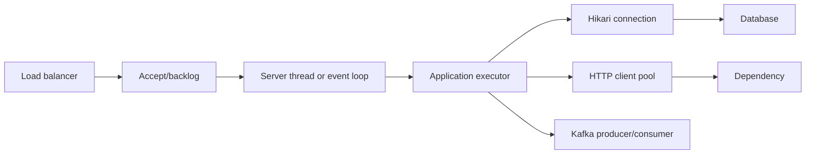

# Spring Boot Runtime Performance And Capacity

Performance is an end-to-end queueing problem. Tuning one pool without locating
the bottleneck often transfers overload to another component.



## Establish The Workload

Define normal/peak request rate, concurrency, payload sizes, endpoint mix,
cache-hit ratio, database/external calls, SLOs, failure rate and deployment
resources. Measure warm and cold behavior. Average latency is insufficient; use
p50/p95/p99 and maximum age for asynchronous work.

Little's Law provides a consistency check:

```text
concurrency ~= throughput * average time in system
```

## Servlet Runtime

In MVC, a request generally occupies a server thread while application code runs
or blocks. Bound maximum threads, accept/backlog/connection behavior and request
body/header limits. Too many threads increase memory, context switching and
downstream pressure; too few create queueing before the application.

Track active/max server threads, queue/backlog, connections, request duration,
timeouts and rejected/503 outcomes. Virtual threads can reduce thread cost for
blocking work but do not increase database connections, CPU or remote capacity.

## Reactive Runtime

WebFlux event loops require non-blocking handlers. A blocking database/client call
on an event-loop thread stalls many connections. Detect event-loop blocking with
thread/JFR evidence and use a deliberately bounded scheduler only when a blocking
dependency cannot be replaced. Avoid unbounded scheduler growth.

Reactive code still needs connection limits, demand control, timeouts and memory
bounds. Backpressure inside a pipeline cannot force an external database to gain
capacity.

## HikariCP And Transactions

Connection demand comes from HTTP, Kafka, batch, schedulers, async work and
management operations. Monitor active/idle/pending, acquisition time, usage time,
timeouts, leak evidence and database saturation.

```text
concurrent DB transactions <= safe DB connections allocated to this workload
```

Increasing pool size can make the database slower. Reduce transaction duration,
fix queries/indexes/N+1, batch deliberately, bound callers and reserve workload
capacity before adding connections.

## HTTP Clients

Configure connect, pool-acquisition, request/response and total deadlines. Bound
connections per destination and globally. Track pending acquisition, active/idle,
DNS, TLS, connect time, first byte, body read, retries and cancellations.

Do not stack retries in gateway, client and service. Propagate the remaining
deadline and use stable idempotency keys for retryable writes.

## Executors, Async And Scheduling

Every executor needs named ownership, bounded concurrency/queue, rejection policy,
task deadline, cancellation, context propagation, metrics and shutdown. The
default/common pool is not an invisible source of unlimited capacity.

`@Async` submits work through a proxy. Self-invocation bypasses advice; executor
acceptance is not business completion; exceptions in `void` async methods require
an explicit handler. Scheduled jobs need overlap/ownership and missed-run policy.

## Serialization And Payloads

Jackson reflection/introspection, large object graphs, compression, logging and
validation can dominate CPU/allocation. Measure serialized bytes, conversion
duration and allocation. Avoid exposing JPA graphs directly, unbounded collections
and logging complete payloads.

## Cache Behavior

Measure hit/miss, load duration, entry weight, eviction and stampede behavior.
`@Cacheable` has proxy/self-invocation boundaries. Prevent synchronized mass expiry
through jitter, single-flight loading or stale-while-revalidate where correctness
allows. A cache can hide a database capacity deficit until a cold-start event.

## Messaging

Kafka listener concurrency is bounded by partitions and downstream resources.
Producer buffers and outbox tables must be bounded. Track arrival/completion rate,
lag/age, retries/DLT and pool consumption. Recovery traffic is part of capacity.

## JVM And Container

Correlate JFR CPU/allocation/locks/I/O, GC logs, heap/native memory, thread count,
direct buffers and class loading with cgroup memory and CPU throttling. A pod can
be `OOMKilled` with free Java heap because total RSS exceeded the limit.

## Startup Performance

Measure `application.started.time`, `application.ready.time`, startup steps,
classpath scanning, bean creation, migrations, remote initialization and JIT/cold
cache effects. Do not move required initialization after readiness merely to make
startup appear faster.

## Load-Test Method

1. state workload, SLO and resource limits;
2. warm up until JIT/cache behavior stabilizes;
3. establish baseline at normal and peak load;
4. increase until one resource saturates;
5. inject slow DB/API, errors and instance loss;
6. verify bounded queues, shedding and recovery;
7. change one variable;
8. compare latency, throughput, errors, saturation and business outcomes;
9. retain profiles and rollback threshold.

## Symptom Matrix

| Symptom | Likely boundary | Evidence |
|---|---|---|
| high latency, low CPU | pool wait, blocking I/O, lock, DNS/TLS | traces, thread dumps, pool metrics, JFR wall |
| high CPU | serialization, loop, crypto, GC | JFR/CPU flame graph, allocation and GC |
| intermittent 503 | server backlog, readiness, gateway or pool rejection | server/gateway metrics, events and traces |
| Hikari timeout | long/leaked transactions or DB saturation | pending/usage, DB sessions/queries, traces |
| throughput plateaus | smallest pool/CPU/dependency limit | saturation and queue-age slope |
| latency worsens after adding threads | context switching/downstream overload | CPU, runnable threads, pool wait, dependency p99 |
| cold deployment slow | startup/JIT/cache/state restoration | startup steps, JFR compilation, cache metrics |

## Official References

- [Spring Boot metrics](https://docs.spring.io/spring-boot/reference/actuator/metrics.html)
- [Spring Boot web servers](https://docs.spring.io/spring-boot/how-to/webserver.html)
- [Spring Framework performance monitoring](https://docs.spring.io/spring-framework/reference/integration/observability.html)

## Recommended Next

Continue with the [Spring Boot Incident Playbook](./SPRING-BOOT-PRODUCTION-INCIDENT-PLAYBOOK.md).

